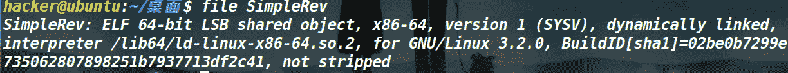

<!--yml
category: 未分类
date: 2022-04-26 14:51:38
-->

# # buuctf--SimpleRev_Mr.LangPiao的博客-CSDN博客

> 来源：[https://blog.csdn.net/weixin_52230368/article/details/119716951](https://blog.csdn.net/weixin_52230368/article/details/119716951)

# buuctf–SimpleRev

做玩这道题感觉对与初学者还是有点小吃力的。所以今天写一篇题解帮助一些同学入门，做题时看不懂其他人的题解，这时我的题解尽可能详细一点。开始分析题目

拿到题目文件，Ubuntu终端**file +文件名** 这命令查看一下文件是什么类型的



发现时 ELF 64位文件放进IDA中进行静态分析。这要求要有代码分析的能力，刚开始学习肯定会有些吃力，但是还是要认真的读代码。

```
int __cdecl __noreturn main(int argc, const char **argv, const char **envp)
{
  int v3; // eax
  char v4; // [rsp+Fh] [rbp-1h]

  while ( 1 )
  {
    while ( 1 )
    {
      printf("Welcome to CTF game!\nPlease input d/D to start or input q/Q to quit this program: ", argv, envp);
      v4 = getchar();
      if ( v4 != 100 && v4 != 68 )
        break;
      Decry();
    }
    if ( v4 == 113 || v4 == 81 )
      Exit();
    puts("Input fault format!");
    v3 = getchar();
    putchar(v3);
  }
} 
```

主函数没有什么特别的，我们接着看一下Decry()这个函数

```
unsigned __int64 Decry()
{
  char v1; // [rsp+Fh] [rbp-51h]
  int v2; // [rsp+10h] [rbp-50h]
  int v3; // [rsp+14h] [rbp-4Ch]
  int i; // [rsp+18h] [rbp-48h]
  int v5; // [rsp+1Ch] [rbp-44h]
  char src[8]; // [rsp+20h] [rbp-40h]
  __int64 v7; // [rsp+28h] [rbp-38h]
  int v8; // [rsp+30h] [rbp-30h]
  __int64 v9; // [rsp+40h] [rbp-20h]
  __int64 v10; // [rsp+48h] [rbp-18h]
  int v11; // [rsp+50h] [rbp-10h]
  unsigned __int64 v12; // [rsp+58h] [rbp-8h]

  v12 = __readfsqword(0x28u);
  *(_QWORD *)src = 'SLCDN';
  v7 = 0LL;
  v8 = 0;
  v9 = 'wodah';
  v10 = 0LL;
  v11 = 0;
  text = (char *)join(key3, &v9);//join函数将两个字符串拼接
  strcpy(key, key1);//将key1复制给key
  strcat(key, src);//也是拼接函数
  v2 = 0;
  v3 = 0;
  getchar();
  v5 = strlen(key);
  for ( i = 0; i < v5; ++i )
  {//这个循环的功能是把key[]字符串数组由大写改成小写
    if ( key[v3 % v5] > '@' && key[v3 % v5] <= 'Z' )
      key[i] = key[v3 % v5] + 32;
    ++v3;
  }
  printf("Please input your flag:", src);
  while ( 1 )//while循环是把str2[]进行变换这是关键的一部分
  {
    v1 = getchar();
    if ( v1 == '\n' )
      break;
    if ( v1 == ' ' )
    {
      ++v2;
    }
    else
    {
      if ( v1 <= '`' || v1 > 'z' )
      {
        if ( v1 > '@' && v1 <= 'Z' )
          str2[v2] = (v1 - 39 - key[v3++ % v5] + 97) % 26 + 97;//这是str2[]变换的语句
      }
      else
      {
        str2[v2] = (v1 - 39 - key[v3++ % v5] + 97) % 26 + 97;
      }
      if ( !(v3 % v5) )
        putchar(32);
      ++v2;
    }
  }
  if ( !strcmp(text, str2) )//将字符串str2与text字符串进行比较
    puts("Congratulation!\n");
  else
    puts("Try again!\n");
  return __readfsqword(0x28u) ^ v12;
} 
```

这是关键函数，我把函数的功能用注释的形式解释。

**在IDA中我们在伪代码中选中一个变量双击就能查看变量中保存的值**

通过查看变量的我们可以知道key3=“ADSFK”; test=“kills”

经过操作后

```
 text = (char *)join(key3, &v9);//join函数将两个字符串拼接
  strcpy(key, key1);//将key1复制给key
  strcat(key, src);//也是拼接函数 
```

```
得到：
char key[] = "adsfkndcls";
	char text[] = "killshadow"; 
```

写代码逆向出flag

```
int main()
{
	char key[] = "adsfkndcls";
	char text[] = "killshadow";
	int i;
	int v3=10;//长度 
	for (int i = 0; i < 10; i++)
	{
		for (int j = 0; j < 128; j++)
		{
			if (j < 'A' || j > 'z' || j > 'Z' && j < 'a')
			{
				continue;
			}
			if ((j - 39 - key[v3 % 10] + 97) % 26 + 97 == text[i])
			{
				printf("%c",j);
				v3++;
				break;
			}
		}
	}
} 
```