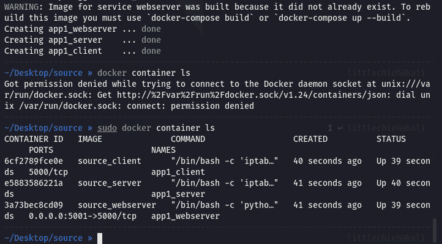
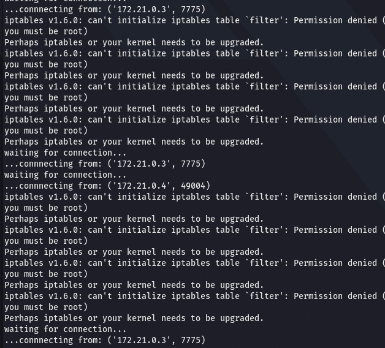

<!--yml
category: 未分类
date: 2022-04-26 14:55:31
-->

# 2020年1月-*CTF比赛Web部分题解_slug01sh的博客-CSDN博客

> 来源：[https://blog.csdn.net/qq_43085611/article/details/112988590](https://blog.csdn.net/qq_43085611/article/details/112988590)

# 1 Web

由于期末考试和各种课设，有一段时间没有比赛了，做题时没有思路，感觉好菜呐～🤒

## 1.1 oh-my-note

题目中给出源码：

```
 import string
import random
import time
import datetime
from flask import render_template, redirect, url_for, request, session, Flask
from functools import wraps
from exts import db
from config import Config
from models import User, Note
from forms import CreateNoteForm

app = Flask(__name__)
app.config.from_object(Config)
db.init_app(app)

def login_required(f):
    @wraps(f)
    def decorated_function(*args, **kws):
        if not session.get("username"):
            return redirect(url_for('index'))
        return f(*args, **kws)

    return decorated_function

def get_random_id():
    alphabet = list(string.ascii_lowercase + string.digits)
    return ''.join([random.choice(alphabet) for _ in range(32)])

@app.route('/')
@app.route('/index')
def index():

    results = Note.query.filter_by(prv='False').limit(100).all()
    notes = []
    for x in results:
        note = {}
        note['title'] = x.title
        note['note_id'] = x.note_id
        notes.append(note)

    return render_template('index.html', notes=notes)

@app.route('/logout')
@login_required
def logout():
    session.pop('username', None)
    return redirect(url_for('index'))

@app.route('/create_note', methods=['GET', 'POST'])
def create_note():
    try:
        form = CreateNoteForm()
        if request.method == "POST":
            username = form.username.data
            title = form.title.data
            text = form.body.data
            prv = str(form.private.data)

            user = User.query.filter_by(username=username).first()

            if user:
                user_id = user.user_id
            else:

                timestamp = round(time.time(), 4)
                random.seed(timestamp)
                user_id = get_random_id()
                user = User(username=username, user_id=user_id)
                db.session.add(user)
                db.session.commit()
                session['username'] = username

            timestamp = round(time.time(), 4)

            post_at = datetime.datetime.fromtimestamp(timestamp, tz=datetime.timezone.utc).strftime(
                '%Y-%m-%d %H:%M UTC')

            random.seed(user_id + post_at)
            note_id = get_random_id()

            note = Note(user_id=user_id, note_id=note_id,
                        title=title, text=text,
                        prv=prv, post_at=post_at)
            db.session.add(note)
            db.session.commit()
            return redirect(url_for('index'))

        else:
            return render_template("create.html", form=form)
    except Exception as e:
        pass

@app.route('/my_notes')
def my_notes():
    if session.get('username'):
        username = session['username']
        user_id = User.query.filter_by(username=username).first().user_id
    else:
        user_id = request.args.get('user_id')
        if not user_id:
            return redirect(url_for('index'))

    results = Note.query.filter_by(user_id=user_id).limit(100).all()
    notes = []
    for x in results:
        note = {}
        note['title'] = x.title
        note['note_id'] = x.note_id
        notes.append(note)

    return render_template("my_notes.html", notes=notes)

@app.route('/view/<_id>')
def view(_id):

    note = Note.query.filter_by(note_id=_id).first()

    user_id = note.user_id
    username = User.query.filter_by(user_id=user_id).first().username
    data = {
        'post_at': note.post_at,
        'title': note.title,
        'text': note.text,
        'username': username
    }

    return render_template('note.html', data=data)

if __name__ == '__main__':
    app.run(host='0.0.0.0', port=5000) 
```

题目中使用 flask 框架。session 并没有给出 security key，所以并不是伪造 session。使用 render_template 而不是使用 render_template_string，所以也无法使用模版注入。

队里的师傅说是随机数问题，以前没做过这类的题目。最相似的题目就是 DDCTF 的礼品商店，先伪造 session，然后访问已知的 flag 页面。

这个题目并没有明确的表明 flag 的位置，让我有些迷惑。

以前没有做过类似的随机数爆破的题目，还挺害怕的，慢慢拆解过后也不过如此。

大致步骤：猜测 flag 的位置在 note 中，需要伪造 user_id，通过代码审计可知 user_id 和 note_id 都是采用时间来作为种子，只需要找到第一篇 note_id，就可以反向推导出种子，从而得到 user_id。

所以就可以写出如下的 Payload：（源于博客[*CTF 2021 Web部分 Writeup](https://blog.frankli.site/2021/01/18/*CTF-2021-Web/)）

```
 import random
import string
import datetime

ts = 1610677740

te = 1610677800

target = 'lj40n2p9qj9xkzy3zfzz7pucm6dmjg1u'

def get_random_id():
    alphabet = list(string.ascii_lowercase + string.digits)
    return ''.join([random.choice(alphabet) for _ in range(32)])

for t in range(ts, te):
    for i in range(9999):

        timestamp = 0.0001 * i + t
        random.seed(timestamp)

        user = get_random_id()
        time = datetime.datetime.fromtimestamp(
            t, tz=datetime.timezone.utc
        ).strftime('%Y-%m-%d %H:%M UTC')
        random.seed(user + time)

        post = get_random_id()
        if post == target:
            print(timestamp, user) 
```

## 1.2 oh-my-socket

题目信息：

```
 http://101.33.124.168:5001/upload subnet: 172.21.0.0/16 server: 172.21.0.2 client: 172.21.0.3 webserver: 172.21.0.4
http://101.33.124.168:5002/upload subnet: 172.22.0.0/16 server: 172.22.0.2 client: 172.22.0.3 webserver: 172.22.0.4
http://101.33.124.168:5003/upload subnet: 172.23.0.0/16 server: 172.23.0.2 client: 172.23.0.3 webserver: 172.23.0.4
http://101.33.124.168:5004/upload subnet: 172.24.0.0/16 server: 172.24.0.2 client: 172.24.0.3 webserver: 172.24.0.4
http://101.33.124.168:5005/upload subnet: 172.25.0.0/16 server: 172.25.0.2 client: 172.25.0.3 webserver: 172.25.0.4

Docker Registry mirrors: http://docker.mirrors.ustc.edu.cn/

Servers reboot every 2 minutes. All source codes and Docker files provided in the attachment. Try to solve it locally before interacting with the servers. 
```

~~看到题目就害怕（逃~~

这个题目让我发现自己自己的不足之处。

1.  docker-compose
2.  TCP原理

上次面试 Gcow 就被提问到 TCP 三次握手，已经忘得差不多了，后面需要慢慢补充一下计算机网络相关的知识。

最初看到 oh-my-socket 文件时，虽然能很直观的看出来这是一个 docker 的文件，但是并不太清楚这个如何使用。

根据题解的表述「在本地尝试」，下面图片中的内容是 server/server/oh-some-funny-code 中的 flag。所以复现的第一步是需要了解清楚如何将这个文件夹的内容运行在本地。


先在我的黑果上测试启动服务，但是发现并不能启动，给出了如下的错误信息。

> TypeError: unsupported operand type(s) for -=: ‘Retry’ and ‘int’
> ERROR: Service ‘client’ failed to build : The command ‘/bin/sh -c apt-get update && apt-get -y upgrade && apt-get install -y iptables && apt-get install -y python3 && apt-get install -y python3-pip && pip3 install -r requirements.txt -i https://pypi.tuna.tsinghua.edu.cn/simple && chmod a+x start.sh’ returned a non-zero code: 2

在题解中并没有说到启动 docker 时遇到的问题，那说明应该能很正常的启动。

我又尝试在 kali 中启动 docker-compose，第一次 docker-compose up -d 时依旧报错，但是报错信息并不复杂

> TypeError: unsupported operand type(s) for -=: ‘Retry’ and ‘int’
> You are using pip version 8.1.1, however version 20.3.3 is available.
> You should consider upgrading via the ‘pip install --upgrade pip’ command.
> ERROR: Service ‘client’ failed to build: The command ‘/bin/sh -c apt-get update && apt-get -y upgrade && apt-get install -y iptables && apt-get install -y python3 && apt-get install -y python3-pip && pip3 install -r requirements.txt -i https://pypi.tuna.tsinghua.edu.cn/simple && chmod a+x start.sh’ returned a non-zero code: 2

大致意思就是我的pip版本有问题，需要更新 pip，安装 pip 并更新后再次使用 `docker-compose up -d` 就正常启动服务了。



后面涉及 Python 的网络编程，需要补充一下 Python 网络编程的基础。参考题解分析 server/server/server.py 文件中的内容：

```
 from socket import *
from time import ctime
import time

HOST = '172.21.0.2'
PORT = 21587
BUFSIZ = 1024
ADDR = (HOST, PORT)

tcpSerSock = socket(AF_INET, SOCK_STREAM)
tcpSerSock.bind(ADDR)
tcpSerSock.listen(5)

cnt = 0
while True:

    print('waiting for connection...')
    tcpCliSock, addr = tcpSerSock.accept()
    cnt += 1
    print('...connnecting from:', addr)

    try:
        while True:

            data = tcpCliSock.recv(BUFSIZ)

            if not data:
                break
            if data == b'*ctf':
                content = open('oh-some-funny-code').read()
                tcpCliSock.send((content.encode()))

            else:
                tcpCliSock.send(('[%s] %s' % (ctime(), data)).encode())
    except Exception as e:
        pass

    if cnt >= 2:
        time.sleep(120)
        tcpSerSock.close()
        exit(0)

tcpSerSock.close() 
```

源码中有个比较关键的点：发送数据 *ctf 即可获得 server 端的 flag。

client 位于另一个主机中，会启动两个服务 app.py 和 client.py。其中app.py 可以查看当前文件的源码，还可以进行任意文件读取（所以后面可以用来获取系统状态）。

client.py 可以连接到 server 端，但是 server 端和 client 端都保持接收的状态，因此发生阻塞。

webserver 端位于第三个主机中，主要功能是可以执行 Python 代码。

整理完后思路就比较清晰了，想办法打断 client 和 server 之间的通信，就可以和 server 进行连接，并且发送 *ctf 从而获得 flag。最直接的方法就是构造 RST 攻击。并且我们已经有了 IP 和 PORT，现在只需要确定 seq 的值即可。

在这里需要先了解一下TCP协议和RST攻击。

将题解的 py 文件上传后，在 Server 的docker中一直出现 Perhaps iptables or your kernel needs to be upgraded. 的报错信息，题解中也没有这个问题。


通过简单的搜索，猜测需要启用 privileged 模式，在 docker-compose 中添加 privilege 之后就可以正常执行了。

试了3个Payload都打不通……太菜了，也没有调试的思路。🤔

# 2 总结

通过本次的比赛，🧐首先学会了「伪随机数基本原理和特性」、「爆破伪随机数的方法」。在oh-my-socket一题中学会了「基本的socket编程」，巩固了「计算机网络的tcp协议」，了解并熟悉了「docker-compose」的使用。

# 3 附录

参考题解：

1.  [frankli](https://blog.frankli.site/2021/01/18/*CTF-2021-Web/)
2.  [星盟安全](https://mp.weixin.qq.com/s?srcid=0120MMrbwrFlSRrMjmGAfQBd&scene=23&sharer_sharetime=1611113812400&mid=2247485857&sharer_shareid=698544d9c79869eb7ddf10c118934f01&sn=1cf534df42999d5126fc3cf3b7fc8f9b&idx=1&__biz=MzU3ODc2NTg1OA%3D%3D&chksm=fd711cecca0695faf313845fb30671cd61feee2a62ad9b13f213d4de7a5b64c0dfbb6d2ac31f&mpshare=1#rd)
3.  [官方题解](https://github.com/sixstars/starctf2021)