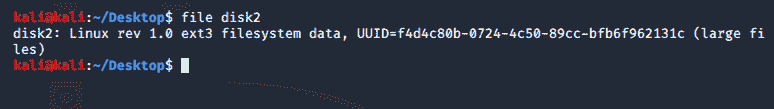
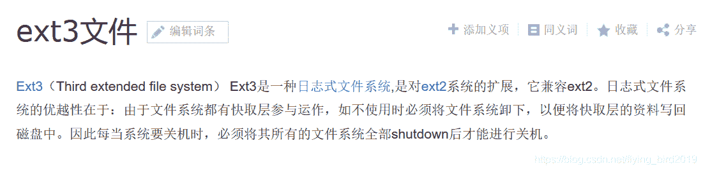
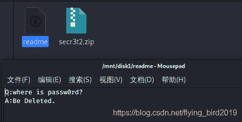

<!--yml
category: 未分类
date: 2022-04-26 14:39:20
-->

# 2020易博霖CTFMisc2--Disk题解_flying_bird2019的博客-CSDN博客

> 来源：[https://blog.csdn.net/flying_bird2019/article/details/105240908](https://blog.csdn.net/flying_bird2019/article/details/105240908)

# MISC2

## Disk

### 方法一

将文件加后缀.zip，打开后发现加密压缩包
将原文件以txt文件形式打开，在文本中发现密码
输入密码得到一个png图片，修改图片高度得flag

### 方法二

将文件移至Linux下，用[flie命令](https://mp.weixin.qq.com/s?src=11&timestamp=1585709957&ver=2251&signature=EpWhmEz1p4qZ0rMV11HoMh8yTeVFQ1Cqr1gYEND-rDJras-U7-TmTzo0cAw0gq83Podtbqp3AqZEfMl8c2LcYUt-SN1gK8pT5LR8RhaN-ronavfKd181fgf8OCMuecD3&new=1)检测文件类型

Linux中以文件的方式储存数据，ext3是一种文件系统，相当于windows下的磁盘

在linux中打开这种文件系统需要将其挂载到某一个文件目录下
[挂载的概念](https://www.zhihu.com/question/266907637)
[文件系统的挂载及mount挂载命令](https://mp.weixin.qq.com/s?src=11&timestamp=1585727257&ver=2251&signature=Yn5rRfmUCYPaAYr8olwEUDwp63HmIdmZFNMA6gqrF-B8qmA0twU9wY7qt2HNS*UmBFLUpN4zIRWMsJHBdkUuBHlDUEnczg7tdC2IUW-2qEojdJo2gUzpzoUu-9rhk9tP&new=1)
挂载后打开目录

提示说密码文件被删除了,上面链接的文章中讲到挂载的文件系统删除的文件是可以恢复的
[extundelete工具的下载和使用](https://www.cnblogs.com/dayxiaobei/p/5456701.html)
使用**extundelete disk1 --restore-all** 命令恢复得到密码文件
输入密码得到flag.png图片，修改图片高度得到flag