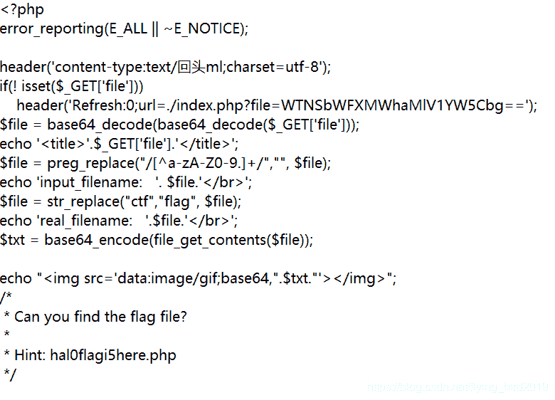
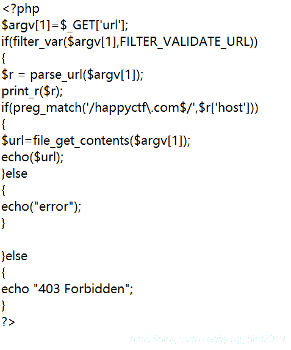
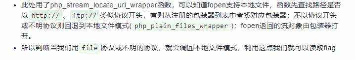

<!--yml
category: 未分类
date: 2022-04-26 14:37:48
-->

# 2020易博霖CTFWeb2--SSRF题解_flying_bird2019的博客-CSDN博客

> 来源：[https://blog.csdn.net/flying_bird2019/article/details/105249075](https://blog.csdn.net/flying_bird2019/article/details/105249075)

# Web2

## SSRF

(靶机服务器已关闭，因此没有截图)

观察题目url
**index.php?file=WTNSbWFXMWhaMlV1YW5Cbg==**
将参数file 进行两次base64解密得ctfimage.jpg
网页输出了上述图片
尝试读取index.php源代码,将file改为**YVc1a1pYZ3VjR2h3**(index.php两次base64加密)

转到后发现图片无法显示，猜测应该是文件按图片的形式输出，因为index.php不是图片文件所以无法显示
查看网页页面元素，将图片的base64编码复制后解码，得到index.php原内容
发现提示：**Hint: hal0flagi5here.php**

用上述方法得到该php文件源码

分析代码，这里有几个**重要条件：**
**1.filter_var($argv[1],FILTER_VALIDATE_URL)**
[绕过filter_var( )](http://www.52bug.cn/hkjs/4631.html)

**2.preg_match(’/happyctf.com / ′ , /', /′,r[‘host’])**
[绕过preg_match()](https://www.jianshu.com/p/80ce73919edb)

**3.file_get_contents()**
用该函数读取url，在之前filter_var( )绕过中发现http://协议无法使用
这里存在一个php的特性

此处参考带佬[题解](https://mp.weixin.qq.com/s?__biz=MzUyMTAyODYwNg==&mid=2247486214&idx=1&sn=0c6a5b5f5452af1cca002f2e35f16cc9&chksm=f9e01d97ce9794816e8412736d1360fb9269bc3eafb27fc43a9121512195f56409d1d5214506&mpshare=1&scene=23&srcid=&sharer_sharetime=1585642924658&sharer_shareid=92f36c51e9fe90eabbcca53a3e7f3364#rd)
题目要求为服务器根目录下的flag.txt文件
构造payload

url=0://happyctf.com/…/…/…/…/…/…/flag.txt
这里不知道Web服务的路径，用多个…/返回根目录，多余的…/会被忽略
最后得到flag

写题解过程中还简单了解了几个协议：
1.[文件包含和伪协议](https://blog.csdn.net/wu000999/article/details/101925271)
2.file:/// 协议格式：
scheme:[//[user:password@]host[:port]][/]path[?query][#fragment]
file协议打开本地文件，所以file://host/path的host省略得file:///
[参考文章](https://mp.weixin.qq.com/s?src=11&timestamp=1585732651&ver=2252&signature=CTgi8Bfhza5d0IafPGlYt41IJQbwM*205CSFXxRYyQAA3LNtJsbRKgck7AXtW2d6s2*O-nLqMfbwdCtNh4E0B6uNeZIBPhJM8Yb5qoKb50uVJmVaXIV*yL6h7EiWUabp&new=1)