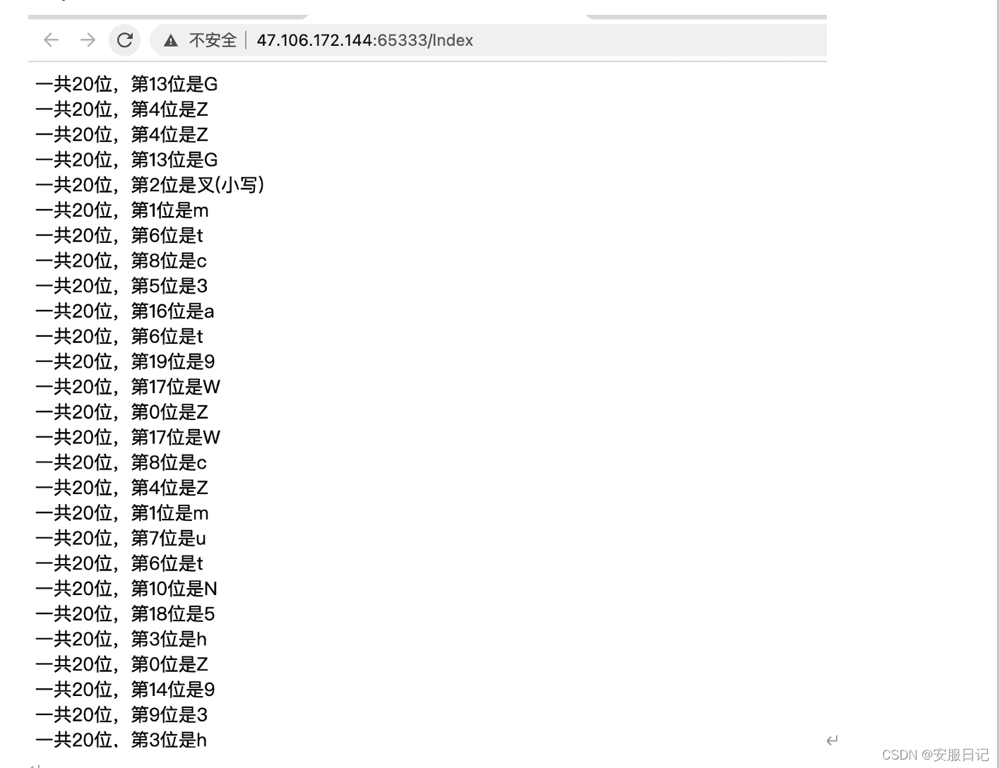
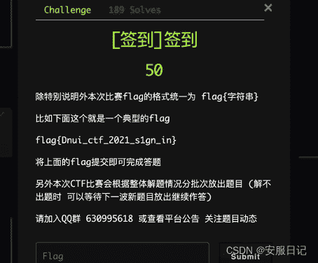
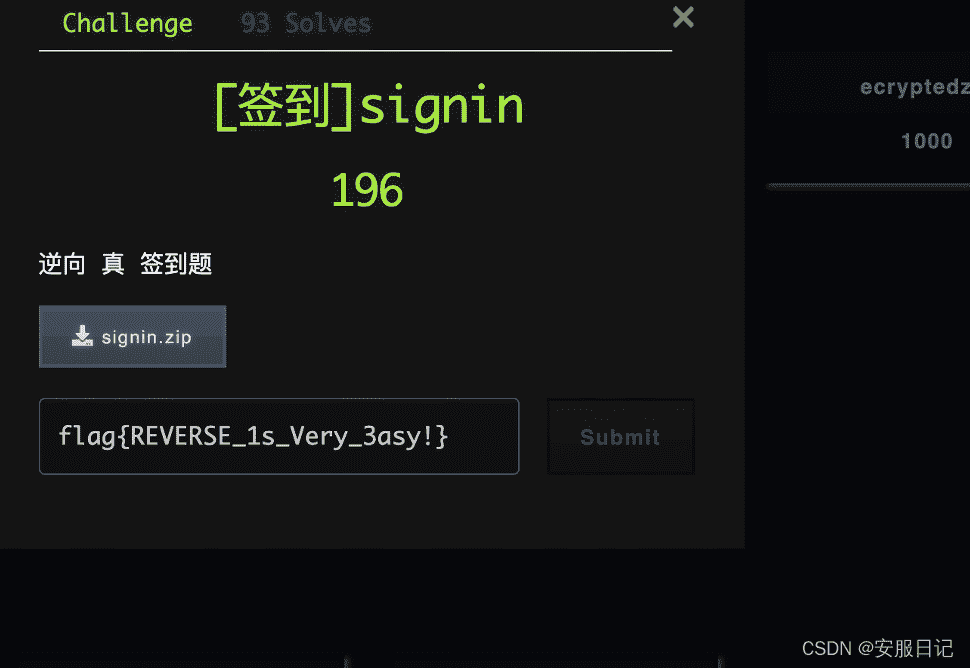
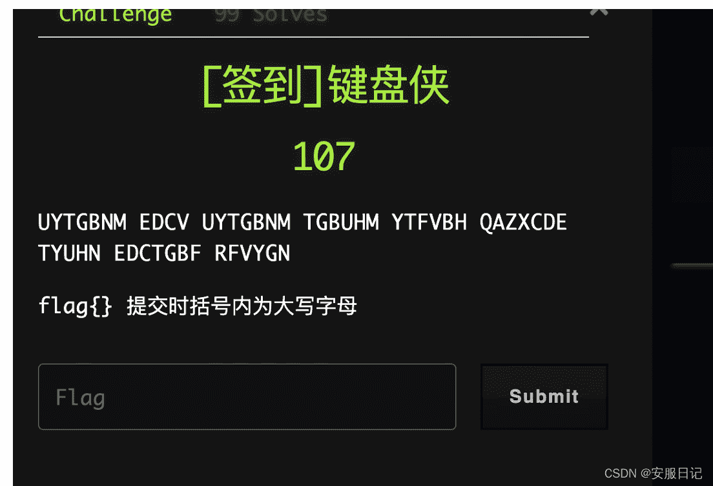
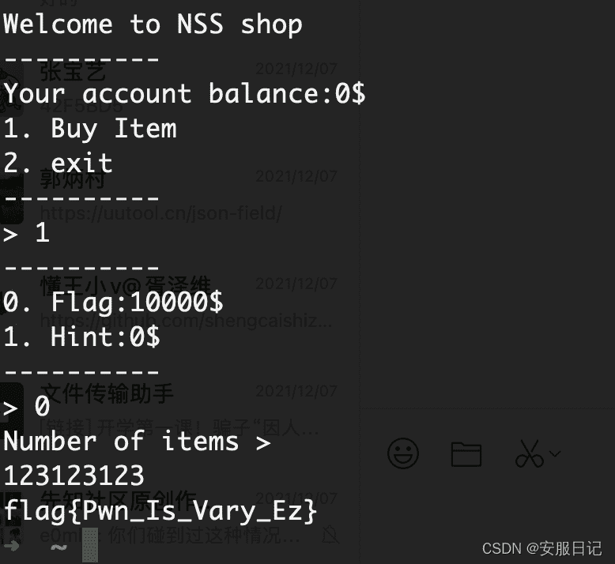

<!--yml
category: 未分类
date: 2022-04-26 14:51:49
-->

# 2021DNUICTF（东软杯CTF）的几个签到题writeup_Q1X1的博客-CSDN博客

> 来源：[https://blog.csdn.net/weixin_54430466/article/details/121771286](https://blog.csdn.net/weixin_54430466/article/details/121771286)

# 1.WEB

`按顺序找出来提交即可！`

# 2.MISC

`比赛的介绍，复制粘贴即可！`

# 3.REVERSE

`利用HEX16进制编辑器编辑搜索flag关键词即可！`

# 4.CRYPTO

`根据字母顺序结合电脑键盘对应待解谜字母，例如 UYTGBNM 在键盘根据顺利画一下得到字母 C`，以此类推，其他字母一样。

# 5.PWN

`int溢出`
