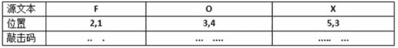
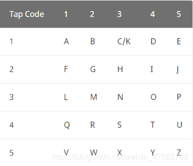
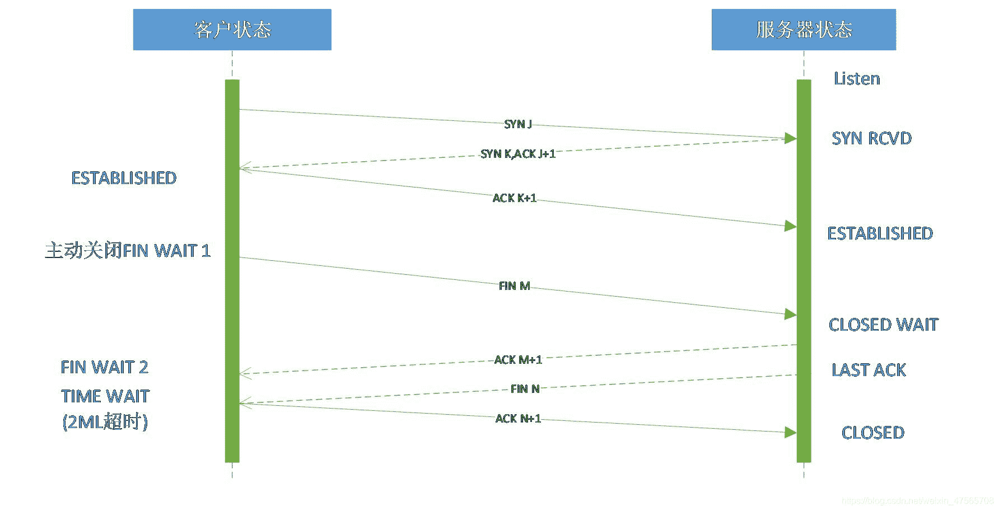
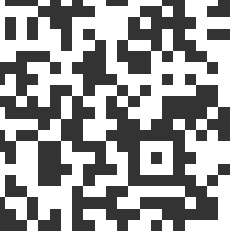
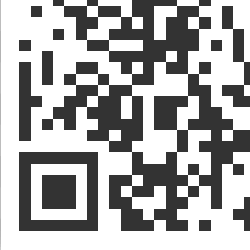
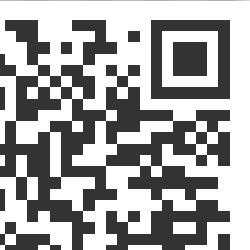
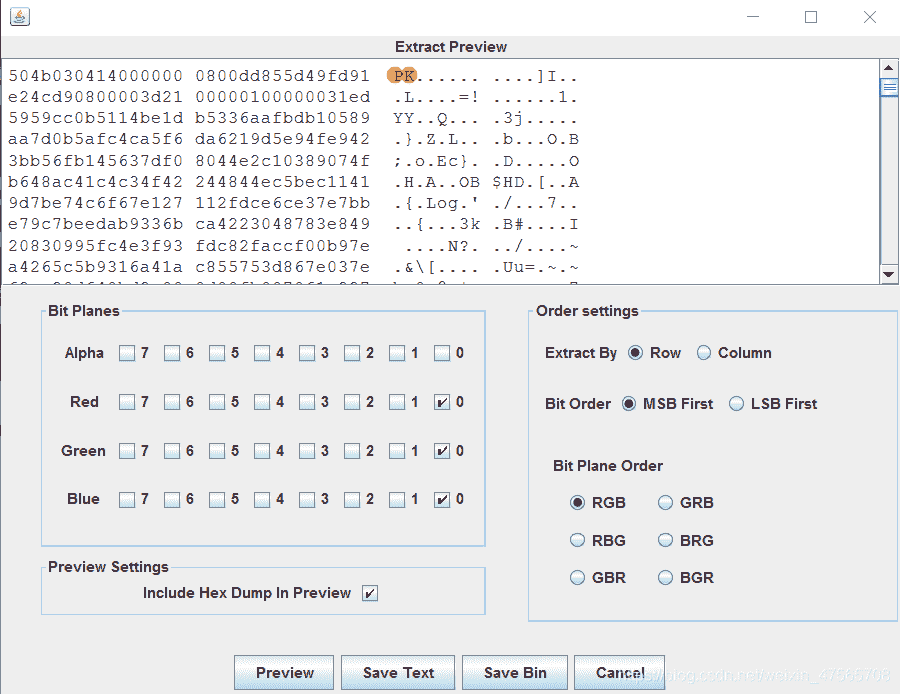
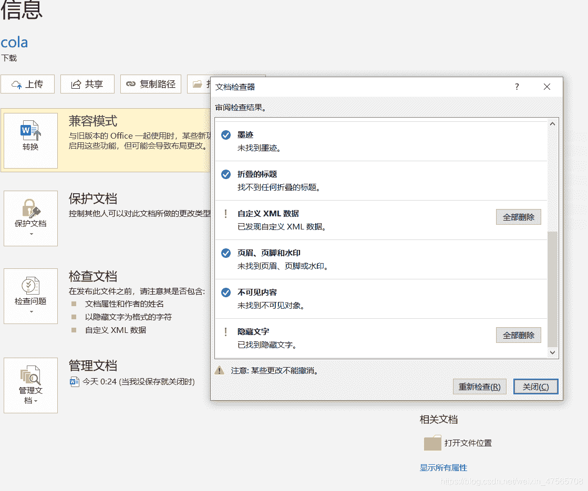

<!--yml
category: 未分类
date: 2022-04-26 14:43:48
-->

# 2021涅普冬令营Misc笔记与题解_break_cat的博客-CSDN博客

> 来源：[https://blog.csdn.net/weixin_47565708/article/details/113785699](https://blog.csdn.net/weixin_47565708/article/details/113785699)

> 前言：
> 
> 在我进行CTF签到活动的不长时间里，也没有专门学过，平常也就应付应付签到题，正好最近有个挺好的入门课，结果有事绊着，到现在录播就看了三个，这两天趁没事了赶紧补一补，先前零碎而间断地写练习场的题，写到今天有点写不下去了，于是就先小结一下，有些题不会，求指点。
> 
> 笔记大多是从幻灯片摘下来的，自己稍微又加了点儿。
> 
> 题目来自练习场https://camp.hackingfor.fun/
> 
> 所有图片均为题原图。
> 
> 题目前面有问号的为存在疑问或没能做出来的题，求指点。

# Misc

## Misc简介

Misc为英文miscellaneous的前四个字母，杂项、混合体、大杂烩的意思。

主要类型：

1.数据编码/图形密码

2.图片隐写

3.音频&视频隐写

4.流量分析

5.内存取证

6.游戏隐写

## 图片隐写

### 属性

查看图片属性。

用 exiftool 查看图片 exif 信息

```
exiftool 图片 
```

### 文件十六进制藏有字符串

（1）**strings**：查找可打印的字符，检查文件中所有的 ASCII 文本

```
strings 文件名 
```

（2）**grep**：使用正则表达式搜索，并输出匹配的行

```
grep -a 要搜索的关键词 文件名 
```

（3）**file**：识别文件类型

```
file 文件名 
```

### 文件包含

（1）**binwalk**：分离文件

分析所选文件（不提取）

```
binwalk 文件名 
```

分析并自动提取已知文件类型

```
binwalk -e 文件名 
```

Windows安装binwalk：https://www.cnblogs.com/pcat/p/5256288.html

（2）**foremost**：提取文件

```
foremost 文件名 
```

| 参数 | 含义 |
| --- | --- |
| -t | 需要恢复文件类型后缀(如jpg) |
| -i | 扫描的分区 |
| -o | 指定存放文件的目录，指定存放文件的目录必须为空，不然会报错 |

（3）**dd**命令

可以针对性分离某个文件，在隐写文件较多的情况下使用

```
dd if=源文件 of=目标文件名 bs=1 skip=开始分离的字节数 
```

参数说明：

*   if=file：输出文件名，缺省为标准输入
*   of=file：输出文件名，缺省为标准输出
*   bs=bytes：设置读写块的大小为Bytes
*   skip=blocks：从输入文件开头跳过blocks个块后再开始复制

https://www.cnblogs.com/yuanqiangfei/p/9138625.html

### 修改文件头

检查后缀名、文件头是否正确

破环文件头，一定不能显示，破环文件尾，文件不一定显示不正常

#### 常见的文件头

| 文件格式 | 文件头 | 文件尾 |
| --- | --- | --- |
| JPEG (jpg) | FF D8 | FF D9 |
| PNG (png) | 89 50 4E 47 | AE 42 60 82 |
| GIF (gif) | 47 49 46 38 | 00 3B |
| ZIP Archive (zip) | 50 4B 03 04 | 50 4B |

https://blog.csdn.net/wssmiss/article/details/88071448

### gif

（1）**特殊帧**

（2）**帧的时间间隔**

### png & bmp

（1）**zlib**

```
 import zlib
s = '''
78 9C 4B CB 49 4C AF 4E 4B 36 32 4D 4E 4A 32 4F
B2 30 B5 34 B5 4C 4B 35 30 36 37 B6 30 32 31 4C
B4 34 4B 4A 33 32 4E A9 05 00 E9 E2 0B 5F D0 1C
68
'''
s = s.replace(' ','').replace('\n','')
b = bytes.fromhex(s)
flag = zlib.decompress(b)
print(flag) 
```

（2）**IHDR**、**IDAT**

高度或者宽度被修改

```
import os
import binascii
import struct
misc = open("IHDR.png","rb").read()

crc32_bytes = misc[0x1d:0x20+1]
crc32_hex_eval = eval('0x' + crc32_bytes.hex())
print(crc32_hex_eval)
for i in range(4096):
    data = misc[0x0c:0x0f+1] + misc[0x10:0x13+1] + struct.pack('>i',i)+ misc[0x18:0x1c+1]  
    crc32 = binascii.crc32(data) & 0xffffffff
    if crc32 == crc32_hex_eval : 
        print(i)
        print("height_hex:"+ hex(i)) 
```

（3）**LSB 或 MSB 隐写（可能有密码）**

LSB（最低有效位）：LSB替换隐写基本思想是用嵌入的秘密信息取代载体图像的最低比特位，原来的7个高位平面与替代秘密信息的最低位平面组合成含隐藏信息的新图形

*   考点：

    像素三原色（RGB）

    通过修改像素中最低位的1bit来达到隐藏的效果

*   zsteg

*   stegsolve：检查每个颜色通道是否正常

（4）**wbs43open（bmp）**

### JPG

（1）**jphide(jphs）**

（2）**steghide**

```
steghide extract -sf 图片 -p 密码 
```

（3）**stegdetect**

jsteg、outguess、jphide、invisible secrets 隐写

查看图片隐写方式

```
stegdetect.exe -tjopi -s1000.0 *.jpg 
```

爆破密码

```
stegbreak -r rules.ini -f 字典 -t p *.jpg 
```

（4）**outguess**

```
outguess -k "key" -r 文件名 -t 保存的文件名 
```

（5）**F5隐写**

```
java Extract 图片 -e misc -p 11111 
```

（6）**水印(单图)**

可能有隐形水印

工具+Java盲水印

### 双图隐写

XOR

### stegpy

### silenteye

LSB 隐写（可能有密码）

## 压缩包

### 注释

查看压缩包的注释

### 暴力破解

（1）先试1-6 位纯数字

（2）弱口令字典

### zip

（1）**检查是否是伪加密**

无加密

压缩源文件数据区的全局加密应当为`00 00` （504B0304两个bytes之后）
且压缩源文件目录区的全局方式位标记应当为`00 00`（504B0304四个bytes之后）

假加密

压缩源文件数据区的全局加密应当为`00 00`
且压缩源文件目录区的全局方式位标记应当为`09 00`

真加密

压缩源文件数据区的全局加密应当为`09 00`
且压缩源文件目录区的全局方式位标记应当为`09 00`

（2）**CRC32 爆破**

文件长度较小时使用。

（3）**已知明文攻击**

https://www.sohu.com/a/274916484_704736

### rar

伪加密

## 音频隐写

### 波形

01串

### 频谱图

## .pyc文件反编译

## 文档隐写

## Word

（1）按Ctrl+A看有没有隐藏文字

（2）图片后面可能隐藏文字

（3）点击 Word 中文件 -> 选项，勾选隐藏文字选项

## 数据编码

### 二进制

二进制是世界上第一台计算机上用的算法，最古老的计算机里有一个个灯泡，当运算的时候，比如要表达“一”，第一个灯泡会亮起来。要表达“二”，则第一个灯泡熄灭，第二个灯泡就会亮起来。

二进制是计算技术中广泛采用的一种数制。二进制数据是用0和1两个数码来表示的数。它的基数为2，进位规则是“逢二进一”，借位规则是“借一当二”，由18世纪德国数理哲学大师莱布尼兹发现。当前的计算机系统使用的基本上是二进制系统，数据在计算机中主要是以补码的形式存储的。计算机中的二进制则是一个非常微小的开关，用“开”来表示1，“关”来表示0。

### 进制转换

*   二进制转ascii码

    二进制 01101110 01100101 01110000

    ascii n e p

    10进制 110 101 112

*   二进制转morse码

    **https://coding.tools/cn/binary-to-text**

*   二进制转二维码（绘图）

*   二进制转图片（hex）

    用脚本将二进制字符串转换成十六进制字符串

    ```
    def binary_to_hex(binary_str):
        decimal_number = int(binary_str, 2)
        hex_number = hex(decimal_number)
        return hex_number

    binary_input = '文本的内容（二进制字符串）'
    hex_output = binary_to_hex(binary_input)
    print('hex result is:{0}'.format(hex_output)) 
    ```

    打开十六进制编辑器，新建文件，将转换后的十六进制字符串粘贴到十六进制编辑区域，调整后保存文件。

### CTF常见编码

#### Ascii码

ASCII是基于拉丁字母的一套电脑编码系统。它主要用于显示现代英语。

![[外链图片转存失败,源站可能有防盗链机制,建议将图片保存下来直接上传(img-NuxaUPO5-1612961421143)(图片\图片1.jpg)]](img/e2e63b9de6429a76cb460d6420596b3b.png)

```
01001110 	  01100101 		   01110000 	 01101110 		01100101 		01110000
   78            101              112           110            101             112  
    N			   e				p			  n				 e				 p 
```

#### base64

编码原理：Base64编码要求把3个8位字节转化为4个6位的字节，之后在6位的前面补两个0，形成8位一个字节的形式，6位2进制能表示的最大数是2的6次方是64，这也是为什么是64个字符(A-Z,a-z，0-9，+，/这64个编码字符，=号不属于编码字符，而是填充字符)的原因，这样就需要一张映射表，如下：

![[外链图片转存失败,源站可能有防盗链机制,建议将图片保存下来直接上传(img-4m5moIN9-1612961421145)(图片\图片2.png)]](img/cad5e4b96133c4fbbf1d05e5362b4ebb.png)

举个例子(base64)：

源文本：T h e

对应ascii码:84 104 101

8位binary：01010100 01101000 01100101

6位binary：010101 000110 100001 100101

高位补0：000010101 00000110 00100001 00100101

对应十进制：21 6 33 37

查表：V G h l

#### base32

Base32编码是使用32个可打印字符（字母A-Z和数字2-7）对任意字节数据进行编码的方案，编码后的字符串不用区分大小写并排除了容易混淆的字符，可以方便地由人类使用并由计算机处理，tips：末尾最多有6个=

The --> KRUGK===

#### base16

Base16使用数字0-9和字母A-F共计16个ASCII可打印字符对任意字节数据进行编码，tips：不会出现=

The --> 546865

#### base36

Base36包含0~9的数字，加上所有26个字母，不区分大小写，不包含任何标点，所有的字母要不全大写，要不全小写。所以加起来就是 “0123456789ABCDEFGHIJKLMNOPQRSTUVWXYZ",或者”0123456789abcdefghijklmnopqrstuvwxyz“

7758521 --> 4maih

特点：

密文由36个字符（0-9,a-z）或（0-9,A-Z）组成，加密仅支持整数数字，解密仅支持字符串，不支持中文

#### base58

采用的字符集为“123456789abcdefghijkmnopqrstuvwxyzABCDEFGHJKLMNPQRSTUVWXYZ”，从这不难看出，Base58是纯数字与字母组成而且去掉了容易引起视觉混淆的字符（0：数字零，O：大写O，I：大写i，l:小写L）。9个数字+49个字母=58个。

Nepnep --> g3GLQtr3

特点：

Base58不使用数字”0”，字母大写”O”，字母大写”I”，和字母小写”l”，以及”+”和”/”符号

#### base62

同样的还有 base62编码，就是26个字母的大小写再加上0-9，一共62个字符。

相比于base64只是去掉了两个符号（+和/）

Nepnep --> gVols1oVols1

特点：

密文由62字符（0-9，a-z，A-Z）组成

#### base85

Base85是一种类似于Base64的二进制文本编码形式，通过使用五个ASCII字符来表示四个字节的二进制数据。例如，它用于将图像嵌入到Adobe PDF文件中。

Nepnep --> :1\B^AT.

#### base91

特点：由91个字符（0-9，a-z，A-Z,!#$%&()*+,./:;<=>?@[]^_`{|}”）组成

Nepnep --> _O[2e,qC

#### base92

特点：比base91 多一个字符 〜

Nepnep --> =U_4d9cc

#### Morse

摩尔斯电码（英语：Morse code）是一种时通时断的信号代码，通过不同的排列顺序来表达不同的英文字母、数字和标点符号。是由美国人艾尔菲德·维尔与萨缪尔·摩尔斯在1836年发明。

摩尔斯电码是一种早期的数字化通信形式。

![[外链图片转存失败,源站可能有防盗链机制,建议将图片保存下来直接上传(img-XAhxRa10-1612961421147)(图片\图片3.png)]](img/705891b42ad0897054e51fe79c3c01dc.png)

```
....- ....- --... .---- ..--- ..--- ....- ---.. 
```

#### Encode like shellcode

shellcode是一段用于利用软件漏洞而执行的代码，shellcode为二进制的机器码，因为经常让攻击者获得shell而得名，经常使用16进制格式来表示，我们也可以用16进制格式来表示其他隐写信息。

```
\x54\x68\x65\x7f\x71\x75\x69\x63\x6b\x7f\x62\x72\x6f\x77\x6e\x7f\x66\x6f\x78\x7f\x6a\x75\x6d\x70\x73\x7f\x6f\x76\x65\x72\x7f\x74\x68\x65\x7f\x6c\x61\x7a\x79\x7f\x64\x6f\x67 
```

#### urlencode

url编码又叫百分号编码，是统一资源定位(URL)编码方式。

URL地址（常说网址）规定了常用的数字，字母可以直接使用，另外一批作为特殊用户字符也可以直接用（/,:@等），剩下的其它所有字符必须通过%xx编码处理。

编码方法很简单，在该字节ascii码的的16进制字符前面加%. 如 空格字符，ascii码是32，对应16进制是’20’，那么urlencode编码结果是:%20。

```
%77%65%6C%63%6F%6D%65%20%74%6F%20%74%68%65%20%4E%65%70%6E%65%70%20%53%74%75%64%69%6F 
```

#### unicode

Unicode，中文又称万国码、国际码、统一码、单一码，是计算机科学领域的业界标准。它整理、编码了世界上大部分的文字系统，使得电脑可以用更为简单的方式来呈现和处理文字。 Unicode伴随着通用字符集的标准而发展，同时也以书本的形式对外发表。Unicode至今仍在不断增修，每个新版本都加入更多新的字符。

```
\u574f\u5973\u4eba\u4e07\u5c81\uff01

&#x574f;&#x5973;&#x4eba;&#x4e07;&#x5c81;&#xff01; 
```

#### aaencode

可以将JS代码转换成常用的网络表情，也就是我们说的颜文字js加密。

```
ﾟωﾟﾉ= /｀ｍ´）ﾉ ~┻━┻   //*´∇｀*/ ['_']; o=(ﾟｰﾟ)  =_=3; c=(ﾟΘﾟ) =(ﾟｰﾟ)-(ﾟｰﾟ); (ﾟДﾟ) =(ﾟΘﾟ)= (o^_^o)/ (o^_^o);(ﾟДﾟ)={ﾟΘﾟ: '_' ,ﾟωﾟﾉ : ((ﾟωﾟﾉ==3) +'_') [ﾟΘﾟ] ,ﾟｰﾟﾉ :(ﾟωﾟﾉ+ '_')[o^_^o -(ﾟΘﾟ)] ,ﾟДﾟﾉ:((ﾟｰﾟ==3) +'_')[ﾟｰﾟ] }; (ﾟДﾟ) [ﾟΘﾟ] =((ﾟωﾟﾉ==3) +'_') [c^_^o];(ﾟДﾟ) ['c'] = ((ﾟДﾟ)+'_') [ (ﾟｰﾟ)+(ﾟｰﾟ 
```

#### jjencode

```
$=~[];$={___:++$,$$$$:(![]+"")[$],__$:++$,$_$_:(![]+"")[$],_$_:++$,$_$$:({}+"")[$],$$_$:($[$]+"")[$],_$$:++$,$$$_:(!""+"")[$],$__:++$,$_$:++$,$$__:({}+"")[$],$$_:++$,$$$:++$,$___:++$,$__$:++$};$.$_=($.$_=$+"")[$.$_$]+($._$=$.$_[$.__$])+( 
```

#### uuencode

Uuencode是二进制信息和文字信息之间的转换编码，也就是机器和人眼识读的转换。Uuencode编码方案常见于电子邮件信息的传输，目前已被多用途互联网邮件扩展（MIME）大量取代。

```
2Y9V/Y:6SY+JZY+B'Y;*![[R! 
```

#### jsfuck

JSFuck 可以让你只用 6 个字符  ! +来编写 JavaScript 程序。

```
[][(![]+[])[+[]]+(![]+[])[!+[]+!+[]]+(![]+[])[+!+[]]+(!![]+[])[+[]]][([][(![]+[])[+[]]+(![]+[])[!+[]+!+[]]+(![]+[])[+!+[]]+(!![]+[])[+[]]]+[])[!+[]+!+[]+!+[]]+(!![]+[][(![]+[])[+[]]+(![]+[])[!+[]+!+[]]+(![]+[])[+!+[]]+(!![]+[])[+[]]])[+!+[]+[+[]]]+([][[]]+[])[+!+[]]+(![]+[])[!+[]+!+[]+!+[]]+(!![]+[])[+[]]+(!![]+[])[+!+[]] 
```

可以直接在浏览器或者 node.js 中运行。

#### brainfuck

```
+++++ +++++ +++++ [->++ +++++ +++++ +++<] >++++ .<+++ +++++ [->-- -----
-<]>- ----- --.<+ ++[-> ---<] >---- -.<++ +++++ ++[-> +++++ ++++< ]>+++ 
```

#### Ook！

```
Ook. Ook. Ook. Ook. Ook. Ook. Ook. Ook. Ook. Ook. Ook. Ook. Ook. Ook. Ook.
Ook. Ook. Ook. Ook. Ook. Ook. Ook. Ook. Ook. Ook. Ook. Ook. Ook. Ook. Ook.
Ook! Ook? Ook! Ook! Ook. Ook? Ook. Ook. Ook. Ook. Ook. Ook. Ook. Ook. Ook. 
```

#### Short ook！

```
..... ..... ..... ..... ..... ..... !?!!. ?.... ..... ..... ..... .....
..... .?.?! .?... ..... !.?.. ..... ..... ..... !?!!. ?!!!! !!!!! !!!!!
!!?.? !.?!! !!!!! !!!!! !!!!! .?... ....! ?!!.? !!!!! !?.?! .?!!! !!!!!
!!!.? ..... ..... ..... ....! ?!!.? ..... ..... ..... ...?. ?!.?. .....
....! .?... ..... ..... ....! ?!!.? !!!!! !!!!! !!!!! !?.?! .?!.? .....
..!?! !.?.. ....? .?!.? ..... ..... !.?.. ..... ..... ...!? !!.?. .....
..... ...?. ?!.?! .?... ..... ..... !?!!. ?!!!! !!!!! !!!?. ?!.?! !!!!!
!!!!! !!.!. ?.... ..... ....! ?!!.? ..... ..... ..?.? !.?.. ..... .....
!.?.. ..... ..... .!?!! .?!!! !!!!! !!!!? .?!.? !!!!! !!!!! !!!!! !!.?.
..... ..... ....! ?!!.? !!!!! !!!!! !!!!? .?!.? !.?.. ..... ..... .....
..!?! !.?.. ..... ..... ..... .?.?! .?... ..... ..... ..... ..... ...!.
?.... ..... ..... .!?!! .?!!! !!!!! !!!!! !?.?! .?!!! !!.?. ..... .....
....! ?!!.? !!!!! !!!!! !!!!? .?!.? !.?.. ..... ..... ..... ....! ?!!.?
..... ..... ..... ..... ?.?!. ?.... ..... ..... ..... .!.?. ..... .....
....! ?!!.? !!!!! !!!!! !!!!? .?!.? !!!!! .?... ..... ..... ..!?! !.?!!
!!!!! !!!!! !!?.? !.?!! !!!!! !!!!! !!!!! !!!!. ?. 
```

![[外链图片转存失败,源站可能有防盗链机制,建议将图片保存下来直接上传(img-nQUMvvpj-1612961421149)(图片\图片4.png)]](img/60ccd250ea6aa475bd3ec66d803509c0.png)

#### 敲击码

敲击码（Tap code）是一种以非常简单的方式对文本信息进行编码的方法。因该编码对信息通过使用一系列的点击声音来编码而命名，敲击码是基于 5 ×5 方格波利比奥斯方阵来实现的，不同点是是用 K 字母被整合到 C 中。




```
24 15 15 22 22 14 14 23 
```

#### 二维码

用某种特定几何图形按一定规律在平面分步的黑白相间的图形记录数据符号信息

堆叠式 / 行排式二维码又称堆积式二维条码或层排式二维条码，其编码原理是建立在一维条码基础之上，按需要堆积成二行或多行。 Code 16 k、Code 49、PDF417

矩阵式二维码：QR CODE

矩阵式二维码，最流行莫过于QR CODE ,我们常说的二维码就是它了。矩阵式二维条码（又称棋盘式二维条码）它是在一个矩形空间通过黑、白像素在矩阵中的不同分布进行编码。在矩阵相应元素位置上，用点（方点、圆点或其他形状）的出现表示二进制“1”，点的不出现表示二进制的“0”，点的排列组合确定了矩阵式二维条码所代表的意义。矩阵式二维条码是建立在计算机图像处理技术、组合编码原理等基础上的一种新型图形符号自动识读处理码制。具有代表性的矩阵式二维条码有：Code One、MaxiCode、QR Code、 Data Matrix、Han Xin Code、Grid Matrix 等。

![[外链图片转存失败,源站可能有防盗链机制,建议将图片保存下来直接上传(img-OCn5CWNP-1612961421154)(图片\图片7.png)]](img/f324394e35251fe14af2331f4bf79a1c.png)

**QR码的特点**

存储大容量信息

传统的条形码只能处理20位左右的信息量，与此相比，QR码可处理条形码的几十倍到几百倍的信息量。

另外，QR码还可以支持所有类型的数据。（如：数字、英文字母、日文字母、汉字、符号、二进制、控制码等）。一个QR码最多可以处理7089字(仅用数字时)的巨大信息量。

在小空间内打印

QR码使用纵向和横向两个方向处理数据，如果是相同的信息量，QR码所占空间为条形码的十分之一左右。(还支持Micro QR码，可以在更小空间内处理数据。)

![[外链图片转存失败,源站可能有防盗链机制,建议将图片保存下来直接上传(img-FKcycAae-1612961421155)(图片\图片8.png)]](img/ed768cb52589bb9d239d9bef6cffe61e.png)

**QR码的基本结构**

QR(Quick-Response) code是被广泛使用的一种二维码，解码速度快。

格式信息：纠错等级

版本信息：即二维码的规格，QR码符号共有40种规格的矩阵

![[外链图片转存失败,源站可能有防盗链机制,建议将图片保存下来直接上传(img-zyalSX2S-1612961421156)(图片\图片9.png)]](img/f5fe36e5aef764fc9a54f9dc3c690fd2.png)

#### 社会主义核心价值观编码

```
友善爱国平等敬业友善法治爱国诚信平等诚信自由平等友善自由平等友善平等和谐诚信自由自由友善平等友善自由诚信民主友善自由友善爱国自由友善平等爱国爱国法治友善爱国平等诚信民主文明爱国民主诚信自由友善敬业友善平等诚信文明爱国民主 
```

#### 与佛论禅

```
佛曰：怯耨提奢滅怯瑟提倒菩帝俱羯侄菩地有奢寫醯殿哆耶 
```

开头有“佛曰”和“新佛曰”

#### 与熊论道

```
熊曰：呋食有魚拙訴爾肉註嗄捕果囑哞嚄取呆山很寶更我嚁告堅我噔 
```

## 流量分析

### 互联网五层模型

防火墙截取的网络攻击流在公安机关对网络攻击的取证中，流量分析往往是非常重要的一个环节，通过分析量，我们能获得许多线索。在学习流量分析之前，我们需要明白一些网络的基础知识，我们将从常见的网络五层模型，自下而上，即物理层->数据链路层->网络层->传输层->应用层 进行介绍

**物理层**

当两台计算机相连直接通信的时候，发挥主要作用的是物理层。

计算机将信号发送到网线上，另外一台计算机负责接收。

假如我们将第三台电脑通过集线器（hub）相连，相当于三台计算机同时连接在同一根导线上，一台计算机发送的信号，会被其他两台计算机同时收到，不够安全，也有可能发生信号冲突。

**数据链路层**

当多台计算机通过交换机（switch）相连的时候，他们采用的通信方式是数据链路层的协议，每一台计算机都分配了对应的MAC地址，当某台计算机想通过给另外一个计算机发送消息时，需要在以太帧头中指明发送方和接收方的地址，交换机在接收到信号之后会根据这个地址正确将信号转发至某一端口（即网线），从而避免了网络内所有计算机都能收到信号。以太帧中的数据包是我们想要传输的信息，包括接下来的IP数据包。

**网络层**

当我们计算机的网络较为大且复杂的时候，我们使用简单的MAC地址并不能很好的管理网络，因为MAC地址是和硬件绑定的，因为假如我们更换了计算机设备，那么就需要重新配置网络的信息。这个时候IP地址网络协议就诞生了。

IP地址和MAC地址通过Arp协议进行转换。其中路由器的存在使得计算机之间能够跨网段访问。如图所示的网络的三个区域的网段分别是192.168.0.0/24、 192.168.1.0/24、 192.168.2.0/24，网关则是路由器连接每个网段的接口，比如192.168.0.1、192.168.1.1、192.168.2.1，计算机想要跨网段通信时，需要把消息转发给路由器上面的网关，路由器再根据IP地址接着转发。

arp协议将物理地址转化为网络地址。

网络层的IP数据包部分，里面指明了源地址和目的地址，IP地址里面的数据包包含了我们想要传输的信息，如TCP数据包。

**传输层**

在网络层的基础上，我们完成了数据通过IP地址的传送，但是我们仍然要确保数据传输的可靠性。Tcp就是这样的一种协议，他具有多种特性，如使用三次握手的方法确保连接畅通，通过端口的方法来区分不同的连接。

大致流程如下：

客户端向服务端发送一个请求连接包 ，标识符为SYN序号为 J

服务端、收到请求连接包，并对SYN J进行确认，然后发送一个回复包，标识符为SYN K, ACK J+1

客户端向服务端发一个确认收到回复包，标识符为ACK K+1

这样就完成了三次握手。



传输层还有一种协议是UDP协议，是不可靠连接，是不能确定对方是否收到的一种数据包，格式如下：

![[外链图片转存失败,源站可能有防盗链机制,建议将图片保存下来直接上传(img-2UD1D2ln-1612961421156)(图片\图片21.png)]](img/b24a6279d3e007c54305dc68979c1a09.png)

**应用层**

HTTP报文由请求报文和相应报文组成。常见的HTTP报文类型有GET/POST

发现一篇总结Misc的不错的文章：https://john-doe.fun/misc-ideas/#%E9%80%9A%E7%94%A8

## 例题

### 属性.jpg


解：Windows 10：右键菜单—>属性

标题、主题有一段字符串，为flag。

### strings.jpg


解：Kali Linux：

```
strings strings.jpg 
```

搜索打印的字符得到flag。

### grep.jpeg


解：Kali Linux：

flag格式BJD{}

```
grep -a BJD grep.jpeg 
```

得到flag。

### aaa.gif


解：PS打开删除没有flag信息的图层，然后拼图，得到 flag{he11ohongke}

插一句，这个flag格式ZTMDEX。

FLAG为：flag{hello hongke}

### lsb.png


解：打开stegsolve，对着 > 点点点，可以看到在red，blue，green的0管道下均出现了类似于条形码的阴影，

打开Data extract：Analyse—>Data extract

按下图操作

![[外链图片转存失败,源站可能有防盗链机制,建议将图片保存下来直接上传(img-nxT9M1KI-1612961421157)(图片\1926879-20210205201807774-1455860130.png)]](img/ee9500e90cbf26bc524f18e2bc45b060.png)

发现存有PNG文件，Save Bin 为.png文件，得到二维码，微信扫一扫得到flag。

### binwalk,foremost,dd.png


解：Kali Linux：

检查图片文件

```
binwalk binwalk,foremost,dd.png 
```

将文件分离出来

```
foremost binwalk,foremost,dd.png 
```

flag为图片文字提交时加上flag{}。

### pngcheck.png


解：binwalk分析并提取已知文件类型（ 取巧 ：） ）

```
binwalk -e pngcheck.png 
```

打开 21154 文件得到flag。

### westego4.3open (123456).bmp


解：使用 westego4

打开工具后选择解密（Decode），选择文件路径以及文件格式，输入文件密码：123456，最后输入导出文件名，生成.txt文件得到flag。

### IHDR.png

![[外链图片转存失败,源站可能有防盗链机制,建议将图片保存下来直接上传(img-anN5qToQ-1612961421158)(图片\IHDR.png)]](img/fe8ce8a139d690e82435e917b42dca96.png)

解：可能不好下载。图片无法显示是正常现象，原因是图片的IHDR（高）不对，这时要使用脚本爆破出文件的高。

```
import os
import binascii
import struct
misc = open("IHDR.png","rb").read()

crc32_bytes = misc[0x1d:0x20+1]
crc32_hex_eval = eval('0x' + crc32_bytes.hex())
print(crc32_hex_eval)
for i in range(4096):
    data = misc[0x0c:0x0f+1] + misc[0x10:0x13+1] + struct.pack('>i',i)+ misc[0x18:0x1c+1]  
    crc32 = binascii.crc32(data) & 0xffffffff
    if crc32 == crc32_hex_eval : 
        print(i)
        print("height_hex:"+ hex(i)) 
```

得到高后使用十六进制编辑器更改图片的IHDR值，

![[外链图片转存失败,源站可能有防盗链机制,建议将图片保存下来直接上传(img-Io5FrBKP-1612961421159)(图片\Snipaste_2021-02-08_16-54-34.png)]](img/426d92aba4500b2267944a741a11a49c.png)

得到原图和flag。

### lsb(123456).png


解：有密钥的lsb隐写，密钥为123456，使用cloacked-pixel（项目地址：https://github.com/livz/cloacked-pixel），将.png文件放进文件夹，在命令行下进入到该文件夹。

```
python2 lsb.py extract lsb(123456).png 1.txt 123456 
```

得到隐写的文件1.txt，得到flag。

注：

extract：提取

### bin.txt

附件文本是一大串的二进制字符串，贼长，我就不把内容放到文章里了，Makedown编辑器会爆炸的。

解：

用脚本将二进制字符串转换成十六进制字符串。

```
def binary_to_hex(binary_str):
    decimal_number = int(binary_str, 2)
    hex_number = hex(decimal_number)
    return hex_number

binary_input = '文本的内容（二进制字符串）'
hex_output = binary_to_hex(binary_input)
print('hex result is:{0}'.format(hex_output)) 
```

转换后的十六进制字符串也贼长，内容放到文章里Makedown编辑器会爆炸的，运行的时候的电脑将近卡了半分钟，所以说这题为什么要用个这么长的字符串呢，诶 -_- 。

由FF D8开头和FF D9结尾可知是一个.jpg文件，打开十六进制编辑器，新建文件，将转换后的十六进制字符串粘贴到十六进制编辑区域，调整后保存文件。

打开图片，得到一个领取的时候显示 口令错误 的红包口令：24597848，此为FLAG。

### Base 编码

```
LJWXQ2C2GN2EGTSIJZWFQ6SGPJMHUTTIMMZWW2DGKE6T2=== 
```

解：base32编码，解码得

```
ZmxhZ3tCNHNlXzFzXzNhc3khfQ== 
```

base64编码，解码得flag。

### Stegsolve工具使用


解：顾名思义，打开stegsolve，点击 < ，发现二维码，扫码得到flag。

### 二维码条形码






解：下载附件，发现是四个残缺的二维码，打开PS进行拼图play，得到二维码，扫码得到flag。

### 图片base64编码

点附件下载是一大串的base64编码，贼长，有多长呢，Makedown编辑器会爆炸的那种长度。

解：顾名思义，base64还原图片，直接整个复制后用在线转换工具转换即可，得到二维码，扫码得到flag。

### LSB图片隐写


解：下载附件，打开stegsolve，点点点，发现红、蓝、绿的 plane 0有东西。遂



PK是啥？

> 小知识：
> 
> .pk文件bai是多轨工程中的单轨的配置文件。
> 
> 这种文件是多轨工程中的单轨的配置文件，每一条音轨对应一个pk文件，这个文件虽然很小，但是记录着它所对应的那条音轨的所有效果信息。例如zip文档的开头标记一般为pk，这是一种源于磁盘操作系统时代的格式。

点击 save bin 保存成.zip文件。解压缩，提示压缩包损坏，使用WinRAR的修复压缩包的功能修好压缩包`^_^`，解压缩，发现1文件，（尝试）用记事本打开，搜索可能与flag有关的字符（我在搜索 flag 无果后搜的 { ，这里给出差评——这题一点提示都没有，根本不知道flag的格式是什么），得到flag，为 hctf{dd0gf4c3tok3yb0ard4g41n~~~} 。

### Morse 编码

```
..-. .-.. .- --. ----.-- .. .-.. --- ...- . -.-- --- ..- -----.- 
```

解：使用在线解密工具，得到

```
ሻd89c57cfd 
```

这是啥？

使用另一个在线解密工具，得到

```
FLAGILOVEYOU 
```

提交，flag错误

加括号

```
FLAG{ILOVEYOU} 
```

提交，flag错误

……

flag是 flag{ILOVEYOU} ，拿走不谢。

不知道那个SBWYE想的让猜格式，编码题最后还得爆破答案，真就Misc呗。

### 16进制查看


解：16进制查看克劳德大头照，搜索flag，得到flag。

### 电子文档隐写

解：WPS

https://xz.aliyun.com/t/1883/

在菜单栏中选择，并单击File（文件）->Tool（工具）->Option（选项）

找到 隐藏文字 功能，选择这个功能，点击保存

Word



你找到就找到了呗，关键是怎么看啊？ ：（

刚刚找到了，在文件—>Word选项—>显示里选择。

### 上课认真听了吗

解：用Wireshark打开题目udphttptcp.pcapng，

1.搜索udp，在Time为3.144098的udp包中找到flag的1/3：flag{254}

2.按照视频的过程：搜索http，在搜索结果中继续搜索字符串 flag{ ，没能搜到包中能找到flag的1/3的http包，搜索字符串 flag{ ，在Time为12.147274的tcp包中找到flag的1/3：flag{340}

3.搜索tcp，搜索 flag{ ，很难找到Time为48.312388的tcp包，flag的1/3：flag{26}

### HTML 实体编码

```
\u66\u6c\u61\u67\u7b\u57\u33\u6c\u63\u30\u6d\u65\u21\u7d 
```

解：找个在线工具把ASCII码转换成字符即可。

### 我是间谍

解：打开Wireshark并设置捕获，运行imaspy.exe程序，看看它都干了些什么，经过漫长的抓包过程，终于找到了带有flag的udp包，感叹一下，流量分析我还是一如既往的不拿手啊，还有，科来真香。

### 简单流量

附件是一个叫liuliang.zip的压缩包，打开后是一个ssl密钥文件sslkey.log和要分析的zstuctf.pcapng。

题目还涉及到一个知识点，在题目描述中——关于ssl密钥导入：https://segmentfault.com/a/1190000018746027

解：导入密钥，用Wireshark打开文件，看看它都干了些什么，经过一阵猛如虎的流量分析，一脸懵逼地又看了一遍视频，按图索骥，终于得到了flag。为了这道题，我还去学了Wireshark命令语法，果然是我的流量分析太弱了。

### 监听消息

解：打开Wireshark分析附件，追踪TCP流，得到一个以hello开头的十六进制数据串。

打开十六进制编辑器，新建文件，将十六进制串粘贴到十六进制编辑区域，调整后保存文件，由文件头确定是.png文件，保存得到残缺的二维码。

修改IDHR，得到完整的残缺二维码。

我不会修残缺二维码，于是我就直接P了一个定位角，然后微信扫码，过了。

### GIF图片隐写

[外链图片转存失败,源站可能有防盗链机制,建议将图片保存下来直接上传(img-xJ9hsJEn-1612961421160)(图片\此为gif图片.gif)]

解：由图名可知，此为gif图片，用十六进制编辑器打开文件，发现没有gif的文件头，于是加文件头并另存文件为.gif，打开.gif文件


发现这张图片中间“password is xxxxxxxxxx”，把xxxxxxxxx部分提取出来，用PS把各图层调一下（可以用通道中的Alpha 1），摘取出来它长这样：

```
Y2F0Y2hfd GhlX2R5bm FtaWNfZm xhZ19pc19 xdW10ZV9z aW1wbGU= 
```

可知是base64编码，解码得

```
catch_the_dynamic_flag_is_qumte_simple 
```

你以为这样就完了吗？提交flag，提示错误，一时之间竟毫无头绪，后面又看了一下解码结果，发现flag是一句话，而且quite simple的quite拼错了，改过来又试了一遍，过了。所以说这个Misc真是离谱，还考验英语水平，顺便还检验了出题人的英语水平，折磨人的flag如下：

flag{catch_the_dynamic_flag_is_quite_simple}

### zip伪加密

解：已知是zip伪加密，则用十六进制编辑器打开文件并修改

> 如何辨别当前的zip是真的加密还是伪加密？
> 
> **无加密**
> 
> 压缩源文件数据区的全局加密应当为`00 00` （504B0304两个bytes之后）
> 且压缩源文件目录区的全局方式位标记应当为`00 00`（504B0304四个bytes之后）
> 
> **假加密**
> 
> 压缩源文件数据区的全局加密应当为`00 00`
> 且压缩源文件目录区的全局方式位标记应当为`09 00`
> 
> **真加密**
> 
> 压缩源文件数据区的全局加密应当为`09 00`
> 且压缩源文件目录区的全局方式位标记应当为`09 00`

![[外链图片转存失败,源站可能有防盗链机制,建议将图片保存下来直接上传(img-FORMDdsg-1612961421161)(图片\Snipaste_2021-02-10_12-29-17.png)]](img/d0f5a62ba254e721089d86cb5a811530.png)

将09 00改为00 00，解压得flag。

### Foremost && binwalk使用

![[外链图片转存失败,源站可能有防盗链机制,建议将图片保存下来直接上传(img-IP6x7Foq-1612961421161)(图片\Alice.jpg)]](img/b6bb38c29045366ca764ccc96aa22336.png)

解：下载附件得到爱丽丝的大头照，由题目可知为Foremost && binwalk使用，

Kali Linux

```
binwalk Alice.jpg

foremost Alice.jpg 
```

分解得到.zip文件，直接查看key.txt得到flag。

### 常见文件文件头补齐

[外链图片转存失败,源站可能有防盗链机制,建议将图片保存下来直接上传(img-Bb3voerW-1612961421162)(图片\can you see me.png)]

解：文件名为.png所以要补齐png头，得到flag。

### 键盘密码

```
ytfvbhn tgbgy hjuygbn yhnmki tgvhn uygbnjm uygbn yhnijm 
```

解：我一开始想复杂了，这题是直接在键盘上画字母，得到一串字母，为flag。

### 流量分析(一)

下载题目附件flag.pcapng，用Wireshark分析，搜索字符串flag和flag{，然后我就什么也没有分析出来，没的思路，去网上去论坛看了一圈，看看有没有人做出来这道题后写了WP，看到[山东城市建设职业学院: 流量分析(一) | 虚假flag的梅开二度](https://forum.0-sec.org/t/topic/1496)，之后就一直跟着yuyuko师傅的思路走，师傅太强了。

### 数字水印隐写

![[外链图片转存失败,源站可能有防盗链机制,建议将图片保存下来直接上传(img-Ks5u8gVv-1612961421162)(图片\half.png)]](img/f0da9762e6d6078eb012f5002aaf6987.png)

不会-_-，上网找的WP：[南京大学：数字水印隐写writeup](https://forum.0-sec.org/t/topic/1547)，跟着做的。

### zip口令爆破

解：使用zip爆破工具，解压得flag，密码是7位纯数字。

### ？流量分析(二)-hard

给我WP我也做不出来系列+1，WP：[沈阳工程学院：冰蝎加密流量分析](https://forum.0-sec.org/t/topic/1502)

### ？流量分析(三)

给我WP我也做不出来系列+1，WP：[南京大学：流量分析(三)_writeup](https://forum.0-sec.org/t/topic/1561)

### pyc反编译

附件是fan.pyc，由题目可知需要将.pyc反编译为.py

```
 print 'Your input1 is your flag~'
l = len(input1)
code = []
for i in range(l):
    num = ((ord(input1[i]) + i) % 128 + 128) % 128
    code += chr(num)

for i in range(l - 1):
    code[i] = chr(ord(code[i]) ^ ord(code[i + 1]))

print code
code = ['\x0b', '\x0e', '\t', '\x15', '0', '4', '\x01', '\x06', '\x14', '4', ',', '\x1b', 'U', '?', 'o', '6', '*', ':', '\x01', 'D', ';', '%', '\x13'] 
```

然后大概意思是根据脚本把字符还原，由于我没怎么学过Python，水平比较糟糕，所以


咳咳，最后得到flag。

### ？流量分析(二)

附件无法下载。

### ？Affine_task

附件Affine_task.py

```
from string import digits, ascii_lowercase
from secret import numbers, A, B

assert min([i in digits for i in numbers])

flag = "flag{"+"".join([ascii_lowercase[int(i)] for i in numbers])+"}"

assert numbers == "".join([str(ascii_lowercase.find(i)) for i in flag[5:-1]])
Ciphertext = ""
for i in flag:
    if i not in ascii_lowercase:
        Ciphertext += i
    else:
        Ciphertext += ascii_lowercase[(ascii_lowercase.find(i)*A+B) % 26]
print("Ciphertext =", Ciphertext) 
```

解：仿射密码e(x) = ax + b(mod 26)

解密脚本

```
def get(a, b):
    if b == 0:
        return 1, 0
    else:
        k = a //b
        remainder = a % b
        x1, y1 = get(b, remainder)
        x, y =y1, x1 - k * y1
    return x, y

s = input("请输入解密字符：").upper()
a = int(input("请输入a："))
b = int(input("请输入b："))

x, y = get(a, 26)
a1 = x % 26

l= len(s)
for i in range(l):
    cipher = a1 * (ord(s[i])- 65 - b) % 26
    res=chr(cipher + 65)
    print(res, end='') 
```

### 音频频谱隐写

解：使用Audacity工具查看频谱图可得flag。

### ？LSB音频隐写

没有思路，于是看别人写的WP—— [沈阳航空航天大学：今天部分新题的Writeup](https://forum.0-sec.org/t/topic/1427)，发现需要用一个叫SilentEye的工具解密。。。

### 音频波形隐写

附件是 普通Disco 。`^_^`

没有思路，于是又去看别人写的WP—— [沈阳航空航天大学：今天部分新题的Writeup](https://forum.0-sec.org/t/topic/1427)。。。

```
01100110 01101100 01100001 01100111 01111011 01010111 00110000 01010111 00101010 01100110 01110101 01101110 01101110 01111001 01111101 
```

### ？MP3 隐写

解：下载后发现无法播放，用十六进制编辑器打开文件，发现文件头为.jpg文件，于是更改扩展名，得到

![[外链图片转存失败,源站可能有防盗链机制,建议将图片保存下来直接上传(img-PLWWDjmE-1612961421164)(图片\1.jpg)]](img/6b805bbf653ef01ee5f35f873174605a.png)

真像，然后就没思路了，查WP—— [沈阳航空航天大学：今天部分新题的Writeup](https://forum.0-sec.org/t/topic/1427)。。。

### ？明文攻击

[沈阳航空航天大学：今天部分新题的Writeup](https://forum.0-sec.org/t/topic/1427)

到 构造一个readme.txt，并以相同方式压缩，注意crc32值及压缩后文件大小须一致 的这一步卡住了。

### ？python脚本使用(一)

![[外链图片转存失败,源站可能有防盗链机制,建议将图片保存下来直接上传(img-GieUAspA-1612961421165)(图片\misc.png)]](img/8bee395ec4cc90aa6254c3c80c6fac30.png)

没思路。

### ？python脚本使用(二)

没思路。没看懂附件给的是啥？

### ？内存取证(一)

### ？内存取证(二)

### ？流量分析-hard