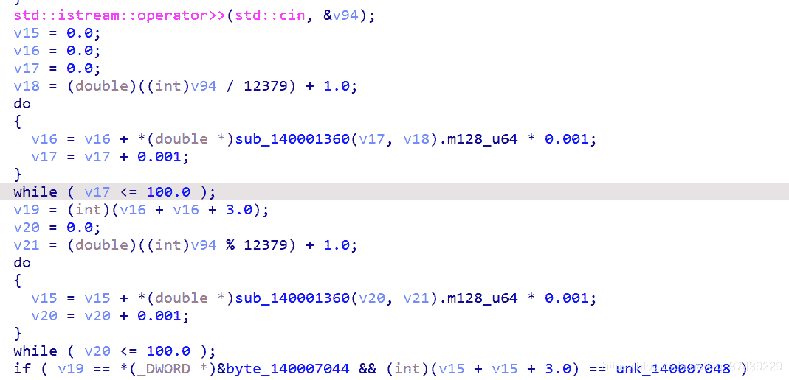

<!--yml
category: 未分类
date: 2022-04-26 14:55:29
-->

# 2021虎符ctf-逆向题解_20000s的博客-CSDN博客

> 来源：[https://blog.csdn.net/qq_37439229/article/details/115424066](https://blog.csdn.net/qq_37439229/article/details/115424066)

## red…

mips架构，nmsl

## GoEncrypt

输入符合正则格式的flag:flag{11111111-1111-1111-1111-111111111111}, 除了”-“的其他hex编码 ，之后分成2组 xtea,脚本

抄百度就行

```
#include<stdio.h>
#include<stdlib.h>
#define uint32_t unsigned int
void encipher(unsigned int num_rounds, uint32_t v[2], uint32_t const key[4]) {
    unsigned int i;
    uint32_t v0 = v[0], v1 = v[1], sum = 0, delta = 0x12345678;
    for (i = 0; i < num_rounds; i++) {
        v0 += (((v1 << 4) ^ (v1 >> 5)) + v1) ^ (sum + key[sum & 3]);
        sum += delta;
        v1 += (((v0 << 4) ^ (v0 >> 5)) + v0) ^ (sum + key[(sum >> 11) & 3]);
    }
    v[0] = v0; v[1] = v1;
}

void decipher(unsigned int num_rounds, uint32_t v[2], uint32_t const key[4]) {
    unsigned int i;
    uint32_t v0 = v[0], v1 = v[1], delta = 0x12345678, sum = delta * num_rounds;
    for (i = 0; i < num_rounds; i++) {
        v1 -= (((v0 << 4) ^ (v0 >> 5)) + v0) ^ (sum + key[(sum >> 11) & 3]);
        sum -= delta;
        v0 -= (((v1 << 4) ^ (v1 >> 5)) + v1) ^ (sum + key[sum & 3]);
    }
    v[0] = v0; v[1] = v1;
}

int main()
{
    uint32_t v[2] = { 0xedf5d910,0x542702cb};
    uint32_t const k[4] = { 0x10203,0x4050607,0x8090a0b,0xc0d0e0f };
    unsigned int r = 32;

    printf("加密前原始数据：0x%x 0x%x\n", v[0], v[1]);
    printf("加密后的数据：0x%x 0x%x\n", v[0], v[1]);
    decipher(r, v, k);
    printf("解密后的数据：0x%x 0x%x\n", v[0], v[1]);
    return 0;
} 
```

## Crackme

输入17个字符分成7和10，又输入一个数要满足



爆破就行

```
//一个除 一个%
#include<math.h>
#include<iostream>
#include<stdio.h>
using namespace std;
double nmsl(double a, double b)
{
	double tmp = pow(a,b-1.0);
	double ret = tmp / exp(a);
	return ret;
}
int main() {
	double v20 = 0.0;
	double v15 = 0.0;
	for (int i = 0; i < 12379; ++i)
	{
		v20 = 0.0;
		v15 = 0.0;
		do {
			v15 = v15 + nmsl(v20, (double)i) * 0.001;
			v20 = v20 + 0.001;
		} while (v20 <= 100.0);
		int total = (int)(v15 + v15 + 3.0);
		if(total == 0x5a2)//total == 0x13b03 
		printf("i == %d ,  x== 0x%x\n",i,total);
	}
}
//99038 
```

前7个和 99038生成的数组xor ,后面10个 rc4,总的来说都是xor ，找到要xor的数就行

```
>> > a = "9903819"
>> > x = [0x8, 0x4d, 0x59, 0x06, 0x73, 0x02, 0x40]
>> > c = ""
>> > for i in range(7) :
	...    c += chr(ord(a[i]) ^ x[i])
	...
	>> > c
	'1ti5K3y'
	>> > s = [0xb2, 0xd6, 0x8e, 0x3f, 0xaa, 0x14, 0x53, 0x54, 0xc6, 0x06]
	>> > key = [0xe0, 0x95, 0xba, 0x60, 0xc9, 0x66, 0x2a, 0x24, 0xb2, 0x36]
	>> > d = ""
	>> > for i in range(10) :
	...   d += chr(s[i] ^ key[i])
	...
	>> > c + d
	'1ti5K3yRC4_crypt0'
	>> > 
```