<!--yml
category: 未分类
date: 2022-04-26 14:20:06
-->

# BUGKU CTF WEB (10-15题)_半夜好饿的博客-CSDN博客_bugkuctfweb题解

> 来源：[https://blog.csdn.net/baidu_35297930/article/details/83381903](https://blog.csdn.net/baidu_35297930/article/details/83381903)

### 11、web5

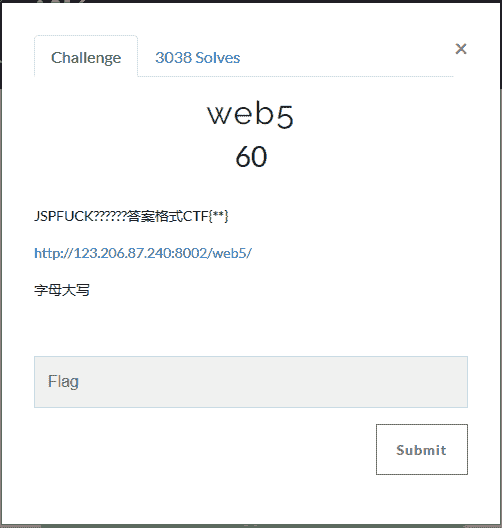
点开网址后：
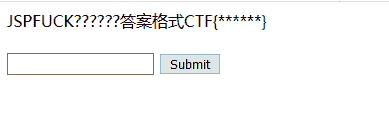
随便输入提交看看：

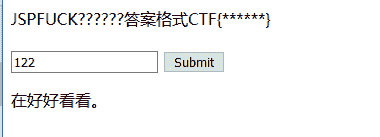
并没有出现什么，F12查看代码，会发现一个奇怪的东西：
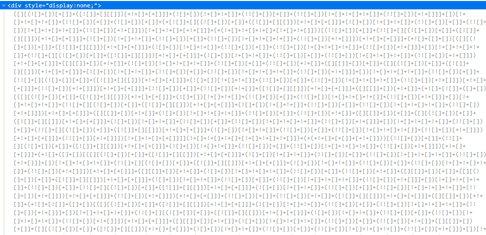

百度以后发现是某种编码，将其丢到控制台出直接解码，得到flag。
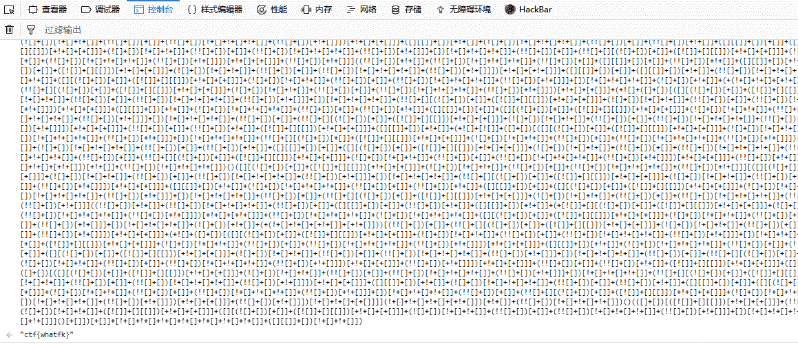

flag：ctf{whatfk}

### 12、头等舱

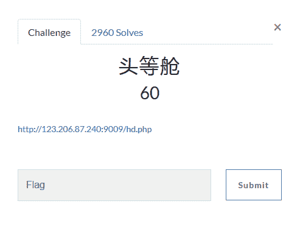

点开网址后：
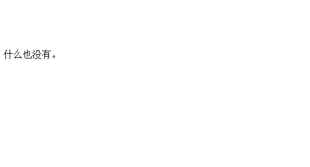

会发现如文字所述，什么也没有，查看代码，emmm，也很干净，什么都莫得orz。
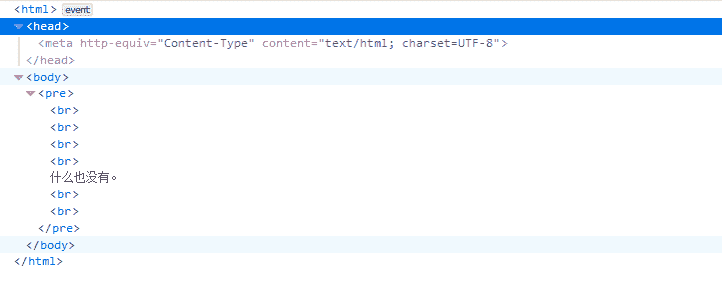

用抓包试试看吧，或许能有什么东西。
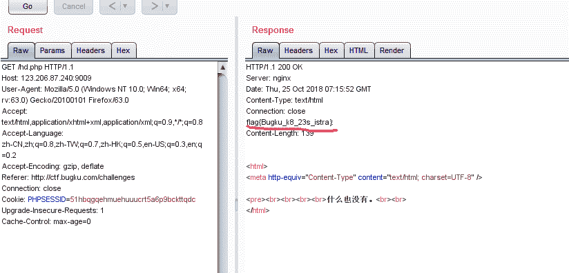

抓包后发现了 flag。查看了其他人的答案，发现，他们的源码中含有一个隐藏的提示，可能是后面给改了？？？源码不给提示了？？
其他人的源码如下：
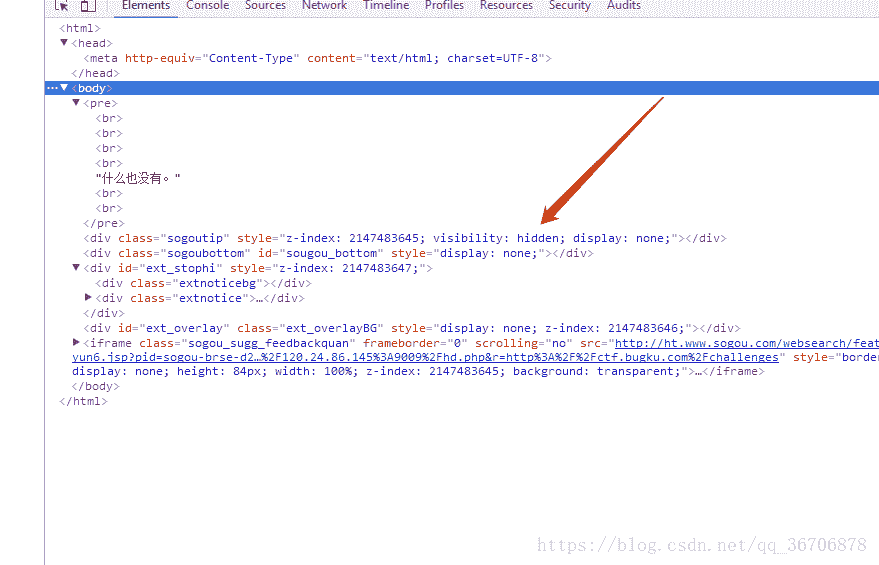

不管怎样flag是拿到了。

flag：flag{Bugku_k8_23s_istra}:

### 13 、网站被黑

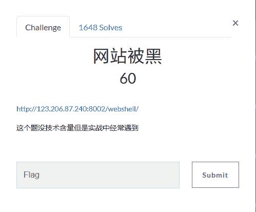

点开网之后：
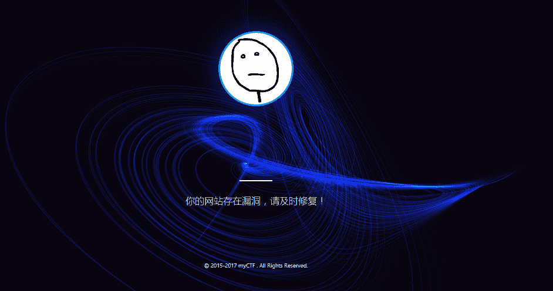

网之后加入index.php，访问成功，说明网站是php的。使用御剑扫描扫描后台得到webshell地址。
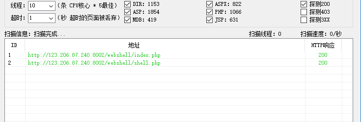

访问，需要密码：
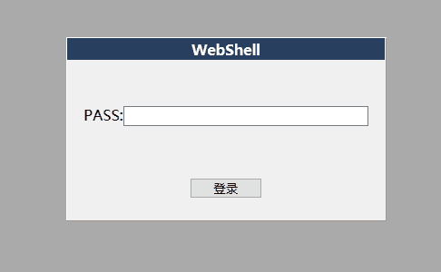

随手试了几个密码，不对，使用bp爆破，使用bp自带的password字典就行。
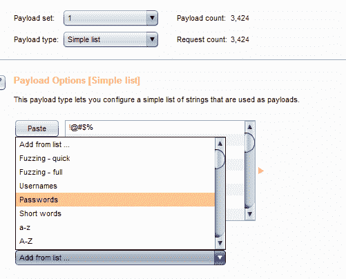

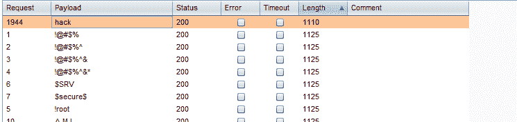

输入后登陆，即可拿到flag。
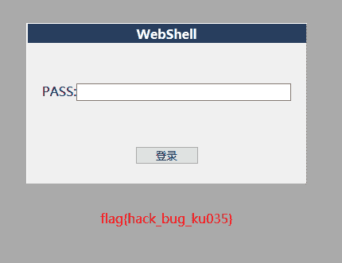

flag:flag{hack_bug_ku035}

### 14、管理员系统

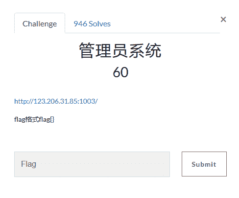

打开网之后：
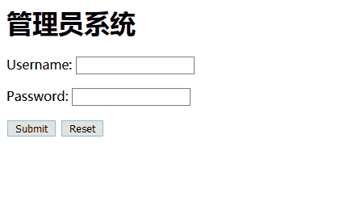

随手输入，密码不正确：
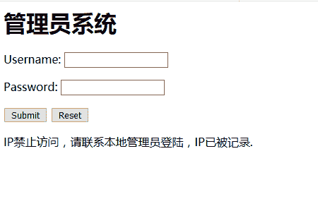
查看源码，发现一个base64编码：
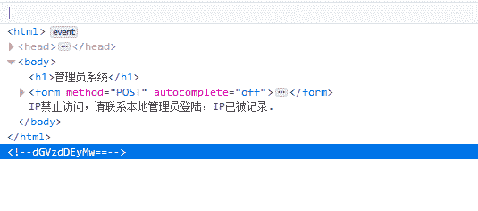
解码后得到：test123，试试将此当密码，admin当用户名，还是失败。

根据提示，联系本地管理员登陆，试试利用XFF伪造成本地ip地址试试看。先利用bp抓包：
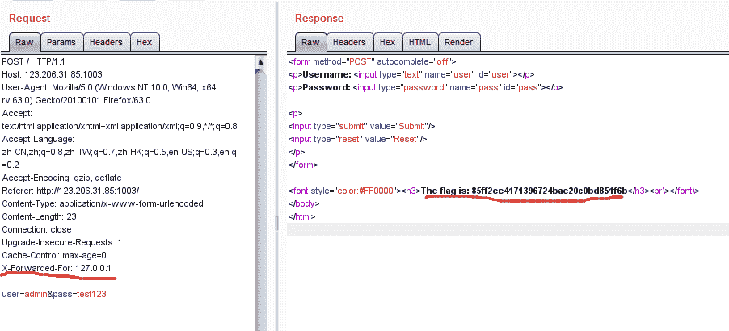

> 相关知识：
> 伪造X-Forwarded-For：
> [https://blog.csdn.net/xiewenbo/article/details/72834964?utm_source=blogxgwz0](https://blog.csdn.net/xiewenbo/article/details/72834964?utm_source=blogxgwz0)

flag：flag{ 85ff2ee4171396724bae20c0bd851f6b}

### 15、web4

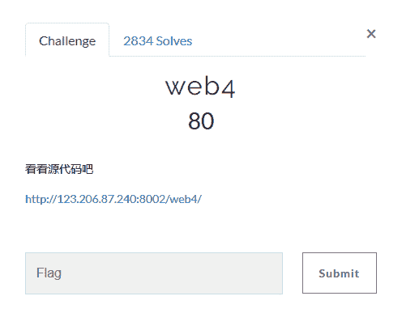
点开网址后：
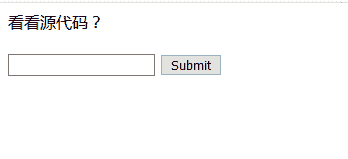

根据提示，查看源码发现一串编码。
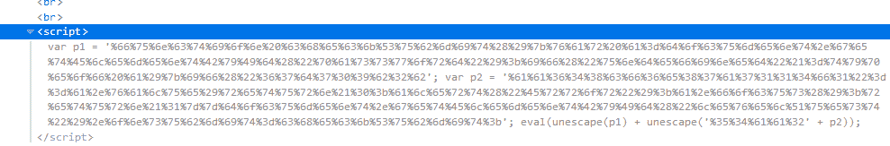

解码后得到：
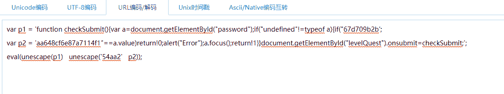

整理后：

```
function checkSubmit(){
   var a=document.getElementById("password");
   if("undefined"!=typeof a)
   {
        if("67d709b2b54aa2aa648cf6e87a7114f1"==a.value)
               return!0;
        alert("Error");
        a.focus();
        return!1
    }
}
document.getElementById("levelQuest").onsubmit=checkSubmit; 
```

整理后，代码意思为：判断变量a的值是否等于67d709b2b54aa2aa648cf6e87a7114f1
直接输入字符串提交就可以得到flag。
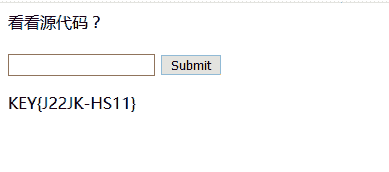

flag：KEY{J22JK-HS11}