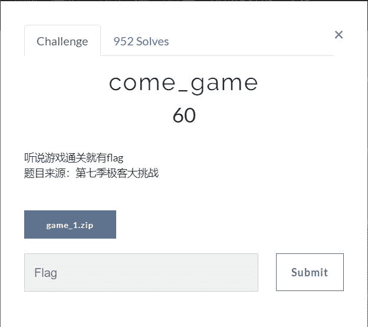

<!--yml
category: 未分类
date: 2022-04-26 14:50:12
-->

# BUGKU做题总结(一)_Qwzf的博客-CSDN博客_bugku解题

> 来源：[https://blog.csdn.net/qq_43625917/article/details/96156562](https://blog.csdn.net/qq_43625917/article/details/96156562)

* * *

## BUGKU做题总结(一)

最近抽出一点时间练了一些BUGKU练习平台的MISC题，又学到了一些知识，感觉很好。现在总结一下当时没有立刻做出的、并有的借鉴大佬的题，加深加深自己的做题印象。

### MISC1(啊哒)

**本题主要是数据隐藏**

先看题目


额，没什么有用信息。那下载题目文件，发现是压缩包。用winrar打开，发现了一张jpg图片。


图片。。。一般遇到图片，先查看属性看是否有隐藏信息。然后用winhex打开，我发现这个地方竟如此可疑。


当然，用记事本打开会更加明显，亲测。。。很明显这是十六进制，十六进制转字符串一波走起。。


提交然而并不对。于是思考尝试后发现ada.jpg用winrar打开


很明显，刚才得到的字符串应该就是这个加密文件的密码了。果然如此，输入密码解压文件得到


### MISC2(宽带信息泄露)

**本题主要是查看路由器备份的配置文件**


看题目提示，emmm。。题目看起来似乎好难。下载题目文件。只有一个conf.bin文件，并且打不开。分析工具用了一波，然而并没有获取到有用信息。。。。于是查百度、查谷歌。。

了解到：**路由器备份的配置文件一般是.bin格式，默认名称通常是conf.bin，通常用“RouterPass”路由器工具打开bin文件。**

于是当然是下载工具了。下载后打开题目文件


然后不断翻找有用信息，发现宽带用户名了。。。


然后按格式提交就行了。。。

### MISC3(come_game)

**本题主要是脑洞和信息发现**



看题目了解到，这道题应该是和游戏有关，并且要通关才有flag。下载题目文件，解压，得到一个.exe可执行文件。运行，发现果然这是个游戏。。。。


在玩之后发现，生成了名字为save1、temp、DeathTime三个文件。分别用notepad++打开后发现，save1有点特殊


想到可能这个2，就是通关关卡数，改为5，打开游戏。果然如此，通关获取到flag了！。。


解题完毕，此题结束。。

### MISC4(linux)

**本题主要是linux系统的常用命令使用**


看到题目，了解到需要linux系统的命令操作。好在我提前已经装过linux虚拟机。那先了解一下[linux常用基础命令](https://www.cnblogs.com/crazylqy/p/5818745.html)

||[Linux基础命令](https://www.cnblogs.com/dunitian/p/4822807.html)吧。

了解完之后，开始继续做题吧！下载题目文件，得到1.tar .gz。打开发现文档flag。所以用`cat`由第一行开始显示档案内容。


这个就应该是所谓的flag了。。。提交，果然是。

### MISC5(做个游戏(08067CTF))

**本题主要是java反编译**


看题目的意思知道，这道题又是一个游戏，并且要求坚持60秒才有flag。然后下载文件，然后打开，发现果然是个游戏。那就开始玩吧。。移动白色方块，避免被撞击，发现可以移动到永远不被撞击的地方哎。然而，等了60秒并没有什么用。。。。


然后，想其他方法了。发现heiheihei.jar用winrar打开，发现了一些图片。


于是我尝试只留第一张，其他全移走。结果发现


显示flag了，然而并没有完全显示完。emmmmm。。。。。既然显示了，那应该在java程序中能找到。百度或谷歌一下，发现有个java反编译工具JD-GUI。下载用下，然而我不知什么原因，并没有下载成功。于是下载了相似工具。用java反编译工具直接打开jar文件，发现并没有有用信息。于是先用winrar打开jar文件，用java反编译工具打开相应组成文件。。。发现flag了。。。


直接提交，发现并不对，发现花括号里的应该Base64加密了。解密后提交，成功了。


### MISC6(想蹭网先解开密码)

**本题主要是了解wifi认证WPA的四次握手包，并根据已给信息生成密码字典破解密码。**

**了解**：wifi握手包,即采用WPA加密方式的无线AP与无线客户端进行连接前的认证信息包


这道题我参考了大佬的博客做的。了解到通过握手包(此题是wifi.cap)便可以对密码进行暴力猜解。题目已经给了前七位。那由此生成一个密码词典吧！于是找了个脚本:

生成字典文件

```
f=open('pass.txt','w')

for i in range(0,10000):
    psd='1391040'+str(i).zfill(4)
    f.write(psd+'\n') 
```

然后用到软件 EWSA导入字典文件，进行暴力猜解，就行了。


emmmm。。。星号是什么鬼。。。不知到怎么才能显示。换另一种方式解题吧。。。。不想叙述了，有个大佬总结的比较详细，可以[参考](https://www.cnblogs.com/leixiao-/p/9825066.html)一下。。
还有个[linux系统的解题方式](https://www.cnblogs.com/Gzu_zb/p/10349362.html)吧。

总结结束，参考一些知识和大佬的博客，又收获了好多。。
继续努力。。。小白进阶ing