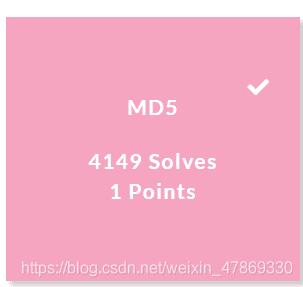

<!--yml
category: 未分类
date: 2022-04-26 14:42:05
-->

# BUUCTF-Crypto-MD5题解_ASSOINT的博客-CSDN博客

> 来源：[https://blog.csdn.net/weixin_47869330/article/details/110938998](https://blog.csdn.net/weixin_47869330/article/details/110938998)

## 由题目可知，此题目为MD5解密

## MD5：

MD5信息摘要算法（英语：MD5 Message-Digest Algorithm），一种被广泛使用的密码散列函数，可以产生出一个128位（16字节）的散列值（hash value），用于确保信息传输完整一致。MD5由美国密码学家罗纳德·李维斯特（Ronald Linn Rivest）设计，于1992年公开，用以取代MD4算法。这套算法的程序在 RFC 1321 标准中被加以规范。1996年后该算法被证实存在弱点，可以被加以破解，对于需要高度安全性的数据，专家一般建议改用其他算法，如SHA-2。2004年，证实MD5算法无法防止碰撞（collision），因此不适用于安全性认证，如SSL公开密钥认证或是数字签名等用途。
来源于：百度百科

### 特征：

**md5加密后是16位或者32位的字符，由字母和数字组成，字母大小写统一；
理论上无法解密，除非暴力破解**

## 解题：

**得到题目之后，打开网址 https://www.cmd5.com/
在线解密**

得到flag{admin1}

ps:什么pe玩意儿 爷换了好几个网址了都 还下了好几个软件都解码失败 气死