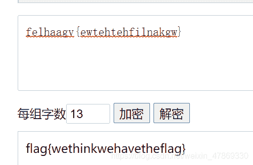

<!--yml
category: 未分类
date: 2022-04-26 14:43:14
-->

# BUUCTF-Crypto-rabbit+篱笆墙上的影子（栅栏密码）+RSA题解_ASSOINT的博客-CSDN博客

> 来源：[https://blog.csdn.net/weixin_47869330/article/details/110981758](https://blog.csdn.net/weixin_47869330/article/details/110981758)

## rabbit：

> 逛了一圈没看到有啥特征可以看出这是rabbit加密的，那就莫得办法了，可能以后题目提示也在题目名称里吧

1.  题目：`U2FsdGVkX1/+ydnDPowGbjjJXhZxm2MP2AgI`
2.  在线解密：

```
 https://www.sojson.com/encrypt_rabbit.html 
```

3.  flag：`flag{Cute_Rabbit}`

## 篱笆墙上的影子（栅栏密码）：

### 解题：

题目：`felhaagv{ewtehtehfilnakgw}`
分析：
篱笆墙想来想去也只有栅栏密码与这个挂钩了
又看到花括号前面有flag 上下两行
方法一：
fine开始动笔：
flag{wethinkw
ehavetheflag}
解出来是这样
得到flag：`flag{wethinkwehavetheflag}`
方法二：
在线解密：

> https://www.qqxiuzi.cn/bianma/zhalanmima.php

**注意：每组字数是总长度的一半，如果确定是两组的话**
**如果是栅栏组数的话就是两组**

### RSA

题目：
在一次RSA密钥对生成中，假设p=473398607161，q=4511491，e=17
求解出d作为flga提交
解题：工具

注意：11是17的十六进制
解出来包上flag{}
flag：

```
flag{125631357777427553} 
```

好耶！