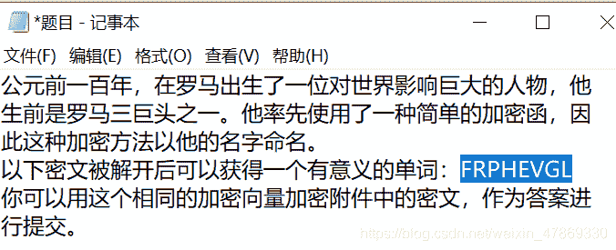
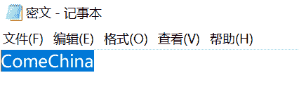
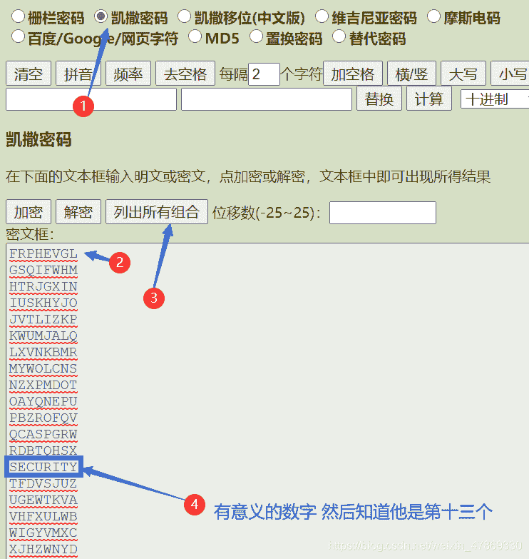
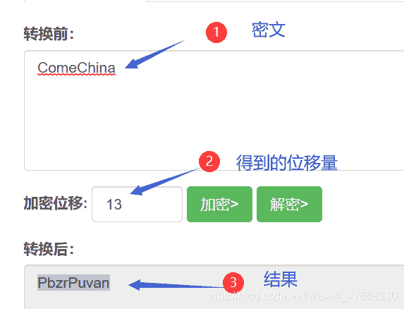

<!--yml
category: 未分类
date: 2022-04-26 14:42:28
-->

# BUUCTF-Crypto-大帝的密码武器题解（凯撒密码）_ASSOINT的博客-CSDN博客

> 来源：[https://blog.csdn.net/weixin_47869330/article/details/111239297](https://blog.csdn.net/weixin_47869330/article/details/111239297)

## 凯撒密码

简而言之就是移位密码
用爆破比较简单一点 老菜鸡了

## 解题：

1.  下载文件，文件名叫zip
2.  ok 修改文件后缀变成zip文件，打开得到题目+密文



（至于本菜鸡还试过用记事本打开一堆乱码对着乱码到处搜就按下不表了）

3.  知道是凯撒密码，打开[密码机器](http://www.ctftools.com/down/down/passwd/)爆破：
    
4.  [凯撒密码在线计算](http://www.metools.info/code/c70.html)
    

```
flag：flag{PbzrPuvan} 
```

### 小结

根据题目名称得到提示，要注意

好耶！