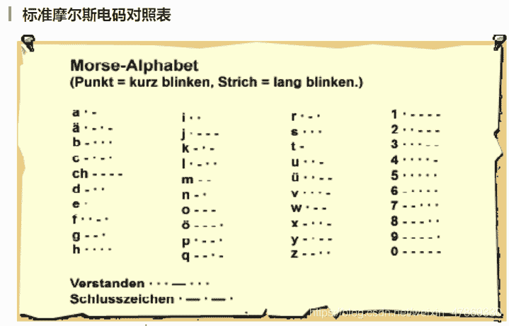
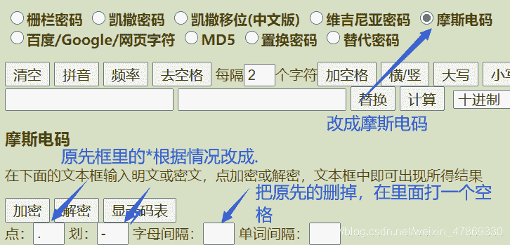
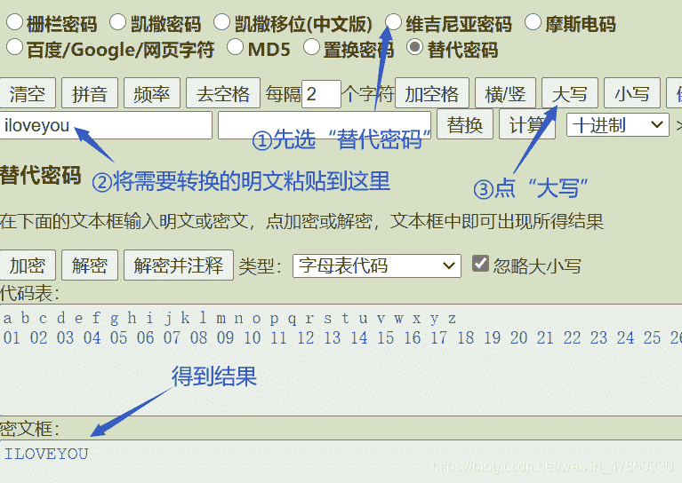

<!--yml
category: 未分类
date: 2022-04-26 14:41:37
-->

# BUUCTF-Crypto-摩丝题解_ASSOINT的博客-CSDN博客_buuctf 摩丝

> 来源：[https://blog.csdn.net/weixin_47869330/article/details/110940639](https://blog.csdn.net/weixin_47869330/article/details/110940639)

## 摩丝密码

> 摩尔斯电码也被称作摩斯密码，是一种时通时断的信号代码，通过不同的排列顺序来表达不同的英文字母、数字和标点符号。
> 它的代码包括五种：短促的点信号“・”，读“滴”（Di）保持一定时间的长信号“—”，读“嗒”（Da）表示点和划之间的停顿、每个词之间中等的停顿，以及句子之间长的停顿。


此外摩斯密码还有变种，比如给你一段音频让你解密这种。

## 解题：

1.  看到题目名称，心里有就有点数了，铁定是考摩斯密码；
2.  在线解密（密码机器）：

```
http://www.ctftools.com/down/down/passwd/ 
```



4.  得到解密结果：iloveyou
5.  提交包上flag{}，发现不对，为什么呢？

```
**摩斯电码只有大写，将它改成大写就行啦** 
```

6.  最终flag：`flag{ILOVEYOU}`

## 小结：

1.  记得解密出来的摩斯电码要改成大写；
2.  转大写的方法：
    

好耶！