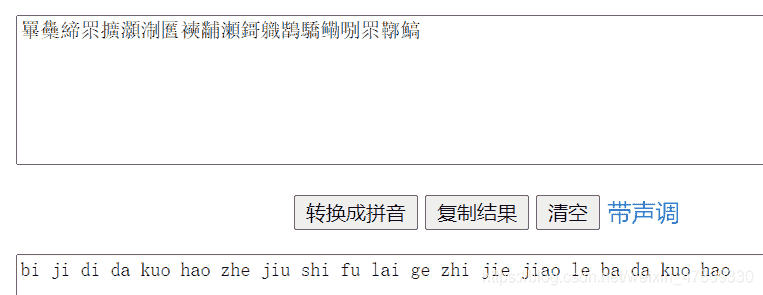
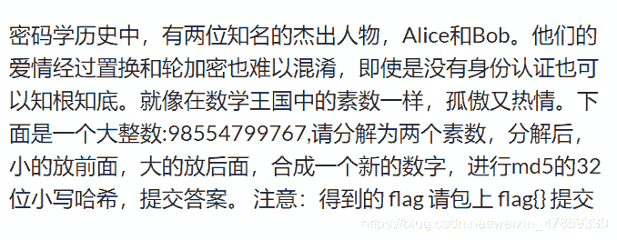
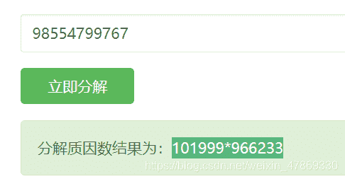

<!--yml
category: 未分类
date: 2022-04-26 14:41:19
-->

# BUUCTF-Crypto-老文盲了+Alice与Bob题解_ASSOINT的博客-CSDN博客

> 来源：[https://blog.csdn.net/weixin_47869330/article/details/111052986](https://blog.csdn.net/weixin_47869330/article/details/111052986)

## 题目：

### 老文盲了

```
罼雧締眔擴灝淛匶襫黼瀬鎶軄鶛驕鳓哵眔鞹鰝 
```

### 解题：

> 想了一下文字加密的，只记得**与佛论禅**，**藏头诗**，看**文字字形里有没有某个特殊字** （如每个字里有‘口’）的算一组

想不出什么名堂，搜搜每个字念什么，[在线文字转拼音](https://www.aies.cn/pinyin.htm)
BJD{这就是flag直接交了吧}
OK fine
flag：`flag{淛匶襫黼瀬鎶軄鶛驕鳓哵}`

## Alice与Bob：

#### 题目：



#### 解题：

1.  根据题目：[在线分解质因数](http://www.jsons.cn/quality/)：
    
2.  新的数为：`101999966233`
3.  再进行[32位md5加密](https://www.qqxiuzi.cn/bianma/md5.htm)：
    
4.  结果即为flag：`flag{d450209323a847c8d01c6be47c81811a}`

## 小结：

1.  文字类加密：**与佛论禅、藏头诗、特殊字形、拼音解密**
2.  按图索骥的照做挺容易的，利用好在线工具；