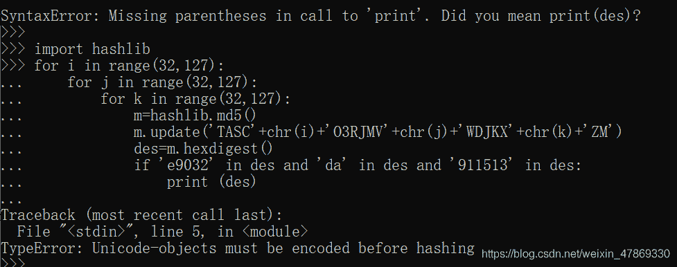
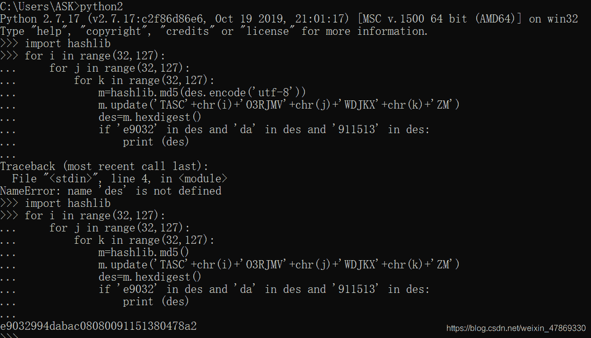

<!--yml
category: 未分类
date: 2022-04-26 14:43:06
-->

# BUUCTF-Crypto-（无语的）丢失的MD5题解_ASSOINT的博客-CSDN博客_输入让你无语的md5

> 来源：[https://blog.csdn.net/weixin_47869330/article/details/111052193](https://blog.csdn.net/weixin_47869330/article/details/111052193)

## MD5特征：

一般为16或32位（字母+数字）

## 解题:

woc这题真的大无语事件了草了
不知道正规解法是怎么样，反正我是这么做的：（**写着写着爷又会了，正确代码在最后**）

1.  zip文件先解压
2.  用Python2打开看一下，有串可疑密文闪了一下
3.  （敲黑板）倔强的想要用 Ctrl C+Ctrl V行不通之后，还是选择了手机录制
4.  密文：`e9032994dabac08080091151380478a2`
5.  （从这开始走弯路）看不出什么名堂来，拿去md5在线解密
6.  解密不出来，灵光一闪用记事本打开 看看：

```
import hashlib   
for i in range(32,127):
    for j in range(32,127):
        for k in range(32,127):
            m=hashlib.md5()
            m.update('TASC'+chr(i)+'O3RJMV'+chr(j)+'WDJKX'+chr(k)+'ZM')
            des=m.hexdigest()
            if 'e9032' in des and 'da' in des and '911513' in des:
                print des 
```

7.  根据题目意思，觉得它缺少了一些代码，到网上搜MD5的题目，试了n次想要补全：（**下面这个是错误的哦，最后的才是正确的**）
    首先根据网上的题目，知道printf des 少了个括号，应为 `print (des)`
    到Python环境里运行，出现了报错,百度得知需要（等等，写题解的时候此处有**插曲**在文末，okay继续）
    
    在这里补全des的括号
    百度报错的原因，然后就在这里迷了路

> 报错是因为是在进行md5哈希运算前，需要对数据进行编码

别的博主改错的格式都是：`xx.encode.('utf_8')`

```
 import hashlib   
for i in range(32,127):
    for j in range(32,127):
        for k in range(32,127):
            m=hashlib.md5()
            m.update(des.encode.('utf_8')'TASC'+chr(i)+'O3RJMV'+chr(j)+'WDJKX'+chr(k)+'ZM')
            des=m.hexdigest()
            if 'e9032' in des and 'da' in des and '911513' in des:
                print (des) 
```

8.  试了好久，发现能力不够，于是凭借以前的经验拿前面那段一闪而过的密文出来试试看
    **艹correct**

爷都看傻了都
最终flag：`flag{e9032994dabac08080091151380478a2}`

## 憨批总结：

1.  以后看到这种类似的题目，先把跳出来的可疑密文拿去试一下（以后的题目应该没这么…这个应该用不到了）；
2.  要是没用记事本打开，做的速度还会更快一点，以后还是**先运行，运行看不出名堂来再用记事本打开**看看；
3.  能力不够，还是没能理解题目意思

补个插曲：

> **等等 卧槽 我是写完题目，再过来写题解的，用的是不那么正规的解法，当我想再用补全代码的情况来做一次的时候，复盘自己的算法，发现 这个我也做出来了？？？！**



> 本来我还是傻得，边迷茫边写题解，然后才反应过来：
> **我有两个Python环境，Python2和Python3**，打开文件的时候Python3没什么变化，Python2打开的时候才有那串一闪而过的密文
> 我*做题*的时候环境运行的是Python3，所以**会给我报错**，直到正确代码出现，才会有flag，但是我*复盘*这里的时候用的是Python2，所以我就算代码是错的也能运行，后面的题解我会**改用Python3环境**

**最后补个正确代码：**

```
import hashlib
for i in range(32,127):
    for j in range(32,127):
        for k in range(32,127):
            m=hashlib.md5()
            m.update('TASC'.encode('utf-8')+chr(i).encode('utf-8')+'O3RJMV'.encode('utf-8')+chr(j).encode('utf-8')+'WDJKX'.encode('utf-8')+chr(k).encode('utf-8')+'ZM'.encode('utf-8'))
            des=m.hexdigest()
            if 'e9032' in des and 'da' in des and '911513' in des:
                print (des) 
```

好耶！