<!--yml
category: 未分类
date: 2022-04-26 14:51:05
-->

# BUUCTF-MISC刷题记录-1_L.o.W的博客-CSDN博客

> 来源：[https://blog.csdn.net/weixin_44145820/article/details/104701824](https://blog.csdn.net/weixin_44145820/article/details/104701824)

## 二维码

用winhex打开图片，在末尾发现如下，怀疑图片中包含压缩包
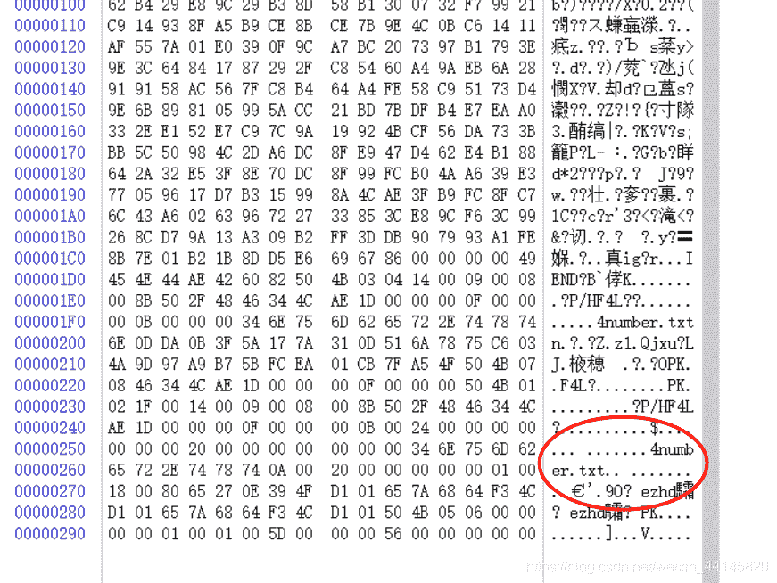
在Linux下用binwalk查看，并用foremost导出至output文件夹
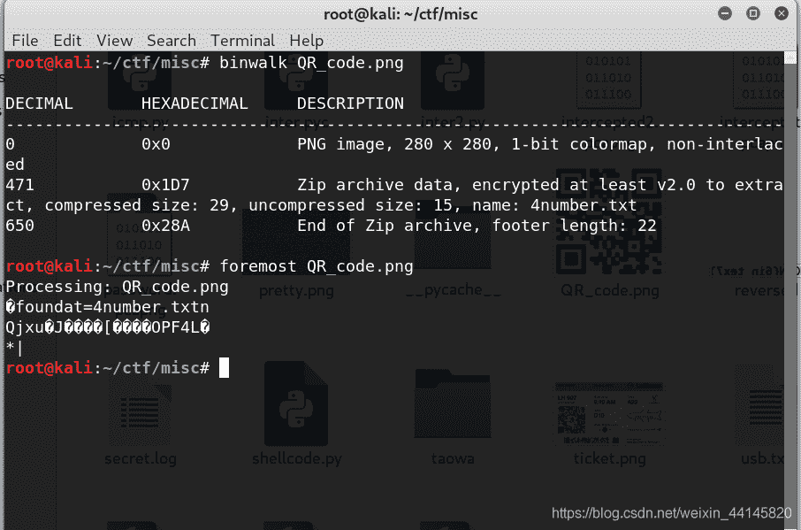
根据提示，密码为4位数字，直接爆破即可
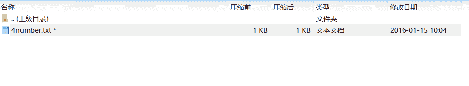
得到密码 7639
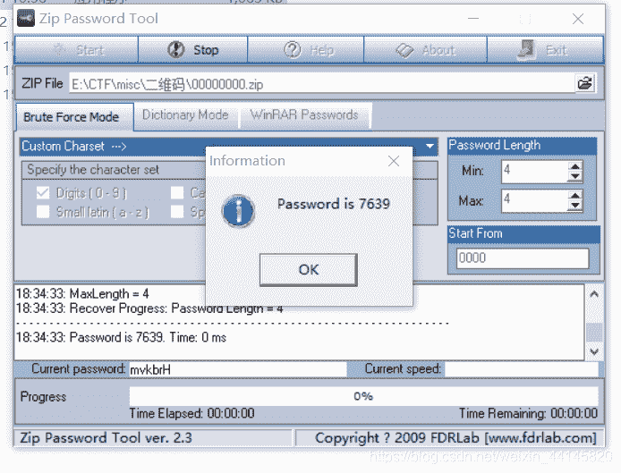
解压压缩包即可获得flag

## N种方法解决

根据题目提示是base64编码的PNG
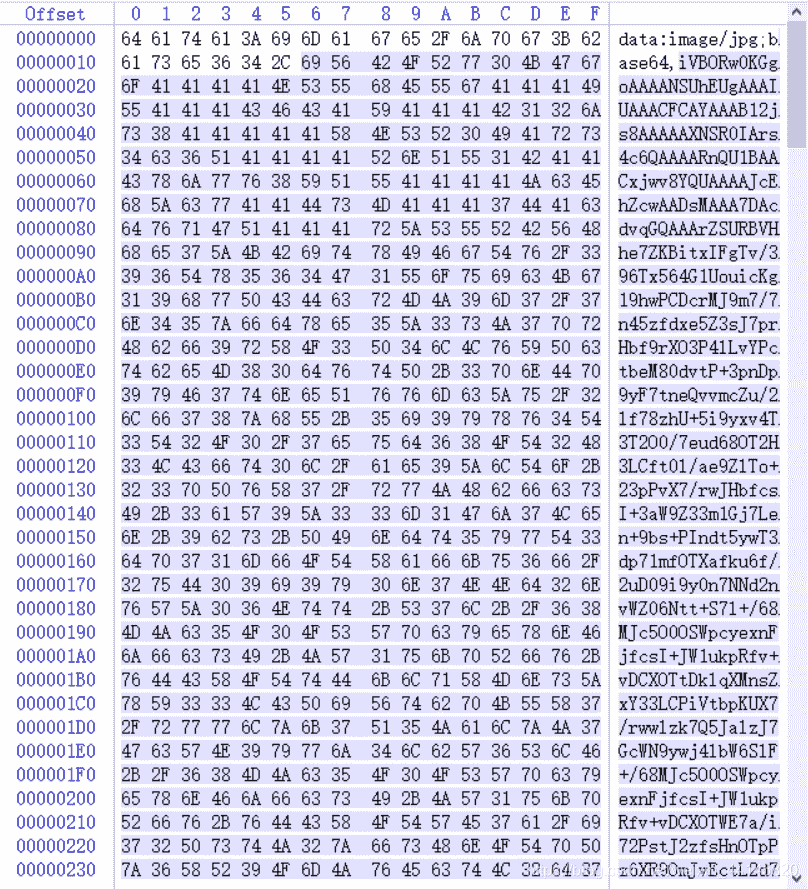
使用下面的脚本解码

```
import base64

f = open("a.txt", 'r')
s = f.read()
f.close()
content = base64.b64decode(s)
f = open("a.png", "wb")
f.write(content)
f.close() 
```

获得一个二维码，在线扫码:[https://online-barcode-reader.inliteresearch.com/](https://online-barcode-reader.inliteresearch.com/)
即可得到flag


## 大白

根据题目提示怀疑题目大小被修改，放入Linux查看，无法打开，证明的确被修改
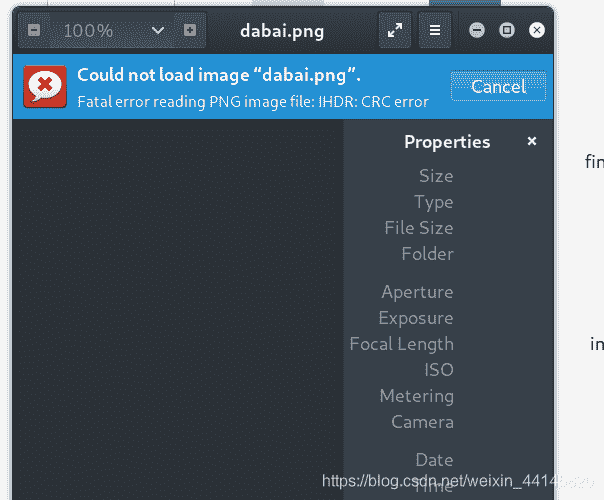
这里用了一下大佬的脚本：

```
import os
import binascii
import struct

misc = open("dabai.png","rb").read()

for i in range(1024):
    data = misc[12:20] +struct.pack('>i',i)+ misc[24:29]
    crc32 = binascii.crc32(data) & 0xffffffff
    if crc32 == 0x6d7c7135:
        print i 
```

得到高度为479（0x1DF），使用winhex修改高度，得到flag
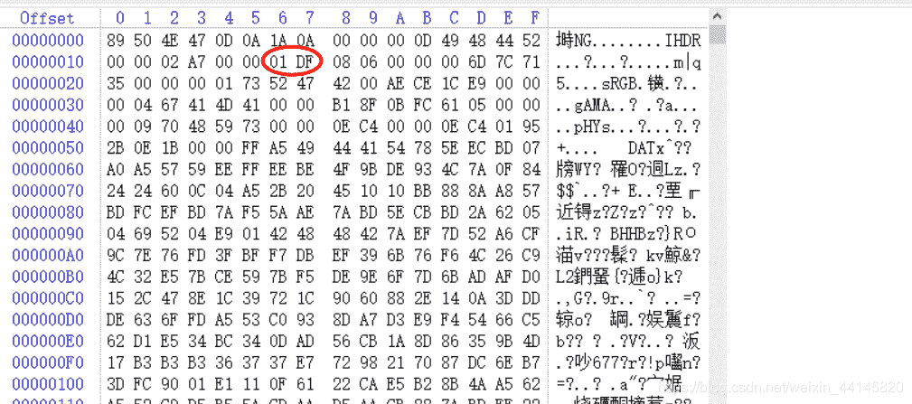


## 基础破解

题目提示密码为4位数字，直接爆破
得到密码 2563
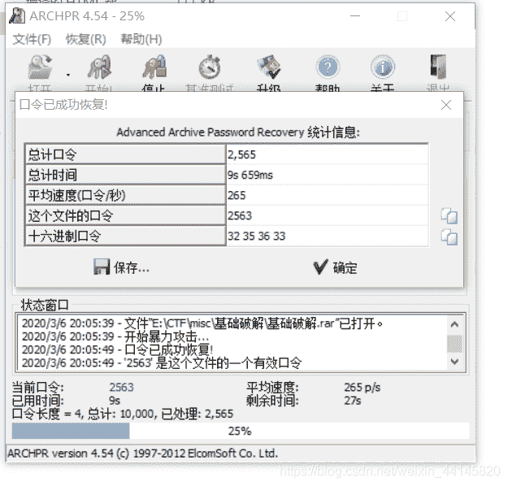
解压之后，得到：ZmxhZ3s3MDM1NDMwMGE1MTAwYmE3ODA2ODgwNTY2MWI5M2E1Y30=
使用base64解密得到flag

## 你竟然赶我走

使用winhex打开，拉到最后就是flag
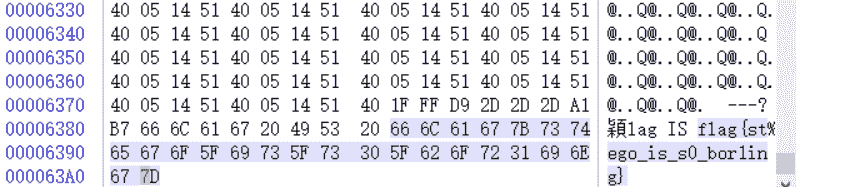

## LSB

使用stegsolve的data extract，发现是一张图片，保存二进制数据
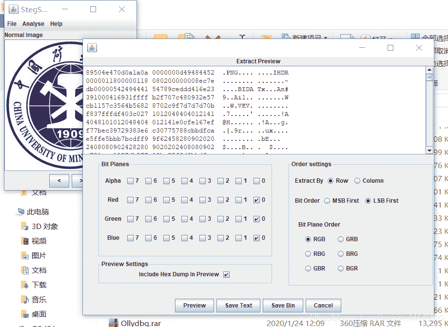
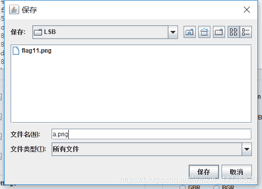
得到一个二维码，在线解码：[https://online-barcode-reader.inliteresearch.com/](https://online-barcode-reader.inliteresearch.com/)
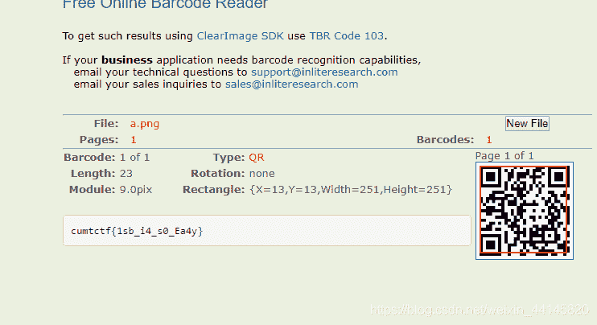

## 乌镇峰会种图

用winhex打开，拉到最下面就是flag
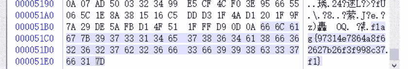

## rar

和前面一样暴力破解，密码是四位数字

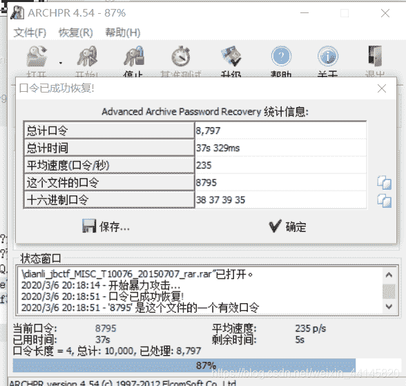

## ningen

根据提示，查看图片中隐藏文件
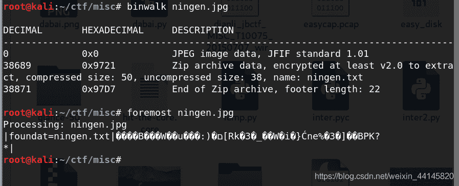
暴力破解密码
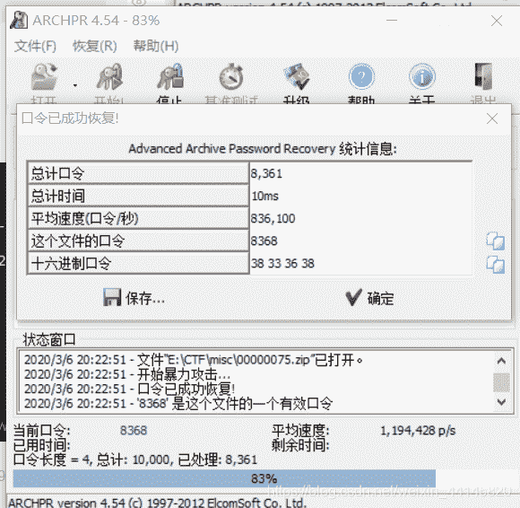

## qr

得到一个二维码，在线解码：[https://online-barcode-reader.inliteresearch.com/](https://online-barcode-reader.inliteresearch.com/)
得到flag
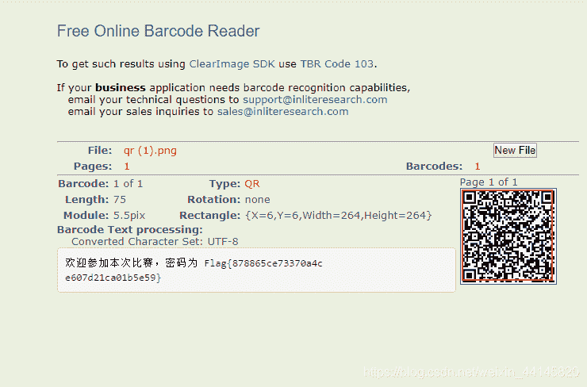

## 文件中的秘密

winhex打开发现flag
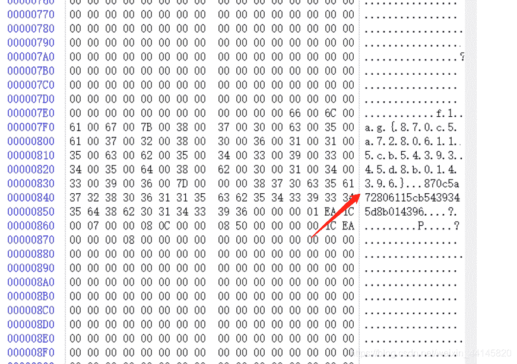

* * *

最后给大家分享一下本人整理的MISC各种编码以及密码学的在线工具网站：
[CTF Crypto/MISC 在线工具网站](https://blog.csdn.net/weixin_44145820/article/details/104635169)