<!--yml
category: 未分类
date: 2022-04-26 14:47:47
-->

# BUUCTF Misc解题_GuJingnan~的博客-CSDN博客

> 来源：[https://blog.csdn.net/weixin_54438700/article/details/122174422](https://blog.csdn.net/weixin_54438700/article/details/122174422)

## ******金三胖******

拿到题目，看到是一个动图，其中有红色的帧闪来闪去，可能是flag，用过使用Stegsolve工具中的帧浏览器，得到flag{he11ohongke}。

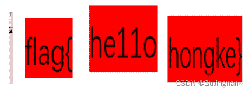

## ******二维码1******

在010中可以看到有一个PK开头的，猜测有一个压缩包，使用kali中自带的工具binwalk（用于搜索二进制图像的嵌入文件和可执行代码的工具）确定存在一个压缩包。把后缀改成zip进行解压，通过工具爆破获得密码（7639），得到flag.

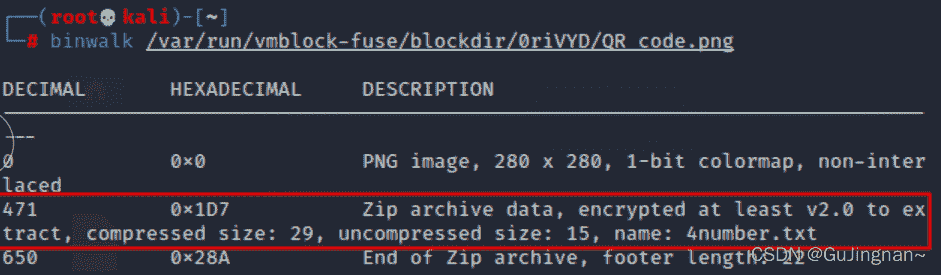

 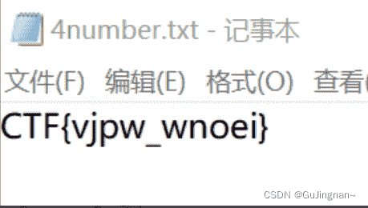

## ******你竟然赶我走******

下载压缩包后解压发现是一张图片，丢到010在最后看到flag{stego_is_s0_bor1ing}

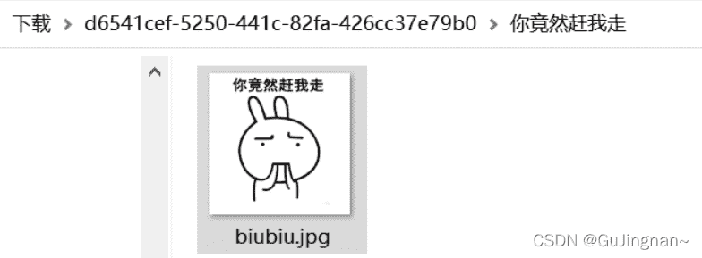

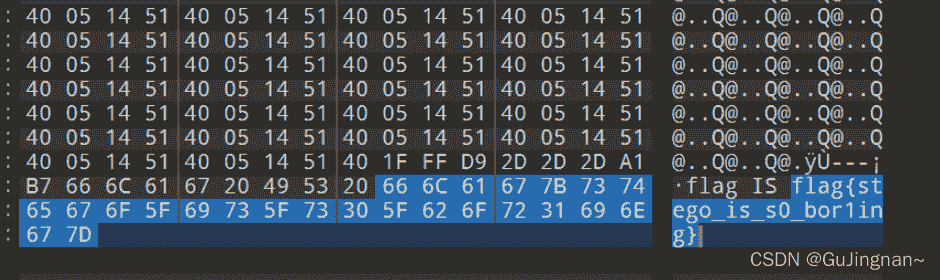

## ******N种解决办法******

压缩包打开是一个key.exe，丢到010 ==> 可以看到是一个base64（base64可以表示图片），拿去解密，

 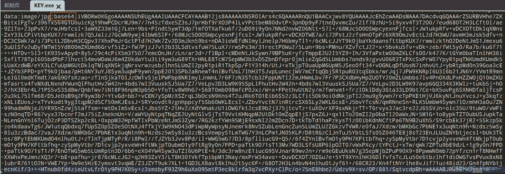

通过在线解密方式，可以得到一张二维码图片。

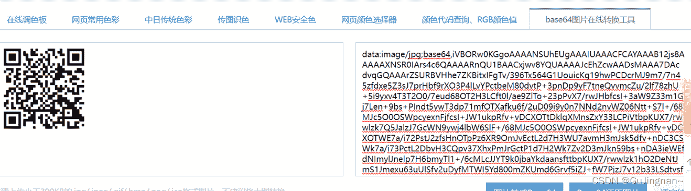

使用在线扫描工具扫一扫，可以得到KEY{dca57f966e4e4e31fd5b15417da63269}，完成。 

## ******大白******

打开后是一张大白的图片，根据题目提示，可以得到如片太小，推测图片是可以更改的，丢到010中，结合大白图片的样子，猜测要改宽度，得到flag。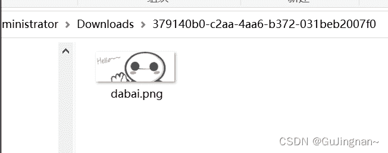

 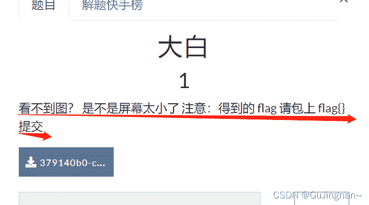

 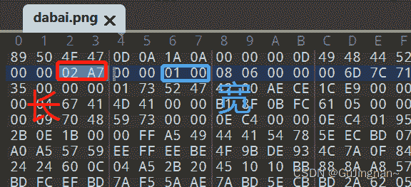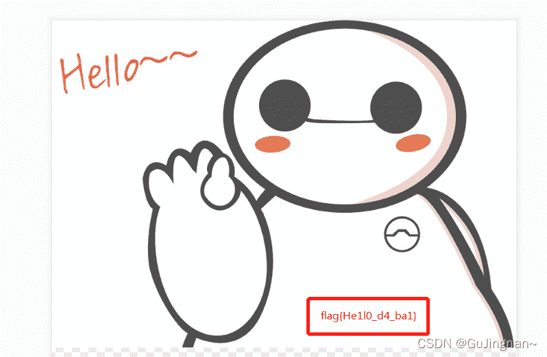

## ******基础破解1******

根据提示可知，压缩包是一个四位数字的密码，通过爆破得到口令2563，解压后得到加密的flag，进行bas64解密flag{70354300a5100ba78068805661b93a5c}。

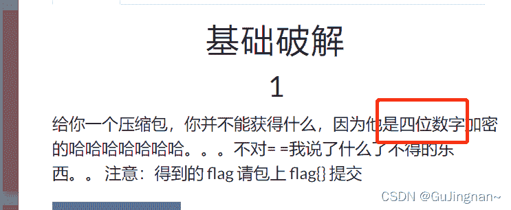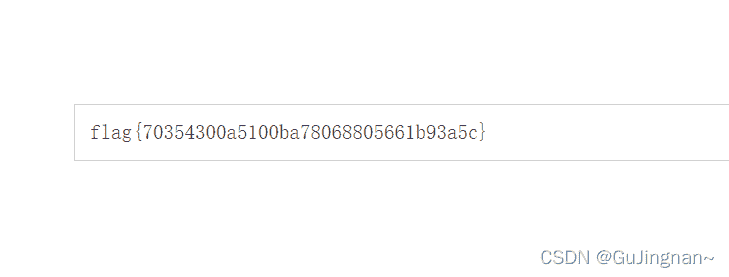

## ******乌镇峰会种图********1******

把图片丢到010，在最后看到flag{97314e7864a8f62627b26f3f998c37f1}。

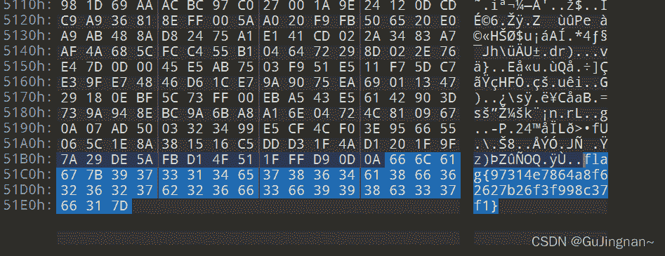

## ******文件中的秘密********-1******

一张海贼王的图片丢到010中可以看到flag。

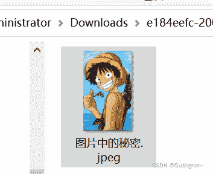

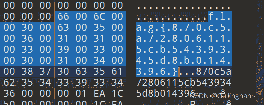

## ******LSB-1******

考虑是图片隐写，当red，green，blue为0时候，可以看到图片上方有些不同。保存得到一张二维码。扫描二维码得到flag{1sb_i4_s0_Ea4y}。

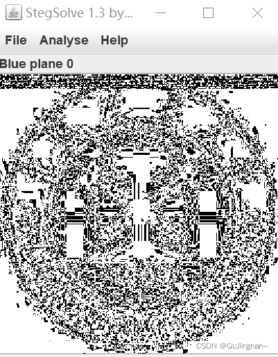

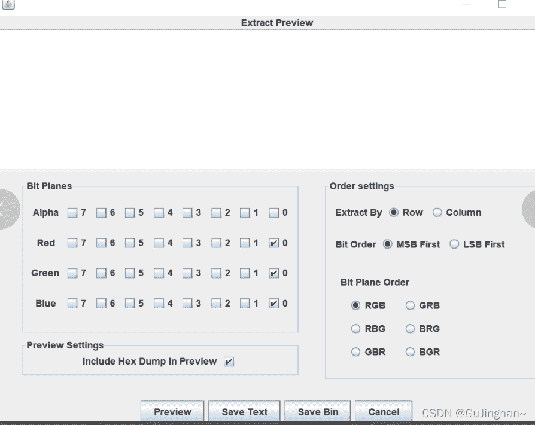

 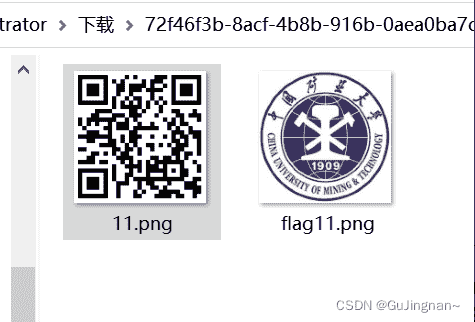

## ******Wireshark******

根据题目可以知道密码即是flag，从包中可以看到明文密码。

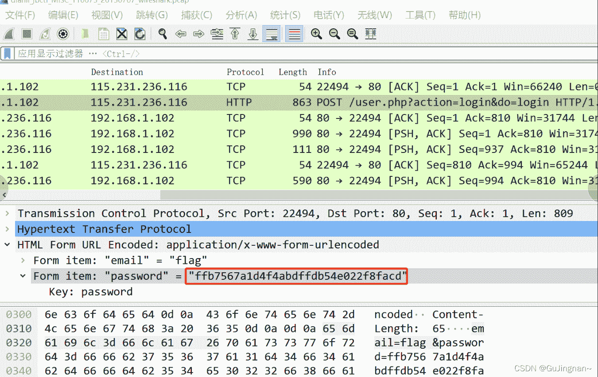

## ******RAR-1******

根据题目提示四位数字密码，通过爆破得到密码8795，解压后得到flag{1773c5da790bd3caff38e3decd180eb7}

 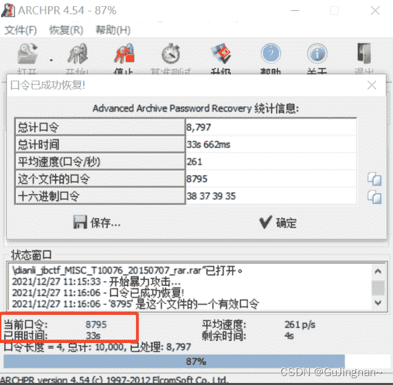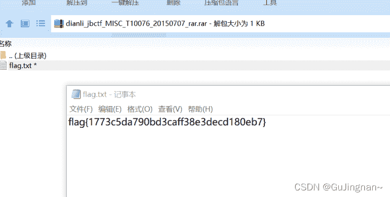

##  ******ZIP伪加密-1******

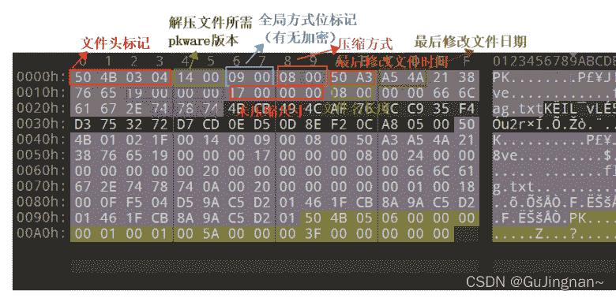

题目中把09改成00，保存再解压可以得到flag{Adm1N-B2G-kU-SZIP}。

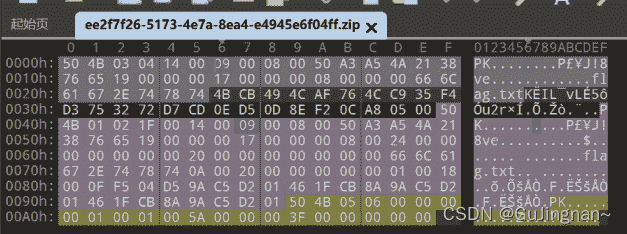

##  Qr-1

直接扫描二维码得到flag。

## ******被嗅探的流量******

使用wireshark打开题目中的包，筛选过滤包http.request.mothod==POST

拉到最后可以看到flag。

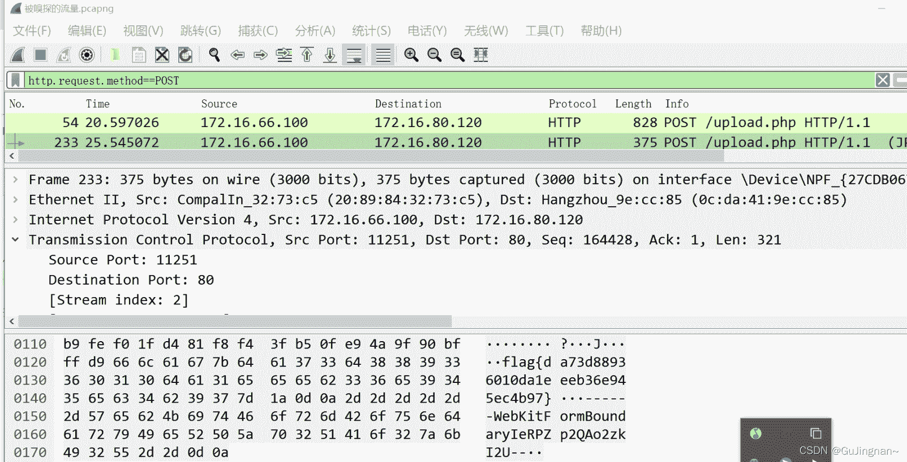

## ******镜子中的世界-1******

把图片丢进StegSolve中，找到key。

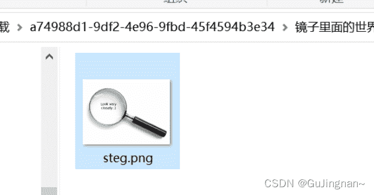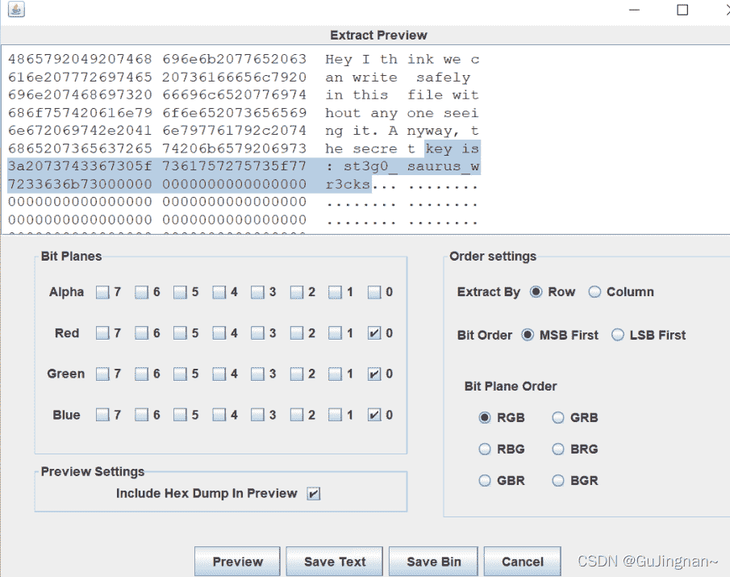

## ******Ningen******

使用binwalk分析包，可以看到有个zip，提取出来的压缩包进行口令爆破获得解压密码。解压后得到txt文档获得flag{b025fc9ca797a67d2103bfbc407a6d5f}。

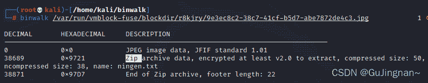

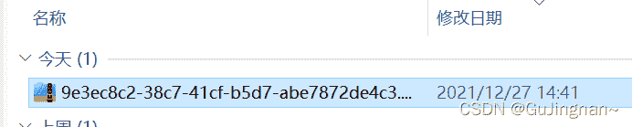