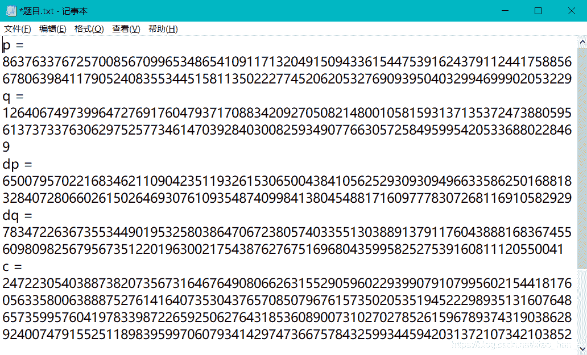
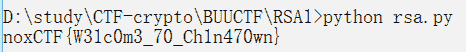
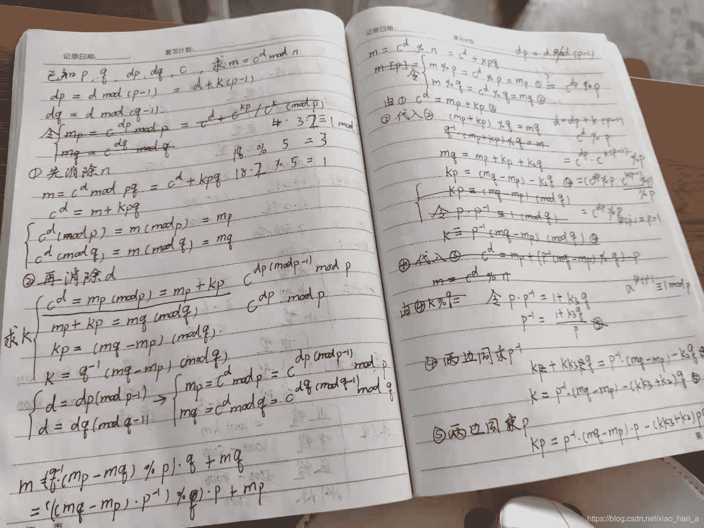

<!--yml
category: 未分类
date: 2022-04-26 14:46:21
-->

# BUUCTF RSA1 解题代码以及详细公式推导_拔草能手晓寒的博客-CSDN博客

> 来源：[https://blog.csdn.net/xiao_han_a/article/details/118516038](https://blog.csdn.net/xiao_han_a/article/details/118516038)

### 题目

首先查看题目，已知p, q, dp, dq和密文c，求解明文



### 解题代码

先把代码附上

```
import gmpy2

p =8637633767257008567099653486541091171320491509433615447539162437911244175885667806398411790524083553445158113502227745206205327690939504032994699902053229 
q = 12640674973996472769176047937170883420927050821480010581593137135372473880595613737337630629752577346147039284030082593490776630572584959954205336880228469 
dq = 783472263673553449019532580386470672380574033551303889137911760438881683674556098098256795673512201963002175438762767516968043599582527539160811120550041
dp = 6500795702216834621109042351193261530650043841056252930930949663358625016881832840728066026150264693076109354874099841380454881716097778307268116910582929
c = 24722305403887382073567316467649080662631552905960229399079107995602154418176056335800638887527614164073530437657085079676157350205351945222989351316076486573599576041978339872265925062764318536089007310270278526159678937431903862892400747915525118983959970607934142974736675784325993445942031372107342103852
n = p * q

I = gmpy2.invert(p, q)                      #I为p(mod q)的逆元，即p*I = 1(mod q)
mp = gmpy2.powmod(c, dp, p)                 #计算mp = c^dp % p
mq = gmpy2.powmod(c, dq, q)                 #计算mq = c^dq % q        

m = (mp + (I * (mq - mp)) * p) % n          #明文求解公式
m = hex(m)[2:]                              #转十六进制数据

flag = ''
for i in range(len(m)//2):
    flag += chr(int(m[i*2:(i+1)*2], 16))

print(flag)
```

运行结果如下：



当然，最后flag要换成BUUCTF要求的格式：

flag{W31c0m3_70_Ch1n470wn}

### 公式推导

不同于常规的RSA加解密，本题出现了dp和dq，其中

dp = d % (p-1)        ①

dq = d % (q-1)        

然后，我们从一般的解密公式入手

m = c^d % n

    = c^d + kpq

两边同时对p取模，得到

m % p = c^d % p

令 mp = c^d % p        ②

    mq =  c^d % q        ③

由①得 d = dp + k*(p-1)        ④

把④代入②，得到

mp = (c^dp * c^(k*(p-1))) % p

由欧拉定理，c^(p-1) % p = 1

所以， mp = c^dp % p

同理， mq = c^dq % q

由②得 c^d = mp + k1*p        ⑤

把⑤代入③，得到

mq = (mp + k1*p) % q

mq = mp + k1*p + k2*q

k1*p = (mq-mp) - k2*q        ⑥

设i为p(mod q)的逆元，即p*i = 1 +k3*q

i = (1+k3*q)/p

⑥两边同时乘上i，得到

k1 + k1*k3*q = i * (mq-mp) - k2*q

k1 = i * (mq-mp) - (k1*k3 + k2)*q

两边再同时乘上p，得到

k1*p = i * (mq-mp) * p - (k1*k3 + k2)*p*q        ⑦

从⑥到⑦绕了一大圈，其实就是想办法把k2消除掉

最后把⑦代入⑤，得到

c^d = mp + i * (mq-mp) * p - (k1*k3 + k2)*p*q

至此，可以得到解密公式

m = c^d % n

    = (mp + i * (mq-mp) * p) % n

大功告成！！！

通过(mod n)终于把这些烦人的系数k消除掉了，前面繁琐的推导都为了这一步。

整理出推导过程花了我一上午的时间，以下是演算草稿：



第一次写博客，有什么不当之处不必指正了，反正说了我也不听，略略略