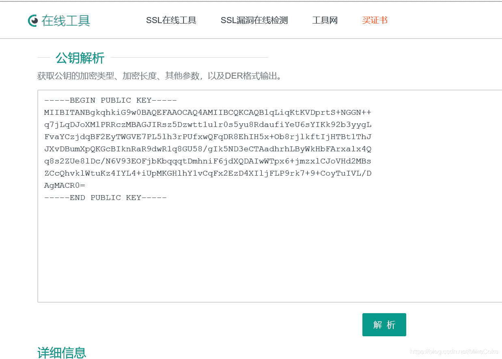
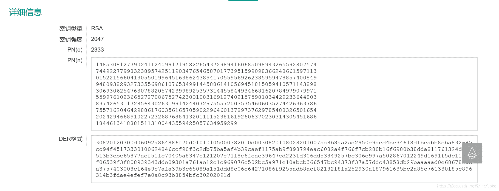
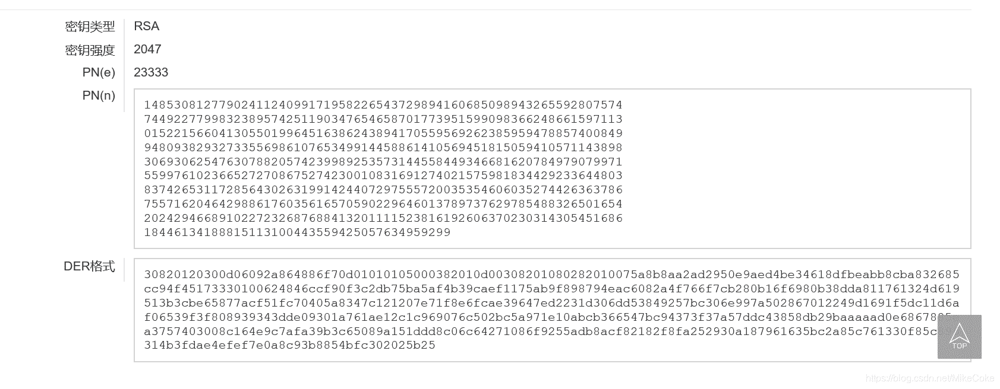
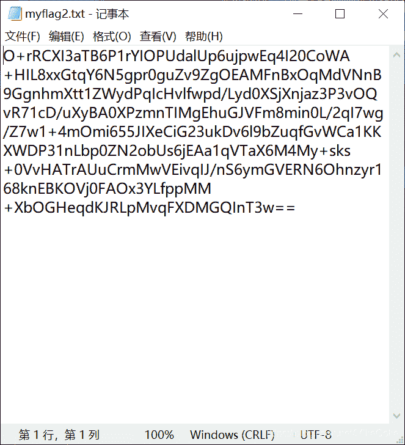
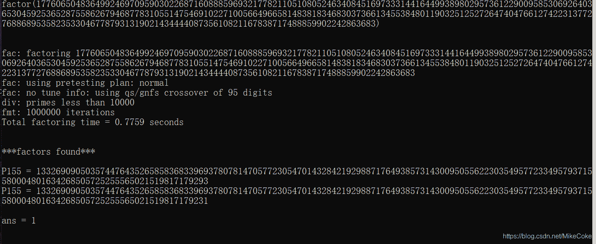
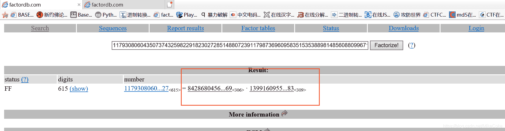
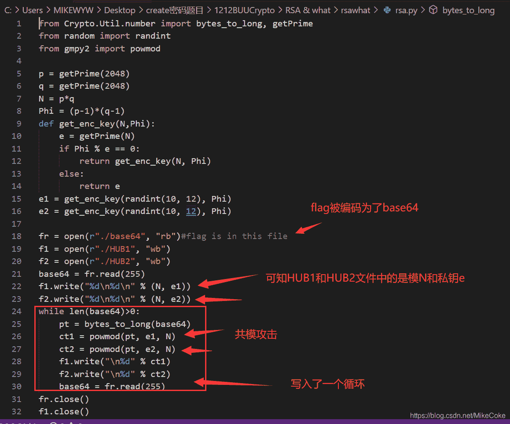

<!--yml
category: 未分类
date: 2022-04-26 14:19:34
-->

# BUUCTF RSA题目全解3_宁嘉的博客-CSDN博客_buuctf rsa3

> 来源：[https://blog.csdn.net/MikeCoke/article/details/107973068](https://blog.csdn.net/MikeCoke/article/details/107973068)

## 1.[WUSTCTF2020]babyrsa

[爆破n](http://factordb.com/index.php?query=73069886771625642807435783661014062604264768481735145873508846925735521695159),就行了

```
from gmpy2 import*
from libnum import*

p = 189239861511125143212536989589123569301
q =  386123125371923651191219869811293586459

c = 28767758880940662779934612526152562406674613203406706867456395986985664083182
n = 73069886771625642807435783661014062604264768481735145873508846925735521695159
e = 65537

phi = (p-1)*(q-1)
d = invert(e,phi)

m =pow(c,d,n)
print(n2s(m)) 
```

**flag{just_@_piece_0f_cak3}**

## 2.RSA4

参考文章
[CTF ——crypto ——RSA原理及各种题型总结](https://blog.csdn.net/vhkjhwbs/article/details/101160822?utm_medium=distribute.pc_relevant_t0.none-task-blog-BlogCommendFromMachineLearnPai2-1.channel_param&depth_1-utm_source=distribute.pc_relevant_t0.none-task-blog-BlogCommendFromMachineLearnPai2-1.channel_param#7%EF%BC%8C%E4%BD%8E%E5%8A%A0%E5%AF%86%E6%8C%87%E6%95%B0%E5%B9%BF%E6%92%AD%E6%94%BB%E5%87%BB)

[RAS4](https://www.cnblogs.com/vict0r/p/13474058.html)

```
from gmpy2 import *
from Crypto.Util.number import *
from functools import reduce

N1 = int('331310324212000030020214312244232222400142410423413104441140203003243002104333214202031202212403400220031202142322434104143104244241214204444443323000244130122022422310201104411044030113302323014101331214303223312402430402404413033243132101010422240133122211400434023222214231402403403200012221023341333340042343122302113410210110221233241303024431330001303404020104442443120130000334110042432010203401440404010003442001223042211442001413004',5)
c1 = int('310020004234033304244200421414413320341301002123030311202340222410301423440312412440240244110200112141140201224032402232131204213012303204422003300004011434102141321223311243242010014140422411342304322201241112402132203101131221223004022003120002110230023341143201404311340311134230140231412201333333142402423134333211302102413111111424430032440123340034044314223400401224111323000242234420441240411021023100222003123214343030122032301042243',5)

N2 = int('302240000040421410144422133334143140011011044322223144412002220243001141141114123223331331304421113021231204322233120121444434210041232214144413244434424302311222143224402302432102242132244032010020113224011121043232143221203424243134044314022212024343100042342002432331144300214212414033414120004344211330224020301223033334324244031204240122301242232011303211220044222411134403012132420311110302442344021122101224411230002203344140143044114',5)
c2 = int('112200203404013430330214124004404423210041321043000303233141423344144222343401042200334033203124030011440014210112103234440312134032123400444344144233020130110134042102220302002413321102022414130443041144240310121020100310104334204234412411424420321211112232031121330310333414423433343322024400121200333330432223421433344122023012440013041401423202210124024431040013414313121123433424113113414422043330422002314144111134142044333404112240344',5)

N3 = int('332200324410041111434222123043121331442103233332422341041340412034230003314420311333101344231212130200312041044324431141033004333110021013020140020011222012300020041342040004002220210223122111314112124333211132230332124022423141214031303144444134403024420111423244424030030003340213032121303213343020401304243330001314023030121034113334404440421242240113103203013341231330004332040302440011324004130324034323430143102401440130242321424020323',5)
c3 = int('10013444120141130322433204124002242224332334011124210012440241402342100410331131441303242011002101323040403311120421304422222200324402244243322422444414043342130111111330022213203030324422101133032212042042243101434342203204121042113212104212423330331134311311114143200011240002111312122234340003403312040401043021433112031334324322123304112340014030132021432101130211241134422413442312013042141212003102211300321404043012124332013240431242',5)

N = [N1,N2,N3]
c = [c1,c2,c3]

def chinese_remainder(modulus, remainders):
    Sum = 0
    prod = reduce(lambda a, b: a*b, modulus)
    for m_i, r_i in zip(modulus, remainders):
        p = prod // m_i
        Sum += r_i * (inverse(p,m_i)*p)
    return Sum % prod
e = 3

pow_m_e = chinese_remainder(N,c)

m = iroot(pow_m_e,e)[0]

print(long_to_bytes(m)) 
```

**flag{D4mn_y0u_h4s74d_wh47_4_b100dy_b4s74rd!}**

## 3.[AFCTF2018]你能看出这是什么加密么

简单的RSA加密

```
from gmpy2 import*
from Crypto.Util.number import long_to_bytes

p=int('0x928fb6aa9d813b6c3270131818a7c54edb18e3806942b88670106c1821e0326364194a8c49392849432b37632f0abe3f3c52e909b939c91c50e41a7b8cd00c67d6743b4f',16)

q=int('0xec301417ccdffa679a8dcc4027dd0d75baf9d441625ed8930472165717f4732884c33f25d4ee6a6c9ae6c44aedad039b0b72cf42cab7f80d32b74061',16)

e=int('0x10001',16)

c=int('0x70c9133e1647e95c3cb99bd998a9028b5bf492929725a9e8e6d2e277fa0f37205580b196e5f121a2e83bc80a8204c99f5036a07c8cf6f96c420369b4161d2654a7eccbdaf583204b645e137b3bd15c5ce865298416fd5831cba0d947113ed5be5426b708b89451934d11f9aed9085b48b729449e461ff0863552149b965e22b6',16)

phi = (q-1)*(p-1)
n=p*q

d=invert(e,phi)
m=pow(c,d,n)
print(long_to_bytes(m)) 
```

```
flag{R54_|5_$0_$imp13} 
```

## 4.[HDCTF2019]together（共模攻击）

先解析公钥





对于题目给的这两个flag文件，去直接base64解密，发现解密失败。将base64编码转换为unicode，再转数字。



[python之将byte转换为int类型函数 int.from_bytes 详解与原码反码补码的简单介绍](https://blog.csdn.net/aic1999/article/details/80102433)

```
 import gmpy2, libnum, base64

def exgcd(a, b):
    if b==0: return 1, 0
    x, y = exgcd(b, a%b)
    return y, x-a//b*y

n = 14853081277902411240991719582265437298941606850989432655928075747449227799832389574251190347654658701773951599098366248661597113015221566041305501996451638624389417055956926238595947885740084994809382932733556986107653499144588614105694518150594105711438983069306254763078820574239989253573144558449346681620784979079971559976102366527270867527423001083169127402157598183442923364480383742653117285643026319914244072975557200353546060352744263637867557162046429886176035616570590229646013789737629785488326501654202429466891022723268768841320111152381619260637023031430545168618446134188815113100443559425057634959299
e1 = 2333
c1 = int.from_bytes(base64.b64decode('R3Noy6r3WLItytAmb4FmHEygoilucEEZbO9ZYXx5JN03HNpBLDx7fXd2fl+UL5+11RCs/y0qlTGURWWDtG66eNLzGwNpAKiVj6I7RtUJl2Pcm3NvFeAFwI9UsVREyh7zIV6sI9ZP8l/2GVDorLAz5ULW+f0OINGhJmZm8FL/aDnlfTElhQ87LPicWpXYoMtyr6WrxjK6Ontn8BqCt0EjQ7TeXZhxIH9VTPWjDmFdmOqaqdVIT+LZemTgLNESwM5nn4g5S3aFDFwj1YiDYl0/+8etvKfOrfoKOwR0CxsRHagwdUUTES8EcHLmMGCxCkDZn3SzmmA6Nb3lgLeSgG8P1A=='), 'big')
e2 = 23333
c2 = int.from_bytes(base64.b64decode('O+rRCXI3aTB6P1rYIOPUdalUp6ujpwEq4I20CoWA+HIL8xxGtqY6N5gpr0guZv9ZgOEAMFnBxOqMdVNnB9GgnhmXtt1ZWydPqIcHvlfwpd/Lyd0XSjXnjaz3P3vOQvR71cD/uXyBA0XPzmnTIMgEhuGJVFm8min0L/2qI7wg/Z7w1+4mOmi655JIXeCiG23ukDv6l9bZuqfGvWCa1KKXWDP31nLbp0ZN2obUs6jEAa1qVTaX6M4My+sks+0VvHATrAUuCrmMwVEivqIJ/nS6ymGVERN6Ohnzyr168knEBKOVj0FAOx3YLfppMM+XbOGHeqdKJRLpMvqFXDMGQInT3w=='), 'big')

a, b = exgcd(e1, e2)

m = pow(c1, a, n)*pow(c2, b, n)%n

print(libnum.n2s(m)) 
```

**flag{23re_SDxF_y78hu_5rFgS}**

## 5.[RoarCTF2019]babyRSA

题目

```
import sympy
import random

def myGetPrime():
    A= getPrime(513)
    print(A)
    B=A-random.randint(1e3,1e5)
    print(B)
    return sympy.nextPrime((B!)%A)
p=myGetPrime()

q=myGetPrime()

r=myGetPrime()

n=p*q*r

c=pow(flag,e,n) 
```

参考wp:
[RoarCTF2019 babyRSA](https://www.cnblogs.com/vict0r/p/13563073.html)

数论考点：
[三个重要的同余式——威尔逊定理、费马小定理、欧拉定理 + 求幂大法的证明](https://blog.csdn.net/CillyB/article/details/52862448)

关键代码分析：


解密代码：

```
from gmpy2 import*
from libnum import*
from Crypto.Util.number import*
from sympy import*

def get_p_q(A,B):
    tmp = 1
    for i in range(B+1,A-1):
        tmp *= i
        tmp %= A
    tmp_inv = invert(tmp,A)
    result = nextprime(tmp_inv)
    return result
A1=21856963452461630437348278434191434000066076750419027493852463513469865262064340836613831066602300959772632397773487317560339056658299954464169264467234407
B1=21856963452461630437348278434191434000066076750419027493852463513469865262064340836613831066602300959772632397773487317560339056658299954464169264467140596

A2=16466113115839228119767887899308820025749260933863446888224167169857612178664139545726340867406790754560227516013796269941438076818194617030304851858418927
B2=16466113115839228119767887899308820025749260933863446888224167169857612178664139545726340867406790754560227516013796269941438076818194617030304851858351026

n=85492663786275292159831603391083876175149354309327673008716627650718160585639723100793347534649628330416631255660901307533909900431413447524262332232659153047067908693481947121069070451562822417357656432171870951184673132554213690123308042697361969986360375060954702920656364144154145812838558365334172935931441424096270206140691814662318562696925767991937369782627908408239087358033165410020690152067715711112732252038588432896758405898709010342467882264362733
c=75700883021669577739329316795450706204502635802310731477156998834710820770245219468703245302009998932067080383977560299708060476222089630209972629755965140317526034680452483360917378812244365884527186056341888615564335560765053550155758362271622330017433403027261127561225585912484777829588501213961110690451987625502701331485141639684356427316905122995759825241133872734362716041819819948645662803292418802204430874521342108413623635150475963121220095236776428

p=get_p_q(A1,B1)
q=get_p_q(A2,B2)

r = n//p//q

phi = (p-1)*(q-1)*(r-1)

e=0x1001

d= invert(e,phi)

m= pow(c,int(d),n)
print(n2s(m)) 
```

**flag{wm-CongrAtu1ation4-1t4-ju4t-A-bAby-R4A}**

## 6.[ACTF新生赛2020]crypto-rsa3

由题目可以得到值 n,c,e，已知p,q接近，所以可以yafu爆破获取到pq

```
from flag import FLAG
from Cryptodome.Util.number import *
import gmpy2
import random

e=65537
p = getPrime(512)
q = int(gmpy2.next_prime(p))
n = p*q
m = bytes_to_long(FLAG)
c = pow(m,e,n)
print(n)
print(c) 
```


Python3脚本

```
from libnum import *
from gmpy2 import *

c = 1457390378511382354771000540945361168984775052693073641682375071407490851289703070905749525830483035988737117653971428424612332020925926617395558868160380601912498299922825914229510166957910451841730028919883807634489834128830801407228447221775264711349928156290102782374379406719292116047581560530382210049

p = 13326909050357447643526585836833969378078147057723054701432842192988717649385731430095055622303549577233495793715580004801634268505725255565021519817179293
q = 13326909050357447643526585836833969378078147057723054701432842192988717649385731430095055622303549577233495793715580004801634268505725255565021519817179231
e=65537
n = p*q

phi = (p-1)*(q-1)
d=invert(e,phi)

m =pow(c,d,n)
print(n2s(m)) 
```

**flag{p_and_q_should_not_be_so_close_in_value}**

## 7.[RoarCTF2019]RSA

**题目**

```
A=(((y%x)**5)%(x%y))**2019+y**316+(y+1)/x
p=next_prime(z*x*y)
q=next_prime(z)
A =  2683349182678714524247469512793476009861014781004924905484127480308161377768192868061561886577048646432382128960881487463427414176114486885830693959404989743229103516924432512724195654425703453612710310587164417035878308390676612592848750287387318129424195208623440294647817367740878211949147526287091298307480502897462279102572556822231669438279317474828479089719046386411971105448723910594710418093977044179949800373224354729179833393219827789389078869290217569511230868967647963089430594258815146362187250855166897553056073744582946148472068334167445499314471518357535261186318756327890016183228412253724
n =  117930806043507374325982291823027285148807239117987369609583515353889814856088099671454394340816761242974462268435911765045576377767711593100416932019831889059333166946263184861287975722954992219766493089630810876984781113645362450398009234556085330943125568377741065242183073882558834603430862598066786475299918395341014877416901185392905676043795425126968745185649565106322336954427505104906770493155723995382318346714944184577894150229037758434597242564815299174950147754426950251419204917376517360505024549691723683358170823416757973059354784142601436519500811159036795034676360028928301979780528294114933347127
c =  41971850275428383625653350824107291609587853887037624239544762751558838294718672159979929266922528917912189124713273673948051464226519605803745171340724343705832198554680196798623263806617998072496026019940476324971696928551159371970207365741517064295956376809297272541800647747885170905737868568000101029143923792003486793278197051326716680212726111099439262589341050943913401067673851885114314709706016622157285023272496793595281054074260451116213815934843317894898883215362289599366101018081513215120728297131352439066930452281829446586562062242527329672575620261776042653626411730955819001674118193293313612128 
```

尝试分解一下n，[factordb](http://factordb.com/)

顺利获取到p,q的值

发现题目并没有给出e的值，可以采取分析爆破的方式计算出e，但会很麻烦。尝试用一下e的一般值 **65537（0x10001）** 成功解出flag

```
from gmpy2 import*
from libnum import*
n =  117930806043507374325982291823027285148807239117987369609583515353889814856088099671454394340816761242974462268435911765045576377767711593100416932019831889059333166946263184861287975722954992219766493089630810876984781113645362450398009234556085330943125568377741065242183073882558834603430862598066786475299918395341014877416901185392905676043795425126968745185649565106322336954427505104906770493155723995382318346714944184577894150229037758434597242564815299174950147754426950251419204917376517360505024549691723683358170823416757973059354784142601436519500811159036795034676360028928301979780528294114933347127
c =  41971850275428383625653350824107291609587853887037624239544762751558838294718672159979929266922528917912189124713273673948051464226519605803745171340724343705832198554680196798623263806617998072496026019940476324971696928551159371970207365741517064295956376809297272541800647747885170905737868568000101029143923792003486793278197051326716680212726111099439262589341050943913401067673851885114314709706016622157285023272496793595281054074260451116213815934843317894898883215362289599366101018081513215120728297131352439066930452281829446586562062242527329672575620261776042653626411730955819001674118193293313612128
p = 842868045681390934539739959201847552284980179958879667933078453950968566151662147267006293571765463137270594151138695778986165111380428806545593588078365331313084230014618714412959584843421586674162688321942889369912392031882620994944241987153078156389470370195514285850736541078623854327959382156753458569
q = 139916095583110895133596833227506693679306709873174024876891023355860781981175916446323044732913066880786918629089023499311703408489151181886568535621008644997971982182426706592551291084007983387911006261442519635405457077292515085160744169867410973960652081452455371451222265819051559818441257438021073941183
e = 65537
phi = (p-1)*(q-1)
d = invert(e,phi)

m= pow(c,d,n)
print(n2s(m)) 
```

**flag{wm-l1l1ll1l1l1l111ll}**

## 8.[AFCTF2018]可怜的RSA

公钥解析，RSA签名加密

```
from gmpy2 import*
from libnum import*
from Crypto.Cipher import PKCS1_OAEP
from Crypto.PublicKey import RSA
from base64 import b64decode
e = 65537
n = 79832181757332818552764610761349592984614744432279135328398999801627880283610900361281249973175805069916210179560506497075132524902086881120372213626641879468491936860976686933630869673826972619938321951599146744807653301076026577949579618331502776303983485566046485431039541708467141408260220098592761245010678592347501894176269580510459729633673468068467144199744563731826362102608811033400887813754780282628099443490170016087838606998017490456601315802448567772411623826281747245660954245413781519794295336197555688543537992197142258053220453757666537840276416475602759374950715283890232230741542737319569819793988431443
p = 3133337
q = 25478326064937419292200172136399497719081842914528228316455906211693118321971399936004729134841162974144246271486439695786036588117424611881955950996219646807378822278285638261582099108339438949573034101215141156156408742843820048066830863814362379885720395082318462850002901605689761876319151147352730090957556940842144299887394678743607766937828094478336401159449035878306853716216548374273462386508307367713112073004011383418967894930554067582453248981022011922883374442736848045920676341361871231787163441467533076890081721882179369168787287724769642665399992556052144845878600126283968890273067575342061776244939
phi = (q-1)*(p-1)
d = int(invert(e,phi))

key = RSA.construct((n,e,d,q,p))
cipher = PKCS1_OAEP.new(key)

with open('C:\\Users\\MIKEWYW\\Desktop\\create密码题目\\1212BUUCrypto\\[AFCTF2018]可怜的RSA\\flag.txt','rb') as f:
    f = f.read()
    c = b64decode(f)
    flag = cipher.decrypt(c)
    print(flag) 
```

## 9.RSA & what

题目分析：
考点：共模攻击+base64隐写
[Base64隐写](https://www.cnblogs.com/vict0r/p/13282901.html)

```
base64在解码的过程:
1,先去掉'='
2,8位一读
3,末尾不足8位的地方舍去. 
```

EXP:

```
from gmpy2 import*
from libnum import*
from Crypto.Util.number import*
import base64
import binascii

N =785095419718268286866508214304816985447077293766819398728046411166917810820484759314291028976498223661229395009474063173705162627037610993539617751905443039278227583504604808251931083818909467613277587874545761074364427549966555519371913859875313577282243053150056274667798049694695703660313532933165449312949725581708965417273055582216295994587600975970124811496270080896977076946000102701030260990598181466447208054713391526313700681341093922240317428173599031624125155188216489476825606191521182034969120343287691181300399683515414809262700457525876691808180257730351707673660380698973884642306898810000633684878715402823143549139850732982897459698089649561190746850698130299458080255582312696873149210028240898137822888492559957665067936573356367589784593119016624072433872744537432005911668494455733330689385141214653091888017782049043434862620306783436169856564175929871100669913438980899219579329897753233450934770193915434791427728636586218049874617231705308003720066269312729135764175698611068808404054125581540114956463603240222497919384691718744014002554201602395969312999994159599536026359879060218056496345745457493919771337601177449899066579857630036350871090452649830775029695488575574985078428560054253180863725364147
e2 = 599
c21=592169079372093727306100216011395857825646323934289480976073629037543922902098120901138454462177159996376654176248238979132528728327590301098966139983157980612320563496546128644967731000716697705104079039156276714872147463350811303393260622707024952543509891692246246277965823414460326811240048060543656588688604452353899779068825120910282167004715339763187734797180326976132213325054697165320479166356562518029805927741656605174809726397565772271562066078076105491745903986597877400370206718954975288721072048333678609055008135809089304229015364348490924974097403734627265297637171818849461766523691595241613878709865506436588268999163342945070495338153600520537498539457396582804692959296612715752573140296135784933206146091436617979599749774330699946637591406356289409716084034451049094715202196203486088368791744107629271647320273259836915312794297246589501008666299165717722507702866033454215783240025504356157664454861755286285777763585177751796252655008206383024707883077513745863312079349790275094080707502392866946325796914450602264462588722052297430827681750827349094323968337670311272933785838850649376115667223821665435911506351891489985627506615492005617098615432522564204152887767244129985681083657783356557756654335186
c22=373940646416832740878733255707567753033716583448402000789202767511920210382830343955553654111486728333980557319799362514960627879016797491389812007768832730979916230647641872759001906846747977631675704310179448857128160385701185892914523053669366534408863734305635222625590986006420486092550427301086984563126480814987024980594613542978310129247678826691418335300577577527951623696426435497835228167084738007750914270251001921329521479047662848650808989996085600197309361410863238526802127877523767262921515150984998560136647154865791163316503073285223966216441025637452229043510097323724381056976302288136843260163922706692913035222445496716008888946581535004546355744211680390731257309941902587303353139951102244865270295414474488798335404630458489706639805186573874814586736746232358849677477533671968344154242963289415569487579895910660999043578737461300406937828924818002658292769882181668784501439254131996848948120781562158861495883827848139425862249576454689133681009549361314460818658995959098228995702202268649635363105549975932395335076521137604288520082040121286614922986554652700056148966514178935952363036963217619879899671383604638416567950421350546204434902113156720006282720889591288850271076074941927715678306057176
c23=527630926460622936571385649841758214453416849039412401087443444317101857090904711485538107058823056085840539073345920792871368232355475394571098380596835468509997340505604333730547799560998822989747473780307779717715522787724471724766494090783971030594671013168209717686720448579582618378459567979027822271918653169622428153856198907810040224340270362413432495029672123261375400927159831537760709974778708160583252613784358234858583174544777979242887938827573604837766801998381379999076416444683891078093889686055482709838668356120916040352123019019255084513769603803814947774554028717814638951416291274696771515474086351482107953150253616922787262398450376249126999644026382478413080973933173079111305142716133389111399235545279259017424722601848670061556859163943895466553927946412523750166582734005733378328468250568944945912238495877929717101722314678120172228493787964904072583905721074766711732215815561012960394537195757832959268603775112932862105945720853959285187521763557915356428113876893276879775603217718981852114599706699524551973934242045743122744146361596971245034059345915315495232135483464496114770357536576200511490922413208178149869347802988786513451486411409887164516065062084917556120712465074206435831498113605
c24=8786437178698940322877889807009957616777351844979869726962356553244050911283984280960665761649310895230455072977431415102053987735969326553978994853162483051544656873294555116009995592043183070208706258164840540599577072097104139505857517663273929851202628854185356185647194933800084230503413037858893307713037149307477830536758283681093517617820169181420796105338681582230788318108428132051793761014952837330456262272828627355701464740578197966332613127307037255647286823496355917642353327912440019621838870388091824748629637425759125214639885130163183752378908729773517053259212525494555880921052679512582051516604297098204363525081039382358483926727008679327719083138865969291911863630382097160230960738043575559330264018212774424527719153248563876760067931499029384228993253862501939337758514377472011933279273181144830381169849387893799390755052093069179605579485710343655570028592595882436632426527654452895431758715126580164902410286422637215098476316042367916779431052267545769495994723721129943616294879642305545894912914632980455031755879087401575310699765408473606166727137934224515998416625122213056208800095077933103150699272650116151674702438463062734472714004926103668378506804002740045547964716693536349447660850580
c25=205314962204511500352858372254132533167549960825498949618514841570703199264867431580754674275990554478140637041427842111391746883257447120035947621456863890934062044010795443059281736346976175772415034838334682726635263432655537852942177334888025283748611576171534251461847349566505628290587224150869640386437623371249743165260396675220683302142805646368906930575140628610003919131999295855501215111393294818218799982703289304596989070475000081175510085432290264502023736899104746316830742226946395027029820825791831870857382647221322734605026210073093918331247494307555600335550942340526536281372036612138713881098866303169425501998978400008829873080965592009371176208668290074288903681417933657472279670688597862835627506340169978450918788539270346340385928840299573889292189531738082166408734046381423516467694328971385421907314814283489322619386570046183556572383980777277173349209330683424343658179781015072259378576130442222984963071166207642585589822061597282467850868050737957726423713761694231879497037175627546427449730638216214828463003483408928375620315193290871300316930139260521382533279767663839278693750409419493280753368451508802658272220767624766390639285308433607255253282702383762149755935518922075584637512494819
c26=271453634732502613378948161256470991260052778799128789839624515809143527363206813219580098196957510291648493698144497567392065251244844074992734669490296293997386198359280316655904691639367482203210051809125904410431506925238374843856343243276508280641059690938930957474434518308646618959004216831130099873532714372402117796666560677624822509159287675432413016478948594640872091688482149004426363946048517480052906306290126242866034249478040406351940088231081456109195799442996799641647167552689564613346415247906852055588498305665928450828756152103096629274760601528737639415361467941349982213641454967962723875032638267311935042334584913897338553953961877439389588793074211502597238465542889335363559052368180212013206172712561221352833891640659020253527584706465205486408990762759230842192028381048563437724528409174790022752557512795782713125166158329880702730769957185428522011430144840232256419113631679343171680631630775266488738173707357123139368825087043785842169049943237537188129367275730984789479909103397937113837824575137021012333461552176687570010445744268373840742899299977372834041925102853718964831225250407279578465008537542659673685686242773379131904890865110699190451534445434533919127658976874721029586168106207

e1 = 1697
c11=412629526163150748619328091306742267675740578011800062477174189782151273970783531227579758540364970485350157944321579108232221072397135934034064481497887079641131808838242743811511451355024436983050572020925065644355566434625618133203024215941534926113892937988520918939061441606915556516246057349589921494351383160036280826024605351878408056180907759973804117263002554923041750587548819746346813966673034182913325507826219961923932100526305289894965216608254252188398580139545189681875824089456195044984585824938384521905334289906422454152976834867304693292466676355760173232407753256256317546190171995276258924613533179898467683358934751999655196790168438343198229183747091108262988777659858609744709324571850262293294975336628234767258858873839342596887193772615000676401522431518310648303975593582965021189182246986957349253156736526071639973844039068996404290548474640668851856078201093335425412842295604919065487301340901573809617549185106072798799159726375235125260509158832996701927878713084753334549129580912412168594170659605421750204835970231909591063407612779337478065175988365401590396247576709343727196106058477166945670117868989025903023998142850338956985816131805349549059377047477131270847579095628384569645636821650
c12=494644347943710545224678831941589086572700792465459558770782213550069709458568349686998660541810166872034041584767487150140111151788221460027897193248273461607411027815984883969396220626358625041781558277804930212654296704055890683796941327712758797770820006623289146990000114915293539639766846910274034245607746230740851938158390562286057002223177609606376329007676845450142537930798148258428701466415483232670659815791064681384406494388237742330786225557303988025468036820082959712050733095860546860468575857084616069132051094882919253745234762029759124776348047587755897123575123506976140900565238840752841856713613368250071926171873213897914794115466890719123299469964019450899291410760762179836946570945555295288184698184555018368687708432612286248476073758067175481771199066581572870175460016017100414479346437034291784837132240891321931601494414908927713208448927221095745802380014441841139882391378410438764884597938773868771896252329517440068673532468372840830510218585255432000690265226016573313570977945083879214961394087065558376158826938257664840570952233832852869328785568175434516247720356520242602299510374317488182738732700078879665745909603766482100138001417023680647717824323143388857817595766172152883484274718248
c13=152942283599728307168144137370127212672611894072038732126041098102628831053000986759260271210671922070555948023688596575415822984026159010574404359474670428678518262175033880513984372909748992727828381694416776740981021730545374002974037896534944567124543272737618380646771071804878796585983783360553761828325817820260204820004421979881871027255562690952334900616675606524933557440263648233514757200263521499508373975003431306847453046714027687108396945719803444444954079308404947126216395526551292104722047878178373207886033071857277857997932255251315982837892164421298202073945919187779856785892717251746704537315003771369737854896595170485152591013676942418134278534037654467840633528916812275267230155352077736583130992587670941654695382287023971261529987384520843829695778029311786431227409189019205818351911572757145556993606643464336196802350204616056286497246016800105003143046120608673496196758720552776772796609670537056331996894322779267635281472481559819839042424017171718303214059720568484939239370144038161541354254182769979771948759413102933987773401644506930205164891773826513161783736386604783484446345744957119469799231796368324927570694496679453313927562345656690240414624431304646248599226046524702364131095964335
c14=79717988936247951265489157583697956031893477858854186991051529161879478488281744062318600470906120960002282886511477294555606503083169449335174864424180701080203993329996226566203834693869525797695969610065991941396723959032680019082506816443041598300477625793433080664346470586416385854692124426348587211026568667694805849554780794033764714016521711467557284846737236374990121316809833819996821592832639024026411520407330206281265390130763948165694574512140518775603040182029818771866749548761938870605590174330887949847420877829240131490902432602005681085180807294176837646062568094875766945890382971790015490163385088144673549085079635083262975154206269679142412897438231719704933258660779310737302680265445437771977749959110744959368586293082016067927548564967400845992380076107522755566531760628823374519718763740378295585535591752887339222947397184116326706799921515431185636740825707782742373783475781052674257292910213843986132987466810027275052416774693363446184518901899202502828670309452622347532932678874990809930682575738653876289384151496807194146308614368821006660626870989784697045160231069428458961107751207771093777394616856305293335603892178327520756554333365975114235981173451368131680404850832773147333013716920
c15=123111353650401158556639983459870663057297871992927053886971224773529636525110628183715748795987525113177540092814119928708272290370336537110381023134637759740716140969662183269370676630325583385284994943164692397459103195434968057377474610500216801375394703781249039351368816958227409657934091741509357152328382960684515093945552479461382281913961956745154260686029997827565075768703774895750561575155143606297116391666385705899138085693913246313778033627210312268959737394553510894720099165193981333775907531107232556909478156441457899797515694348816961762796703443502856101079430585547997496001098926600499728389113862894833789669213630332988693669889340482430613291490613803204484751470676686041002772556117213612152322606737150858116122936539131795111263513114569794532805886643087299918196635113037777138666914296986040549274559835214505300618256105508764026461518876579387159881983544667258537064954616097750399839661065797883103731694314852301848272092388637114950059216922969842082648527035538090054093890365647676119748995243416337805666557501345234056968476142608491830438065401219751688687373709390057521910942736632126729711606256158399963682990881473178216060827021373776598901281958527655543318413664277921492723185984
c16=36869806815936046911848195817405817350259890871483063184373728397968909458432625046025376290214729914038387534731762237978339011724858818860181178811639468996206294711495853807311240013786226884265118119546377272154555615363105236192878292703331473547623021744317034819416624562896226194523639793573028006666236271812390759036235867495803255905843636447252225413871038762657801345647584493917576263471587347202664391908570140389126903204602391093990827188675090199750617303773574821926387194478875191828814971296674530519321530805302667925998711835019806761133078403281404889374663875077339168901297819436499920958268483684335998301056068380228873524800383911402490807139268964095165069610454677558808756444381542173782815227920906224931028457073652453777424387873533280455944646592996920617956675786286711447540353883400282402551158169958389450168079568459656526911857835375748015814860506707921852997096156275804955989964215077733621769938075413007804223217091604613132253046399456747595300404564172224333936405545921819654435437072133387523533568472443532200069133022979195685683508297337961701169394794966256415112246587706103819620428258245999539040721929317130088874161577093962579487428358736401687123174207198251449851429295

c1 = [c11,c12,c13,c14,c15,c16]
c2 = [c21,c22,c23,c24,c25,c26]

s = ''
a = gcdext(e1,e2)
for i in range(6):
    m = pow(c1[i],a[1],N)*pow(c2[i],a[2],N)%N
    s +=n2s(m)                                        #16进制转字符串
    #s += binascii.unhexlify(hex(m)[2:]).decode()     16进制转字符串（另一种写法）
ans=s.split('\n')   # 通过分隔符\n对 s 内的字符串进行切片操作

# 关键代码
libase64=['A','B','C','D','E','F','G','H','I','J','K','L','M','N','O','P','Q','R','S','T','U','V','W','X','Y','Z','a','b','c','d','e','f','g','h','i','j','k','l','m','n','o','p','q','r','s','t','u','v','w','x','y','z','0','1','2','3','4','5','6','7','8','9','+','/']
def myb64_bytes(str):
    s=''
    temp=str.replace('=','')         #去掉=号
    for i in temp:
        s+=bin(libase64.index(i))[2:].zfill(6)
    return s

def bytes_to_string(str):
    s=''
    for i in range(0,len(str),8):
        s+=chr(eval('0b'+str[i:i+8]))
    return s

flag = ''
for i in ans:
    b=myb64_bytes(i)
    temp=len(b)%8
    if temp !=0:
        flag += b[-temp:]
    else:
        flag=flag

print(bytes_to_string(flag)) 
```

## 10.[网鼎杯 2020 青龙组]you_raise_me_up（离散对数）

涉及知识点：**离散对数**，可以通过sage来解决
也可以通过 python 第三方sympy库来解决。

这个考点以后可以写一篇专门的文章来解析离散对数及解决代码。

可以参考一下的文章：
1.[[网鼎杯2020青龙组] you_raise_me_up](https://www.cnblogs.com/vict0r/p/13298370.html)
2.[离散对数概念](http://abloz.com/tech/2018/06/27/discrete-logarithm/)
3.[Sympy常用函数总结](https://www.cnblogs.com/YuanZiming/p/13070883.html?utm_medium=referral&utm_source=itdadao)

```
from sympy import*
求离散对数（如下15 = 7**3 mod 41）：
discrete_log(41, 15, 7) 
```

```
来分析一下这道题

from Crypto.Util.number import *
import random

n = 2 ** 512
m = random.randint(2, n-1) | 1
c = pow(m, bytes_to_long(flag), n)
print 'm = ' + str(m)
print 'c = ' + str(c) 
```

从题目可以看出来，要解出flag，只需要一个公式即可。

**c = m ** flag mod n (这里的等号是同余号)。
意思为 c同余m的flag次方 模 n**

**我们要解flag的值，用函数
discrete_log(n,c,m) #(模数，同余数，同余数)**

```
from gmpy2 import*
from sympy import*
from libnum import*

n = 2 ** 512

m = 391190709124527428959489662565274039318305952172936859403855079581402770986890308469084735451207885386318986881041563704825943945069343345307381099559075
c = 6665851394203214245856789450723658632520816791621796775909766895233000234023642878786025644953797995373211308485605397024123180085924117610802485972584499

flag = discrete_log(n,c,m)
print(n2s(flag)) 
```

**flag{5f95ca93-1594-762d-ed0b-a9139692cb4a}**