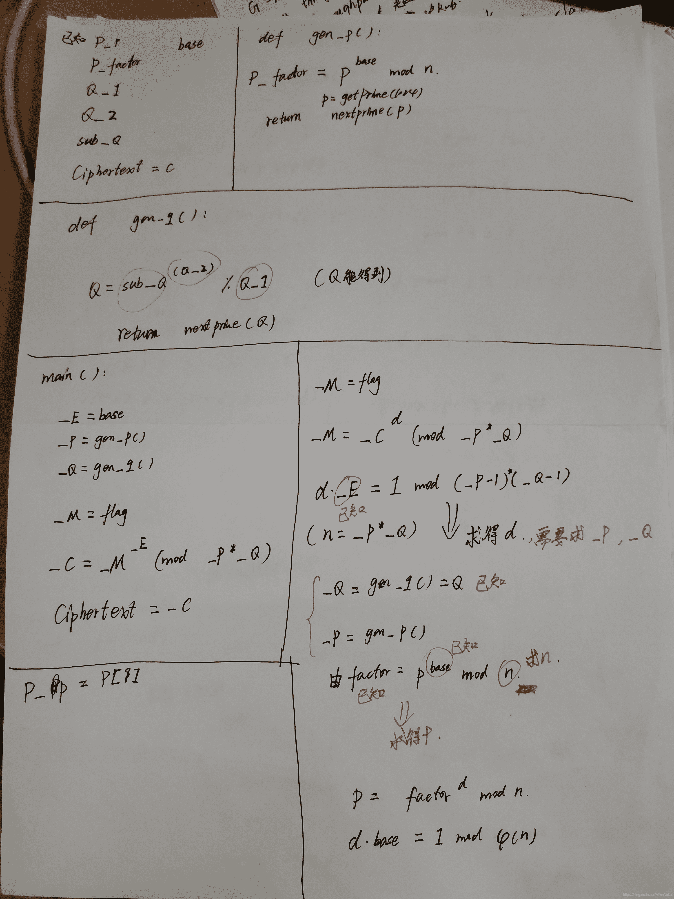
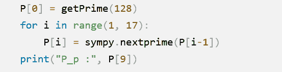
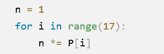
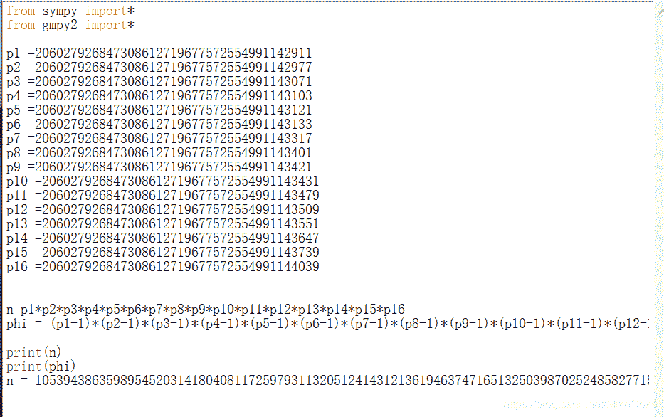
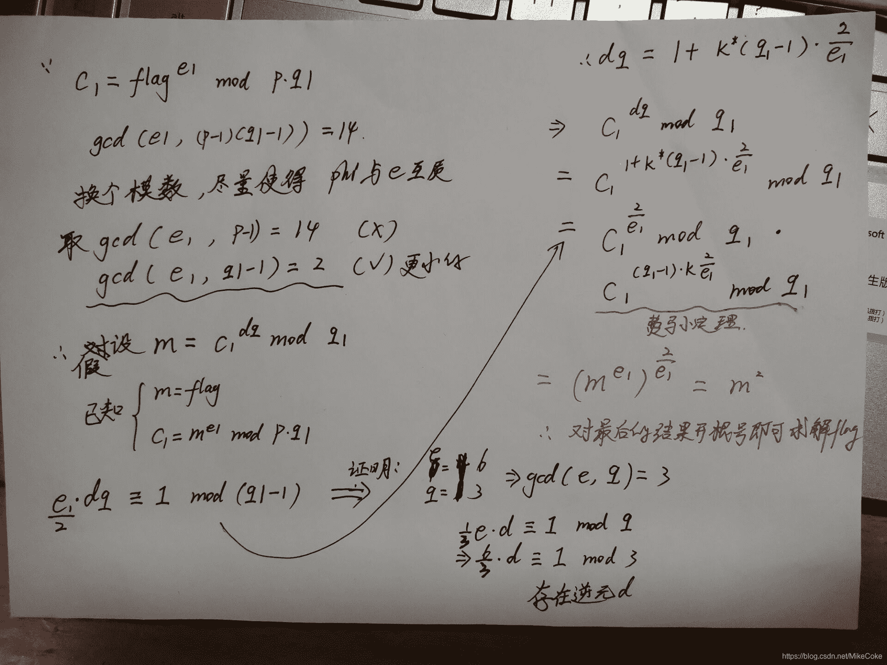
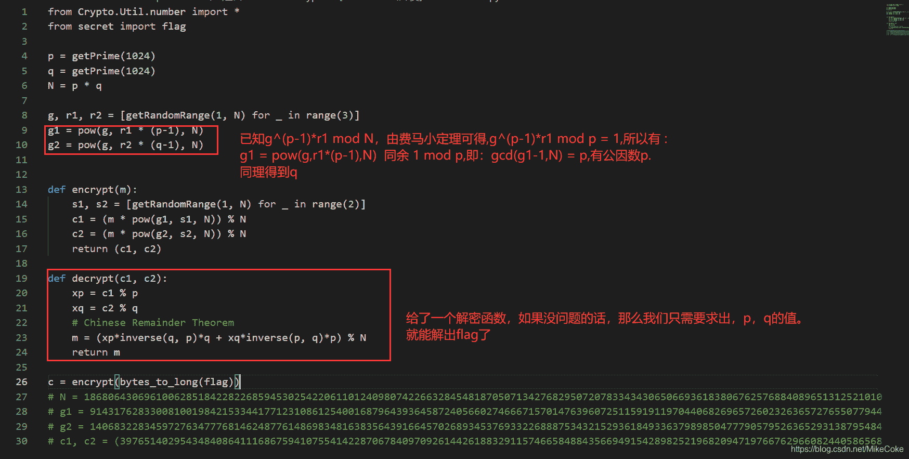

<!--yml
category: 未分类
date: 2022-04-26 14:38:45
-->

# BUUCTF RSA题目全解4_宁嘉的博客-CSDN博客

> 来源：[https://blog.csdn.net/MikeCoke/article/details/108540699](https://blog.csdn.net/MikeCoke/article/details/108540699)

## 1.[MRCTF2020]babyRSA

题目

```
import sympy
import random
from gmpy2 import gcd, invert
from Crypto.Util.number import getPrime, isPrime, getRandomNBitInteger, bytes_to_long, long_to_bytes
from z3 import *
flag = b"MRCTF{xxxx}"
base = 65537

def GCD(A):
    B = 1
    for i in range(1, len(A)):
        B = gcd(A[i-1], A[i])
    return B

def gen_p():
    P = [0 for i in range(17)]
    P[0] = getPrime(128)
    for i in range(1, 17):
        P[i] = sympy.nextprime(P[i-1])
    print("P_p :", P[9])
    n = 1
    for i in range(17):
        n *= P[i]
    p = getPrime(1024)
    factor = pow(p, base, n)
    print("P_factor :", factor)
    return sympy.nextprime(p)

def gen_q():
    sub_Q = getPrime(1024)
    Q_1 = getPrime(1024)
    Q_2 = getPrime(1024)
    Q = sub_Q ** Q_2 % Q_1
    print("Q_1: ", Q_1)
    print("Q_2: ", Q_2)
    print("sub_Q: ", sub_Q)
    return sympy.nextprime(Q)

if __name__ == "__main__":
    _E = base
    _P = gen_p()
    _Q = gen_q()
    assert (gcd(_E, (_P - 1) * (_Q - 1)) == 1)
    _M = bytes_to_long(flag)
    _C = pow(_M, _E, _P * _Q)
    print("Ciphertext = ", _C)
'''
P_p : 206027926847308612719677572554991143421
P_factor : 213671742765908980787116579976289600595864704574134469173111790965233629909513884704158446946409910475727584342641848597858942209151114627306286393390259700239698869487469080881267182803062488043469138252786381822646126962323295676431679988602406971858136496624861228526070581338082202663895710929460596143281673761666804565161435963957655012011051936180536581488499059517946308650135300428672486819645279969693519039407892941672784362868653243632727928279698588177694171797254644864554162848696210763681197279758130811723700154618280764123396312330032986093579531909363210692564988076206283296967165522152288770019720928264542910922693728918198338839
Q_1:  103766439849465588084625049495793857634556517064563488433148224524638105971161051763127718438062862548184814747601299494052813662851459740127499557785398714481909461631996020048315790167967699932967974484481209879664173009585231469785141628982021847883945871201430155071257803163523612863113967495969578605521
Q_2:  151010734276916939790591461278981486442548035032350797306496105136358723586953123484087860176438629843688462671681777513652947555325607414858514566053513243083627810686084890261120641161987614435114887565491866120507844566210561620503961205851409386041194326728437073995372322433035153519757017396063066469743
sub_Q:  168992529793593315757895995101430241994953638330919314800130536809801824971112039572562389449584350643924391984800978193707795909956472992631004290479273525116959461856227262232600089176950810729475058260332177626961286009876630340945093629959302803189668904123890991069113826241497783666995751391361028949651
Ciphertext =  1709187240516367141460862187749451047644094885791761673574674330840842792189795049968394122216854491757922647656430908587059997070488674220330847871811836724541907666983042376216411561826640060734307013458794925025684062804589439843027290282034999617915124231838524593607080377300985152179828199569474241678651559771763395596697140206072537688129790126472053987391538280007082203006348029125729650207661362371936196789562658458778312533505938858959644541233578654340925901963957980047639114170033936570060250438906130591377904182111622236567507022711176457301476543461600524993045300728432815672077399879668276471832
''' 
```

**解析题目：**
附上一张解题时的草稿：



```
解题的关键就是得到 _Q和_P的值 
```

得到_P 需要先求得 n 值，即 p[i] 的积，已知 p[9] 所以可以得到其他数的值。通过nextprime()和prevprime()获取。

由下面的代码可知 n *= p[i]


用快速幂求出_Q，一般的方法计算需要花费大量的时间，但快速幂则不需要。

解题脚本：

```
from sympy import*
from gmpy2 import*
from Crypto.Util.number import getPrime, isPrime, getRandomNBitInteger, bytes_to_long, long_to_bytes
from libnum import *

base = 65537

factor = 213671742765908980787116579976289600595864704574134469173111790965233629909513884704158446946409910475727584342641848597858942209151114627306286393390259700239698869487469080881267182803062488043469138252786381822646126962323295676431679988602406971858136496624861228526070581338082202663895710929460596143281673761666804565161435963957655012011051936180536581488499059517946308650135300428672486819645279969693519039407892941672784362868653243632727928279698588177694171797254644864554162848696210763681197279758130811723700154618280764123396312330032986093579531909363210692564988076206283296967165522152288770019720928264542910922693728918198338839
Q_1 = 103766439849465588084625049495793857634556517064563488433148224524638105971161051763127718438062862548184814747601299494052813662851459740127499557785398714481909461631996020048315790167967699932967974484481209879664173009585231469785141628982021847883945871201430155071257803163523612863113967495969578605521
Q_2 = 151010734276916939790591461278981486442548035032350797306496105136358723586953123484087860176438629843688462671681777513652947555325607414858514566053513243083627810686084890261120641161987614435114887565491866120507844566210561620503961205851409386041194326728437073995372322433035153519757017396063066469743
sub_Q = 168992529793593315757895995101430241994953638330919314800130536809801824971112039572562389449584350643924391984800978193707795909956472992631004290479273525116959461856227262232600089176950810729475058260332177626961286009876630340945093629959302803189668904123890991069113826241497783666995751391361028949651
C = 1709187240516367141460862187749451047644094885791761673574674330840842792189795049968394122216854491757922647656430908587059997070488674220330847871811836724541907666983042376216411561826640060734307013458794925025684062804589439843027290282034999617915124231838524593607080377300985152179828199569474241678651559771763395596697140206072537688129790126472053987391538280007082203006348029125729650207661362371936196789562658458778312533505938858959644541233578654340925901963957980047639114170033936570060250438906130591377904182111622236567507022711176457301476543461600524993045300728432815672077399879668276471832

n = 10539438635989545203141804081172597931132051241431213619463747165132503987025248582771555311810323381729760961121447002016156746222020966901400959645383507299787393393940907670656931122111967297623240350064525684953586981946269904228539552893474248971708700742448481522610148032792489795795657904072709461194248999446646937243189180517925938843690596725454310456641081157220847526889513939921263145363721522541156535271894065237347970511859577051803327662984167632899314773295870123211969366796475802975061771107869745971398534622502022697158076294180251147128288397453694978583231330461753089568295881858686877387
phi=10539438635989545203141804081172597930313565025721202039349893153144521681802796939944691212276140428813302033765912398022723981851143799179615905268199289541381904669646180679739361697730489353605631133067388676952317352394916373679537217218611824559143339759547422489889128757236815399586987559233014860741827151993195393268928778770383214498675129201474931698230526820742871583168314164752473584471153952396705043109214451960223346231702624168674271504373222760127210063915795903064653970610544371165591018853297013883792933990246625393605690743305620830278550591281875515602003482439012085370823114752000000000

d1=invert(base,phi)                    

p=pow(factor,d1,n)
_P = nextprime(p)

def fastExpMod(b, e, m):               
    result = 1
    while e != 0:
        if (e&1) == 1:

            result = (result * b) % m
        e >>= 1

        b = (b*b) % m
    return result

q=fastExpMod(sub_Q,Q_2 , Q_1)
_Q = nextprime(q)

d2 = invert(base,(_P-1)*(_Q-1))        
_M = pow(C,d2,(_P*_Q))
print(n2s(_M)) 
```

**MRCTF{sti11_@_b@by_qu3st10n}**

后期修改，更好的代码：

```
from gmpy2 import*
from libnum import*
from sympy import*

e = 65537
P_factor = 213671742765908980787116579976289600595864704574134469173111790965233629909513884704158446946409910475727584342641848597858942209151114627306286393390259700239698869487469080881267182803062488043469138252786381822646126962323295676431679988602406971858136496624861228526070581338082202663895710929460596143281673761666804565161435963957655012011051936180536581488499059517946308650135300428672486819645279969693519039407892941672784362868653243632727928279698588177694171797254644864554162848696210763681197279758130811723700154618280764123396312330032986093579531909363210692564988076206283296967165522152288770019720928264542910922693728918198338839
Q_1 = 103766439849465588084625049495793857634556517064563488433148224524638105971161051763127718438062862548184814747601299494052813662851459740127499557785398714481909461631996020048315790167967699932967974484481209879664173009585231469785141628982021847883945871201430155071257803163523612863113967495969578605521
Q_2 = 151010734276916939790591461278981486442548035032350797306496105136358723586953123484087860176438629843688462671681777513652947555325607414858514566053513243083627810686084890261120641161987614435114887565491866120507844566210561620503961205851409386041194326728437073995372322433035153519757017396063066469743
sub_Q = 168992529793593315757895995101430241994953638330919314800130536809801824971112039572562389449584350643924391984800978193707795909956472992631004290479273525116959461856227262232600089176950810729475058260332177626961286009876630340945093629959302803189668904123890991069113826241497783666995751391361028949651
c = 1709187240516367141460862187749451047644094885791761673574674330840842792189795049968394122216854491757922647656430908587059997070488674220330847871811836724541907666983042376216411561826640060734307013458794925025684062804589439843027290282034999617915124231838524593607080377300985152179828199569474241678651559771763395596697140206072537688129790126472053987391538280007082203006348029125729650207661362371936196789562658458778312533505938858959644541233578654340925901963957980047639114170033936570060250438906130591377904182111622236567507022711176457301476543461600524993045300728432815672077399879668276471832
P_p = 206027926847308612719677572554991143421

p = []
for i in range(9):
    P_p = prevprime(P_p)
p.append(P_p)
for i in range(1, 17):
    p.append(nextprime(p[i-1]))
n = 1
phi = 1
for i in range(17):
    n *= p[i]      
    phi *= (p[i]-1)    
d = invert(e,phi)
_P = pow(P_factor,int(d),n)     
_P = nextprime(_P)

Q = pow(sub_Q,Q_2,Q_1)
_Q = nextprime(Q)

N = _P*_Q
Phi = (_Q-1)*(_P-1)
_d = invert(e,Phi)
m = pow(c,int(_d),N)
print(n2s(m)) 
```

## 2.[WUSTCTF2020]dp_leaking_1s_very_d@angerous

简单的dp泄露

```
from gmpy2 import*
from libnum import*

e = 65537

n=156808343598578774957375696815188980682166740609302831099696492068246337198792510898818496239166339015207305102101431634283168544492984586566799996471150252382144148257236707247267506165670877506370253127695314163987084076462560095456635833650720606337852199362362120808707925913897956527780930423574343287847

c=108542078809057774666748066235473292495343753790443966020636060807418393737258696352569345621488958094856305865603100885838672591764072157183336139243588435583104423268921439473113244493821692560960443688048994557463526099985303667243623711454841573922233051289561865599722004107134302070301237345400354257869

dp=734763139918837027274765680404546851353356952885439663987181004382601658386317353877499122276686150509151221546249750373865024485652349719427182780275825

def getd(n,e,dp):
	for i in range(1,e):
		if(dp*e-1)%i == 0:
			if n%((e*dp-1)//i+1) == 0:
				p = ((e*dp-1)//i+1)
				q = n//p
				phi=(q-1)*(p-1)
				d = invert(e,phi)
				return d
d =getd(n,e,dp)
m=pow(c,d,n)
print(n2s(m)) 
```

## 3.[De1CTF2019]babyrsa

**考点：**
1.（CRT中国剩余定理）
2.（低加密指数攻击爆破）
3.（yafu分解p,q）
4.（e，phi 不互素）

第四步推荐学习：
大佬：[Soreat_u’s Blog](https://blog.soreatu.com/posts/writeup-for-crypto-problems-in-de1ctf-2019/#problem-2)
大佬：[skysec一叶飘零](https://skysec.top/2018/11/17/%E5%BD%93%E4%B8%AD%E5%9B%BD%E5%89%A9%E4%BD%99%E5%AE%9A%E7%90%86%E9%82%82%E9%80%85RSA/)

第四步大致推导过程：


EXP:

```
from gmpy2 import*
from libnum import*

def CRT(a,n):
    sum = 0
    N = reduce(lambda x,y:x*y,n)   

    for n_i, a_i in zip(n,a):    
        N_i = N // n_i
        sum += a_i*N_i*invert(N_i,n_i)
    return sum % N 

n =  [20129615352491765499340112943188317180548761597861300847305827141510465619670536844634558246439230371658836928103063432870245707180355907194284861510906071265352409579441048101084995923962148527097370705452070577098780246282820065573711015664291991372085157016901209114191068574208680397710042842835940428451949500607613634682684113208766694028789275748528254287705759528498986306494267817198340658241873024800336013946294891687591013414935237821291805123285905335762719823771647853378892868896078424572232934360940672962436849523915563328779942134504499568866135266628078485232098208237036724121481835035731201383423,31221650155627849964466413749414700613823841060149524451234901677160009099014018926581094879840097248543411980533066831976617023676225625067854003317018794041723612556008471579060428898117790587991055681380408263382761841625714415879087478072771968160384909919958010983669368360788505288855946124159513118847747998656422521414980295212646675850690937883764000571667574381419144372824211798018586804674824564606122592483286575800685232128273820087791811663878057827386379787882962763290066072231248814920468264741654086011072638211075445447843691049847262485759393290853117072868406861840793895816215956869523289231421,29944537515397953361520922774124192605524711306753835303703478890414163510777460559798334313021216389356251874917792007638299225821018849648520673813786772452822809546571129816310207232883239771324122884804993418958309460009406342872173189008449237959577469114158991202433476710581356243815713762802478454390273808377430685157110095496727966308001254107517967559384019734279861840997239176254236069001453544559786063915970071130087811123912044312219535513880663913831358790376650439083660611831156205113873793106880255882114422025746986403355066996567909581710647746463994280444700922867397754748628425967488232530303,25703437855600135215185778453583925446912731661604054184163883272265503323016295700357253105301146726667897497435532579974951478354570415554221401778536104737296154316056314039449116386494323668483749833147800557403368489542273169489080222009368903993658498263905567516798684211462607069796613434661148186901892016282065916190920443378756167250809872483501712225782004396969996983057423942607174314132598421269169722518224478248836881076484639837343079324636997145199835034833367743079935361276149990997875905313642775214486046381368619638551892292787783137622261433528915269333426768947358552919740901860982679180791]
c =  [19131432661217908470262338421299691998526157790583544156741981238822158563988520225986915234570037383888112724408392918113942721994125505014727545946133307329781747600302829588248042922635714391033431930411180545085316438084317927348705241927570432757892985091396044950085462429575440060652967253845041398399648442340042970814415571904057667028157512971079384601724816308078631844480110201787343583073815186771790477712040051157180318804422120472007636722063989315320863580631330647116993819777750684150950416298085261478841177681677867236865666207391847046483954029213495373613490690687473081930148461830425717614569,15341898433226638235160072029875733826956799982958107910250055958334922460202554924743144122170018355117452459472017133614642242411479849369061482860570279863692425621526056862808425135267608544855833358314071200687340442512856575278712986641573012456729402660597339609443771145347181268285050728925993518704899005416187250003304581230701444705157412790787027926810710998646191467130550713600765898234392350153965811595060656753711278308005193370936296124790772689433773414703645703910742193898471800081321469055211709339846392500706523670145259024267858368216902176489814789679472227343363035428541915118378163012031,18715065071648040017967211297231106538139985087685358555650567057715550586464814763683688299037897182845007578571401359061213777645114414642903077003568155508465819628553747173244235936586812445440095450755154357646737087071605811984163416590278352605433362327949048243722556262979909488202442530307505819371594747936223835233586945423522256938701002370646382097846105014981763307729234675737702252155130837154876831885888669150418885088089324534892506199724486783446267336789872782137895552509353583305880144947714110009893134162185382309992604435664777436197587312317224862723813510974493087450281755452428746194446,2282284561224858293138480447463319262474918847630148770112472703128549032592187797289965592615199709857879008271766433462032328498580340968871260189669707518557157836592424973257334362931639831072584824103123486522582531666152363874396482744561758133655406410364442174983227005501860927820871260711861008830120617056883514525798709601744088135999465598338635794275123149165498933580159945032363880613524921913023341209439657145962332213468573402863796920571812418200814817086234262280338221161622789516829363805084715652121739036183264026120868756523770196284142271849879003202190966150390061195469351716819539183797]
x = CRT(c,n)
p = iroot(x,4)[0]

ee1 = 42
ee2 = 3
ce1 =  45722651786340123946960815003059322528810481841378247280642868553607692149509126962872583037142461398806689489141741494974836882341505234255325683219092163052843461632338442529011502378931140356111756932712822516814023166068902569458299933391973504078898958921809723346229893913662577294963528318424676803942288386430172430880307619748186863890050113934573820505570928109017842647598266634344447182347849367714564686341871007505886728393751147033556889217604647355628557502208364412269944908011305064122941446516990168924709684092200183860653173856272384
ce2 =  13908468332333567158469136439932325992349696889129103935400760239319454409539725389747059213835238373047899198211128689374049729578146875309231962936554403287882999967840346216695208424582739777034261079550395918048421086843927009452479936045850799096750074359160775182238980989229190157551197830879877097703347301072427149474991803868325769967332356950863518504965486565464059770451458557744949735282131727956056279292800694203866167270268988437389945703117070604488999247750139568614939965885211276821987586882908159585863514561191905040244967655444219603287214405014887994238259270716355378069726760953320025828158
tmp =  864078778078609835167779565982540757684070450697854309005171742813414963447462554999012718960925081621571487444725528982424037419052194840720949809891134854871222612682162490991065015935449289960707882463387
n  =  15911581555796798614711625288508309704791837516232122410440958830726078821069050404012820896260071751380436992710638364294658173571101596931605797509712839622479368850251206419748090059752427303611760004621378226431226983665746837779056271530181865648115862947527212787824629516204832313026456390047768174765687040950636530480549014401279054346098030395100387004111574278813749630986724706263655166289586230453975953773791945408589484679371854113457758157492241225180907090235116325034822993748409011554673180494306003272836905082473475046277554085737627846557240367696214081276345071055578169299060706794192776825039

def cal_e(ce,ee,n):
    k = 0
    while True:
        x = ce+k*n
        if(iroot(x,ee)[1]):
            return iroot(x,ee)[0]
        k+=1
e1 = cal_e(ce1,ee1,n)
e2 = cal_e(ce2,ee2,n)-tmp

q1 =  127587319253436643569312142058559706815497211661083866592534217079310497260365307426095661281103710042392775453866174657404985539066741684196020137840472950102380232067786400322600902938984916355631714439668326671310160916766472897536055371474076089779472372913037040153356437528808922911484049460342088834871
q2 =  114401188227479584680884046151299704656920536168767132916589182357583461053336386996123783294932566567773695426689447410311969456458574731187512974868297092638677515283584994416382872450167046416573472658841627690987228528798356894803559278308702635288537653192098514966089168123710854679638671424978221959513
c1 =  262739975753930281690942784321252339035906196846340713237510382364557685379543498765074448825799342194332681181129770046075018122033421983227887719610112028230603166527303021036386350781414447347150383783816869784006598225583375458609586450854602862569022571672049158809874763812834044257419199631217527367046624888837755311215081173386523806086783266198390289097231168172692326653657393522561741947951887577156666663584249108899327053951891486355179939770150550995812478327735917006194574412518819299303783243886962455399783601229227718787081785391010424030509937403600351414176138124705168002288620664809270046124
c2 =  7395591129228876649030819616685821899204832684995757724924450812977470787822266387122334722132760470911599176362617225218345404468270014548817267727669872896838106451520392806497466576907063295603746660003188440170919490157250829308173310715318925771643105064882620746171266499859049038016902162599261409050907140823352990750298239508355767238575709803167676810456559665476121149766947851911064706646506705397091626648713684511780456955453552020460909638016134124590438425738826828694773960514221910109473941451471431637903182205738738109429736425025621308300895473186381826756650667842656050416299166317372707709596

phi = (q1-1)

dq = invert(e1//2,phi)
x = pow(c1,dq,q1)
m = iroot(x,2)[0]
print(n2s(m)) 
```

## 4\. [V&N2020 公开赛]CRT

**考点CRT,模不互素**
题目

```
import hashlib
from functools import reduce
from Crypto.Util.number import *

ms = [getRandomNBitInteger(128) for i in range(8)]
p = reduce(lambda x,y: x*y, ms)
x = getRandomRange(1, p)
cs = [x % m  for m in ms]

flag = "flag{" + hashlib.sha256(str(x).encode()).hexdigest() + "}" 
```

EXP:

```
from gmpy2 import*
from functools import*
import hashlib
import itertools

def uni(P, Q):
    r1, m1 = P
    r2, m2 = Q
    d = gcd(m1, m2)
    assert (r2-r1) % d == 0
    l = gcdext(m1//d, m2//d)
    return (r1 + (r2-r1)//d*l[1]*m1) % lcm(m1, m2),lcm(m1, m2)

def CRT(eq):
    return reduce(uni, eq)

ms = [284461942441737992421992210219060544764, 218436209063777179204189567410606431578, 288673438109933649911276214358963643204, 239232622368515797881077917549177081575, 206264514127207567149705234795160750411, 338915547568169045185589241329271490503, 246545359356590592172327146579550739141, 219686182542160835171493232381209438048]
cs = [273520784183505348818648859874365852523, 128223029008039086716133583343107528289, 5111091025406771271167772696866083419, 33462335595116820423587878784664448439, 145377705960376589843356778052388633917, 128158421725856807614557926615949143594, 230664008267846531848877293149791626711, 94549019966480959688919233343793910003]

x,Lcm = CRT(zip(cs,ms))          

for i in itertools.count(0):
    flag = "flag{" + hashlib.sha256(str(x + i*Lcm).encode()).hexdigest() + "}"
    if "4b93deeb" in flag:
        print(flag)
        break 
```

## 5.[V&N2020 公开赛]easy_RSA

题目

```
from random import randint
from gmpy2 import *
from Crypto.Util.number import *

def getprime(bits):
    while 1:
        n = 1
        while n.bit_length() < bits:
            n *= next_prime(randint(1,1000))
        if isPrime(n - 1):
            return n - 1

m = bytes_to_long(b'flag{************************************}')

p = getprime(505)
q = getPrime(512)
r = getPrime(512)
assert m < q

n = p * q * r
e = 0x10001
d = invert(q ** 2, p ** 2)
c = pow(m, 2, r)
cipher = pow(c, e, n)

print(n)
print(d)
print(cipher)

'''

7941371739956577280160664419383740967516918938781306610817149744988379280561359039016508679365806108722198157199058807892703837558280678711420411242914059658055366348123106473335186505617418956630780649894945233345985279471106888635177256011468979083320605103256178446993230320443790240285158260236926519042413378204298514714890725325831769281505530787739922007367026883959544239568886349070557272869042275528961483412544495589811933856131557221673534170105409
7515987842794170949444517202158067021118454558360145030399453487603693522695746732547224100845570119375977629070702308991221388721952258969752305904378724402002545947182529859604584400048983091861594720299791743887521228492714135449584003054386457751933095902983841246048952155097668245322664318518861440
1618155233923718966393124032999431934705026408748451436388483012584983753140040289666712916510617403356206112730613485227084128314043665913357106301736817062412927135716281544348612150328867226515184078966397180771624148797528036548243343316501503364783092550480439749404301122277056732857399413805293899249313045684662146333448668209567898831091274930053147799756622844119463942087160062353526056879436998061803187343431081504474584816590199768034450005448200

''' 
```

解题思路：

从题设代码中可以得到的信息有

n=p∗q∗r

d=invert(q2,p2)

c=m^2 mod r

cipher=c^e mod n

同时，注释中已经给出n，d，cipher的值，所以基本的思路是先由cipher求出c，再由c求出m

由cipher求出c首先要确定e mod n的逆元，所以需要先求出ϕ(n)，那么需要先对n进行分解得到p,q,r

(题设中知道p是最小的那个)

题设中知道p,q,r都是素数，欧拉函数很简单了就是ϕ(n)=(p−1)(q−1)(r−1)

利用gmpy2.invert函数求e的逆元dec后，有 c=cipher^dec mod n

```
from gmpy2 import*
from libnum import*
from sympy.ntheory.residue_ntheory import nthroot_mod
from Crypto.Util.number import*

n = 7941371739956577280160664419383740967516918938781306610817149744988379280561359039016508679365806108722198157199058807892703837558280678711420411242914059658055366348123106473335186505617418956630780649894945233345985279471106888635177256011468979083320605103256178446993230320443790240285158260236926519042413378204298514714890725325831769281505530787739922007367026883959544239568886349070557272869042275528961483412544495589811933856131557221673534170105409
d = 7515987842794170949444517202158067021118454558360145030399453487603693522695746732547224100845570119375977629070702308991221388721952258969752305904378724402002545947182529859604584400048983091861594720299791743887521228492714135449584003054386457751933095902983841246048952155097668245322664318518861440
cipher = 1618155233923718966393124032999431934705026408748451436388483012584983753140040289666712916510617403356206112730613485227084128314043665913357106301736817062412927135716281544348612150328867226515184078966397180771624148797528036548243343316501503364783092550480439749404301122277056732857399413805293899249313045684662146333448668209567898831091274930053147799756622844119463942087160062353526056879436998061803187343431081504474584816590199768034450005448200

p = 102634610559478918970860957918259981057327949366949344137104804864768237961662136189827166317524151288799657758536256924609797810164397005081733039415393
q = 7534810196420932552168708937019691994681052660068275906973480617604535381306041583841106383688654426129050931519275383386503174076258645141589911492908993
r = 10269028767754306217563721664976261924407940883784193817786660413744866184645984238866463711873380072803747092361041245422348883639933712733051005791543841

phi = (p-1)*(q-1)*(r-1)        
e = 0x10001

d1 = invert(e,phi)        

c = pow(cipher,d1,n)
m = nthroot_mod(c,2,r)       

print(long_to_bytes(m)) 
```

## 6.[V&N2020 公开赛]Fast

题目：

```
from Crypto.Util.number import *
from secret import flag

p = getPrime(1024)
q = getPrime(1024)
N = p * q

g, r1, r2 = [getRandomRange(1, N) for _ in range(3)]
g1 = pow(g, r1 * (p-1), N)
g2 = pow(g, r2 * (q-1), N)

def encrypt(m):
    s1, s2 = [getRandomRange(1, N) for _ in range(2)]
    c1 = (m * pow(g1, s1, N)) % N
    c2 = (m * pow(g2, s2, N)) % N
    return (c1, c2)

def decrypt(c1, c2):
    xp = c1 % p
    xq = c2 % q

    m = (xp*inverse(q, p)*q + xq*inverse(p, q)*p) % N
    return m

c = encrypt(bytes_to_long(flag)) 
```

解题思路：


EXP:

```
from gmpy2 import*
from libnum import*
from Crypto.Util.number import*

def decrypt(c1, c2):
    xp = c1 % p
    xq = c2 % q

    m = (xp*invert(q,p)*q + xq*invert(p,q)*p) % N
    return m

N = 18680643069610062851842282268594530254220611012409807422663284548187050713427682950720783343430650669361838067625768840896513125210105582070603021732086193955893838077699465426052925750736212977005683541174195320832791835197114668838654054444342903298662698415765898335350206380896849522280206304272801325820946987172164086644949521111058774180676742851681476123338557138770304164634321305204827406522957769478330124484710532963132900017800651579612646041955628867746525508376194147796920773364680264059390497210260540079810501777507814448518995581208169818764701641258963569599247156932381367802991222265241699715283
g1 = 9143176283300810019842153344177123108612540016879643936458724056602746667157014763960725115919119704406826965726023263657276550779443988565368344040505696950820899770544814163379169539926317676679421275092688200844094929042154854719312788471536324082041360841253720783220459009201882865091829118575721525038404689868986360373373122049951274015083845966946475469982961355934516388706446794517870569063777231434618411404965077775991870069073539415961610645268985004687402050059891500490949250730689691141954694508001895390336750734542724392709744200091587065816283592253967715080611459937165344139809223328071517060208
g2 = 14068322834597276347776814624877614869834816383564391664570268934537693322688875343215293618493363798985047779057952636529313879548457643220996398640913517182122425631198219387988691569709691279442005545716133131472147592456812502863851227108284027033557263611949365667779259585770738623603814004666845554284808166195201470503432803440754207350347128045893594280079379926676477680556845095378093693409219131090910168117334308781843178748431526974047817218228075136005979538773141427004682344298827618677773735288946271346252828348742296301538573408254015281232250841148556304927266143397565889649305095857756884049430
c1, c2 = (3976514029543484086411168675941075541422870678409709261442618832911574665848843566949154289825219682094719766762966082440586568781997199077781276145091509192208487682443007457513002005089654365915817414921574344557570444253187757317116858499013550050579856269915915792827620535138057468531410166908365364129001407147467636145589396570815405571923148902993581000542566387654639930651683044853608873583911638108204074537952317056718986683846742909366072461130053275195290631718363272923316002049685111871888148244026652658482359335651889139243735138819453744763293112267738369048641158946411500606588429007794613880534, 18524535479582837341745231233387403662294605513261199630593257391163433751052467785080620993007681605662927226603747560698627838567782891522546977611597418150309028806158429831471152782211111046118637630899456903846057977815397285171313888516791822545633820066408276065732715348834255021260666966934592884548856831383262013360819013814149529393178712576141627031723067564594282618223686778534522328204603249125537258294561872667849498796757523663858312311082034700705599706428944071848443463999351872482644584735305157234751806369172212650596041534643187402820399145288902719434158798638116870325144146218568810928344)
p = gcd(g1-1,N)

q = N//p
m = decrypt(c1, c2)
print(long_to_bytes(m)) 
```

## 7.[MRCTF2020]Easy_RSA

题目：

```
import sympy
from gmpy2 import gcd, invert
from random import randint
from Crypto.Util.number import getPrime, isPrime, getRandomNBitInteger, bytes_to_long, long_to_bytes
import base64

from zlib import *
flag = b"MRCTF{XXXX}"
base = 65537

def gen_prime(N):
    A = 0
    while 1:
        A = getPrime(N)
        if A % 8 == 5:
            break
    return A

def gen_p():
    p = getPrime(1024)
    q = getPrime(1024)
    assert (p < q)
    n = p * q
    print("P_n = ", n)
    F_n = (p - 1) * (q - 1)
    print("P_F_n = ", F_n)
    factor2 = 2021 * p + 2020 * q
    if factor2 < 0:
        factor2 = (-1) * factor2
    return sympy.nextprime(factor2)

def gen_q():
    p = getPrime(1024)
    q = getPrime(1024)
    assert (p < q)
    n = p * q
    print("Q_n = ", n)
    e = getRandomNBitInteger(53)
    F_n = (p - 1) * (q - 1)
    while gcd(e, F_n) != 1:
        e = getRandomNBitInteger(53)
    d = invert(e, F_n)
    print("Q_E_D = ", e * d)
    factor2 = 2021 * p - 2020 * q
    if factor2 < 0:
        factor2 = (-1) * factor2
    return sympy.nextprime(factor2)

if __name__ == "__main__":
    _E = base
    _P = gen_p()
    _Q = gen_q()
    assert (gcd(_E, (_P - 1) * (_Q - 1)) == 1)
    _M = bytes_to_long(flag)
    _C = pow(_M, _E, _P * _Q)
    print("Ciphertext = ", _C)
'''
P_n =  14057332139537395701238463644827948204030576528558543283405966933509944444681257521108769303999679955371474546213196051386802936343092965202519504111238572269823072199039812208100301939365080328518578704076769147484922508482686658959347725753762078590928561862163337382463252361958145933210306431342748775024336556028267742021320891681762543660468484018686865891073110757394154024833552558863671537491089957038648328973790692356014778420333896705595252711514117478072828880198506187667924020260600124717243067420876363980538994101929437978668709128652587073901337310278665778299513763593234951137512120572797739181693
P_F_n =  14057332139537395701238463644827948204030576528558543283405966933509944444681257521108769303999679955371474546213196051386802936343092965202519504111238572269823072199039812208100301939365080328518578704076769147484922508482686658959347725753762078590928561862163337382463252361958145933210306431342748775024099427363967321110127562039879018616082926935567951378185280882426903064598376668106616694623540074057210432790309571018778281723710994930151635857933293394780142192586806292968028305922173313521186946635709194350912242693822450297748434301924950358561859804256788098033426537956252964976682327991427626735740
Q_n =  20714298338160449749545360743688018842877274054540852096459485283936802341271363766157976112525034004319938054034934880860956966585051684483662535780621673316774842614701726445870630109196016676725183412879870463432277629916669130494040403733295593655306104176367902352484367520262917943100467697540593925707162162616635533550262718808746254599456286578409187895171015796991910123804529825519519278388910483133813330902530160448972926096083990208243274548561238253002789474920730760001104048093295680593033327818821255300893423412192265814418546134015557579236219461780344469127987669565138930308525189944897421753947
Q_E_D =  100772079222298134586116156850742817855408127716962891929259868746672572602333918958075582671752493618259518286336122772703330183037221105058298653490794337885098499073583821832532798309513538383175233429533467348390389323225198805294950484802068148590902907221150968539067980432831310376368202773212266320112670699737501054831646286585142281419237572222713975646843555024731855688573834108711874406149540078253774349708158063055754932812675786123700768288048445326199880983717504538825498103789304873682191053050366806825802602658674268440844577955499368404019114913934477160428428662847012289516655310680119638600315228284298935201
Ciphertext =  40855937355228438525361161524441274634175356845950884889338630813182607485910094677909779126550263304194796000904384775495000943424070396334435810126536165332565417336797036611773382728344687175253081047586602838685027428292621557914514629024324794275772522013126464926990620140406412999485728750385876868115091735425577555027394033416643032644774339644654011686716639760512353355719065795222201167219831780961308225780478482467294410828543488412258764446494815238766185728454416691898859462532083437213793104823759147317613637881419787581920745151430394526712790608442960106537539121880514269830696341737507717448946962021
''' 
```

分析题目：
分析题目代码可知，要得到flag，最根本的点在于获取 _P 和 _Q 的值。

_M = bytes_to_long(flag)
_C = pow(_M, _E, _P * _Q)

所以 _M = _C ** d mod _P * _Q
由 e*d = 1 mod (_P-1) * (_Q-1) 求e的逆就可以得到 d 了

**1.分析_P的获取：**
P_n = p*q
P_F_n = (p-1)*(q-1)
建立方程组，用sympy.solve()函数求解，得到p,q。**注意这里 q > p。**

**1.分析_Q的获取：**
这里我们已知了的点：
Q_n = n
Q_E_D = e*d

这里**涉及的算法 ：是已知n,e,d,来获取素数p,q**。 想通过直接分解n得到p,q是不可能实现的。[相关论文](https://www.di-mgt.com.au/rsa_factorize_n.html)

解题代码python3:

```
from gmpy2 import*
from sympy import*
from sympy.abc import a,b       
from libnum import*
from Crypto.Util.number import*

e = 65537
P_n =  14057332139537395701238463644827948204030576528558543283405966933509944444681257521108769303999679955371474546213196051386802936343092965202519504111238572269823072199039812208100301939365080328518578704076769147484922508482686658959347725753762078590928561862163337382463252361958145933210306431342748775024336556028267742021320891681762543660468484018686865891073110757394154024833552558863671537491089957038648328973790692356014778420333896705595252711514117478072828880198506187667924020260600124717243067420876363980538994101929437978668709128652587073901337310278665778299513763593234951137512120572797739181693
P_F_n =  14057332139537395701238463644827948204030576528558543283405966933509944444681257521108769303999679955371474546213196051386802936343092965202519504111238572269823072199039812208100301939365080328518578704076769147484922508482686658959347725753762078590928561862163337382463252361958145933210306431342748775024099427363967321110127562039879018616082926935567951378185280882426903064598376668106616694623540074057210432790309571018778281723710994930151635857933293394780142192586806292968028305922173313521186946635709194350912242693822450297748434301924950358561859804256788098033426537956252964976682327991427626735740
Q_n =  20714298338160449749545360743688018842877274054540852096459485283936802341271363766157976112525034004319938054034934880860956966585051684483662535780621673316774842614701726445870630109196016676725183412879870463432277629916669130494040403733295593655306104176367902352484367520262917943100467697540593925707162162616635533550262718808746254599456286578409187895171015796991910123804529825519519278388910483133813330902530160448972926096083990208243274548561238253002789474920730760001104048093295680593033327818821255300893423412192265814418546134015557579236219461780344469127987669565138930308525189944897421753947
Q_E_D =  100772079222298134586116156850742817855408127716962891929259868746672572602333918958075582671752493618259518286336122772703330183037221105058298653490794337885098499073583821832532798309513538383175233429533467348390389323225198805294950484802068148590902907221150968539067980432831310376368202773212266320112670699737501054831646286585142281419237572222713975646843555024731855688573834108711874406149540078253774349708158063055754932812675786123700768288048445326199880983717504538825498103789304873682191053050366806825802602658674268440844577955499368404019114913934477160428428662847012289516655310680119638600315228284298935201
c =  40855937355228438525361161524441274634175356845950884889338630813182607485910094677909779126550263304194796000904384775495000943424070396334435810126536165332565417336797036611773382728344687175253081047586602838685027428292621557914514629024324794275772522013126464926990620140406412999485728750385876868115091735425577555027394033416643032644774339644654011686716639760512353355719065795222201167219831780961308225780478482467294410828543488412258764446494815238766185728454416691898859462532083437213793104823759147317613637881419787581920745151430394526712790608442960106537539121880514269830696341737507717448946962021

pq = solve([P_n - (a * b) , (P_n - P_F_n + 1)-(a + b)],[a,b])[0]

Pp = pq[0]
Pq = pq[1]
factor1 = 2021 * Pp + 2020 * Pq
_P = nextprime(factor1)

def getpq(n,ed):
        p=1
        q=1
        while p==1 and q==1:
                k = ed - 1
                g = random.randint(0,n)
                while p==1 and q==1 and k % 2 ==0:
                        k //= 2
                        x = pow(g,k,n)
                        if x > 1 and gcd(x-1,n)>1:
                                p = gcd(x-1,n)
                                q = n // p
                                factor2 = 2021 * p - 2020 * q
                                if factor2 < 0:
                                        factor2 = (-1) * factor2
        return nextprime(factor2)

_Q = getpq(Q_n,Q_E_D)

phi = (_P-1)*(_Q-1)
d = int(invert(e,phi))
_M = pow(c,d,_P*_Q)

print(n2s(_M)) 
```

## 8.[NPUCTF2020]EzRSA

题目：

```
from gmpy2 import lcm , powmod , invert , gcd , mpz
from Crypto.Util.number import getPrime
from sympy import nextprime
from random import randint
p = getPrime(1024)
q = getPrime(1024)
n = p * q
gift = lcm(p - 1 , q - 1)
e = 54722
flag = b'NPUCTF{******************}'
m = int.from_bytes(flag , 'big')
c = powmod(m , e , n)
print('n: ' , n)
print('gift: ' , gift)
print('c: ' , c) 
```

解密脚本：

```
from gmpy2 import*
from libnum import*

e = 54722
n = 17083941230213489700426636484487738282426471494607098847295335339638177583685457921198569105417734668692072727759139358207667248703952436680183153327606147421932365889983347282046439156176685765143620637107347870401946946501620531665573668068349080410807996582297505889946205052879002028936125315312256470583622913646319779125559691270916064588684997382451412747432722966919513413709987353038375477178385125453567111965259721484997156799355617642131569095810304077131053588483057244340742751804935494087687363416921314041547093118565767609667033859583125275322077617576783247853718516166743858265291135353895239981121
gift = 2135492653776686212553329560560967285303308936825887355911916917454772197960682240149821138177216833586509090969892419775958406087994054585022894165950768427741545736247918410255804894522085720642952579638418483800243368312702566458196708508543635051350999572787188236243275631609875253617015664414032058822919469443284453403064076232765024248435543326597418851751586308514540124571309152787559712950209357825576896132278045112177910266019741013995106579484868768251084453338417115483515132869594712162052362083414163954681306259137057581036657441897428432575924018950961141822554251369262248368899977337886190114104
c = 3738960639194737957667684143565005503596276451617922474669745529299929395507971435311181578387223323429323286927370576955078618335757508161263585164126047545413028829873269342924092339298957635079736446851837414357757312525158356579607212496060244403765822636515347192211817658170822313646743520831977673861869637519843133863288550058359429455052676323196728280408508614527953057214779165450356577820378810467527006377296194102671360302059901897977339728292345132827184227155061326328585640019916328847372295754472832318258636054663091475801235050657401857262960415898483713074139212596685365780269667500271108538319

'''
phi = gift*8
assert (P_Q < n)    #  定理：lcm(a,b) * gcd(a,b) = a * b
print(P_Q)                   #所以有  ：(p-1)  * (q-1) = lcm(p-1,q-1) * gcd(p-1,q-1)
                             # 因为 (p-1)  * (q-1) < n ，所以gcd(p-1,q-1)有阈值,为8
'''
phi = gift*8    

'''
x  = gcd(e,phi)
print(x)       #输出结果为 2 。e，phi不互质 ，不满足RSA公钥条件

e //= 2      #解决的办法，e,phi互质
'''

e //= 2                   
d  = invert(e,phi)        
m = pow(c,d,n)            

m = iroot(m,2)[0]
print(n2s(m)) 
```

第二种写法（逻辑更优）：

```
 for i in range(4,8):
    phi = gift*i
    try:
        d = invert(e//2,phi)
        m = pow(c,d,n)
        m = iroot(m,2)[0]
        print(n2s(m))
    except ZeroDivisionError:
        continue 
```

**NPUCTF{diff1cult_rsa_1s_e@sy}**