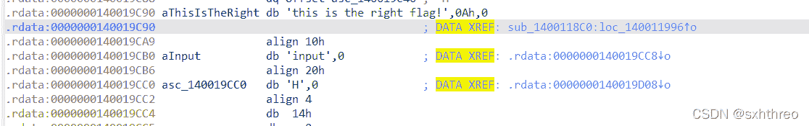
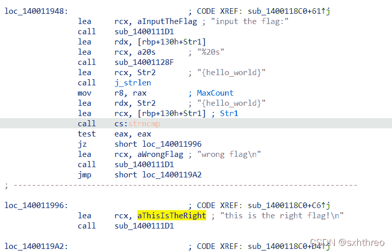
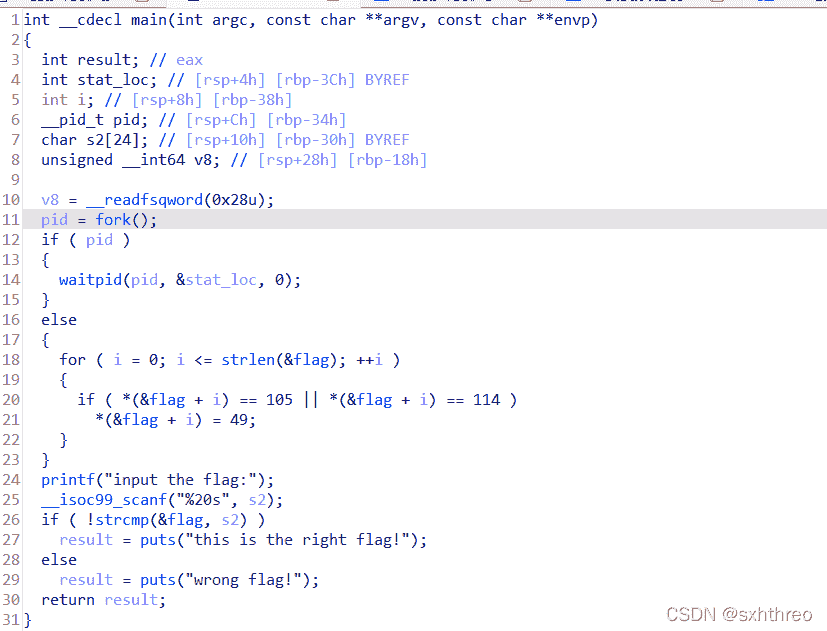
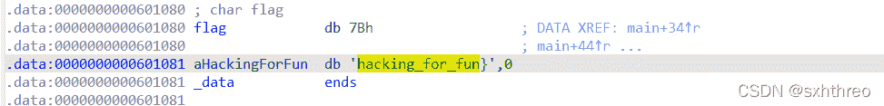
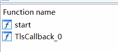
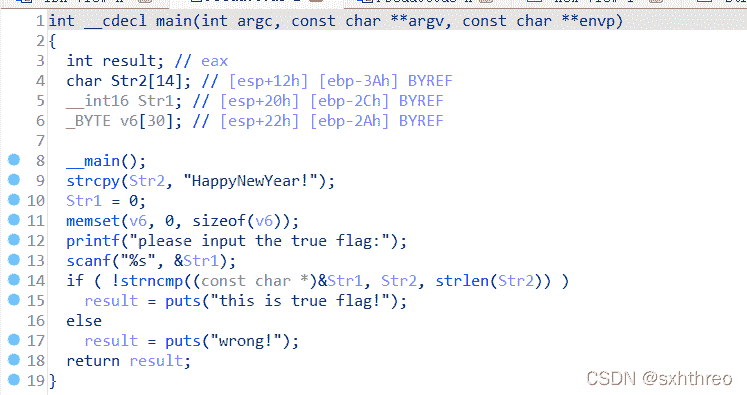

<!--yml
category: 未分类
date: 2022-04-26 14:49:03
-->

# BUUCTF Reverse前五题解题记录_sxhthreo的博客-CSDN博客_buuctf reverse

> 来源：[https://blog.csdn.net/sxH3O/article/details/123220088](https://blog.csdn.net/sxH3O/article/details/123220088)

# 第一题：easyre

直接找到字符串即可。

# 第二题：reverse1

这题进入ida找不到main函数，但可以通过shift+F12（我的电脑还要同时按住Fn），查找此程序的string集。如图：

通过该图可以看到this is the right flag!字符串，点进去如下图所示：

DATA XREF是交叉引用的意思，我点入DATA XREF: sub_1400118C0:loc_140011996↑o，找到了程序的“主函数”，如图：

 在这里找到了flag，即“{hello_world}”。

# 第三题：reverse2

 这题比较简单，点击"flag"即可获取flag：

 然后将ascii为105（i）和114（r）进行代替操作（1）即可。

# 第四题：内涵的软件

简单，点shift+F5获取反汇编，直接获得flag。

#  第五题：新年快乐

本题有点难度。由于ida左边只有两个函数，考虑本程序加壳。

进入exeinfope分析，发现是upx壳，上网查找到了脱壳工具，它的操作是这样的：

打开工具文件夹，输入.\upx -d a.exe，成功脱壳。

脱壳之后就很好办了。进入main函数，F5反汇编，直接获取flag。

 2022.3.2 0:49