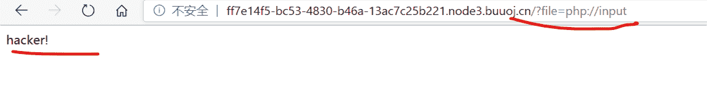
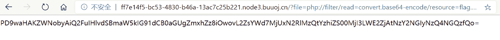

<!--yml
category: 未分类
date: 2022-04-26 14:47:14
-->

# BUUCTF [ACTF2020 新生赛]Include_是阿星呀的博客-CSDN博客

> 来源：[https://blog.csdn.net/qq_45237725/article/details/109334907](https://blog.csdn.net/qq_45237725/article/details/109334907)

# 题解

主要考查了利用php://filter伪协议进行文件包含
进入题目根据Tip进入正题，可以看到URL中存在文件包含（题目名也很直接）

首先考虑 "php://input"伪协议

发现题目过滤了php://input 伪协议

重新考虑之后使用 “php://filter"伪协议” 来进行包含。当它与包含函数结合时，php://filter流会被当作php文件执行。所以我们一般对其进行编码，阻止其不执行。从而导致任意文件读取。

构造Payload: ?file=php://filter/read=convert.base64-encode/resource=flag.php
这里需要注意的是使用php://filter伪协议进行文件包含时，需要加上read=convert.base64-encode来对文件内容进行编码
发送请求得到base64编码后的flag.php文件源码:

解码之，得到Flag

```
<?php
echo "Can you find out the flag?";
//flag{2517de34-c8be-4227-a6f0-7664b27484d3} 
```

参考文章：
[https://www.cnblogs.com/yesec/p/12379909.html](https://www.cnblogs.com/yesec/p/12379909.html)

# 课外拓展

[文件包含-伪协议](https://blog.csdn.net/Wu000999/article/details/101925271)
[CTF中伪协议总结](https://blog.csdn.net/qiuyeyijian/article/details/102993218#phpinput_28)