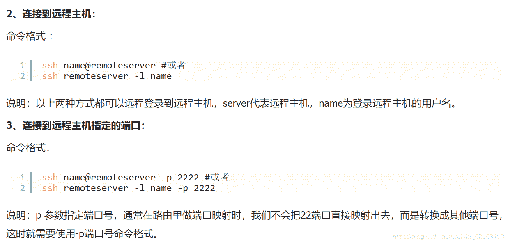
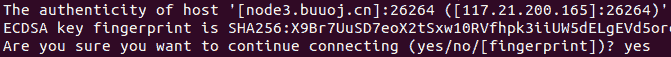
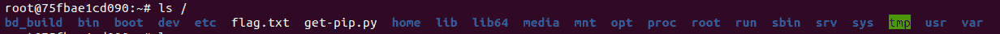
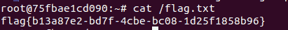

<!--yml
category: 未分类
date: 2022-04-26 14:34:35
-->

# BUUCTF-basic——Linux labs题解wp_东方黑手的博客-CSDN博客

> 来源：[https://blog.csdn.net/weixin_52653109/article/details/116381659](https://blog.csdn.net/weixin_52653109/article/details/116381659)

basic算是一类入门网安操作测试。
这题主要考察Linux的——ssh（远程登入）指令

ssh命令指导参考链接：https://www.jb51.net/article/115461.htm

根据格式，结合题目给的端口

登入后，这个填**yes**

然后就最基本的操作指令了。

```
ls / 
```



```
cat /flag.txt 
```


Linux还是要好好学