<!--yml
category: 未分类
date: 2022-04-26 14:33:33
-->

# BUUCTF crackMe 题解___lifanxin的博客-CSDN博客_buuctf crackme

> 来源：[https://blog.csdn.net/A951860555/article/details/118667242](https://blog.csdn.net/A951860555/article/details/118667242)

# 程序信息

  这道题目来自于哪个实际比赛，我没有去找，我个人是从buuoj上刷到的，位于re部分第二页，题目只有一分，做出来的人也比较多，看起来应该是个简单的题目。
  之所以要写这个wp，是对题目的答案存在一些疑问，网上也有很多wp，我都看了一下，大致都出自于同一个人的手笔O(∩_∩)O。我个人感觉网上的wp分析过程都漏了一步，虽然这样得出的flag可以通过buuoj，但是这是个crack题目，网上wp的答案无法通过程序本身，我个人分析得出的答案是可以通过程序本身的。

# 题目分析

## main函数分析

  下面开始分析整个题目，这里我就不改题目中的函数名了，直接使用IDA的命名。首先先说下这道题目的用意，用户名已知`welcomebeijing`，然后根据程序求解正确的用户密码，最后md5就是flag，所以密码求解是否正确是可以用程序本身来验证的。另外这道题目难点主要在两个，第一是代码略长，处理过程略显复杂；其二是用了很多反调试的代码，调试时需要处理一下。
  如下图所示，最开始main函数中使用了两个do-while循环，`v0 = sub_4024BE(); fflush(v0);`应该是用于刷新缓冲区的，对题目不影响；`sub_401000`函数检查了输入是否为字母或者数字，这里正常输入即可，然后用于存储的变量名我改了下，方便后面查看。

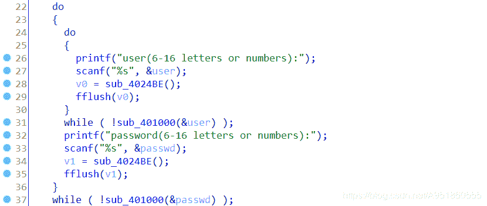
  如下图所示，是main函数中接下来的步骤，我们先看两个if语句，满足的话则break，所以`sub_401830`是关键性的处理函数。然后还有一个就是`v3`的值，该值由函数`loc_4011A0`返回，下面我们先看下这个函数。

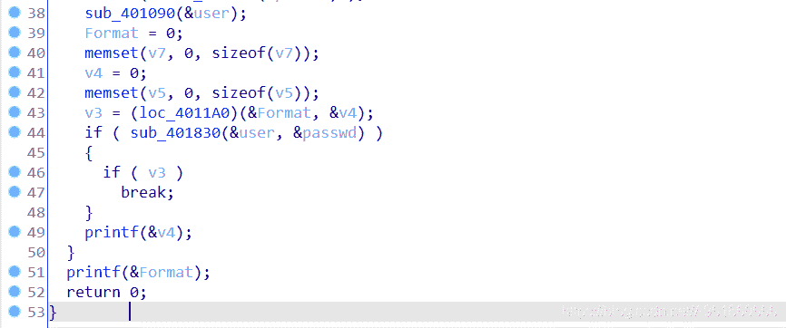
  该函数点进去后，本身无法反编译，问题出在下面这个地方，`jbe`和`aaa`那行，在IDA中找到对应的十六进制直接修改为nop指令，然后选中所有左侧标红的地址，快捷键p重新定义为一个函数，此时再执行反编译操作即可。


  反编译后的代码如下所示，可以看到还是很难看，是一系列的赋值操作，这里只截了一部分，前面是`Congratulations:)`，后面是`try again`，还需要注意这里直接将result赋值为1，并且返回。所以前面的代码也就好理解了，`v3`永远都为1，`printf(&v4)`打印try again，`printf(&Format)`打印Congratulations:)。

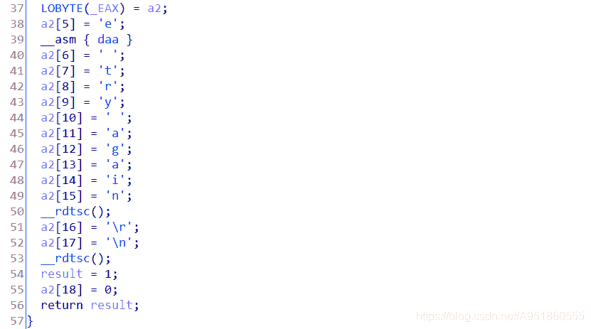
  接着看下`sub_401090`这个函数，就是将用户名执行了一系列操作赋值给了`byte_416050`这个数组，具体细节就不分析，后面可以通过动态调试得出。

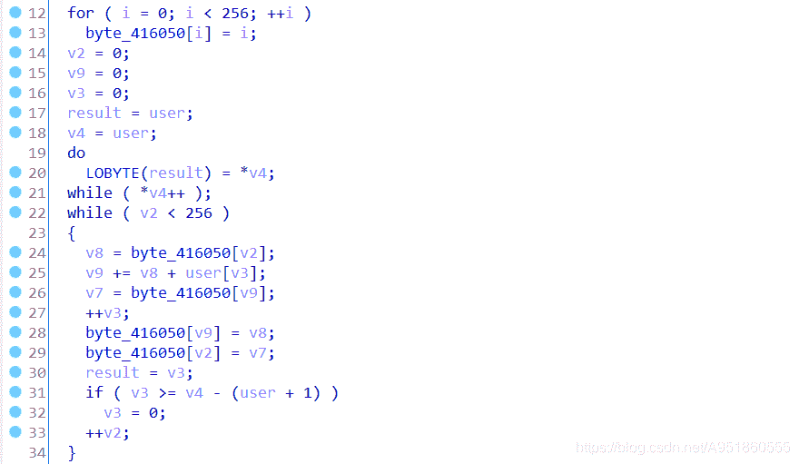

## sub_401830关键函数分析

  接下来看看这个关键函数，首先是第一个while循环，解释放在代码注释中。举例来说，这段代码的意思就是，假设输入密码为`39d09ffa4cfcc4cc`，然后两位一组切割，`0x39 0xd0 0x9f 0xfa 0x4c 0xfc 0xc4 0xcc`存放到v14中，后面while循环中有个异或运算就是用这个两位一组切割后的密码去参与运算的。

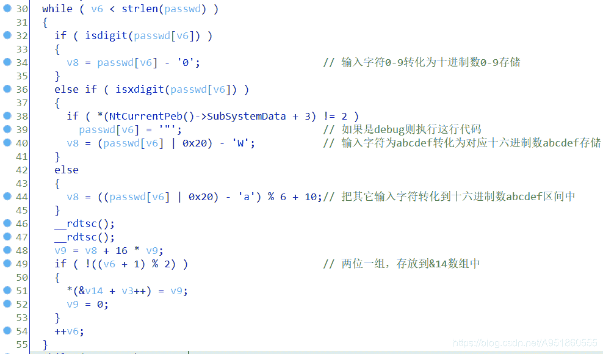
  如下截图所示，是关键函数的第二个while循环，这里我直接给出结论，先看注释，然后逆着来分析。首先return必须返回true，即`v13 == 0xAB94`要成立，v13的成立和v16-2相关，所以结合v13可以从`sub_401470`反推出v16-2；然后结合用户名user从`sub_401710`再反推出v16，最后通过动态调试得出`byte_416050`再与v16异或即可得到两位一组分割过后的密码，注意这里循环次数为8，代表分组后为8位即实际密码为16个字符。原密码的话就是两位分组分割后的密码拼接起来即可。

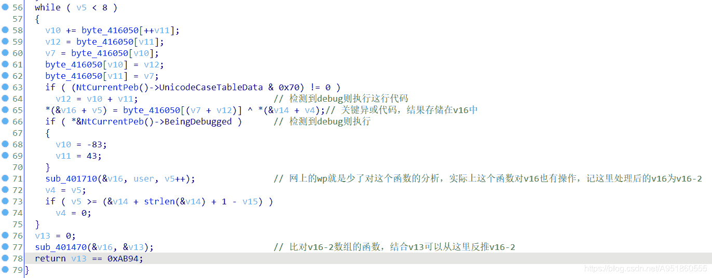
  先看sub_401470，如下截图所示，只截了一部分，`a2`就是v16-2，让每个if判断中的a2等于对应字母就可得到`v13 == 0xAB94`，这里还有一行反调试，没有截图出来，大家自行判别就好，最后解出来v16-2为`dbappsec`。

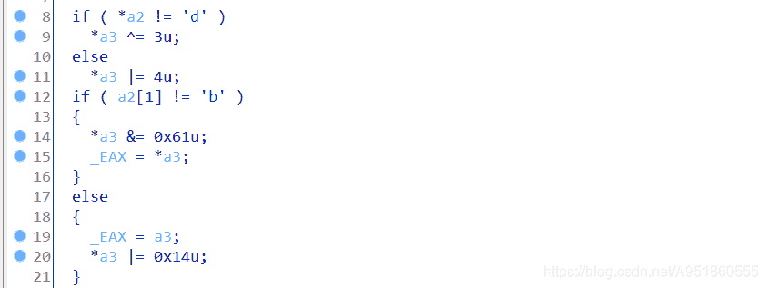
  我们再看`sub_401710`函数，如下截图所示，最开始的if判断中`StartupInfo.dwX`等等也是反调试代码，如果处于调试的话就会执行这里面的代码。然后我们注意一下`v4`和`count`，v4是user用户名的长度，count是两位一组后的密码分组个数计数，v4是永远大于count的，所以这里只会执行else if中的语句，也就是将v16与用户名进行异或。因此我们将v16-2与用户名进行异或即可得到v16。

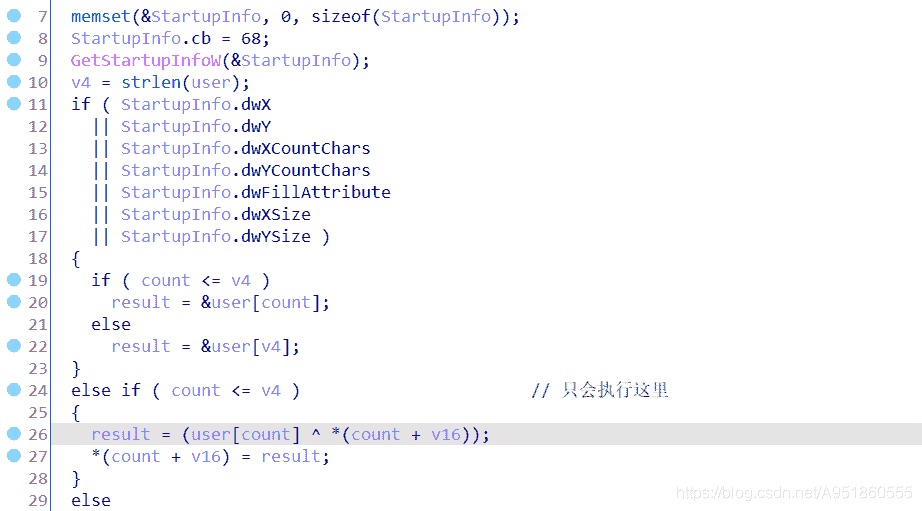

## 动态调试byte_416050

  最后就剩`byte_416050`数组了，动态调试的话需要去除反调试代码的干扰，举例如下，如下截图所示，将`jz`指令改为`jmp`即可，jmp对应的操作码为`0xEB`。

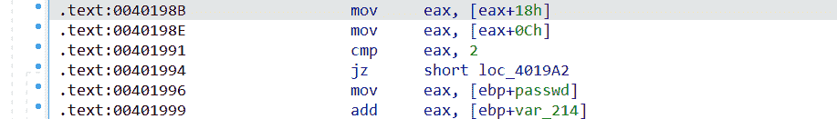
  如下截图所示，第一个图展示了应该打断点的地方，第二个图标红的两个地方是关键代码，我们可以看到byte数组的值是放在了ecx中来进行异或的，所以调试的时候观察ecx就行，最终得出的结果是`0x2a, 0xd7, 0x92, 0xe9, 0x53, 0xe2, 0xc4, 0xcd`。

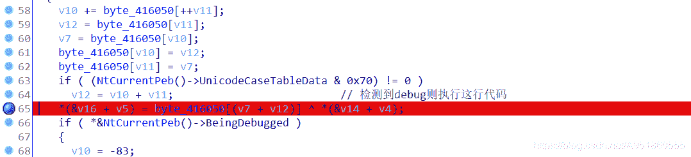
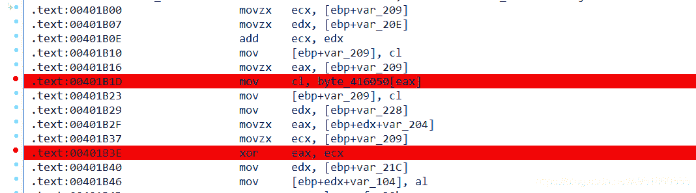

# 求解

  下面给出求解脚本：

```
v16_2 = "dbappsec"
user = "welcomebeijing"

v16 = []
for i in range(8):
    temp = ord(v16_2[i])^ord(user[i])
    v16.append(temp)
print(v16)

passwd = ""
byte_416050 = [0x2a, 0xd7, 0x92, 0xe9, 0x53, 0xe2, 0xc4, 0xcd]
for i in range(8):

    passwd += hex(byte_416050[i]^v16[i])[2:]

print(passwd) 
```

  这里就和网上的答案，包括buuoj的flag不一样了，如下截图所示，用我这个脚本算出的密码去跑程序是没有问题，但md5后提交flag是不行的。网上的答案是`4eb5f3992391a1ae`，我脚本中也给出了，就是少了一个函数的分析，直接用的v16-2来进行运算的，答案肯定是通不过程序的，但md5后的flag是可以提交到buuoj上的😕，不知道是不是buuoj搞错了。

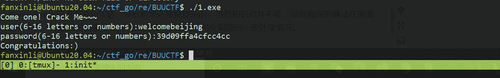

# 总结

  这道题说句实话，分析起来还是挺复杂的，当然知识点并不难，没有高深的算法在里面进行干扰，做题的时候慢慢分析吧，积累一下反调试和反编译的一些处理情况。

不忘初心，砥砺前行！