<!--yml
category: 未分类
date: 2022-04-26 14:42:20
-->

# BUUCTF misc 解题记录 二（超级详细）_Vayn3的博客-CSDN博客

> 来源：[https://blog.csdn.net/qq_51090016/article/details/115712647](https://blog.csdn.net/qq_51090016/article/details/115712647)

## [SUCTF2018]followme（kali下搜索整个文件夹）

先导出http
再放到kali

kali下输入grep -r ‘CTF’ ./文件名/

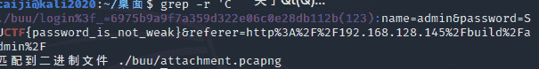

## 蜘蛛侠呀（tshark提取数据）

所有的icmp包后面都跟了一串数据，使用tshark把这些全部提取出来

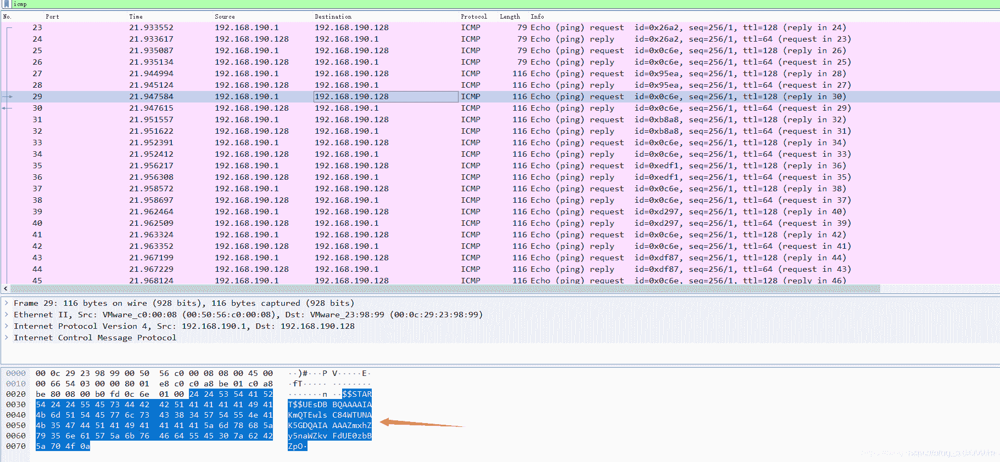

```
tshark -r out.pcap -T fields -e data > data.txt 
```

得到data.txt，发现有重复，用脚本去重
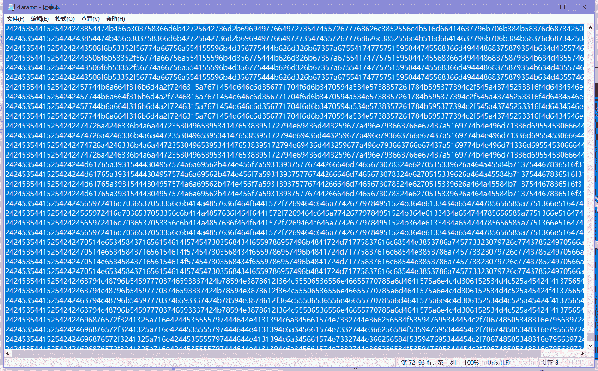

```
with open('data.txt', 'r') as file:
    res_list = []
    lines = file.readlines()
    print('[+]去重之前一共{0}行'.format(len(lines)))
    print('[+]开始去重，请稍等.....')
    for i in lines:
        if i not in res_list:
            res_list.append(i)
    print('[+]去重后一共{0}行'.format(len(res_list)))
    print(res_list)

with open('data1.txt', 'w') as new_file:
    for j in res_list:
        new_file.write(j) 
```

再将十六进制数据转为字符

```
import binascii

with open('data1.txt','r') as file:
    with open('data2.txt','wb') as data:
        for i in file.readlines():
            data.write(binascii.unhexlify(i[:-1])) 
```

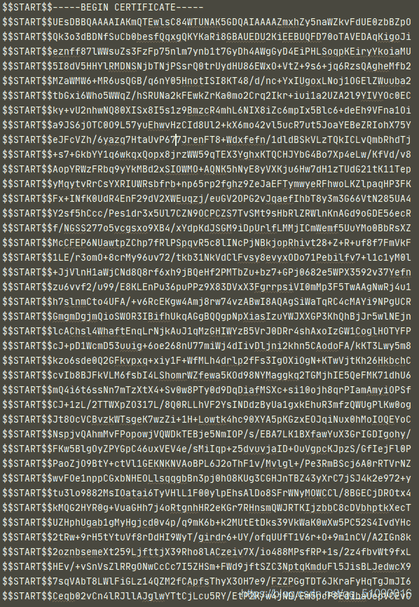
去除首尾两行，将base64解码以字节流形式写成zip

```
import base64

with open('data3.txt','rb') as file:
    with open('res.zip','wb') as new_file:
        new_file.write(base64.b64decode(file.read())) 
```

终于得到gif：
这一系列操作实在看的我头疼

然后是时间隐写？？Ubuntu下使用identify
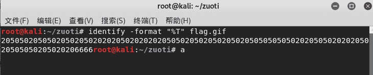
20替换为0
50替换为1

011011010100010000110101010111110011000101110100

```
>>>int('011011010100010000110101010111110011000101110100',2)
120139720634740 
```

```
>>> hex(120139720634740)
'0x6d44355f3174' 
```

```
>>> binascii.unhexlify('6d44355f3174')
b'mD5_1t' 
```

```
>>> hashlib.md5('mD5_1t'.encode('utf-8')).hexdigest()
'f0f1003afe4ae8ce4aa8e8487a8ab3b6' 
```

flag{f0f1003afe4ae8ce4aa8e8487a8ab3b6}

## [RCTF2019]draw（logo解释器）

将那些字符复制到这个网站：https://www.calormen.com/jslogo/

如图：

## **[MRCTF2020]不眠之夜**（montage和gaps）

拼图，把最开始的文件和中间显示不了的文件去掉，120个，每张都是200 x 100，应该长：10张图片，宽：12张图片，那么拼起来的总图就应该是长：2000 x 宽：1200

放到kali里，先用montage：`montage *jpg -tile 10x12 -geometry 200x100+0+0 flag.jpg`

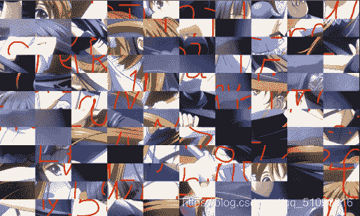
再用gaps ：

```
gaps --image=flag.jpg --generations=40 --population=120 --size=100 
```

为什么我费劲九牛二虎之力安装完还出错了？？真的给我弄吐了，还百度不到原因

## [安洵杯 2019]easy misc（盲水印）

看压缩包：

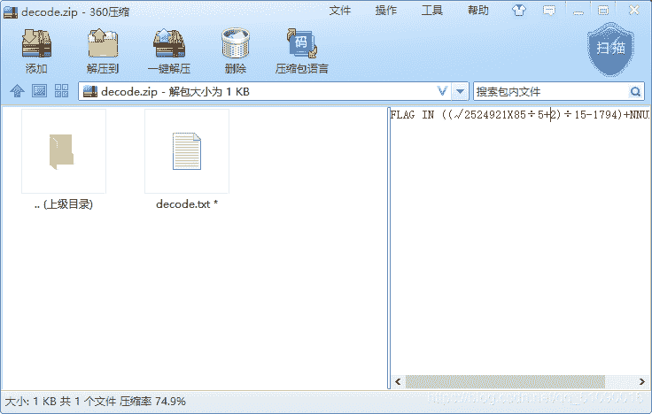

```
FLAG IN ((√2524921X85÷5+2)÷15-1794)+NNULLULL 
```

前面计算得7，后面猜测是掩码


得到密码，打开解压
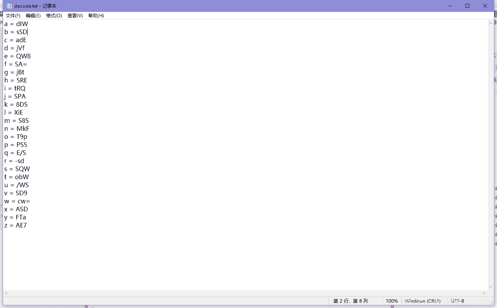
这又是啥。。果然做题全靠百度，原来是字频隐写
按照wp的做，先看png

binwalkt一下
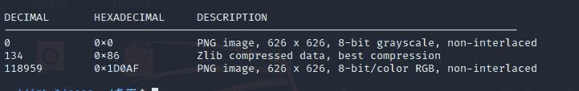
还有个png，foremost一下
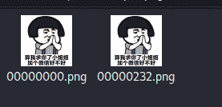
两个一样的图片？想到盲水印，安装脚本地址：
https://github.com/chishaxie/BlindWaterMark

输入：

```
python2 bwm.py decode 00000000.png 00000232.png output.png 
```

得到
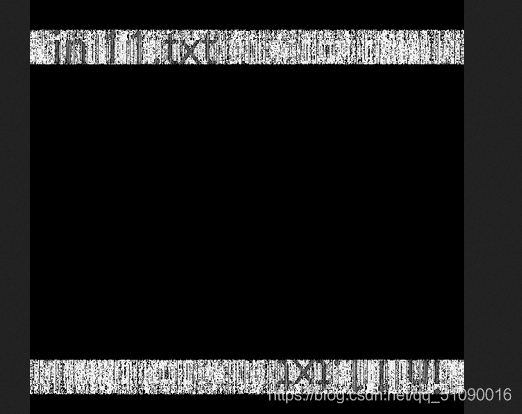
提示in 11.txt（所以费了这么大力气就这）

hint中提示取前16位，利用python脚本获取11.txt中前16高频字母

```
import re

file = open('C:/Users/Fiona/Desktop/11.txt')
line = file.readlines()
file.seek(0,0)
file.close()

result = {}
for i in range(97,123):
	count = 0
	for j in line:
		find_line = re.findall(chr(i),j)
		count += len(find_line)
	result[chr(i)] = count
res = sorted(result.items(),key=lambda item:item[1],reverse=True)

num = 1
for x in res:
		print('频数第{0}: '.format(num),x)
		num += 1 
```

即：etaonrhsidluygw
对照decode.txt里面的数得到一串base64的编码：
QW8obWdIWT9pMkFSQWtRQjVfXiE/WSFTajBtcw==

解密后
Ao(mgHY?i2ARAkQB5_^!?Y!Sj0ms
这是base85

得到
flag{have_a_good_day1}

## [MRCTF2020]Hello_ misc

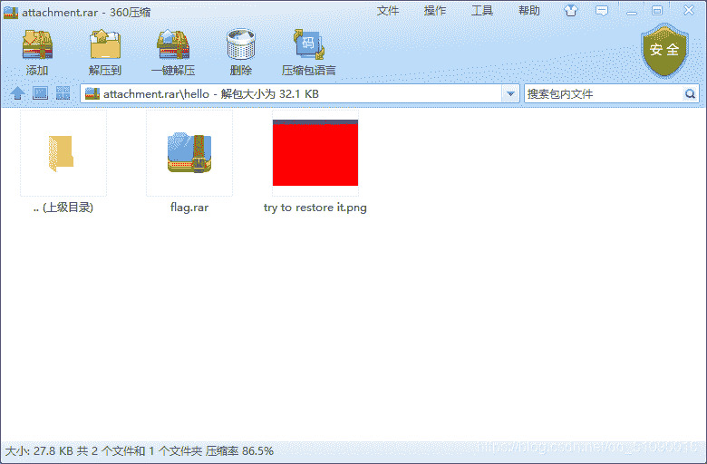

正常先把图片用010打开看看：
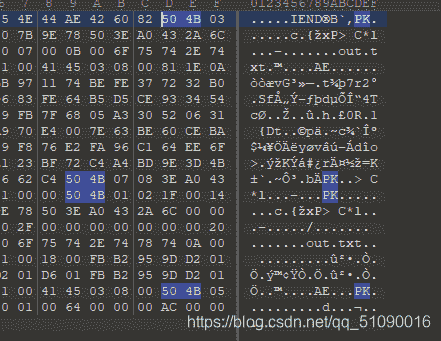
发现有压缩包的痕迹，改成zip看看

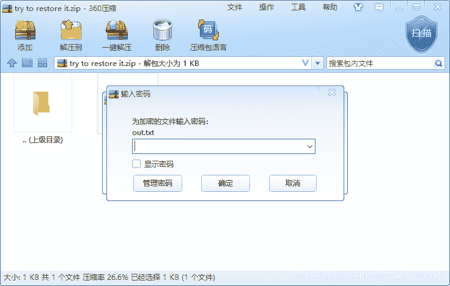
需要密码，从哪弄？应该是原本那张图片，那个颜色就让我怀疑是lsb隐写
这题和之前的不一样，在red通道发现图片（难怪图片是红色）
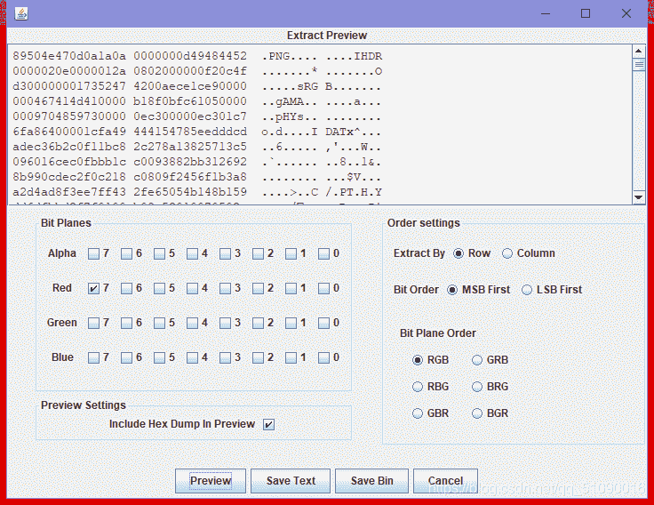

另存
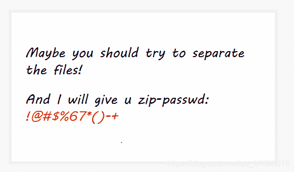
得到解压密码，解压
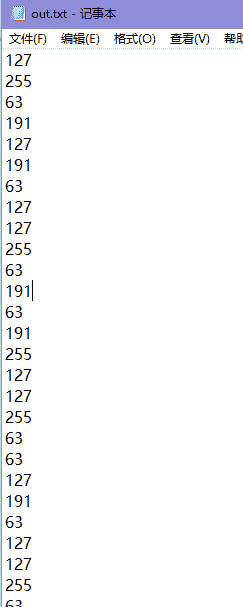
几个重复的数字，之前好像碰到过，又有点忘了，刚好复习一下

用脚本转换二进制提取前两字节，转为ASCII

得到提示rar-passwd:0ac1fe6b77be5dbe

```
with open('out.txt') as a_file:
    content = [x.strip() for x in a_file.readlines()]
bins = []
for i in content:
    bins.append(bin(int(i))[2:].zfill(8)[:2])
stringBins = ''.join(bins)
num = 0
flag = ''
for i in range(int(len(stringBins)/8)):
    flag+=chr(int(stringBins[num:num+8],2))
    num+=8

print(flag) 
```

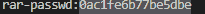
得到zip，解压后猜测是docx
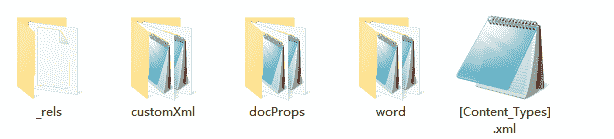
改后缀
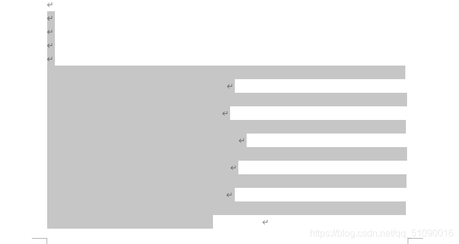
好像藏着什么，咋看不到，把字体改成黑色
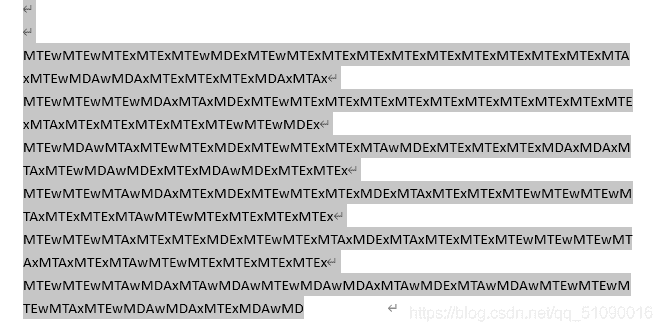
这又是什么？？果然做题全靠百度。。使用notepad解码每一行base64编码，如图
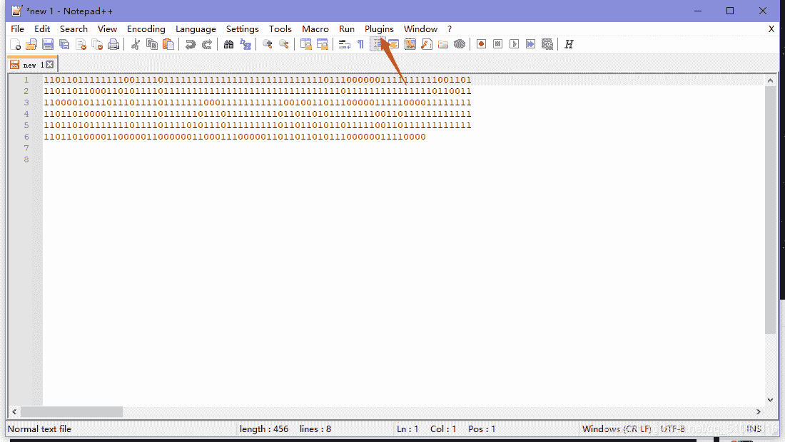
观察0的形状。。。脑洞太大了：He1Lo_mi5c~

## [BSidesSF2019]zippy（密码解压）

pca文件，tcp追踪流
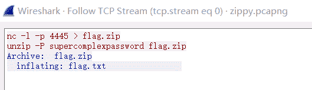

这是啥。。看wp吧

应该是正在发送一个加了密的zip文件，找到这个加密文件的数据流

以原始数据保存为zip文件
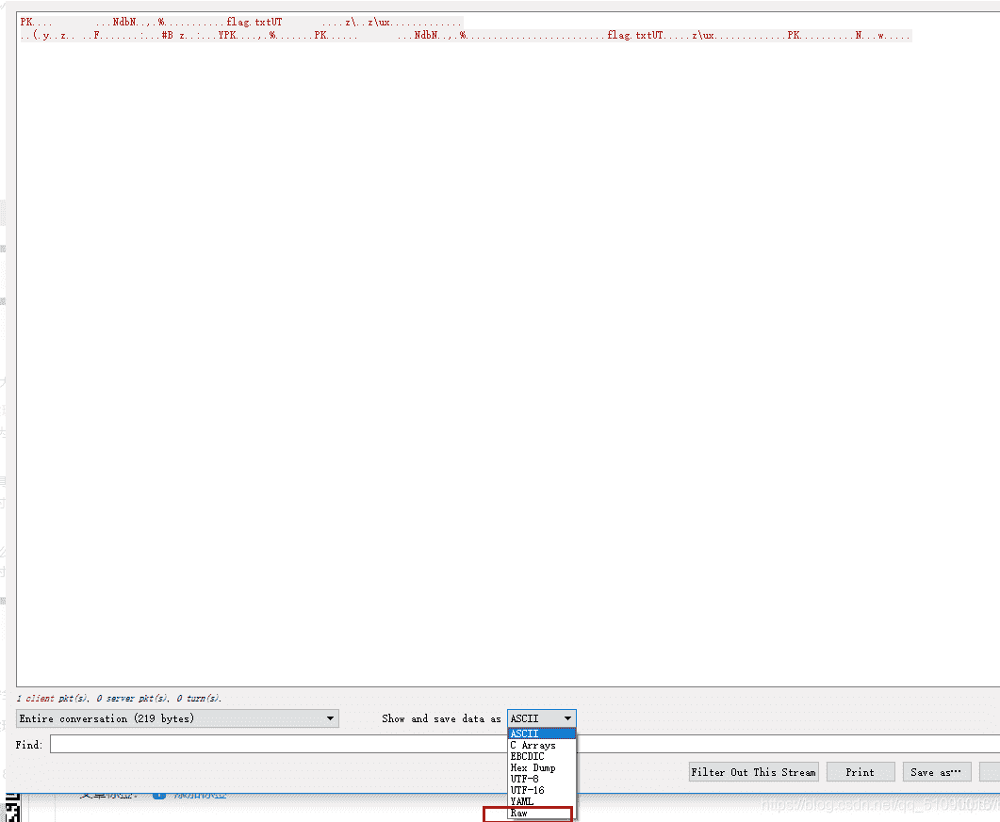
使用密码解压

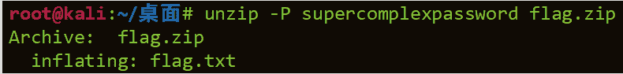

## [ACTF新生赛2020]明文攻击(隐藏文件内容在010)

文件里有个压缩包和图片，压缩包里只有txt文件，根据提示明文攻击，估计是要在图片里找到一个txt文件。

图片放到010发现有txt
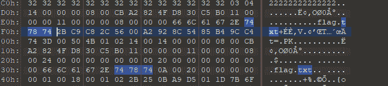

改成zip后缀失败。。那该咋办，看这后面的样子，像是一个压缩包，但是却没有文件头，试一下复制下来加个文件头504b：
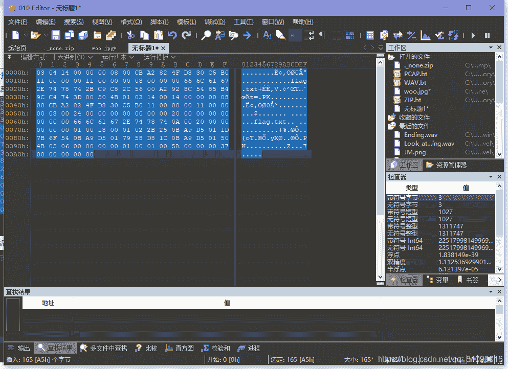
果然得到了
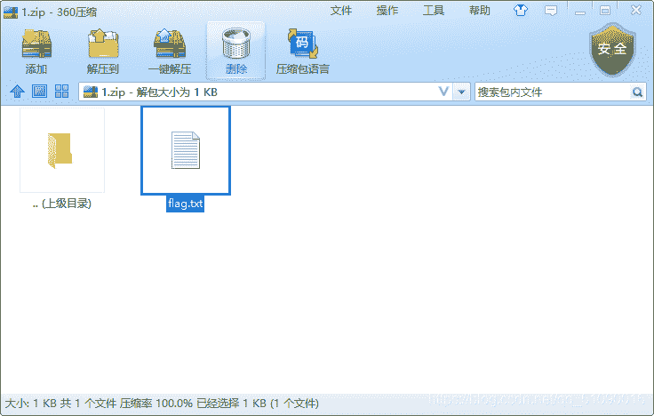
明文攻击

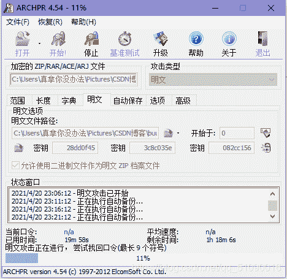

## 粽子的来历（脑洞太大 ff修复 行间距问题）

用word发现打不开，用010打开

发现一段小段数字被F包围，尝试将其全部改为F，保存。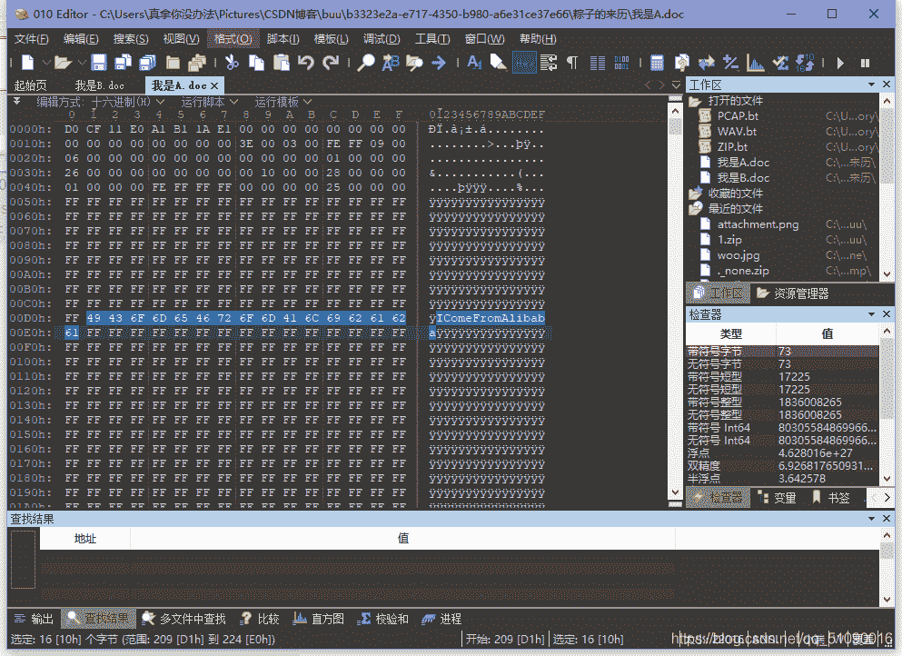
然后就能打开了
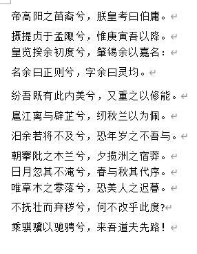
仔细看，发现四个文档间距不同，想到MD5加密，设1.5倍为1,1倍为0，将每行的值连在一起，进行MD5解密（这也行？）
最后发现c是对的
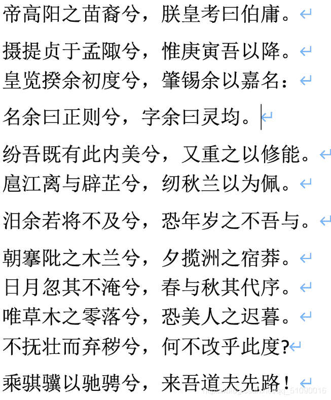

```
100100100001 
```

md5 d473ee3def34bd022f8e5233036b3345为正确flag

## 派大星的烦恼（倒过来的二进制）

首先放到010里搜索字节22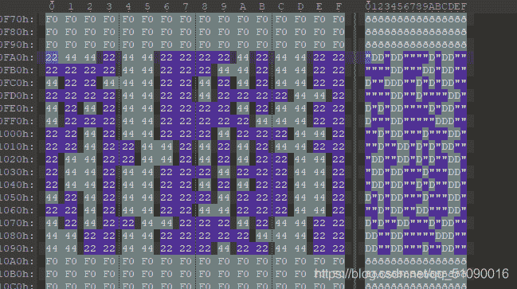
根据提示
0x22，0x44 想到二进制

把右边那一段：

```
"DD"DD""""D"DD""""""DD"""DD"DD""D""DDD""D"D"DD""""""DD""D""""DD"D"D"DD""""D"DD""D"""DD"""""DDD""""D"DD"""D"""DD"""D""DD"D"D"DD"""DD""DD"D"D""DD""DD"DD"""D"""DD""DD"DD""D"D""DD"D"D"DD"""D"""DD"""D"DD""DD"""DD"D"D""DD"""D"DD""DD""DD"""""DDD""DD""DD"""D""DD"" 
```

转换成二进制

01101100 00101100 00001100 01101100 10011100 10101100 00001100 10000110 10101100 00101100 10001100 00011100 00101100 01000110 00100110 10101100 01100110 10100110 01101100 01000110 01101100 10100110 10101100 01000110 00101100 11000110 10100110 00101100 11001100 00011100 11001100 01001100

尝试将其转化为字符
发现是一堆无意义的东西。。。

猜想是否 01 弄错 调换 01 尝试。。还是一堆无意义的东西

尝试倒序 将每八位倒转但整体位置不变

```
6406950a54184bd5fe6b6e5b4ce43832 
```

## [ACTF新生赛2020]music（对原文件进行异或）

先用audacit发现打不开，用010看看。。实在发现不了问题，看wp

**猜测对整个原文件进行了异或，使用010 Editor在工具->十六进制运算->二进制异或对整个文件内容进行异或**

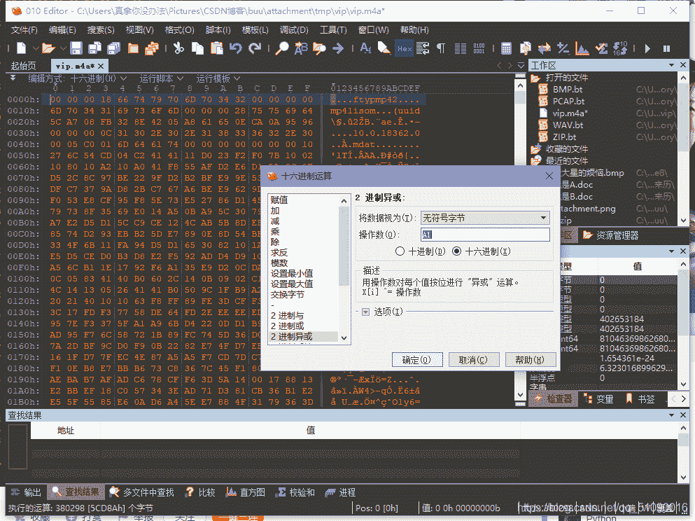
保存后仔细听就得到了

## [SCTF2019]电单车

放到audacity里面看看
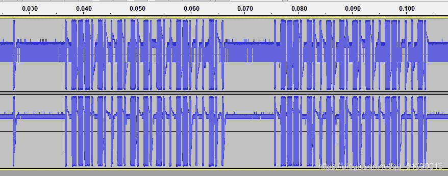

细的为0宽的为1
0 0111010010101010011000100 011101001010101001100010

根据wp

**钥匙信号(PT224X) = 同步引导码(8bit) + 地址位(20bit) + 数据位(4bit) + 停止码(1bit)**

地址位长度为20bit，后4位为数据位即**01110100101010100110**就是flag（咱也不懂，咱也不敢问）

## hashcat(爆破ppt文件)

010没看出啥，改成zip也没思路，binwalk一下

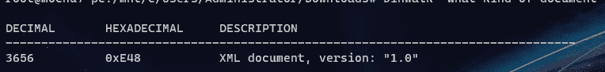
XML文件，添加文件后缀为ppt，有加密

使用Accent OFFICE Password Recovery对其爆破密码，老样子还是猜测密码为四位纯数字

得到密码9919

使用密码解开ppt文档，在倒数第二页有全选中标红即可（这个真想不到）

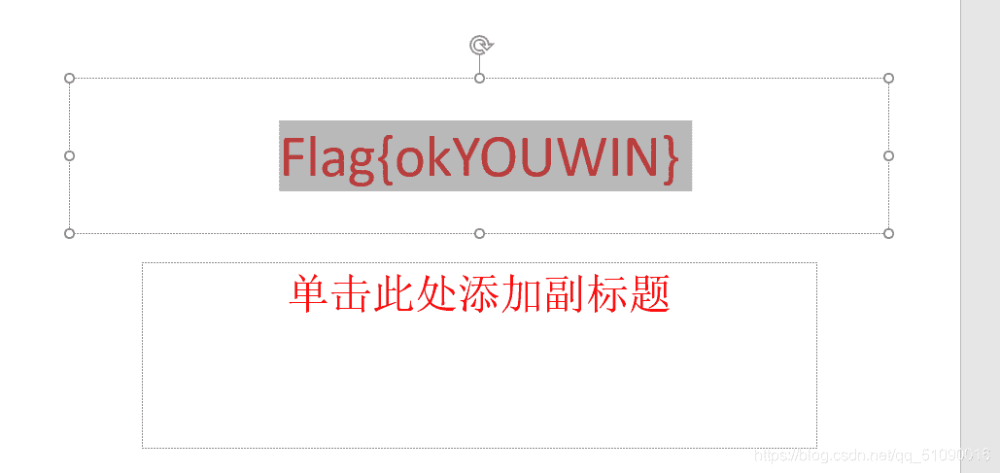

## [UTCTF2020]zero（零宽度字符隐写）

又是没遇见过的类型。。。
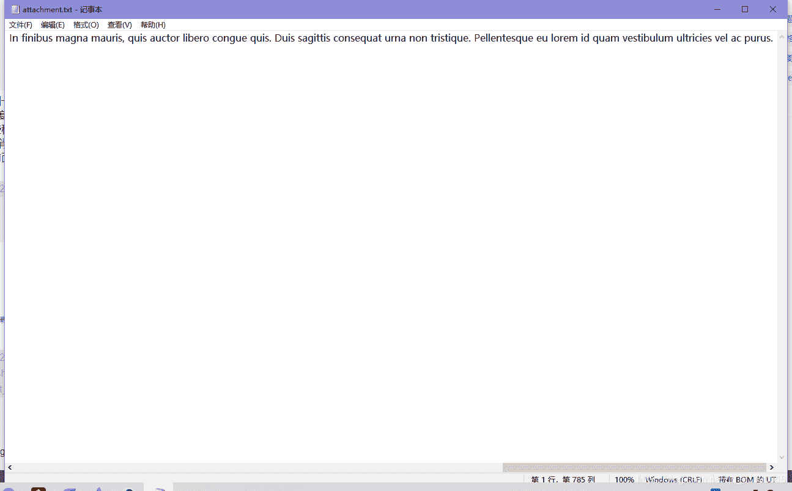
打开看了看没思路，只好看wp

先看看什么是零宽度字符隐写

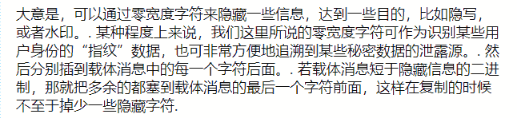
那该怎么分辨呢。。
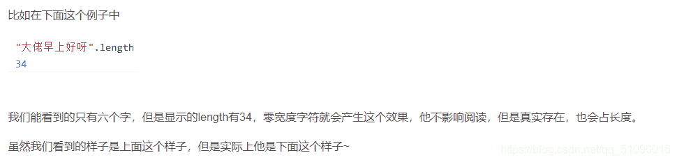

解密网址：https://330k.github.io/misc_tools/unicode_steganography.html

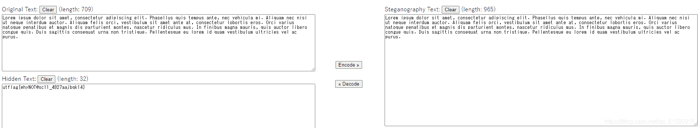

## [湖南省赛2019]Findme

五张图片，一个个看

第一张应该是宽高不对

```
import zlib
import struct
file = '1.png'
fr = open(file,'rb').read()
data = bytearray(fr[12:29])

crc32key = 0xC4ED3 

n = 4095 
for w in range(n): 
    width = bytearray(struct.pack('>i', w))
    for h in range(n): 
        height = bytearray(struct.pack('>i', h)) 
        for x in range(4): 
            data[x+4] = width[x] 
            data[x+8] = height[x] 

        crc32result = zlib.crc32(data) 
        if crc32result == crc32key: 
            print(width,height) 
            print(data) 
            newpic = bytearray(fr) 
            for x in range(4): 
                newpic[x+16] = width[x]
                newpic[x+20] = height[x] 
            fw = open(file+'.png','wb') 
            fw.write(newpic) 
            fw.close 
```

改完怎么是这样
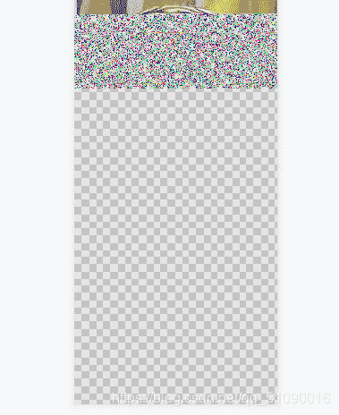
用010打开，发现错误
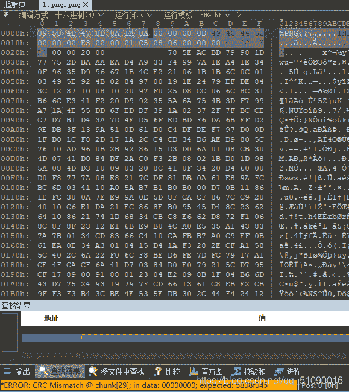
IDAT十六进制标识为：49 44 41 54，将两个chunk的IDAT在union CTYPE type的位置补上即可得到完整的图片

第二个chunk

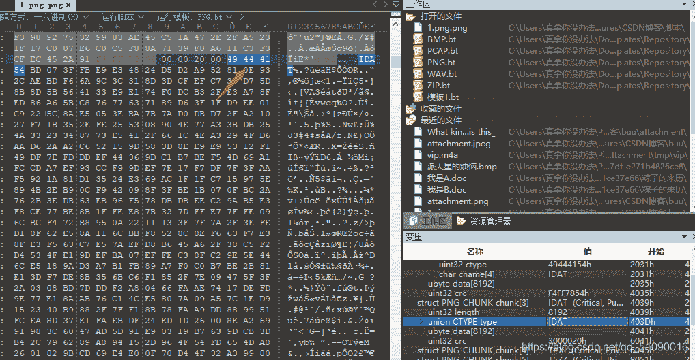
两个改完就可以正常打开了
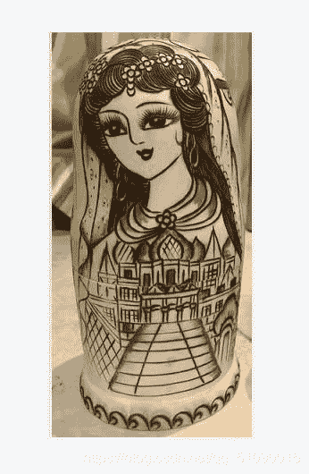

## 真的很杂

这题暂时先放着把。。

## voip（Wireshark抓取RTP包）

啥是voip？

**VoIP——基于IP的语音传输（英语：Voice over Internet Protocol，缩写为VoIP）是一种语音通话技术，经由网际协议（IP）来达成语音通话与多媒体会议，也就是经由互联网来进行通信。其他非正式的名称有IP电话（IP telephony）、互联网电话（Internet telephony）、宽带电话（broadband telephony）以及宽带电话服务（broadband phone service）**

直接主菜单点击 电话——>VoIP电话 就可以听到声音

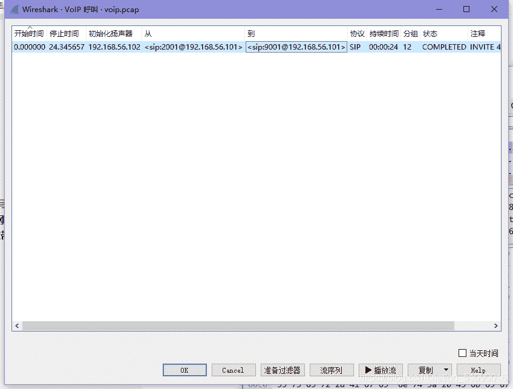

## [MRCTF2020]pyFlag(拼接出来一个文件)

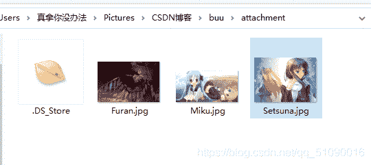

正常从图片入手，搜pk的时候在文件末尾发现了一个secret file，每个图片都有，提取出来组成一个zip

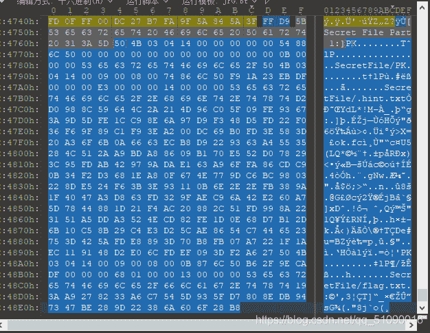
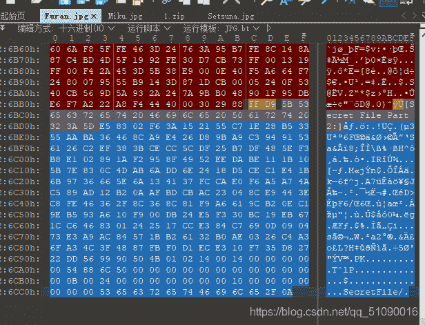
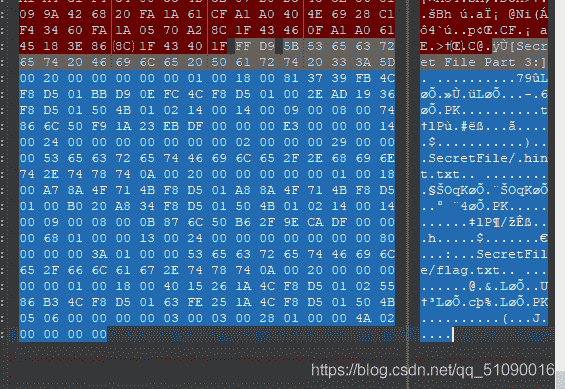
复制出来得到：
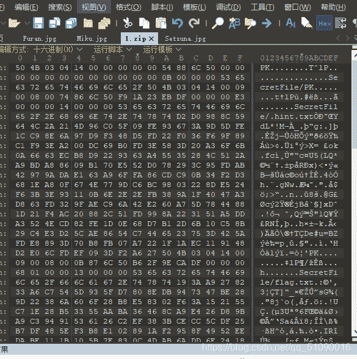
解压需要密码，爆破
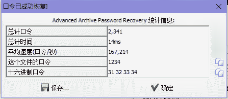
得到两个txt文件，看hint

再看flag.txt
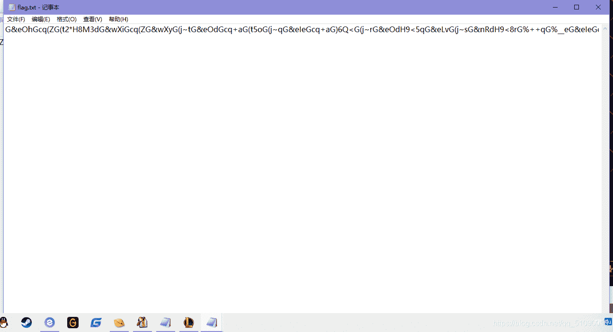
根据提示，会有的base解码：16，32，48，85（16进制转10进制）

用脚本：

```
 import base64
import re

def baseDec(text,type):
    if type == 1:
        return base64.b16decode(text)
    elif type == 2:
        return base64.b32decode(text)
    elif type == 3:
        return base64.b64decode(text)
    elif type == 4:
        return base64.b85decode(text)
    else:
        pass

def detect(text):
    try:
        if re.match("^[0-9A-F=]+$",text.decode()) is not None:
            return 1
    except:
        pass

    try:
        if re.match("^[A-Z2-7=]+$",text.decode()) is not None:
            return 2
    except:
        pass

    try:
        if re.match("^[A-Za-z0-9+/=]+$",text.decode()) is not None:
            return 3
    except:
        pass

    return 4

def autoDec(text):
    while True:
        if b"MRCTF{" in text:
            print("\n"+text.decode())
            break

        code = detect(text)
        text = baseDec(text,code)

with open("flag.txt",'rb') as f:
    flag = f.read()

autoDec(flag) 
```

就行了

## Business Planning Group（010搜索iend bpg图像格式）

010打开后搜索iend（PNG图像的图像结束数据（IEND））

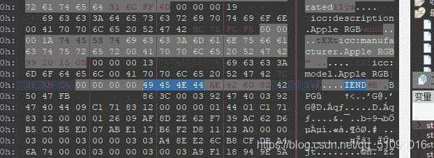
发现bpg

将这些数据另存出来为bpg文件，发现Windows的图像软件不能直接打开，网上能打开的工具

https://bellard.org/bpg/

base64解密即可

## [GWCTF2019]huyao（频域盲水印隐写）

看到两张一样的图片，想到盲水印，但这里用BlindWaterMark还不行，看wp知道是频域盲水印隐写，用脚本

```
 import cv2
import numpy as np
import random
import os
from argparse import ArgumentParser
ALPHA = 5

def build_parser():
    parser = ArgumentParser()
    parser.add_argument('--original', dest='ori', required=True)
    parser.add_argument('--image', dest='img', required=True)
    parser.add_argument('--result', dest='res', required=True)
    parser.add_argument('--alpha', dest='alpha', default=ALPHA)
    return parser

def main():
    parser = build_parser()
    options = parser.parse_args()
    ori = options.ori
    img = options.img
    res = options.res
    alpha = options.alpha
    if not os.path.isfile(ori):
        parser.error("original image %s does not exist." % ori)
    if not os.path.isfile(img):
        parser.error("image %s does not exist." % img)
    decode(ori, img, res, alpha)

def decode(ori_path, img_path, res_path, alpha):
    ori = cv2.imread(ori_path)
    img = cv2.imread(img_path)
    ori_f = np.fft.fft2(ori)
    img_f = np.fft.fft2(img)
    height, width = ori.shape[0], ori.shape[1]
    watermark = (ori_f - img_f) / alpha
    watermark = np.real(watermark)
    res = np.zeros(watermark.shape)
    random.seed(height + width)
    x = range(height / 2)
    y = range(width)
    random.shuffle(x)
    random.shuffle(y)
    for i in range(height / 2):
        for j in range(width):
            res[x[i]][y[j]] = watermark[i][j]
    cv2.imwrite(res_path, res, [int(cv2.IMWRITE_JPEG_QUALITY), 100])

if __name__ == '__main__':
    main() 
```

得到
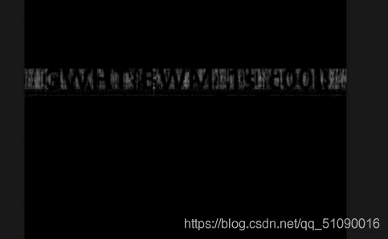

## [UTCTF2020]File Carving

## [GUET-CTF2019]soul sipse（音频隐写）

## [UTCTF2020]spectogram（奇怪的操作）

## [UTCTF2020]sstv(qsstv)

kali打开qsstv
Options->Configuration->Sound勾选From file
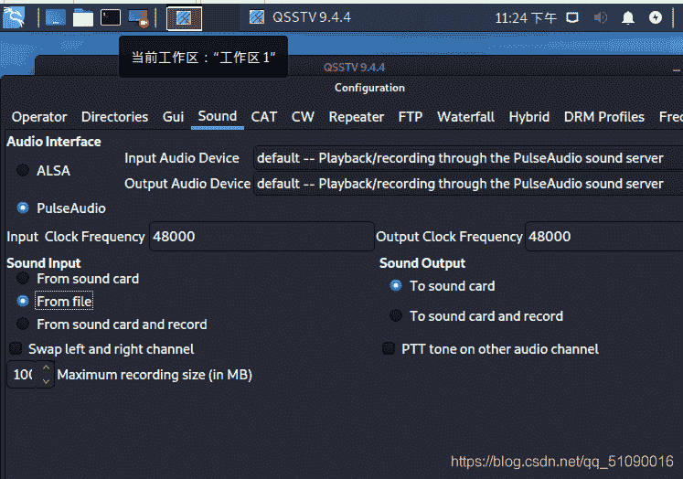

点这个
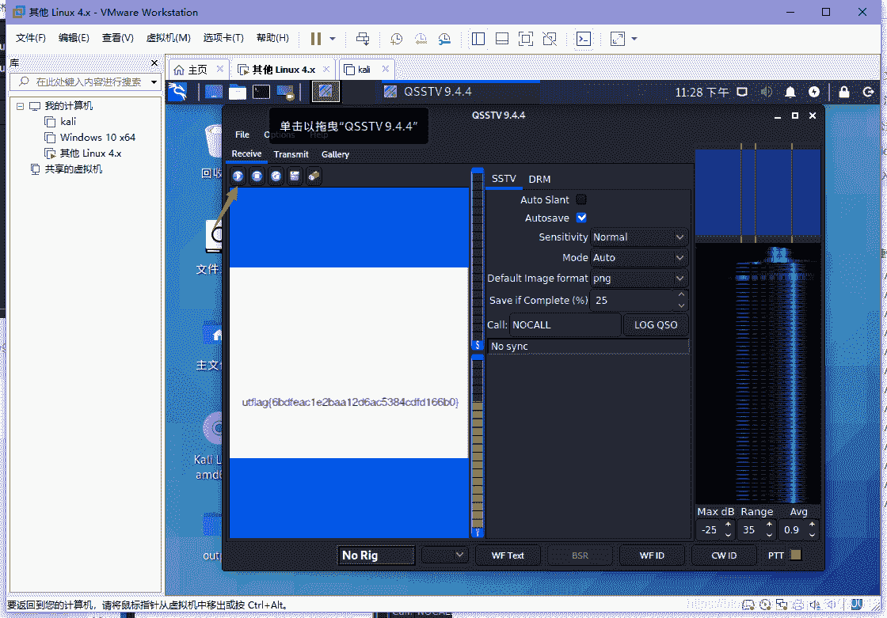

## 我爱Linux(Python Picke序列化内容)