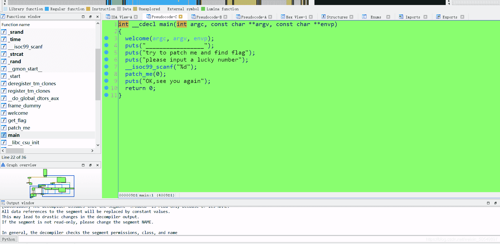
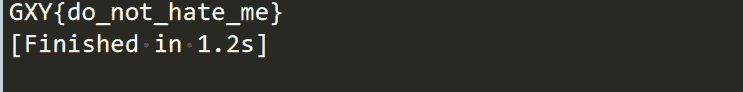
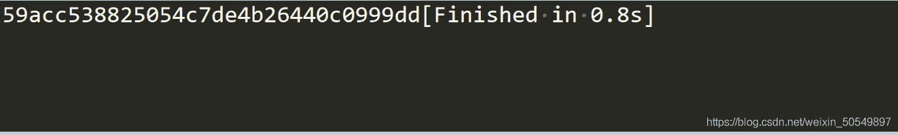
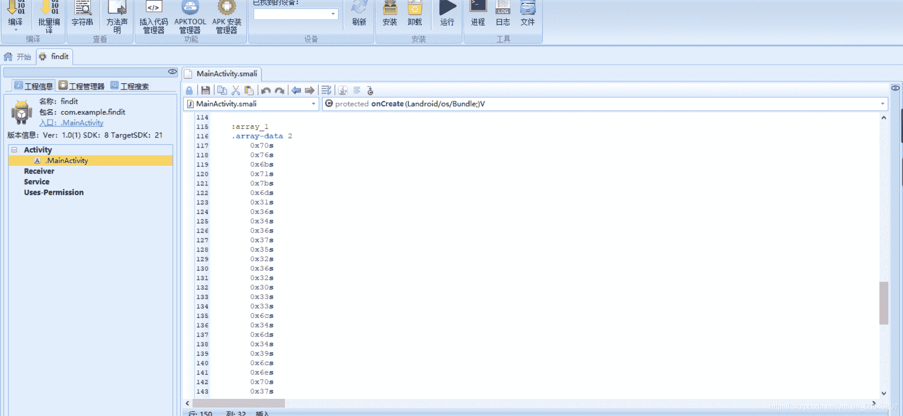
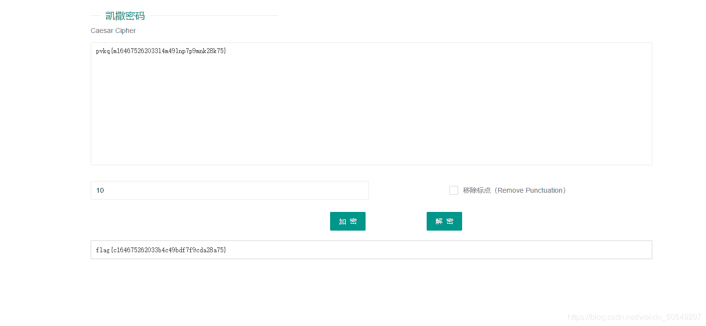

<!--yml
category: 未分类
date: 2022-04-26 14:38:12
-->

# BUUCTF reverse：[GXYCTF2019]luck_guy,findit,简单注册器题解_June_gjy的博客-CSDN博客

> 来源：[https://blog.csdn.net/weixin_50549897/article/details/113523762](https://blog.csdn.net/weixin_50549897/article/details/113523762)

# [GXYCTF2019]luck_guy，简单注册器，题解

由于作者水平有限，有不当之处或有更好方法请在评论区指出
题目地址[https://buuoj.cn/challenges](https://buuoj.cn/challenges)

## luck_guy

拖进IDA，查看main函数
找到patch_me(0)，里面可以看到，如果输入的是偶数就进入get_flag()函数。本题关键应该就在里面。打开后

```
unsigned __int64 get_flag()
{
  unsigned int v0; 
  int i; 
  int j; 
  __int64 s; 
  char v5; 
  unsigned __int64 v6; 

  v6 = __readfsqword(0x28u);
  v0 = time(0LL);
  srand(v0);
  for ( i = 0; i <= 4; ++i )
  {
    switch ( rand() % 200 )                     
    {
      case 1:
        puts("OK, it's flag:");
        memset(&s, 0, 0x28uLL);
        strcat((char *)&s, f1);
        strcat((char *)&s, &f2);                
        printf("%s", (const char *)&s);
        break;
      case 2:
        printf("Solar not like you");
        break;
      case 3:
        printf("Solar want a girlfriend");
        break;
      case 4:
        s = 0x7F666F6067756369LL;
        v5 = 0;
        strcat(&f2, (const char *)&s);          
        break;
      case 5:
        for ( j = 0; j <= 7; ++j )
        {
          if ( j % 2 == 1 )
            *(&f2 + j) -= 2;
          else
            --*(&f2 + j);
        }
        break;
      default:
        puts("emmm,you can't find flag 23333");
        break;
    }
  }
  return __readfsqword(0x28u) ^ v6;
} 
```

分析伪代码。从rand() % 200可以看出来，随机生成1-199之间的数字。表示这些书随机组合，flag就在其中。原来题目luck_guy是这个意思。显然，flag由f1和f2拼接而成。我们可以看到f1为GXY{do_not_
选择关键是找出f2是多少。经判断，switch里的顺序 是case4,case5,case1
写python脚本如下

```
flag = 'GXY{do_not_'
f2 = [0x7F, 0x66, 0x6F, 0x60, 0x67, 0x75, 0x63, 0x69]
s = ''
for i in range(8):
    if i % 2 == 1:
        c = chr(int(f2[i]) - 2)
    else:
        c = chr(int(f2[i]) - 1)
    flag += c
print(flag) 
```

发现输出为GXY{do_not_~dn^fsbg，显然不是想要的flag
查资料想到IDA反编译成C语言代码，s = 0x7F666F6067756369LL数据储存应该是小端储存。关于大小端储存详见[这篇文章](https://blog.csdn.net/iteye_21199/article/details/82205638?utm_medium=distribute.pc_relevant.none-task-blog-BlogCommendFromMachineLearnPai2-4.control&depth_1-utm_source=distribute.pc_relevant.none-task-blog-BlogCommendFromMachineLearnPai2-4.control)
所以应该反过来。

```
flag = 'GXY{do_not_'
f2 = [0x7F, 0x66, 0x6F, 0x60, 0x67, 0x75, 0x63, 0x69][::-1]
s = ''
for i in range(8):
    if i % 2 == 1:
        c = chr(int(f2[i]) - 2)
    else:
        c = chr(int(f2[i]) - 1)
    flag += c
print(flag) 
```



## 简单注册器

用 android killer打开，使用工具查看java源码（以下截取了一段）

```
 if (j == 1)
        {
          paramAnonymousView = "dd2940c04462b4dd7c450528835cca15".toCharArray();
          paramAnonymousView[2] = ((char)(paramAnonymousView[2] + paramAnonymousView[3] - 50));
          paramAnonymousView[4] = ((char)(paramAnonymousView[2] + paramAnonymousView[5] - 48));
          paramAnonymousView[30] = ((char)(paramAnonymousView[31] + paramAnonymousView[9] - 48));
          paramAnonymousView[14] = ((char)(paramAnonymousView[27] + paramAnonymousView[28] - 97));
          j = 0;
          for (;;)
          {
            if (j >= 16)
            {
              paramAnonymousView = String.valueOf(paramAnonymousView);
              localTextView.setText("flag{" + paramAnonymousView + "}");
              return;
            }
            int i = paramAnonymousView[(31 - j)];
            paramAnonymousView[(31 - j)] = paramAnonymousView[j];
            paramAnonymousView[j] = i;
            j += 1;
          }
        }
        localTextView.setText("输入注册码错误");
      }
    });
  } 
```

由此可见flag就是dd2940c04462b4dd7c450528835cca15经过了一系列加密后的结果，加密操作要进行16次
写脚本如下

```
s=['d','d','2','9','4','0','c','0','4','4','6','2','b','4','d','d','7','c','4','5','0','5','2','8','8','3','5','c','c','a','1','5']
s[2]=chr(ord(s[2])+ord(s[3])-50)
s[4]=chr(ord(s[2])+ord(s[5])-48)
s[30]=chr(ord(s[31])+ord(s[9])-48)
s[14]=chr(ord(s[27])+ord(s[28])-97)

for j in range(16):
	i=s[31-j]
	s[31-j]=s[j]
	s[j]=i

for j in s:
	print(j,end="") 
```

输出结果
**Get the flag!** flag{59acc538825054c7de4b26440c0999dd}

## findit

用android killer打开,看到一组16进制数字
转换为字符后为pvkq{m164675262033l4m49lnp7p9mnk28k75}
而前面pvkq可能是flag经过某种变换加密后的结果
疑似是flag进行了某种移位，猜测是凯撒密码
放在在线解密平台上一个个密钥试看看可以找到flag
当然也可以写脚本批量输出
解密python脚本如下，把每个偏移量都遍历一遍

```
 s='pvkq{m164675262033l4m49lnp7p9mnk28k75}'
str='abcdefghijklmnopqrstuvwxyz'

for i in range(1,27):
	print("Key=%d"%i,end=" ")
	for word in s:
		if word in str:
			n=str.find(word)
			word=str[n-i]

		print(word,end="")
	print('\n') 
```

输出的结果如下

```
 Key=1 oujp{l164675262033k4l49kmo7o9lmj28j75}

Key=2 ntio{k164675262033j4k49jln7n9kli28i75}

Key=3 mshn{j164675262033i4j49ikm7m9jkh28h75}

Key=4 lrgm{i164675262033h4i49hjl7l9ijg28g75}

Key=5 kqfl{h164675262033g4h49gik7k9hif28f75}

Key=6 jpek{g164675262033f4g49fhj7j9ghe28e75}

Key=7 iodj{f164675262033e4f49egi7i9fgd28d75}

Key=8 hnci{e164675262033d4e49dfh7h9efc28c75}

Key=9 gmbh{d164675262033c4d49ceg7g9deb28b75}

Key=10 flag{c164675262033b4c49bdf7f9cda28a75}

Key=11 ekzf{b164675262033a4b49ace7e9bcz28z75}

Key=12 djye{a164675262033z4a49zbd7d9aby28y75}

Key=13 cixd{z164675262033y4z49yac7c9zax28x75}

Key=14 bhwc{y164675262033x4y49xzb7b9yzw28w75}

Key=15 agvb{x164675262033w4x49wya7a9xyv28v75}

Key=16 zfua{w164675262033v4w49vxz7z9wxu28u75}

Key=17 yetz{v164675262033u4v49uwy7y9vwt28t75}

Key=18 xdsy{u164675262033t4u49tvx7x9uvs28s75}

Key=19 wcrx{t164675262033s4t49suw7w9tur28r75}

Key=20 vbqw{s164675262033r4s49rtv7v9stq28q75}

Key=21 uapv{r164675262033q4r49qsu7u9rsp28p75}

Key=22 tzou{q164675262033p4q49prt7t9qro28o75}

Key=23 synt{p164675262033o4p49oqs7s9pqn28n75}

Key=24 rxms{o164675262033n4o49npr7r9opm28m75}

Key=25 qwlr{n164675262033m4n49moq7q9nol28l75}

Key=26 pvkq{m164675262033l4m49lnp7p9mnk28k75}

[Finished in 0.6s] 
```

找到flag为flag{c164675262033b4c49bdf7f9cda28a75}密钥为10.

* * *

## 本人其它文章链接

[BUUCTF reverse：[GXYCTF2019]luck_guy,findit,简单注册器题解](https://blog.csdn.net/weixin_50549897/article/details/113523762)

[封神台靶场尤里的复仇I第一第二第五第六第七章解题思路(持续更新）](https://blog.csdn.net/weixin_50549897/article/details/112099578)

[ctfhub:网鼎杯第一场2018 reverse-beijing题解](https://blog.csdn.net/weixin_50549897/article/details/113743550)

[逆向工程入门：IDAwindows本地动态调试，linux远程动态调试及虚拟机配置](https://blog.csdn.net/weixin_50549897/article/details/113772269)

[逆向迷宫题总结（持续更新） 2020华南师大CTF新生赛maze，攻防世界新手区：NJUPT CTF 2017，BUUCTF：不一样的flag](https://blog.csdn.net/weixin_50549897/article/details/110633105)