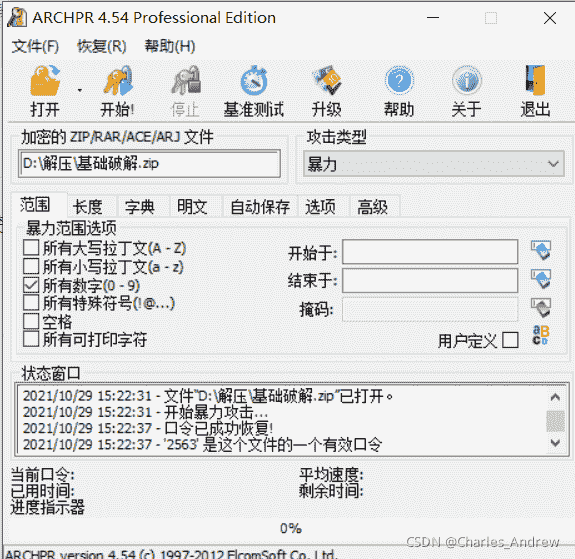
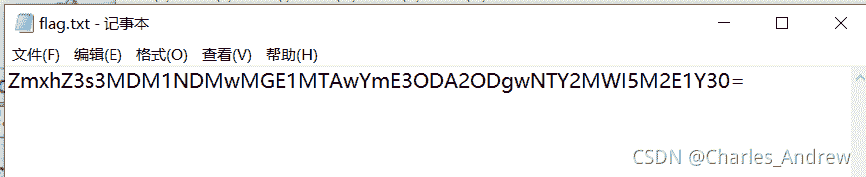
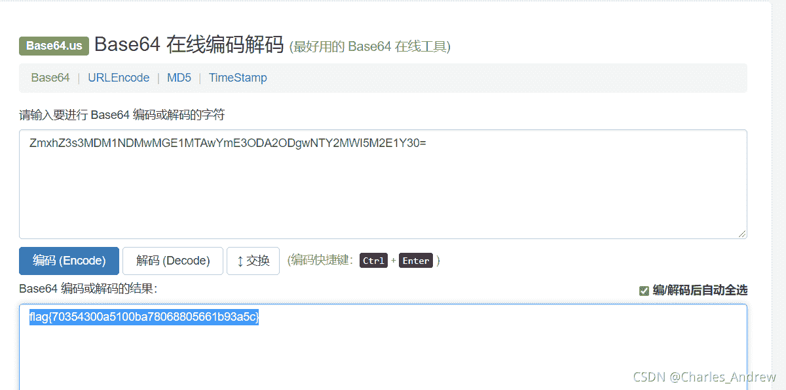

<!--yml
category: 未分类
date: 2022-04-26 14:54:37
-->

# BUUCTF 基础破解_Charles_Andrew的博客-CSDN博客

> 来源：[https://blog.csdn.net/Charles_Andrew/article/details/121035671](https://blog.csdn.net/Charles_Andrew/article/details/121035671)

  解压出来是一个含加密的压缩包，text题目也说的说清楚了是四位数字，所以直接使用ARCHPR进行暴力破解。

得出来密码是2563，输入文件后就可以得到（密码）

为什么打括号呢？因为这密码是base64加密过的，所以我们还需要找个base64解密的网站进行解码，就得到了flag.

