<!--yml
category: 未分类
date: 2022-04-26 14:42:04
-->

# BUUCTF[SCTF2019]Who is he题解_mortal15的博客-CSDN博客

> 来源：[https://blog.csdn.net/a5555678744/article/details/118371570](https://blog.csdn.net/a5555678744/article/details/118371570)

# 简介

一道unity逆向题，这个unity本身嘛。。虽然不是重点，但是各位师傅看的时候千万别喝水。

话说回来，虽然是unity逆向，但是这道题有点特例独行，一般unity的关键信息都会放在assembly-Csharp.dll里面，这道题看似也不例外，但是得到的却是假答案。真正的答案需要依靠动态调试来慢慢找。

## 题解

先运行下程序

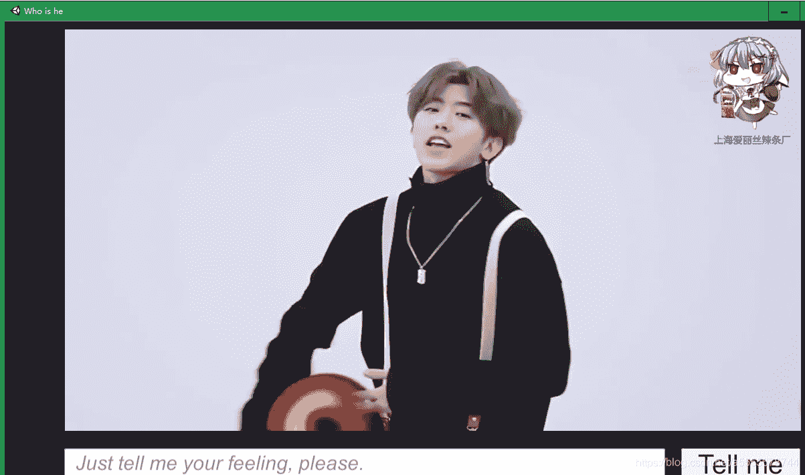

啊这。。

随便输入点什么，发现会发一个info：emmmm。。。。这样的提示

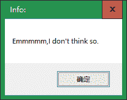

把exe拖进x64debug

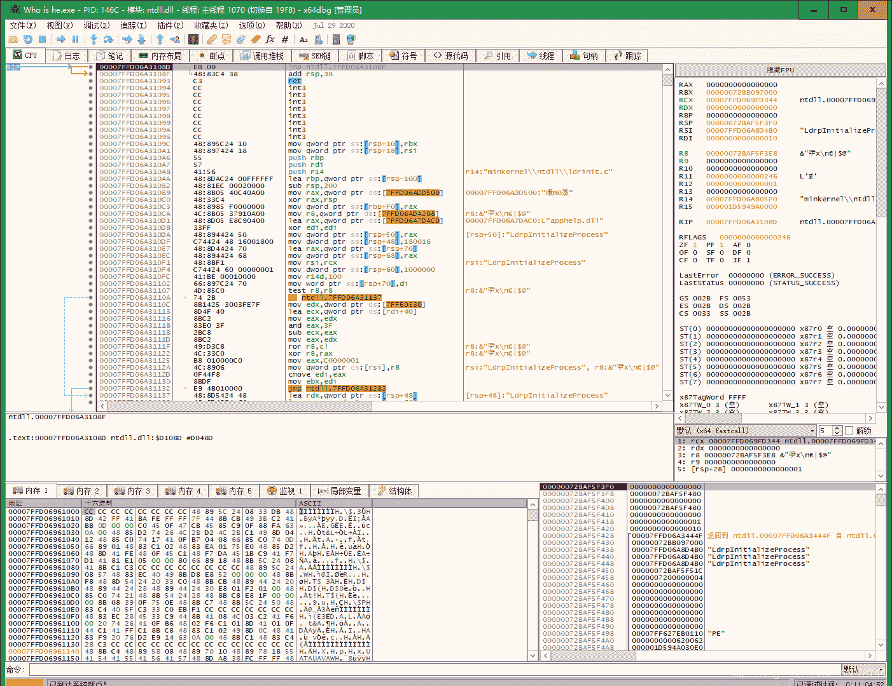

由于是unity的程序，直接查字符串不一定管用，这题就是这个情况，难点就在于定位对输入正确与否的判断。

## 定位关键判断

首先，没有做输入之前的一切操作都是我们不能干预的，也就是说最后结果正确与否与输入前无关，那就直接运行到我们输入的时候断下来就行了呀！这想法是对的，但是实际操作起来x64dbg不配合，输入之后总是会跳一大段，直接到程序结尾，这就给寻找关键判断增加了难度。

但是我们依旧可以逐步回溯到消息窗口弹出的地方

步骤如下：

1\. 首先F9到程序正常启动

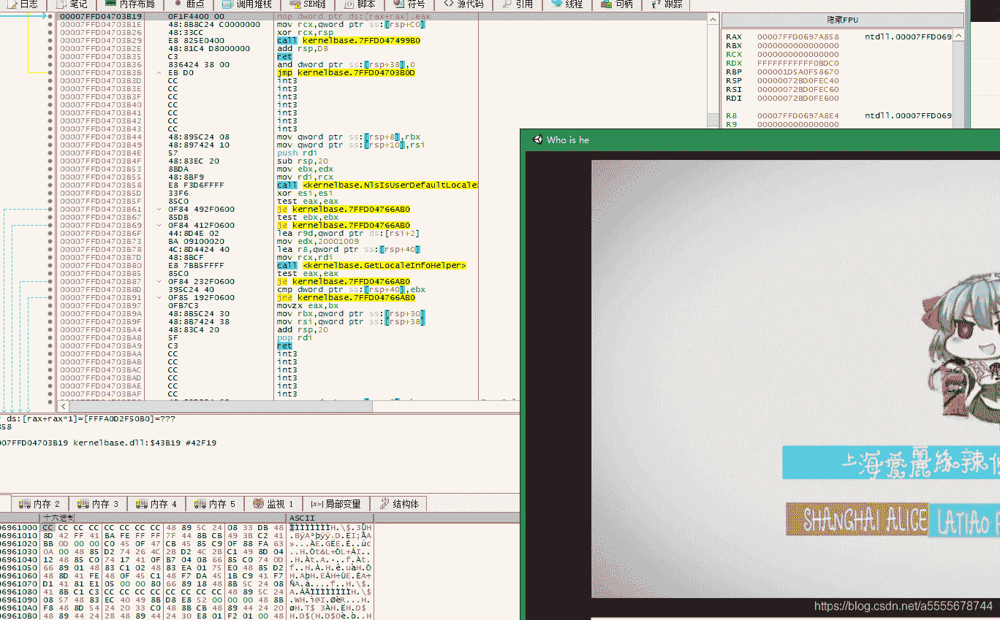

随后运行就动不了了，一旦输入完再F8就到了这里，然后就结束了。。

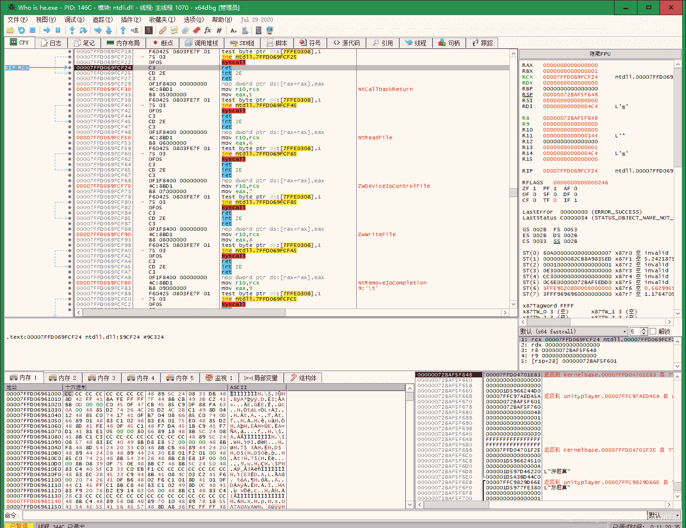

但是这也不要紧，用好栈窗口，跳了多少都不怕，看右下角的栈窗口，尝试找一找窗口中的提示字符info：emmmmm，这样就能根据栈中储存的函数返回地址跳转到消息窗口弹出的函数，从而在附近找到关键判断。

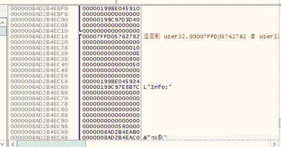

翻一翻栈窗口，确实能找到这个info：，只是后面的内容没看见，不过也不影响，我们先进入它这个函数要返回的这个地址

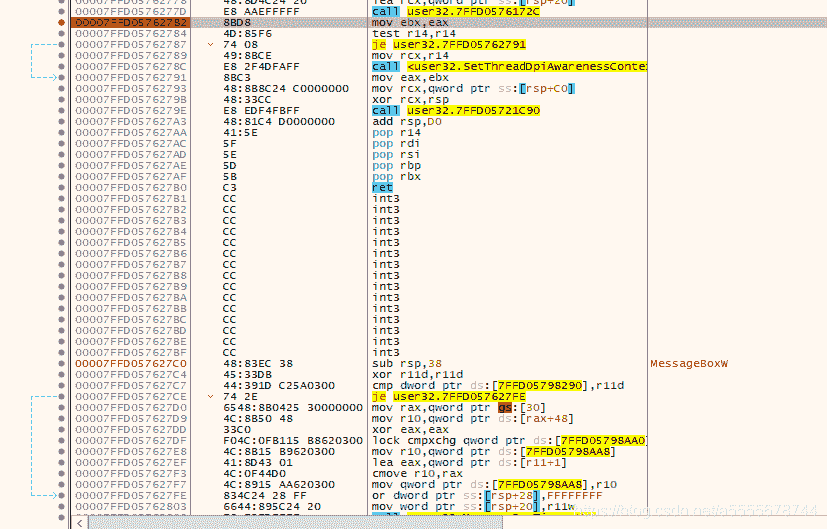

可以在这里下个断点（注意只有关闭消息窗口之后RSI才能到这里），但是这后面的语句是在消息窗口弹出之后执行的，并不是我们的目标，我们要做的是找到怎样让消息窗口弹出正确信息，也就是找关键判断，从现在情况来看，判断到这里已经结束了，也就是说应该再往前回溯。

return到其上层函数

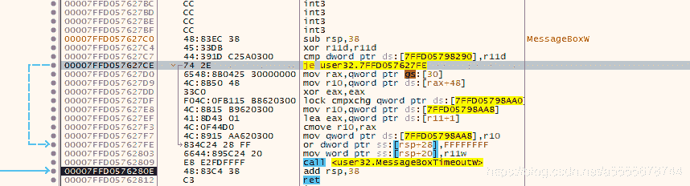

它的上层函数就只是个messagebox，并没有执行关键判断，得继续回溯。

再return到上层函数，依然没有关键判断，继续。

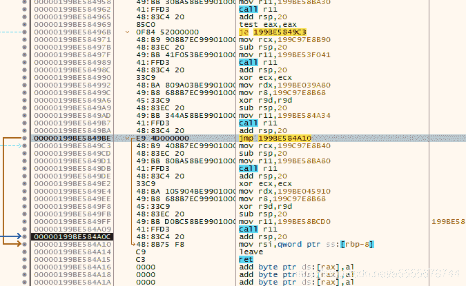

在这里，有一个判断的结果直接影响了会不会执行这个函数，猜测其为关键跳转，接下来进行验证。

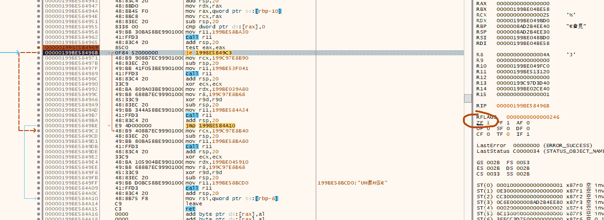

在这里双击ZF后的1，改变跳转结果，执行到第二个call的时候得到弹窗：

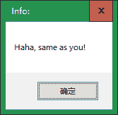

说明这里就是关键跳转。 （下断点了之后会失效，因为这个程序在这些地址在每次运行的时候都不一样，是动态变化的）

接下来向上分析怎样的跳转条件能够得到正确的消息输出。

找到关键判断后就能回溯到比较

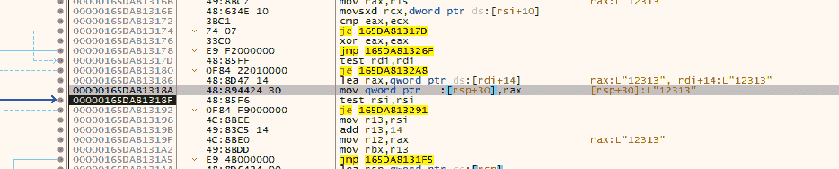

这里把我输入的值存起来了，之后就一直跟着自己的输入字符走。

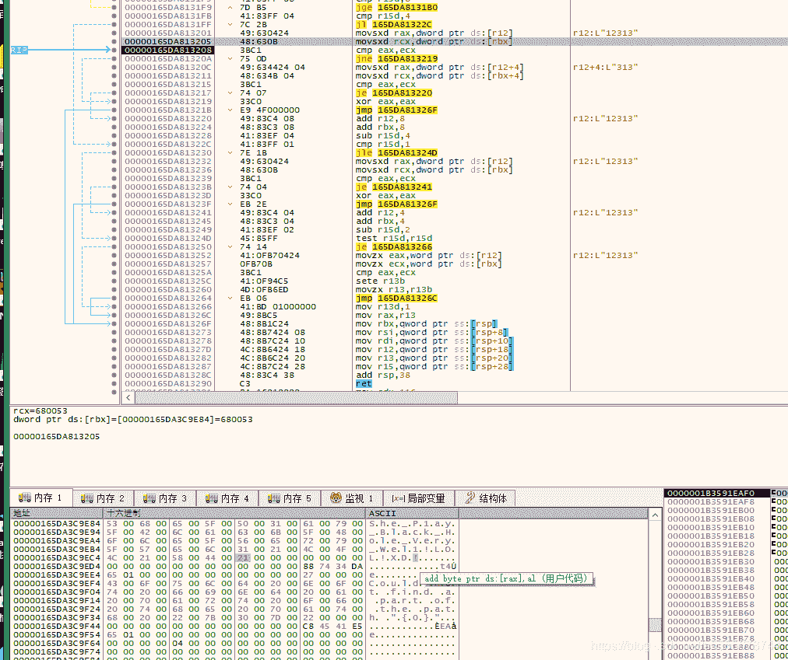

注意和自己输入有关的比较，在这里就有一处，其实下面就是flag了。

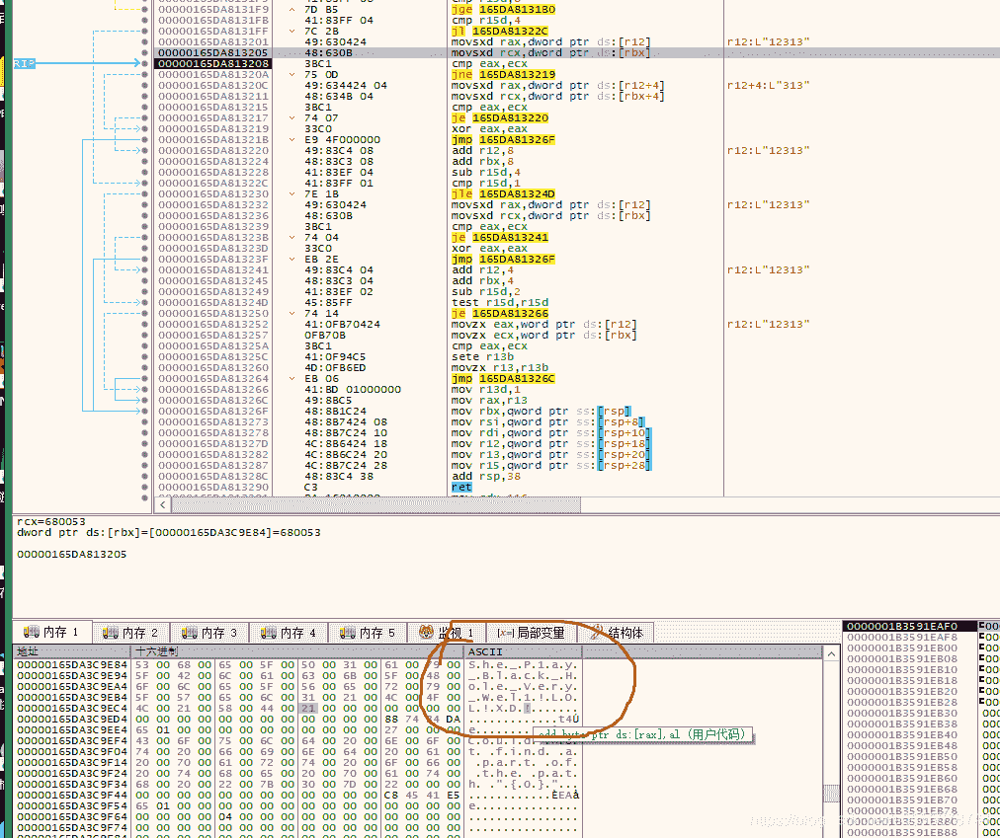

师傅们可以自己再去验证一下，这里就不赘述了。

FLAG：flag{She_P1ay_Black_Hole_Very_Wel1!LOL!XD!}