<!--yml
category: 未分类
date: 2022-04-26 14:46:59
-->

# BUUCTF_MISC——[MRCTF2020]ezmisc、荷兰宽带数据泄露、[BJDCTF 2nd]最简单的misc-y1ng_Ho1aAs的博客-CSDN博客

> 来源：[https://blog.csdn.net/Xxy605/article/details/108937651](https://blog.csdn.net/Xxy605/article/details/108937651)

# 一、[MRCTF2020]ezmisc

## Ⅰ、工具

1.  TweakPNG
2.  Winhex

## Ⅱ、题解

使用TweakPNG查看图片，出现chunk报错，即图片尺寸被修改过

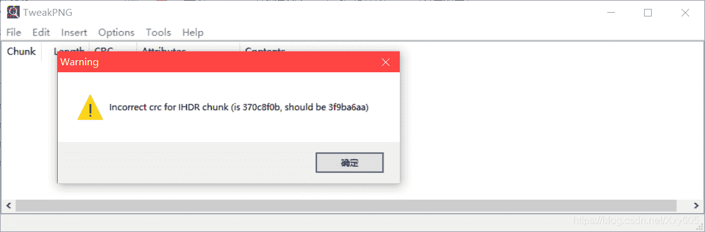
图片为500x319，怀疑该图片高度遭到篡改

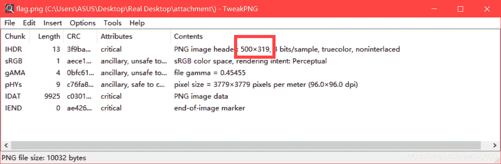
使用Winhex打开，红框部分为PNG图片的尺寸数据，为十六进制

将后一个改成1F4（16），即500（10）

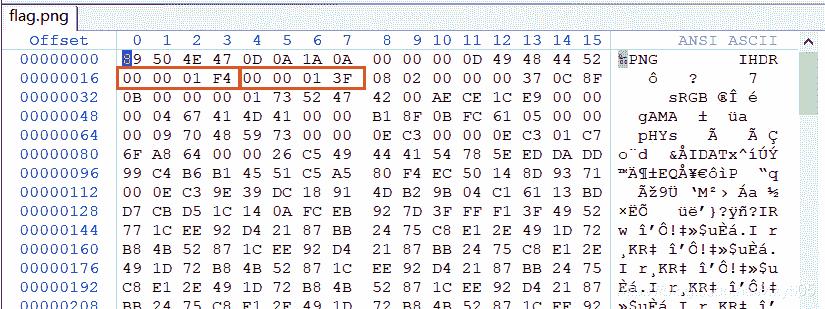
保存即可发现隐藏的部分有FLAG


# 二、荷兰宽带数据泄露

## Ⅰ、工具

1.  RouterPassView

## Ⅱ、题解

文件是`conf.bin`，是宽带数据文件，需要用RouterPassView打开

没有给出明确的提示FLAG，那么应该是账户名或者是密码
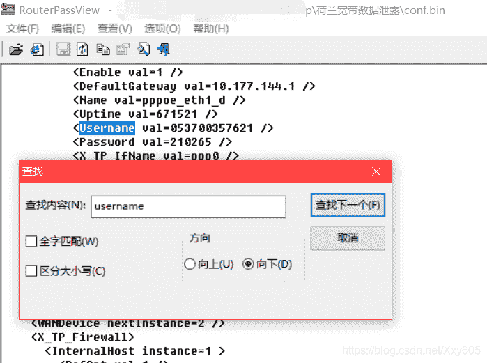
多次尝试发现是用户名

> **flag{053700357621}**

# 三、[BJDCTF 2nd]最简单的misc-y1ng

## Ⅰ、工具

1.  ZipCenOp
2.  Winhex

## Ⅱ、题解

题目是一个加密的压缩包，没有任何提示密码，考虑是伪加密

使用ZipCenOp破解伪加密

在cmd运行以下代码：

```
java ZipCenOp.jar r secret.zip 
```

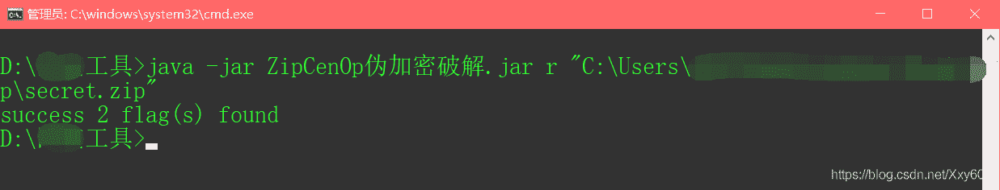
成功解压

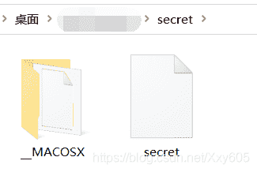
使用Winhex查阅文件数据，找到`IHDR`串，表明这是一个**缺失文件头的PNG文件**

在第一字节前面插入四个字节0数据，准备补全文件头

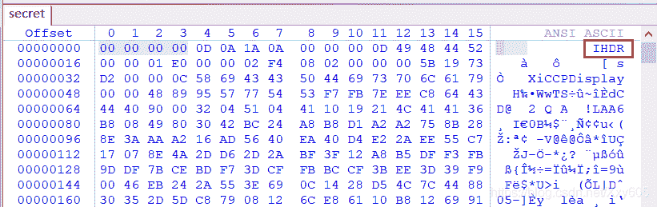
加入PNG的文件头`89504E47`，保存

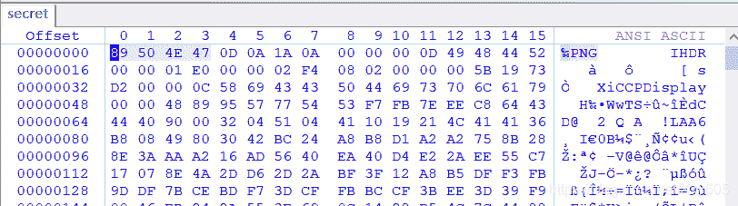
给文件加上后缀`.png`，发现一个十六进制字符串`424A447B79316E677A756973687561697D`

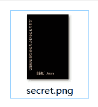
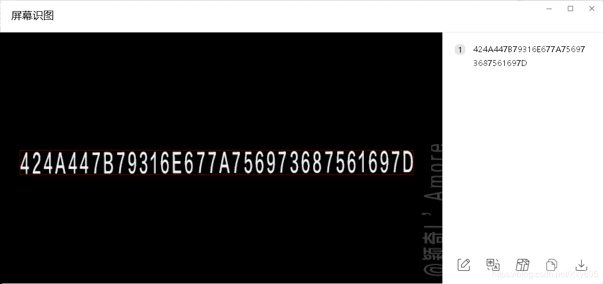
使用在线转换工具，得到FLAG明文
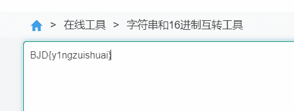

> **BJD{y1ngzuishuai}**

# 完

> 欢迎在评论区留言
> 感谢浏览