<!--yml
category: 未分类
date: 2022-04-26 14:31:41
-->

# BUUCTF_MISC题解_TYUT_网安小菜鸡的博客-CSDN博客_buuctf misc

> 来源：[https://blog.csdn.net/m0_52885531/article/details/117406720](https://blog.csdn.net/m0_52885531/article/details/117406720)

# BUUCTF_MISC题解

## 第二题

将GIF图片用ps进行逐帧分解，可以得到三张特殊的照片

[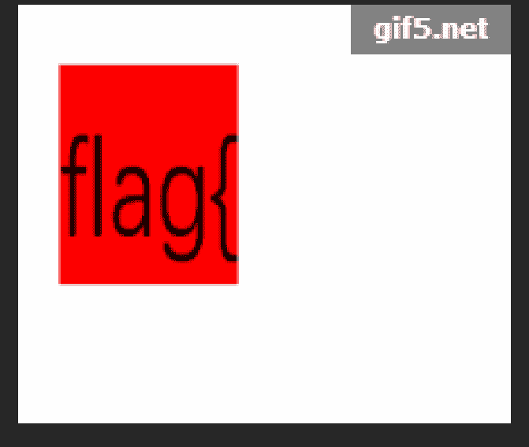](https://imgtu.com/i/gXMkB6)

[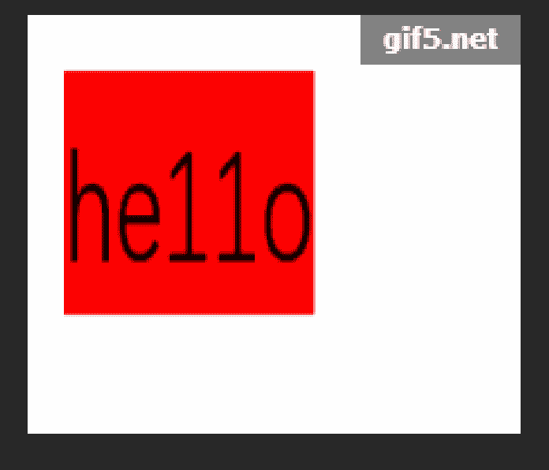](https://imgtu.com/i/gXMAHK)

[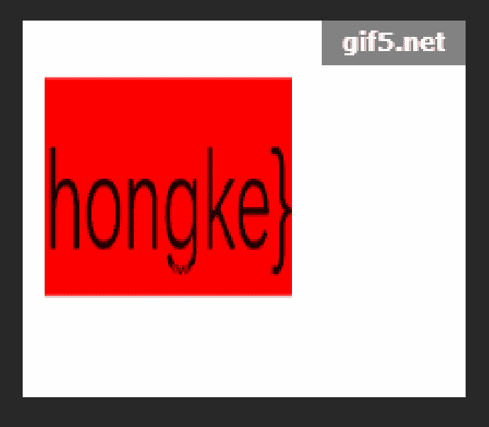](https://imgtu.com/i/gXMJUS)

直接将三个照片里的内容拼接起来就好

## 第三题 二维码

下载好附件解压后发现是一个.png文件的二维码

[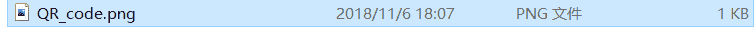](https://imgtu.com/i/gXMNCQ)

用CQR扫描后得到二维码的结果

[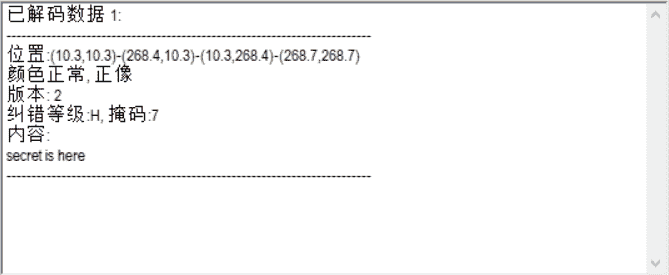](https://imgtu.com/i/gXMWvR)

发现并没有得到想要的flag，并且提示我们flag并不在这李，那我们就用二进制编辑器打开看一看在哪里。

[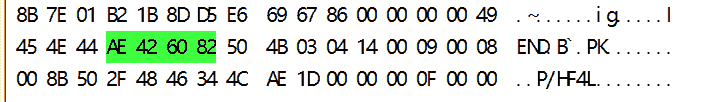](https://imgtu.com/i/gXQpa8)

.png的文件尾是<mark>AE 42 60 82</mark>，按理来说在文件尾之后就应该结束，我们却发现png的文件尾后还跟着<mark>50 4B 03 04</mark>，这是.zip的文件头，说明在该照片下还隐藏着一个.zip文件，到这一步有两种方法：

1.  将50 4B 03 04之前的东西全部删掉，之后保存，将文件后缀名改为.zip
2.  用Linux中的binwalk将隐藏的.zip文件分离出来。语句：binwalk -e 文件名

然后打开这个.zip文件，解压它，但是！它居然加密了，我们看看是不是**伪加密**

> 伪加密这里可以看这个大佬的文章学习
> 
> https://blog.csdn.net/qq_26187985/article/details/83654197

[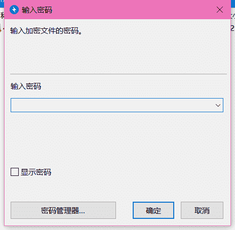](https://imgtu.com/i/gXGFud)

再用二进制编辑器打开这个.zip文件

[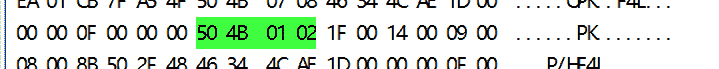](https://imgtu.com/i/gXGe4f)

发现核心目录区头504B0102四个bytes之后的数为：09 00，而不是00 00，说明这个.zip文件加密方式是全局真加密，我们只能去找密码了。可以看见压缩包内的.txt文件名为4numbers，说明密码是四位数字，那我们用kali自带的fcrackzip进行弱口令爆破就行，语句为：<mark>fcrackzip -b -c1 -u -l4 文件名</mark>

[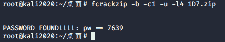](https://imgtu.com/i/gXGR2D)

发现密码是7639

ok，那就打开它

[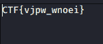](https://imgtu.com/i/gXJEM4)

这样就得到了flag

## 第四题 N种方法解决

下载附件之后发现是一个.exe文件，结果却发现打不开

[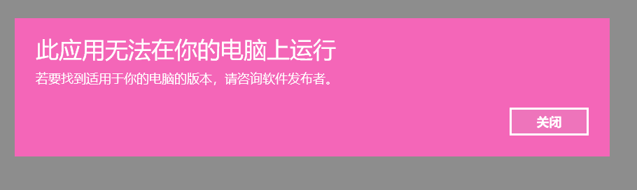](https://imgtu.com/i/gXgPBt)

那我们就试试拿二进制编辑器打开，看看它是个什么东东

[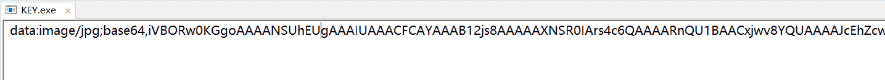](https://imgtu.com/i/gXgkAf)

哇哦，发现这个东西一点都不简单，哪是什么.exe文件，分明就是一个.jpg转成了base64，百度一下怎么办，发现只需要把那一行丢到浏览器里打开一下就好。

[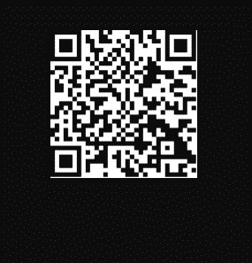](https://imgtu.com/i/gXggvd)

手机扫一下，得到结果<mark>KEY{dca57f966e4e4e31fd5b15417da63269}</mark>

## 第五题 大白

这道题题目就给了很大的提示

[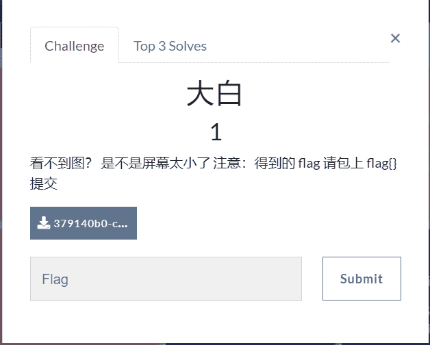](https://imgtu.com/i/gX5XSf)

说明照片中是隐含了消息的，只不过不是我们屏幕太小看不见，而是它通过更改照片的尺寸给隐藏起来了

我们继续用二进制打开这个.png文件

[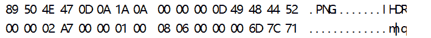](https://imgtu.com/i/gXIZXF)

**这里有一个知识点**

用二进制打开的.png文件的第二行中，前四位表示的是宽度，后四位表示的是长度

我们将其进行修改

[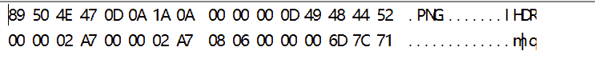](https://imgtu.com/i/gXIJXD)

将其都修改成<mark>00 00 02 A7</mark>，再次打开照片就得到了想要的东西

## 第六题 你竟然赶我走？

这道题比较简单

我们直接拿二进制编辑器打开这个.jpg文件，而在它的最底部就写着flag

[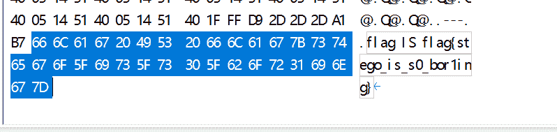](https://imgtu.com/i/gXTFMT)

## 第七题 基础破解

[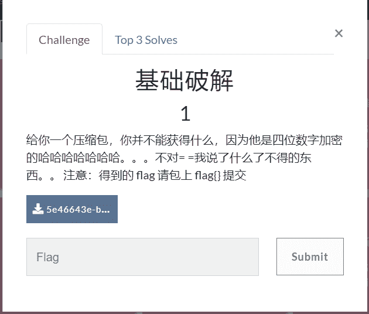](https://imgtu.com/i/gXH4ZF)

题目给了我们很大的提示：这是一个加密过的.rar文件，并且密码是四位数字。

本来以为和第三题一样用fcrackzip爆破，结果fcrackzip只能爆破.zip文件，那就百度一下吧

[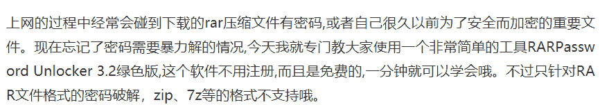](https://imgtu.com/i/gXqFh9)

百度可真是个好东西

刚好一堆CTF工具合集里有RARPassword Unlocker 这个软件，那就试试

[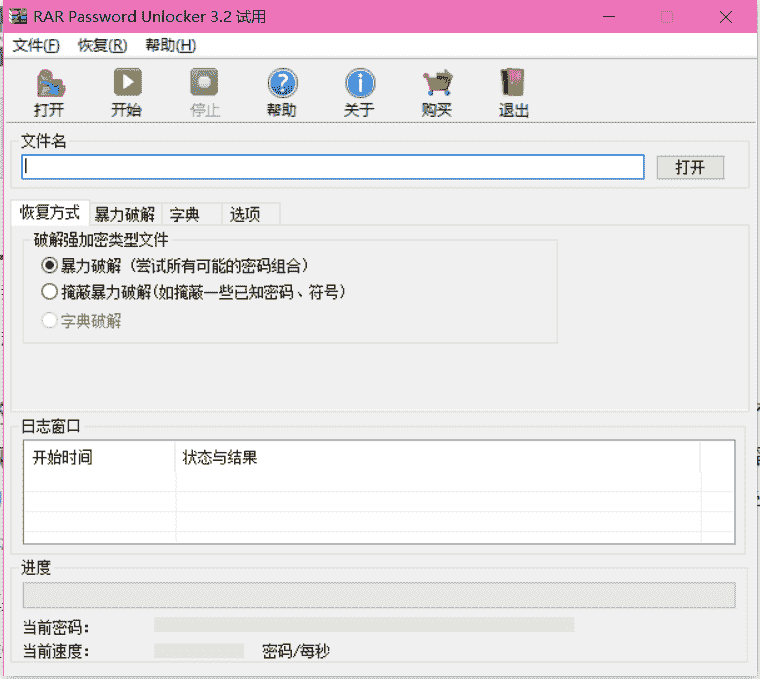](https://imgtu.com/i/gXqMAe)

我们选择第二个掩蔽暴力破解，因为我们已经知道密码是四个数字了

[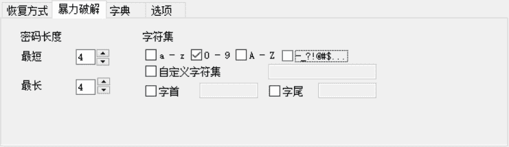](https://imgtu.com/i/gXq39A)

我们这么配置一下，然后让它去跑一下

[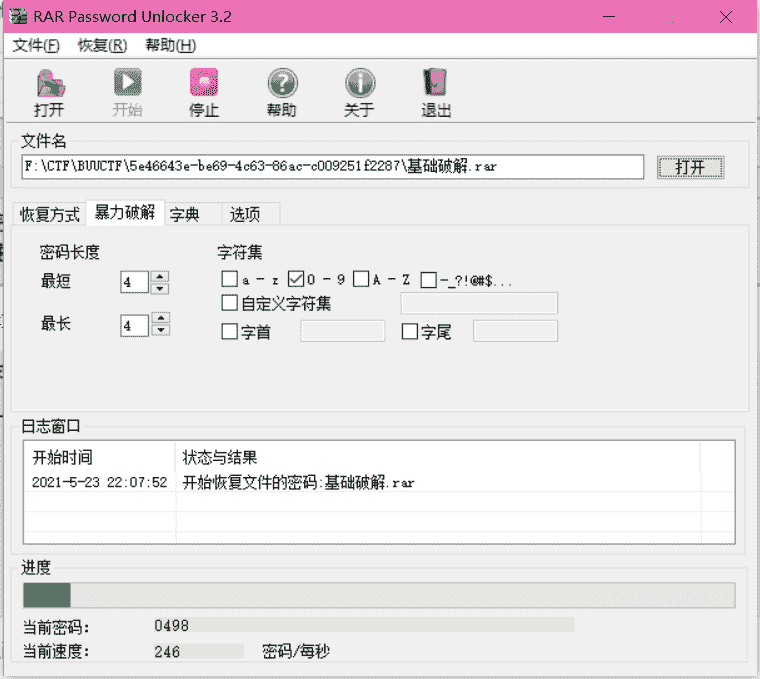](https://imgtu.com/i/gXqUHS)

这是跑起来的样子

[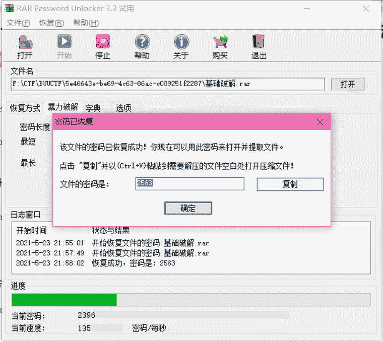](https://imgtu.com/i/gXqscq)

然后就跑到了密码：<mark>2563</mark>

**解压！**

打开那个flag.txt

[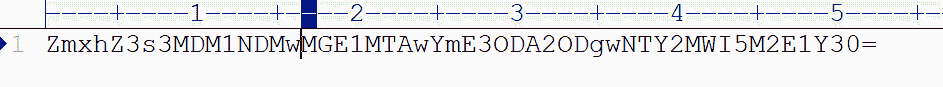](https://imgtu.com/i/gXq5C9)

很显然使用base64加密的一段文字，俺们去在线解密一下

[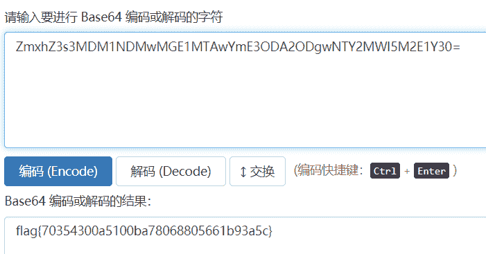](https://imgtu.com/i/gXLCKP)

一不小心就得到了flag

## 第八题 乌镇峰会种图

下载附件之后是一个.jpg文件，观察照片里并没有什么有用的信息，还是老思路，用二进制编辑器打开，看看有没有藏什么信息

[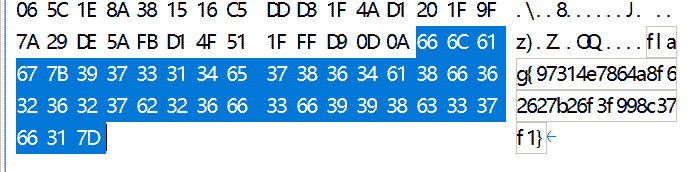](https://imgtu.com/i/gzdGwT)

事情就是如此的巧妙

## 第九题 LSB

题目给的信息很清楚LSB，也就是Least Significant Bit（最低有效位）。在大多数PNG问图像中，没个像素都由R、G、B三原色组成，每种颜色一般用8位数据表示，如果修改其最低位，人眼是不能区分出这种微笑的变化的，因此可以利用没个像素的R、G、B颜色的分量的最低有效位来隐藏信息，这样每个像素可以携带3位的信息。（摘编自c0d1_CTFer）

既然题目给的信息这么明显，那我们直接就按LSB来处理信息。

处理LSB最常用的软件是Stegsolve，我们打开这个.png文件，我们先一个个查看图像

[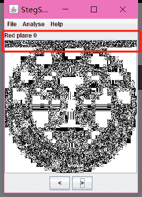](https://imgtu.com/i/gzrAIK)

[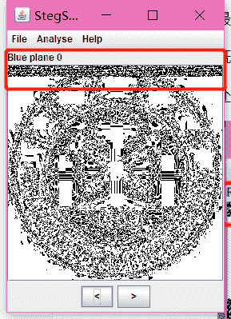](https://imgtu.com/i/gzrYRg)

[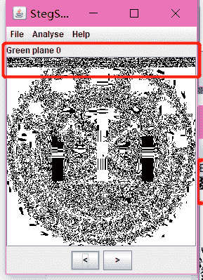](https://imgtu.com/i/gzrBd0)

由着三个图片可以看出来，在这三个通道上是隐藏了信息的，具体分析看看是什么信息

[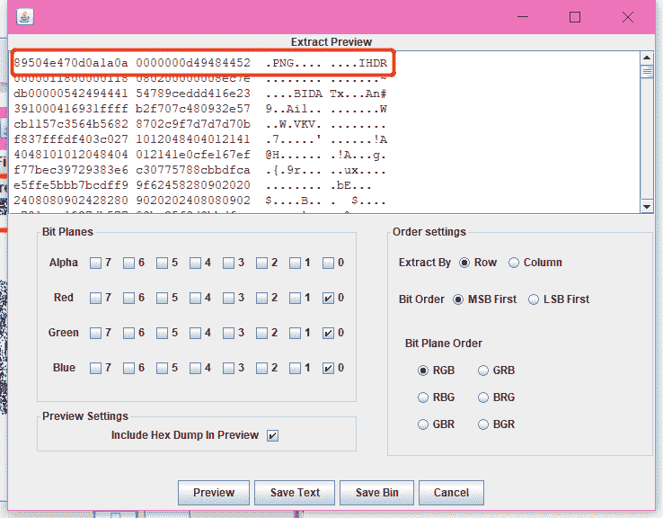](https://imgtu.com/i/gzrjeI)

可以发现是隐藏了一个.png文件在这里，我们点击<mark>Save Bin</mark>将这个.png文件保存下来看看是什么

结果发现是一个二维码

[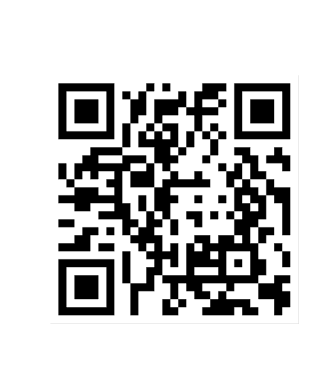](https://imgtu.com/i/gzsVwq)

扫描之后得到了信息

[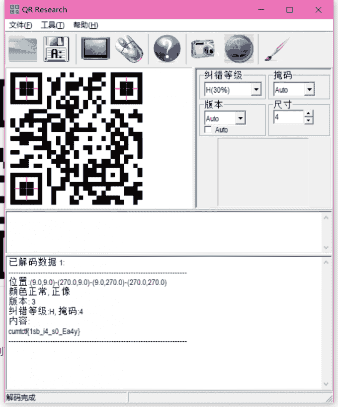](https://imgtu.com/i/gzscAP)

## 第十题 文件中的秘密

下载好附件打开后，发现是一个.jpeg格式的文件，还是老样子用二进制编辑器打开

首先我们就注意到了一点

[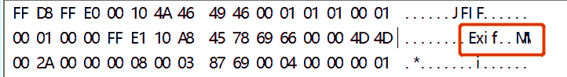](https://imgtu.com/i/gzyvPf)

<mark>EXIF</mark>，它是在提示我EXIF吗？？

屏幕前的小伙伴可能没看过c0d1_CTFer所以这里简单介绍一下

> EXIF（可交换图像文件格式）可以用来记录数码照片的属性信息和拍摄数据，EXIF可以被附加在JPEG、TIFF、RIFF等文件中，为其增加有关数码相机拍摄信息的内容。缩略图或图像处理软件的一些版本信息。

所有我们直接用Windows自带的属性打开查看一下

[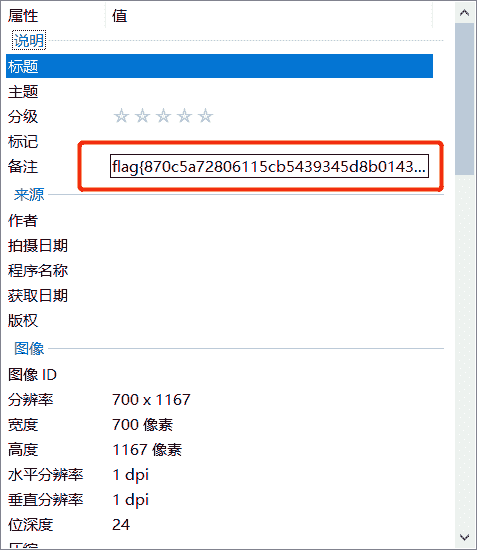](https://imgtu.com/i/gz6RyQ)

芜湖，一切都是如此的妙不可言

## 第十一题 wireshark

题目提供了很详细的信息：wireshark抓到管理员登陆网站的一段流量包（管理员的密码即是答案)

下载好附件后，我们先用wireshark打开这个数据包

ctrl+f调出搜索框，依次选择分组字节流，宽窄，字符串，然后我们进行查找flag

[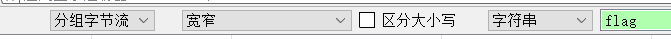](https://imgtu.com/i/gzgSBj)

查找后发现结果的第一个数据包就含有flag，而在flag后紧跟着的就是password，这正好与对应，根据题目的指引，那么password里的数据就是flag

[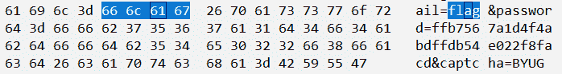](https://imgtu.com/i/gzg6Kg)

## 第十二题 rar

首先看题目提示的很清楚，四个数字密码，而且附件是.rar我们就直接暴力破解密码

[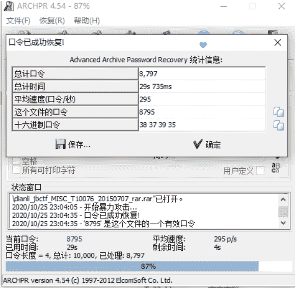](https://imgtu.com/i/gzoPUg)

<mark>8795</mark>

输入密码打开后发现一个.txt文件

[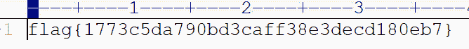](https://imgtu.com/i/gzo3G9)

得到了flag

## 第十三题 qr

下载好附件后是一个二维码，扫描之后得到了flag

[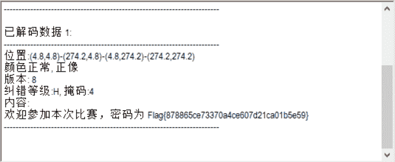](https://imgtu.com/i/gzorRA)

## 第十四题 zip伪加密

题目告诉我们的信息很少但是已经足够了“zip伪加密”

果不其然，我们在打开附件的时候提示我们输入密码

但由于是伪加密，我们也不需要去爆破密码，我们依旧用二进制编辑器打开它

我们找到核心目录其头<mark>50 4B 01 02</mark>后的8个字节

[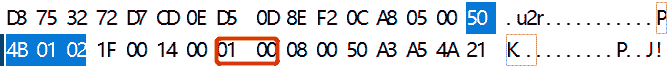](https://imgtu.com/i/2S1BkR)

是01 00 说明这个zip是伪加密，我们只需要将其修改成00 00就解除了它的伪加密，就可以直接打开文件了

得到一个.txt文件，里面就是flag

[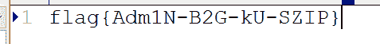](https://imgtu.com/i/2S1Rne)

## 第十五题 ningen

下载好附件之后是一个.jpg格式的文件，我们用二进制编辑器打开它，搜索<mark>50 4B 03 04</mark>（这是.zip文件的文件头）

[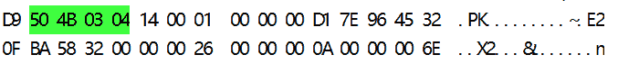](https://imgtu.com/i/29LZnJ)

结果不小心发现了这个小东西

那我们就把50 4B 03 04之前的东西全部删掉，然后保存，并将文件名修改成.zip

我们将它打开，发现有密码，但是题目告诉了我们这是一个4位数字密码，我们用工具爆破一下

[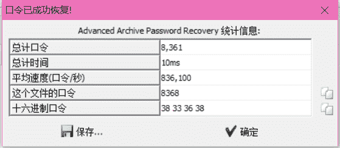](https://imgtu.com/i/29LcHs)

得到了密码，那就解压，打开，之后的我就不详细说明了哦

## 第十六题 镜子里的世界

我们下载好附件以后发现是一个.png文件，用二进制打开观察发现是一个纯纯的.png文件没有夹杂其它别的东西

那我们试试用StegSolve打开它，把所有通道都查看一遍之后没发现任何奇怪的地方，那就具体分析分析他的R、G、B通道的最低有效位，哇哦，一不小心就发现了好东东

## 第十七题 被嗅探的流量

被嗅探的流量，emmmm，很有味道👀

用wireshark打开附件，和第十一题的步骤一样，我们在这么多数据包中搜索带有flag字符的

然后第一个包中上传了一个名叫flag的.jpg文件

[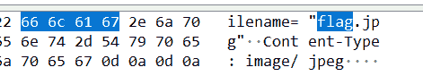](https://imgtu.com/i/29Ok5t)

我们右键这个数据包，然后追踪它的TCP流，我们在所追踪出的TCP流中再进行查找flag，结果就得到了

[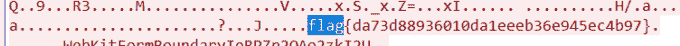](https://imgtu.com/i/29OurQ)

## 第十八题 小明的保险箱

下载好附件之后是一个.jpg文件，但是题目说保险箱有一个四位数的密码，因此我们猜测在这个.jpg文件中肯定还隐藏了其他文件，我们用二进制编辑器打开这个文件。

我们发现<mark>FF D9</mark>就是.jpg的文件尾就应该结束了，可后面还加了<mark>52 61 72 21</mark>这正是.rar的文件头吗

说明这里还藏着一个.rar文件，那就很easy了，还是老规矩，我们把.rar文件分离出来（之前说了太多次怎么分了，这里就不加赘述了）

解压时很自然的发现需要密码，这也很正常，毕竟人家早就告诉你有密码了

我们依旧使用爆破工具进行爆破

[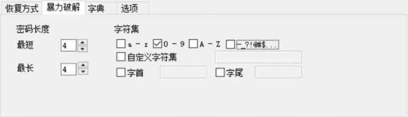](https://imgtu.com/i/2iGiGQ)

设置好之后进行爆破

[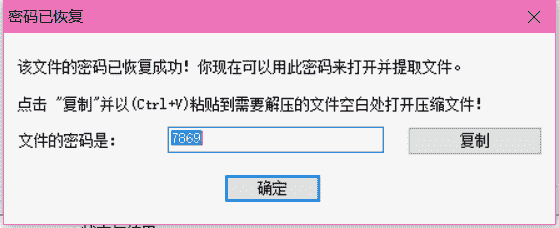](https://imgtu.com/i/2iGnaT)

一不小心就得到了密码

## 第十九题 爱因斯坦

下载好附件后打开发现是一个.jpg文件，用二进制打开，查找.jpg的文件尾<mark>FF D9</mark>发现在其后面还有一个.zip文件

[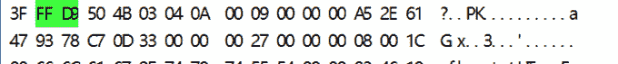](https://imgtu.com/i/2iU93D)

继续解压，发现是有密码的，但是题目没有给任何提示，我们无法确定这个密码的长短，如果直接使用暴力破解的话肯定要花费很长的时间，所以暴力破解的思路肯定不对

那我们就继续在图片上找找，说不定会有密码

我们用老思路用StegSolve打开图片查看也没有找到任何信息，那我们就查查这个文件的EXIF

果然，在文件的属性中找到这么一句话

[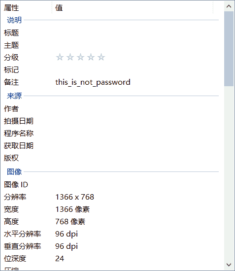](https://imgtu.com/i/2iU1Ds)

这里就很值得怀疑，我们拿去试试是不是密码，结果这还真的就是压缩文件的密码

就得到了flag

## 第二十题 easycap

下载好附件后发现可以用wireshark打开，打开之后，我们用之前的思路去查询分组字节流中的flag，显示查不到

那就直接追踪数据包的TCP流，结果答案就这么明显的摆在眼前

[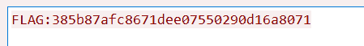](https://imgtu.com/i/2iaiGT)

## 第二十一题 另外一个世界

打开附件发现是一个.jpg文件，继续用二进制编辑器打开仔细寻找发现里面有两个<mark>FF D8 FF</mark>，所以有两个.jpg文件，我们将这两个文件进行分离发现什么信息都没有，相反在源文件的基础上，我们直接搜索flag（<mark>66 6C 61 67</mark>）反而很轻易的看到了flag

很明显这是用base64加密的，我们只需要去在线解密一下就ok

## 第二十二题 FLAG

下载好附件之后发现是一个很很很搞笑的照片，我们还用之前的思路，拿二进制打开的话是一点信息都没有的，是一个很纯很纯的.png文件，所以我们猜测可能是用了LSB隐写，我们拿StegSolve打开它，分析它的数据

发现这里应该是隐藏了.zip文件，我们将它分离出来，命名成.zip文件，打开的话提示我们数据损坏

这里可以不用管它，继续打开里面的文件就好

打开发现是一堆乱码，但是我们在乱码中找到了最重要的东西

题目上提示了把hctf换成flag就好

## 第二十三题 假如给我三天光明

呼~

这应该是目前遇到最难的一道题了

打开附件后发现，有一个照片和被加密的压缩包，那么密码肯定在这个照片里

打开发现照片底下的确藏有东西，但是不知道是什么

首先猜测的是二进制，但是按它两位两位排列只能写三个数字，所能隐藏的信息太少了，所以应该不是二进制

题目给了我们很大的提示“假如给我三天光明”，这该不是盲文吧，百度一下，嘿！盲文还真的就长这个样子

然后就推出密码是<mark>kmdonowg</mark>

打开压缩包发现是个音频文件，听的话是摩斯密码，但是我实在太菜了，靠听真的听不出来，所以只能借助工具——Audacity

我们获得这个.wav的波形图

长的一段是-,短的一段是.然后结合摩斯密码表就得到了答案

## 第二十四题 神秘的龙卷风

根据题目知道，这个压缩包的是由四位密码组成的，我们用爆破工具爆破

打开压缩包发现是一个.txt文档，可是打开后发现真的是外星人语言

这下可真的啥也不知道了，只能百度搜题解，发现这是一种编程语言叫brainfuck

可以在线执行（http://bf.doleczek.pl/）

## 第二十五题 后门查杀

这是一道看起来很难很难的题，它有一大堆的.php文件

题目上提示是webshell上传，我们直接用杀软扫描刚刚下载好的附件，如果真的存在webshell上传的话，那么一定会报毒的

我们按照路径找到那个文件

很容易就能找到flag

## 第二十六题 荷兰宽带数据泄漏

根据题目信息得到这是文件应该是宽带数据流量，那么我们就需要用相对应得工具打开，百度到的是需要用routerpassview打开

那就下个它打开文件

按照我们之前做题的经验，flag一般会藏在用户名或者密码当中，我们就在这堆数据里找username和password，然后一个一个去提交，看那个是真正的flag

终于我们找到了那个万恶的flag

就是用户名

## 第二十七题 来首歌吧

打开附件之后发现是一个音频文件

我们还用Audacity进行查看，发现在这首歌中有两个轨道

而上面那一条轨道正是莫斯密码

我们将其写下来

… -… -.-. ----. …— … -… …- ----. -.-. -… ----- .---- —… —… …-. … …— . -… .---- --… -… --… ----- ----. …— ----. .---- ----. .---- -.-.

再在线转换一下就得到了flag

## 第二十八题 数据包中的线索

下载好附件后用wireshark打开，我们可以一个一个分析这些数据包，发现只有一种类型的数据包是很可疑的，它与其他数据包很不一样，其他数据包没有多少信息，而只有这个数据包里含有很多信息

我们进行追踪它的TCP流

这里看起来就很可疑了，貌似是base64编码，我们在一个网站进行在线解码一下（https://the-x.cn/base64）

发现是一个.jpg文件，我们下载打开，就发现了神奇的小秘密

## 第二十九题 九连环

我们下载好附件后发现是一个.jpg文件，按照之前的旧思路用二进制编辑器打开，我们去搜索.zip的文件头（<mark>50 4B 03 04</mark>）发现有很多，而且根据题目“九连环”也感觉这个文件不是那么简单

我们就打开kali用binwalk分析一下

发现果然有东西，那就用foremost分离一下

得到了一个.zip文件

打开的话发现是有密码的，那就用二进制编辑器判断一下是不是伪加密

果然是伪加密，将01 08修改成00 08，绕过伪加密

发现里面只有一个.jpg和一个加密了的压缩包

而照片里没有提供任何信息（用之前解密.jpg的思路）

这里用steghide来破解

输入密码解压之后就能看到flag了

## 第三十题 面具下的flag

打开附件发现是一个.jpg照片，用二进制编辑器打开的话可以搜索到文件中包含<mark>50 4B 03 04</mark>，可以断定文件中隐藏了.zip文件

用binwalk分析一下

思路正确

那就用foermost分离出来

打开压缩包解压的时候发现被加密了，二进制编辑器打开发现是伪加密，直接改掉

改成<mark>00 00</mark>

打开发现是一个.vmdk文件，本来的思路是将它挂载到kali上，但是只能发现一半的flag，另一半怎么也发现不了，最后百度了一下，发现这个东西不需要挂载到kali上，直接用kali里的命令7z解压就行，命令：

<mark>7z x flag.vmdk -o./</mark>

解压以后会在flag_part_two中发现一个挂载没有的文件

依次打开part_one和part_two中的文件，一个是我们之前提到过的brainfuck一个是Ook

在这个网站中解码就好

https://www.splitbrain.org/services/ook

然后就可得到flag

## 第三十一题 webshell后门

详细解法请参考第第二十五题