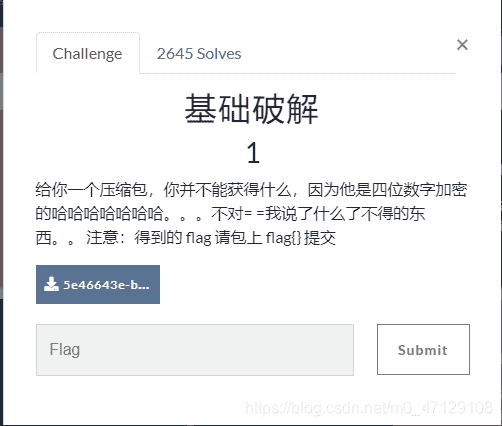
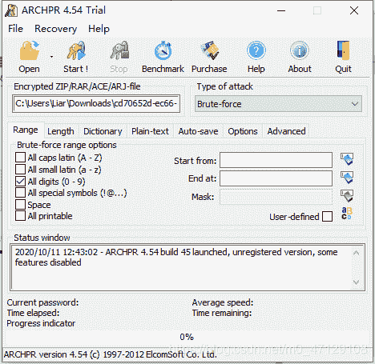
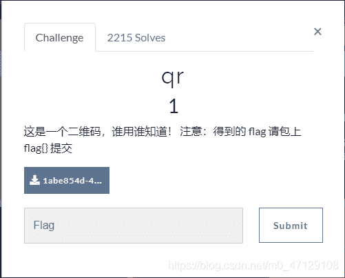
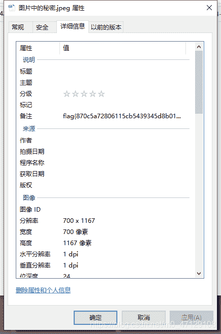
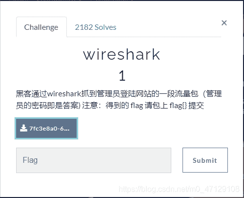
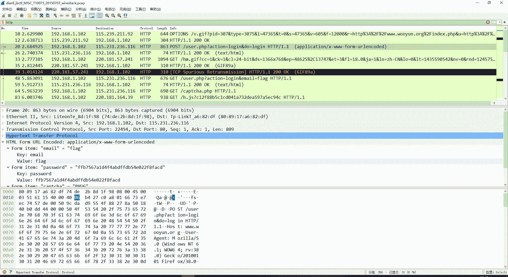

<!--yml
category: 未分类
date: 2022-04-26 14:51:19
-->

# BUUCTF_Misc部分题目_不专业的骗子的博客-CSDN博客

> 来源：[https://blog.csdn.net/m0_47129108/article/details/109010405](https://blog.csdn.net/m0_47129108/article/details/109010405)

#### 签到

签到就完事了

#### 基础破解&rar

题目提示了四位纯数字，暴力破解就行

#### qr

啊哈，二维码，扫就完事了

#### 文件中的秘密

拿到题目后得到一个图片，根据题目的意思右键查看属性
在详细信息内得到了flag

#### wireshark

根据题目及题目提示找到

如何快速找到有效数据包，我也不太清楚，看了一些题目大部分是在http和tcp类型里边的，不行就一个一个找嘛
看到password即为flag